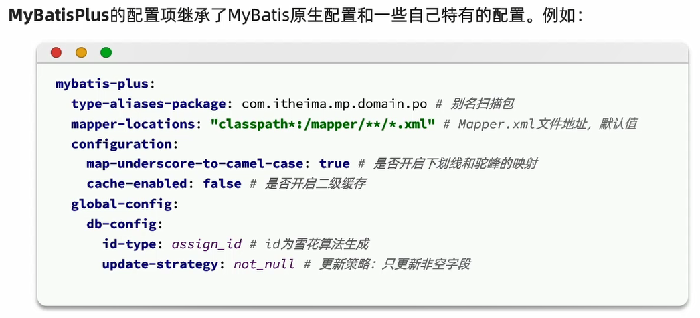

# MyBatisPlus

[MyBatisPlus官网](https://baomidou.com/)

特点:
1. 润物无声:只做增强不做改变,引入它不会对现有工程产生影响,如丝般顺滑
2. 效率至上:只需简单配置,即可快速进行单表CRUD操作,节省大量时间

# 快速入门

# 使用步骤

1. 引入MyBatisPlus的起步依赖,代替MyBatis依赖

```xml
<dependency>
    <groupId>com.baomidou</groupId>
    <artifactId>mybatis-plus-boot-starter</artifactId>
    <version>3.5.6</version>
</dependency>
```

2. 定义Mapper接口并继承BaseMapper

```java
public interface UserMapper extends BaseMapper<User> {
}
```

# 基本原理

MyBatisPlus通过扫描实体类,并基于反射获取实体类信息作为数据库表信息

- 类名驼峰转下划线作为表名
- 名为id的字段作为主键
- 变量名驼峰转下划线作为表的字段名

# 常用注解


# 常见配置

