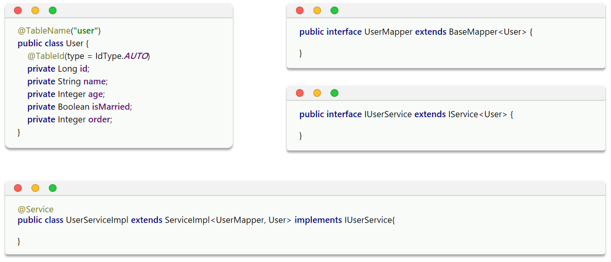
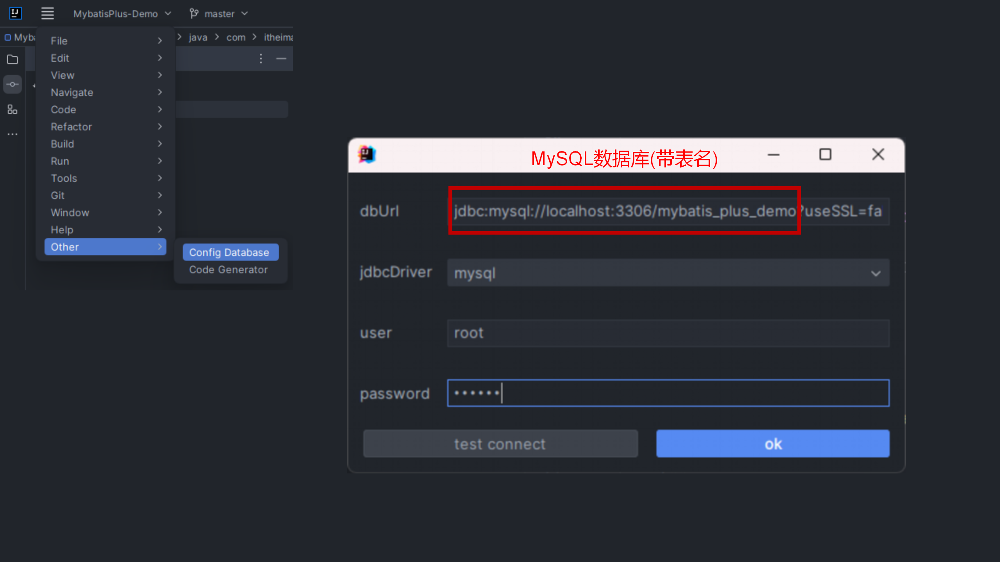
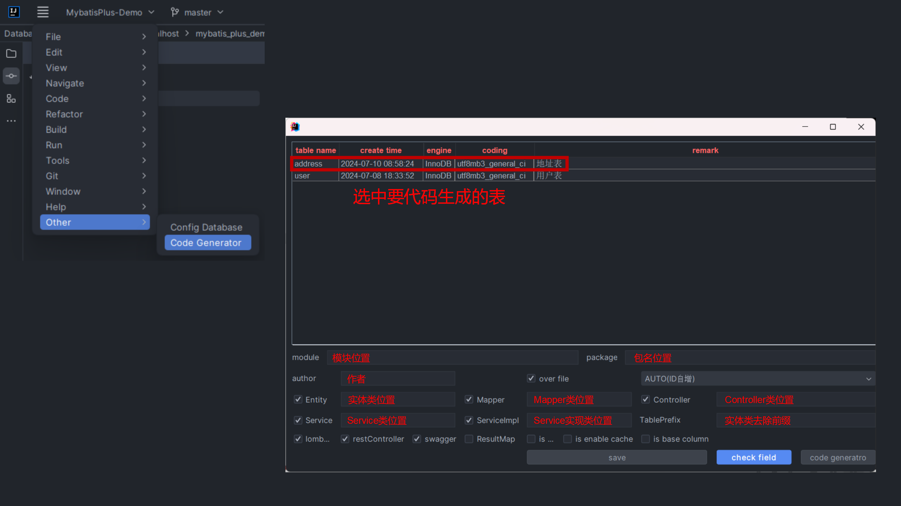
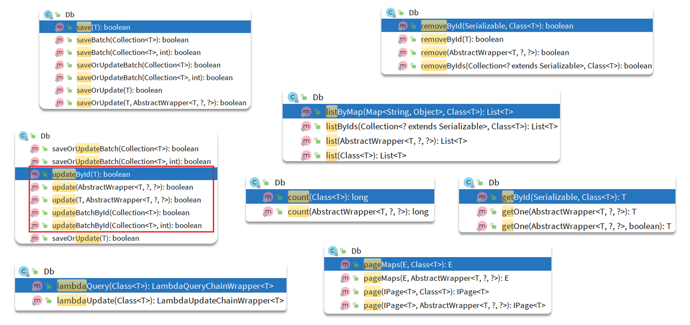

# 扩展功能

# MyBatisPlus代码生成



推荐使用IDEA插件:**MyBatisPlus**





# Db静态工具



细节:**一旦出现Service相互调用,尽量使用Db静态工具去调用**

## 范例

需求:
- 实现根据用户id查询收货地址功能,需要验证用户状态,冻结用户抛出异常
- 改造根据id查询用户的接口,查询用户的同时,查询出用户对应的所有地址
- 改造根据id批量查询用户的接口,查询用户的同时,查询出用户对应的所有地址

AddressVO.java:

```java
package com.itheima.mp.domain.vo;

import io.swagger.annotations.ApiModel;
import io.swagger.annotations.ApiModelProperty;
import lombok.Data;

@Data
@ApiModel(description = "收货地址VO")
public class AddressVO{

    @ApiModelProperty("id")
    private Long id;

    @ApiModelProperty("用户ID")
    private Long userId;

    @ApiModelProperty("省")
    private String province;

    @ApiModelProperty("市")
    private String city;

    @ApiModelProperty("县/区")
    private String town;

    @ApiModelProperty("手机")
    private String mobile;

    @ApiModelProperty("详细地址")
    private String street;

    @ApiModelProperty("联系人")
    private String contact;

    @ApiModelProperty("是否是默认 1默认 0否")
    private Boolean isDefault;

    @ApiModelProperty("备注")
    private String notes;
}
```

UserVO.java:

```java
package com.itheima.mp.domain.vo;

import io.swagger.annotations.ApiModel;
import io.swagger.annotations.ApiModelProperty;
import lombok.Data;

import java.util.List;

@Data
@ApiModel(description = "用户VO")
public class UserVO {

    @ApiModelProperty("用户id")
    private Long id;

    @ApiModelProperty("用户名")
    private String username;

    @ApiModelProperty("详细信息")
    private String info;

    @ApiModelProperty("使用状态（1正常 2冻结）")
    private Integer status;

    @ApiModelProperty("账户余额")
    private Integer balance;

    @ApiModelProperty("用户的收货地址")
    private List<AddressVO> addresses;
}
```

UserController.java:

```java
/**
 * 根据id查询收货地址
 *
 * @param id
 * @return
 */
@GetMapping("/address/{id}")
@ApiOperation("根据用户id查询收货地址")
public List<AddressVO> queryAddressById(@ApiParam("用户id") @PathVariable("id") Long id) {
    log.info("根据用户id查询收货地址:{}", id);
    return userService.queryAddressById(id);
}

/**
 * 根据id查询用户及其收货地址
 *
 * @param id
 * @return
 */
@GetMapping("/user/{id}")
@ApiOperation("根据id查询用户及其收货地址")
public UserVO queryUserAndAddressById(@ApiParam("用户id") @PathVariable("id") Long id) {
    log.info("根据id查询用户及其收货地址:{}", id);
    return userService.queryUserAndAddressById(id);
}

/**
 * 根据ids批量查询用户及其收货地址
 *
 * @param ids
 * @return
 */
@GetMapping("/user")
@ApiOperation("根据ids批量查询用户及其收货地址")
public List<UserVO> queryUserAndAddressByIds(@ApiParam("用户ids集合") @RequestParam("ids") List<Long> ids) {
    log.info("根据ids批量查询用户及其收货地址:{}", ids);
    return userService.queryUserAndAddressByIds(ids);
}
```

UserService.java:

```java
/**
 * 根据id查询收货地址
 *
 * @param id
 * @return
 */
List<AddressVO> queryAddressById(Long id);

/**
 * 根据id查询用户及其收货地址
 *
 * @param id
 * @return
 */
UserVO queryUserAndAddressById(Long id);

/**
 * 根据ids批量查询用户及其收货地址
 *
 * @param ids
 * @return
 */
List<UserVO> queryUserAndAddressByIds(List<Long> ids);
```

UserServiceImpl.java:

```java
/**
 * 根据id查询收货地址
 *
 * @param id
 * @return
 */
@Override
public List<AddressVO> queryAddressById(Long id) {
    // 查询用户
    User user = this.getById(id);
    if (user == null || user.getStatus() == 2) {
        throw new RuntimeException("用户状态异常");
    }
    // 查询用户的收货地址
    List<Address> addresses = Db.lambdaQuery(Address.class)
            .eq(Address::getUserId, id)
            .list();
    // 转换地址VO
    return BeanUtil.copyToList(addresses, AddressVO.class);
}

/**
 * 根据id查询用户及其收货地址
 *
 * @param id
 * @return
 */
@Override
public UserVO queryUserAndAddressById(Long id) {
    // 查询用户
    User user = this.getById(id);
    if (user == null || user.getStatus() == 2) {
        throw new RuntimeException("用户状态异常");
    }

    // 查询用户所有的收货地址
    List<Address> addresses = Db.lambdaQuery(Address.class)
            .eq(Address::getUserId, id)
            .list();
    // 封装VO
    UserVO userVO = BeanUtil.copyProperties(user, UserVO.class);
    if (CollUtil.isNotEmpty(addresses)) {
        List<AddressVO> addressVOList = BeanUtil.copyToList(addresses, AddressVO.class);
        userVO.setAddresses(addressVOList);
    }
    return userVO;
}

/**
 * 根据ids批量查询用户及其收货地址
 *
 * @param ids
 * @return
 */
@Override
public List<UserVO> queryUserAndAddressByIds(List<Long> ids) {

    // 查询用户
    List<User> users = this.listByIds(ids);
    if (CollUtil.isEmpty(users)) {
        return Collections.emptyList();
    }

    List<UserVO> userVOList = new ArrayList<>(users.size());

    // 查询用户所有的收货地址(循环内查询数据库性能较差)
//        for (User user : users) {
//            // 查询单个用户所有的收货地址
//            List<Address> addresses = Db.lambdaQuery(Address.class)
//                    .eq(Address::getUserId, user.getId())
//                    .list();
//            if (CollUtil.isNotEmpty(addresses)) {
//                // 转换用户和地址VO
//                List<AddressVO> addressVOList = BeanUtil.copyToList(addresses, AddressVO.class);
//                UserVO userVO = BeanUtil.copyProperties(user, UserVO.class);
//                userVO.setAddresses(addressVOList);
//                userVOList.add(userVO);
//            }
//        }

    // 查询用户所有的收货地址(尽可能地减少数据库查询次数,尽量通过在单个查询中获取所有必要的数据)
    // 获取用户id集合
    List<Long> userIds = users.stream().map(User::getId).collect(Collectors.toList());
    // 根据用户id集合查询出所有的地址
    List<Address> addresses = Db.lambdaQuery(Address.class).in(Address::getUserId, userIds).list();
    // 转换地址VO
    List<AddressVO> addressVOList = BeanUtil.copyToList(addresses, AddressVO.class);
    // 用户地址集合分组处理,同一个用户的地址放入一个集合(组)中
    Map<Long, List<AddressVO>> addressMap = new HashMap<>(0);
    if (CollUtil.isNotEmpty(addressVOList)) {
        addressMap = addressVOList.stream().collect(Collectors.groupingBy(AddressVO::getUserId));
    }
    for (User user : users) {
        // 转换用户VO
        UserVO userVO = BeanUtil.copyProperties(user, UserVO.class);
        // 添加单个用户的所有地址
        userVO.setAddresses(addressMap.get(user.getId()));
        userVOList.add(userVO);
    }
    
    return userVOList;
}
```

细节:**循环内查询数据库性能较差,尽可能地减少数据库查询次数,尽量通过在单个查询中获取所有必要的数据**

# 逻辑删除

逻辑删除就是基于代码逻辑模拟删除效果,但并不会真正删除数据

思路:
1. 在表中添加一个字段标记数据是否被删除
2. 当删除数据时把标记置为1
3. 查询时只查询标记为0的数据

例如逻辑删除字段为deleted:                
删除操作:`UPDATE user SET deleted = 1 WHERE id = 1 AND deleted = 0`                      
查询操作:`SELECT * FROM user WHERE deleted = 0`

MybatisPlus提供了逻辑删除功能,无需改变方法调用的方式,而是在底层自动修改CRUD的语句

在文件中配置逻辑删除的字段名称和值即可

application.yaml:

```yaml
mybatis-plus:
  global-config:
    db-config:
      logic-delete-field: flag // 全局逻辑删除的实体字段名,字段类型可以是boolean、integer 
      logic-delete-value: 1 // 逻辑已删除值(默认为1)
      logic-not-delete-value: 0 // 逻辑未删除值(默认为0)
```

逻辑删除的问题:
- 会导致数据库表垃圾数据越来越多,影响查询效率
- SQL中全都需要对逻辑删除字段做判断,影响查询效率

**不推荐采用逻辑删除功能,如果数据不能删除,可以采用把数据迁移到其它表的办法**

# 枚举处理器

实现PO类中的枚举类型变量与数据库字段的转换:
1. 给枚举中的与数据库对应的value值添加`@EnumValue`注解
2. 在配置文件中配置统一的枚举处理器,实现类型转换
3. 枚举默认传递给前端的是枚举项的名字,可以通过给枚举中的desc值添加`@JsonValue`注解,实现返回desc字段

## 范例

application.yaml:

```yaml
mybatis-plus:
  type-aliases-package: com.itheima.mp.domain.po
  global-config:
    db-config:
      id-type: auto
      logic-delete-field: deleted # 配置逻辑删除字段
      logic-delete-value: 1
      logic-not-delete-value: 0
  configuration:
    default-enum-type-handler: com.baomidou.mybatisplus.core.handlers.CompositeEnumTypeHandler # 配置枚举处理器
```

UserStatus.java:

```java
package com.itheima.mp.enums;

import com.baomidou.mybatisplus.annotation.EnumValue;
import com.fasterxml.jackson.annotation.JsonValue;
import lombok.Getter;

@Getter
public enum UserStatus {
    NORMAL(1, "正常"),
    FROZEN(2, "冻结");

    @EnumValue
    private final int value;
    @JsonValue
    private final String desc;

    UserStatus(int value, String desc) {
        this.value = value;
        this.desc = desc;
    }
}
```

User.java:

```java
package com.itheima.mp.domain.po;

import com.itheima.mp.enums.UserStatus;
import lombok.Data;

import java.time.LocalDateTime;

@Data
public class User {

    /**
     * 用户id
     */
    private Long id;

    /**
     * 用户名
     */
    private String username;

    /**
     * 密码
     */
    private String password;

    /**
     * 注册手机号
     */
    private String phone;

    /**
     * 详细信息
     */
    private String info;

    /**
     * 使用状态（1正常 2冻结）
     */
    private UserStatus status;

    /**
     * 账户余额
     */
    private Integer balance;

    /**
     * 创建时间
     */
    private LocalDateTime createTime;

    /**
     * 更新时间
     */
    private LocalDateTime updateTime;
}
```

UserVO.java:

```java
package com.itheima.mp.domain.vo;

import com.itheima.mp.enums.UserStatus;
import io.swagger.annotations.ApiModel;
import io.swagger.annotations.ApiModelProperty;
import lombok.Data;

import java.util.List;

@Data
@ApiModel(description = "用户VO")
public class UserVO {

    @ApiModelProperty("用户id")
    private Long id;

    @ApiModelProperty("用户名")
    private String username;

    @ApiModelProperty("详细信息")
    private String info;

    @ApiModelProperty("使用状态（1正常 2冻结）")
    private UserStatus status;

    @ApiModelProperty("账户余额")
    private Integer balance;

    @ApiModelProperty("用户的收货地址")
    private List<AddressVO> addresses;
}
```

UserServiceImpl.java:

```java
package com.itheima.mp.service.Impl;

import cn.hutool.core.bean.BeanUtil;
import cn.hutool.core.collection.CollUtil;
import com.baomidou.mybatisplus.extension.service.impl.ServiceImpl;
import com.baomidou.mybatisplus.extension.toolkit.Db;
import com.itheima.mp.domain.po.Address;
import com.itheima.mp.domain.po.User;
import com.itheima.mp.domain.vo.AddressVO;
import com.itheima.mp.domain.vo.UserVO;
import com.itheima.mp.enums.UserStatus;
import com.itheima.mp.mapper.UserMapper;
import com.itheima.mp.service.UserService;
import org.springframework.stereotype.Service;
import org.springframework.transaction.annotation.Transactional;

import java.util.*;
import java.util.stream.Collectors;

@Service
public class UserServiceImpl extends ServiceImpl<UserMapper, User> implements UserService {
    /**
     * 根据id扣减余额
     *
     * @param id
     * @param money
     */
    @Override
    @Transactional
    public void deductBalance(Long id, Integer money) {
        // 查询用户
        User user = this.getById(id);

        // 校验用户状态
        if (user == null || user.getStatus() == UserStatus.FROZEN) {
            throw new RuntimeException("用户状态异常");
        }

        // 校验余额是否充足
        if (user.getBalance() < money) {
            throw new RuntimeException("用户余额不足");
        }

        // 扣减余额
        // baseMapper.deductBalance(id, money);

        // 扣减余额,并且如果扣减后余额为0,则将用户status修改为冻结状态(2)
        int remainBalance = user.getBalance() - money;
        lambdaUpdate().set(User::getBalance, remainBalance)
                .set(remainBalance == 0, User::getStatus, UserStatus.FROZEN)
                .eq(User::getId, id)
                .eq(User::getBalance, user.getBalance()) // 乐观锁
                .update();
    }

    /**
     * 根据复杂条件查询
     *
     * @param name
     * @param status
     * @param minBalance
     * @param maxBalance
     * @return
     */
    @Override
    public List<User> queryUsers(String name, Integer status, Integer minBalance, Integer maxBalance) {
        return lambdaQuery()
                .like(name != null, User::getUsername, name)
                .eq(status != null, User::getStatus, status)
                .gt(minBalance != null, User::getBalance, minBalance)
                .lt(maxBalance != null, User::getBalance, maxBalance)
                .list();
    }

    /**
     * 根据id查询收货地址
     *
     * @param id
     * @return
     */
    @Override
    public List<AddressVO> queryAddressById(Long id) {
        // 查询用户
        User user = this.getById(id);
        if (user == null || user.getStatus() == UserStatus.FROZEN) {
            throw new RuntimeException("用户状态异常");
        }
        // 查询用户的收货地址
        List<Address> addresses = Db.lambdaQuery(Address.class)
                .eq(Address::getUserId, id)
                .list();
        // 转换地址VO
        return BeanUtil.copyToList(addresses, AddressVO.class);
    }

    /**
     * 根据id查询用户及其收货地址
     *
     * @param id
     * @return
     */
    @Override
    public UserVO queryUserAndAddressById(Long id) {
        // 查询用户
        User user = this.getById(id);
        if (user == null || user.getStatus() == UserStatus.FROZEN) {
            throw new RuntimeException("用户状态异常");
        }

        // 查询用户所有的收货地址
        List<Address> addresses = Db.lambdaQuery(Address.class)
                .eq(Address::getUserId, id)
                .list();
        // 封装VO
        UserVO userVO = BeanUtil.copyProperties(user, UserVO.class);
        if (CollUtil.isNotEmpty(addresses)) {
            List<AddressVO> addressVOList = BeanUtil.copyToList(addresses, AddressVO.class);
            userVO.setAddresses(addressVOList);
        }
        return userVO;
    }

    /**
     * 根据ids批量查询用户及其收货地址
     *
     * @param ids
     * @return
     */
    @Override
    public List<UserVO> queryUserAndAddressByIds(List<Long> ids) {

        // 查询用户
        List<User> users = this.listByIds(ids);
        if (CollUtil.isEmpty(users)) {
            return Collections.emptyList();
        }

        List<UserVO> userVOList = new ArrayList<>(users.size());

        // 查询用户所有的收货地址(循环内查询数据库性能较差)
//        for (User user : users) {
//            // 查询单个用户所有的收货地址
//            List<Address> addresses = Db.lambdaQuery(Address.class)
//                    .eq(Address::getUserId, user.getId())
//                    .list();
//            if (CollUtil.isNotEmpty(addresses)) {
//                // 转换用户和地址VO
//                List<AddressVO> addressVOList = BeanUtil.copyToList(addresses, AddressVO.class);
//                UserVO userVO = BeanUtil.copyProperties(user, UserVO.class);
//                userVO.setAddresses(addressVOList);
//                userVOList.add(userVO);
//            }
//        }

        // 查询用户所有的收货地址(尽可能地减少数据库查询次数,尽量通过在单个查询中获取所有必要的数据)
        // 获取用户id集合
        List<Long> userIds = users.stream().map(User::getId).collect(Collectors.toList());
        // 根据用户id集合查询出所有的地址
        List<Address> addresses = Db.lambdaQuery(Address.class).in(Address::getUserId, userIds).list();
        // 转换地址VO
        List<AddressVO> addressVOList = BeanUtil.copyToList(addresses, AddressVO.class);
        // 用户地址集合分组处理,同一个用户的地址放入一个集合(组)中
        Map<Long, List<AddressVO>> addressMap = new HashMap<>(0);
        if (CollUtil.isNotEmpty(addressVOList)) {
            addressMap = addressVOList.stream().collect(Collectors.groupingBy(AddressVO::getUserId));
        }
        for (User user : users) {
            // 转换用户VO
            UserVO userVO = BeanUtil.copyProperties(user, UserVO.class);
            // 添加单个用户的所有地址
            userVO.setAddresses(addressMap.get(user.getId()));
            userVOList.add(userVO);
        }

        return userVOList;
    }
}
```

# JSON处理器

实现Java实体类与数据库JSON类型的相互转换:
1. 给JSON类型的字段创建一个对应的实体类,并给该字段添加`@TableField(typeHandler = JacksonTypeHandler.class)`注解,并指定类型处理器
2. 给表添加`@TableName(value = "userVO", autoResultMap = true)`注解,并添加属性`autoResultMap = true`,开启自动映射(默认关闭)

## 范例

User.java:

```java
package com.itheima.mp.domain.po;

import com.baomidou.mybatisplus.annotation.TableField;
import com.baomidou.mybatisplus.annotation.TableName;
import com.baomidou.mybatisplus.extension.handlers.JacksonTypeHandler;
import com.itheima.mp.enums.UserStatus;
import lombok.Data;

import java.time.LocalDateTime;

@Data
@TableName(value = "user", autoResultMap = true)
public class User {

    /**
     * 用户id
     */
    private Long id;

    /**
     * 用户名
     */
    private String username;

    /**
     * 密码
     */
    private String password;

    /**
     * 注册手机号
     */
    private String phone;

    /**
     * 详细信息
     */
    @TableField(typeHandler = JacksonTypeHandler.class)
    private UserInfo info;

    /**
     * 使用状态（1正常 2冻结）
     */
    private UserStatus status;

    /**
     * 账户余额
     */
    private Integer balance;

    /**
     * 创建时间
     */
    private LocalDateTime createTime;

    /**
     * 更新时间
     */
    private LocalDateTime updateTime;
}
```

UserVO.java:

```java
package com.itheima.mp.domain.vo;

import com.baomidou.mybatisplus.annotation.TableField;
import com.baomidou.mybatisplus.annotation.TableName;
import com.baomidou.mybatisplus.extension.handlers.JacksonTypeHandler;
import com.itheima.mp.domain.po.UserInfo;
import com.itheima.mp.enums.UserStatus;
import io.swagger.annotations.ApiModel;
import io.swagger.annotations.ApiModelProperty;
import lombok.Data;

import java.util.List;

@Data
@ApiModel(description = "用户VO")
@TableName(value = "userVO", autoResultMap = true)
public class UserVO {

    @ApiModelProperty("用户id")
    private Long id;

    @ApiModelProperty("用户名")
    private String username;

    @ApiModelProperty("详细信息")
    @TableField(typeHandler = JacksonTypeHandler.class)
    private UserInfo info;

    @ApiModelProperty("使用状态（1正常 2冻结）")
    private UserStatus status;

    @ApiModelProperty("账户余额")
    private Integer balance;

    @ApiModelProperty("用户的收货地址")
    private List<AddressVO> addresses;
}
```