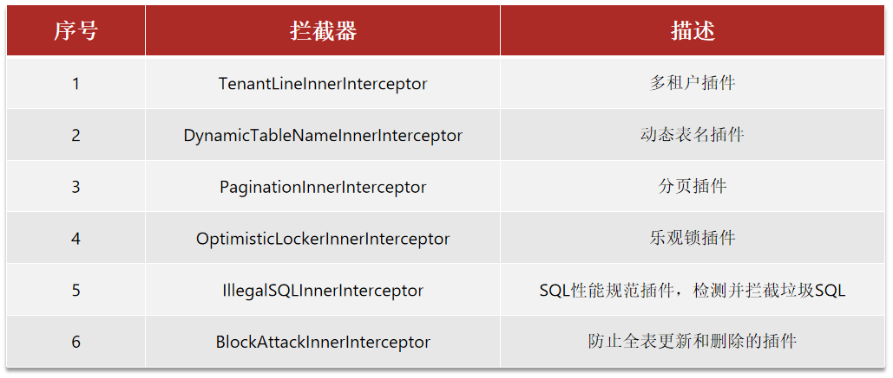
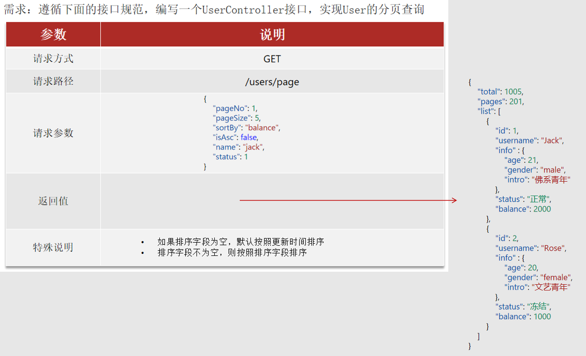

# 插件功能



# 分页插件

定义配置类,创建并添加分页插件,直接使用

## 基本用法

MyBatisConfig.java:

```java
package com.itheima.mp.config;

import com.baomidou.mybatisplus.annotation.DbType;
import com.baomidou.mybatisplus.extension.plugins.MybatisPlusInterceptor;
import com.baomidou.mybatisplus.extension.plugins.inner.PaginationInnerInterceptor;
import org.springframework.context.annotation.Bean;
import org.springframework.context.annotation.Configuration;

@Configuration
public class MyBatisConfig {

    @Bean
    public MybatisPlusInterceptor mybatisPlusInterceptor() {
        MybatisPlusInterceptor interceptor = new MybatisPlusInterceptor();
        // 创建分页插件
        PaginationInnerInterceptor paginationInnerInterceptor = new PaginationInnerInterceptor(DbType.MYSQL);
        paginationInnerInterceptor.setMaxLimit(1000L);
        // 添加分页插件
        interceptor.addInnerInterceptor(paginationInnerInterceptor);
        return interceptor;
    }
}
```

直接使用分页插件:

```java
// 测试分页查询
@Test
void testPageQuery() {
    int pageNo = 1, pageSize = 2;
    // 分页条件
    Page<User> page = Page.of(pageNo, pageSize);
    // 排序条件
    page.addOrder(new OrderItem().setColumn("balance").setAsc(true));
    // 分页查询
    Page<User> p = userService.page(page);
    // 解析
    long total = p.getTotal();
    System.out.println("总条数:" + total);
    long pages = p.getPages();
    System.out.println("总页数:" + pages);
    List<User> users = p.getRecords();
    users.forEach(System.out::println);
}
```

## 范例



## 代码开发

PageQuery.java:

```java
package com.itheima.mp.domain.query;

import io.swagger.annotations.ApiModel;
import io.swagger.annotations.ApiModelProperty;
import lombok.Data;

@Data
@ApiModel(description = "分页查询实体")
public class PageQuery {
    @ApiModelProperty("页码")
    private Integer pageNo;
    @ApiModelProperty("页数")
    private Integer pageSize;
    @ApiModelProperty("排序字段")
    private String sortBy;
    @ApiModelProperty("是否升序")
    private Boolean isAsc;
}
```

UserQuery.java:

```java
package com.itheima.mp.domain.query;

import io.swagger.annotations.ApiModel;
import io.swagger.annotations.ApiModelProperty;
import lombok.Data;
import lombok.EqualsAndHashCode;

@Data
@EqualsAndHashCode(callSuper = true)
@ApiModel(description = "用户查询条件实体")
public class UserQuery extends PageQuery {
    @ApiModelProperty("用户名关键字")
    private String name;
    @ApiModelProperty("用户状态：1-正常，2-冻结")
    private Integer status;
    @ApiModelProperty("余额最小值")
    private Integer minBalance;
    @ApiModelProperty("余额最大值")
    private Integer maxBalance;
}
```

PageDTO.java:

```java
package com.itheima.mp.domain.dto;

import io.swagger.annotations.ApiModel;
import io.swagger.annotations.ApiModelProperty;
import lombok.Data;

import java.util.List;

@Data
@ApiModel(description = "分页结果")
public class PageDTO<T> {
    @ApiModelProperty("总条数")
    private Long total;
    @ApiModelProperty("总页数")
    private Long pages;
    @ApiModelProperty("集合")
    private List<T> list;
}
```

UserController.java:

```java
/**
 * 根据复杂条件分页查询
 *
 * @param ids
 * @return
 */
@GetMapping("/page")
@ApiOperation("根据复杂条件分页查询")
public PageDTO<UserVO> queryUsersPage(UserQuery userQuery) {
    log.info("根据复杂条件分页查询:{}", userQuery);
    return userService.queryUsersPage(userQuery);
}
```

UserService.java:

```java
/**
 * 根据复杂条件分页查询
 *
 * @param pageQuery
 * @return
 */
PageDTO<UserVO> queryUsersPage(UserQuery UserQuery);
```

UserServiceImpl.java:

```java
/**
 * 根据复杂条件分页查询
 *
 * @param pageQuery
 * @return
 */
@Override
public PageDTO<UserVO> queryUsersPage(UserQuery UserQuery) {
    // 分页条件
    String name = UserQuery.getName();
    Integer status = UserQuery.getStatus();
    Integer minBalance = UserQuery.getMinBalance();
    Integer maxBalance = UserQuery.getMaxBalance();
    Page<User> page = Page.of(UserQuery.getPageNo(), UserQuery.getPageSize());

    // 排序条件
    if (UserQuery.getSortBy() == null) {
        // 如果排序字段为空,默认按照更新时间排序
        page.addOrder(new OrderItem().setColumn("update_time").setAsc(UserQuery.getIsAsc()));
    } else {
        // 排序字段不为空,则按照排序字段排序
        page.addOrder(new OrderItem().setColumn(UserQuery.getSortBy()).setAsc(UserQuery.getIsAsc()));
    }

    // 分页查询
    Page<User> p = lambdaQuery()
            .like(name != null, User::getUsername, name)
            .eq(status != null, User::getStatus, status)
            .gt(minBalance != null, User::getBalance, minBalance)
            .lt(maxBalance != null, User::getBalance, maxBalance)
            .page(page);

    // 封装VO结果
    PageDTO<UserVO> pageDto = new PageDTO<>();
    // 总条数
    pageDto.setTotal(p.getTotal());
    // 总页数
    pageDto.setPages(p.getPages());
    // 当前页数据
    if (CollUtil.isEmpty(p.getRecords())) {
        pageDto.setList(Collections.emptyList());
        return pageDto;
    }
    pageDto.setList(BeanUtil.copyToList(p.getRecords(), UserVO.class));

    // 返回结果
    return pageDto;
}
```

## 代码优化

需求:
- 在PageQuery中定义方法,将PageQuery对象转为MyBatisPlus中的Page对象
- 在PageDTO中定义方法,将MyBatisPlus中的Page结果转为PageDTO结果

PageQuery.java:

```java
package com.itheima.mp.domain.query;

import cn.hutool.core.util.StrUtil;
import com.baomidou.mybatisplus.core.metadata.OrderItem;
import com.baomidou.mybatisplus.extension.plugins.pagination.Page;
import io.swagger.annotations.ApiModel;
import io.swagger.annotations.ApiModelProperty;
import lombok.Data;

@Data
@ApiModel(description = "分页查询实体")
public class PageQuery {
    @ApiModelProperty("页码")
    private Integer pageNo = 1;
    @ApiModelProperty("页数")
    private Integer pageSize = 10;
    @ApiModelProperty("排序字段")
    private String sortBy;
    @ApiModelProperty("是否升序")
    private Boolean isAsc = true;

    public <T> Page<T> toMpPage(OrderItem... items) {
        // 分页条件
        Page<T> page = Page.of(pageNo, pageSize);
        // 排序条件
        if (StrUtil.isNotBlank(sortBy)) {
            // 排序字段不为空,则按照排序字段排序
            page.addOrder(new OrderItem().setColumn(sortBy).setAsc(isAsc));
        } else if (items != null) {
            // 如果排序字段为空,默认排序
            page.addOrder(items);
        }
        return page;
    }

    public <T> Page<T> toMpPage(String defaultSortBy, Boolean defaultAsc) {
        return toMpPage(new OrderItem().setColumn(defaultSortBy).setAsc(defaultAsc));
    }

    public <T> Page<T> toMpPageDefaultSortByCreateTime() {
        return toMpPage(new OrderItem().setColumn("create_time").setAsc(false));
    }

    public <T> Page<T> toMpPageDefaultSortByUpdateTime() {
        return toMpPage(new OrderItem().setColumn("update_time").setAsc(false));
    }
}
```

PageDTO.java:

```java
package com.itheima.mp.domain.dto;

import cn.hutool.core.bean.BeanUtil;
import cn.hutool.core.collection.CollUtil;
import com.baomidou.mybatisplus.extension.plugins.pagination.Page;
import io.swagger.annotations.ApiModel;
import io.swagger.annotations.ApiModelProperty;
import lombok.Data;

import java.util.Collections;
import java.util.List;
import java.util.function.Function;
import java.util.stream.Collectors;

@Data
@ApiModel(description = "分页结果")
public class PageDTO<T> {
    @ApiModelProperty("总条数")
    private Long total;
    @ApiModelProperty("总页数")
    private Long pages;
    @ApiModelProperty("集合")
    private List<T> list;

    public static <PO, VO> PageDTO<VO> of(Page<PO> p, Class<VO> clazz) {
        // 封装VO结果
        PageDTO<VO> pageDto = new PageDTO<>();
        // 总条数
        pageDto.setTotal(p.getTotal());
        // 总页数
        pageDto.setPages(p.getPages());
        // 当前页数据
        List<PO> records = p.getRecords();
        if (CollUtil.isEmpty(records)) {
            pageDto.setList(Collections.emptyList());
            return pageDto;
        }
        pageDto.setList(BeanUtil.copyToList(records, clazz));
        return pageDto;
    }

    public static <PO, VO> PageDTO<VO> ofConvertor(Page<PO> p, Function<PO, VO> convertor) {
        // 封装VO结果
        PageDTO<VO> pageDto = new PageDTO<>();
        // 总条数
        pageDto.setTotal(p.getTotal());
        // 总页数
        pageDto.setPages(p.getPages());
        // 当前页数据
        List<PO> records = p.getRecords();
        if (CollUtil.isEmpty(records)) {
            pageDto.setList(Collections.emptyList());
            return pageDto;
        }
        List<VO> collect = records.stream().map(convertor).collect(Collectors.toList());
        pageDto.setList(collect);
        return pageDto;
    }
}
```

UserServiceImpl.java:

```java
/**
 * 根据复杂条件分页查询
 *
 * @param pageQuery
 * @return
 */
@Override
public PageDTO<UserVO> queryUsersPage(UserQuery userQuery) {
    // 分页条件
    String name = userQuery.getName();
    Integer status = userQuery.getStatus();
    Integer minBalance = userQuery.getMinBalance();
    Integer maxBalance = userQuery.getMaxBalance();

    // 排序条件
    Page<User> page = userQuery.toMpPageDefaultSortByUpdateTime();

    // 分页查询
    Page<User> p = lambdaQuery()
            .like(name != null, User::getUsername, name)
            .eq(status != null, User::getStatus, status)
            .gt(minBalance != null, User::getBalance, minBalance)
            .lt(maxBalance != null, User::getBalance, maxBalance)
            .page(page);

    // 封装VO结果并返回
    return PageDTO.of(p, UserVO.class);
}
```