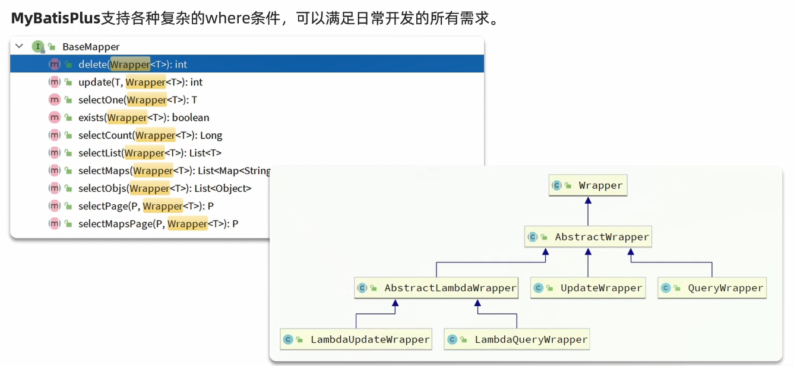
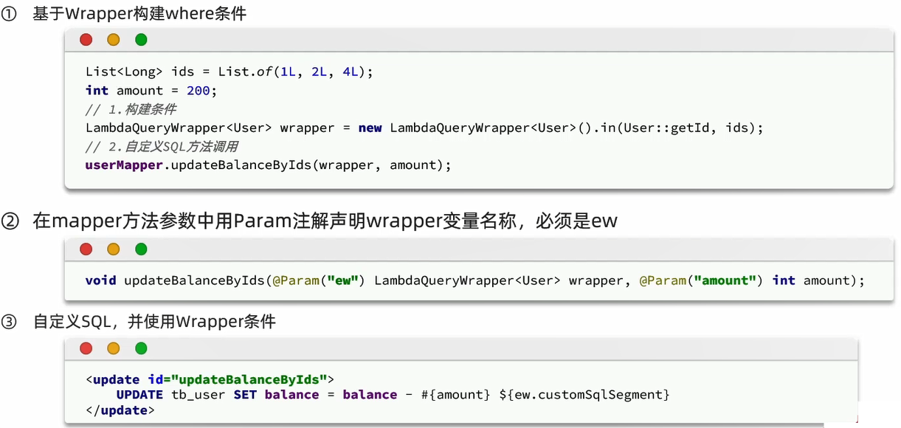
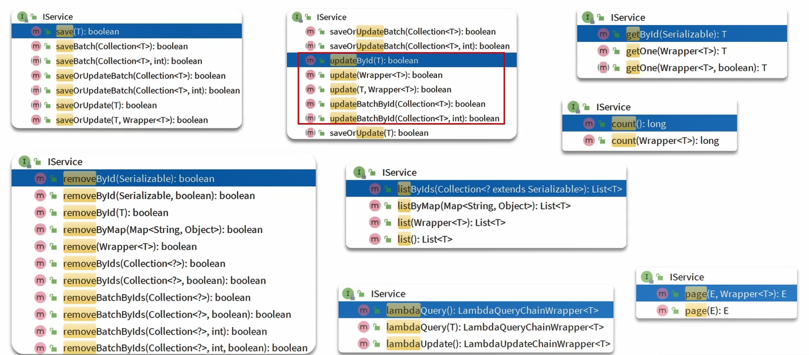
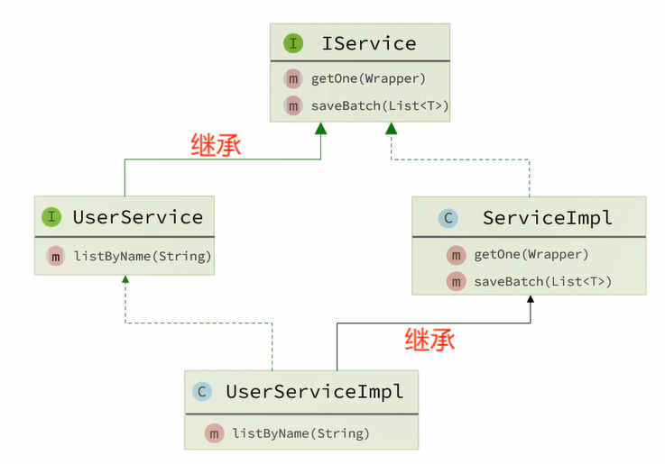
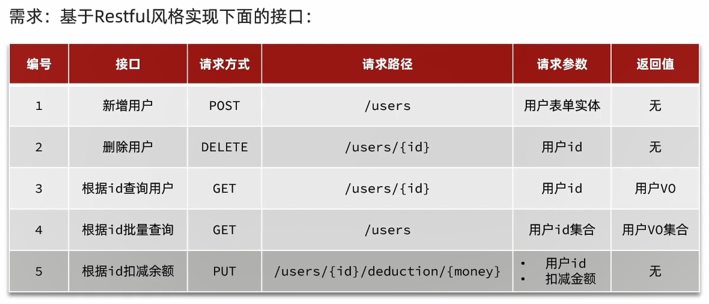

# 核心功能

# 条件构造器



细节:
- **`QueryWrapper`和`LambdaQueryWrapper`通常用来构建select、delete、update的where条件部分**
- **`UpdateWrapper`和`LambdaUpdateWrapper`通常只有在set语句比较特殊时,才使用**
- **尽量使用`LambdaQueryWrapper`和`LambdaUpdateWrapper`,避免硬编码**

## 范例

准备工作:

```sql
-- 创建地址表
CREATE TABLE IF NOT EXISTS `address`
(
    `id`         bigint NOT NULL AUTO_INCREMENT,
    `user_id`    bigint                                                  DEFAULT NULL COMMENT '用户ID',
    `province`   varchar(10) CHARACTER SET utf8 COLLATE utf8_general_ci  DEFAULT NULL COMMENT '省',
    `city`       varchar(10) CHARACTER SET utf8 COLLATE utf8_general_ci  DEFAULT NULL COMMENT '市',
    `town`       varchar(10) CHARACTER SET utf8 COLLATE utf8_general_ci  DEFAULT NULL COMMENT '县/区',
    `mobile`     varchar(255) CHARACTER SET utf8 COLLATE utf8_general_ci DEFAULT NULL COMMENT '手机',
    `street`     varchar(255) CHARACTER SET utf8 COLLATE utf8_general_ci DEFAULT NULL COMMENT '详细地址',
    `contact`    varchar(255) CHARACTER SET utf8 COLLATE utf8_general_ci DEFAULT NULL COMMENT '联系人',
    `is_default` bit(1)                                                  DEFAULT b'0' COMMENT '是否是默认 1默认 0否',
    `notes`      varchar(255) CHARACTER SET utf8 COLLATE utf8_general_ci DEFAULT NULL COMMENT '备注',
    `deleted`    bit(1)                                                  DEFAULT b'0' COMMENT '逻辑删除',
    PRIMARY KEY (`id`) USING BTREE,
    KEY `user_id` (`user_id`) USING BTREE
) 
    COMMENT ='地址表'
    ENGINE = InnoDB
    AUTO_INCREMENT = 71
    DEFAULT CHARSET = utf8mb3
    ROW_FORMAT = COMPACT;

-- 地址表导入数据
INSERT INTO `address` (`id`, `user_id`, `province`, `city`, `town`, `mobile`, `street`, `contact`, `is_default`,
                       `notes`, `deleted`)
VALUES (59, 2, '北京', '北京', '朝阳区', '13900112222', '金燕龙办公楼', 'Rose', b'1', NULL, b'0'),
       (60, 1, '北京', '北京', '朝阳区', '13700221122', '修正大厦', 'Jack', b'0', NULL, b'0'),
       (61, 1, '上海', '上海', '浦东新区', '13301212233', '航头镇航头路', 'Jack', b'1', NULL, b'0'),
       (63, 2, '广东', '佛山', '永春', '13301212233', '永春武馆', 'Rose', b'0', NULL, b'0'),
       (64, 3, '浙江', '杭州', '拱墅区', '13567809102', '浙江大学', 'Hope', b'1', NULL, b'0'),
       (65, 3, '浙江', '杭州', '拱墅区', '13967589201', '左岸花园', 'Hope', b'0', NULL, b'0'),
       (66, 4, '湖北', '武汉', '汉口', '13967519202', '天天花园', 'Thomas', b'1', NULL, b'0'),
       (67, 3, '浙江', '杭州', '拱墅区', '13967589201', '左岸花园', 'Hopey', b'0', NULL, b'0'),
       (68, 4, '湖北', '武汉', '汉口', '13967519202', '天天花园', 'Thomas', b'1', NULL, b'0'),
       (69, 3, '浙江', '杭州', '拱墅区', '13967589201', '左岸花园', 'Hopey', b'0', NULL, b'0'),
       (70, 4, '湖北', '武汉', '汉口', '13967519202', '天天花园', 'Thomas', b'1', NULL, b'0');

-- 创建用户表
CREATE TABLE `user`
(
    `id`          BIGINT(19)   NOT NULL AUTO_INCREMENT COMMENT '用户id',
    `username`    VARCHAR(50)  NOT NULL COMMENT '用户名' COLLATE 'utf8_general_ci',
    `password`    VARCHAR(128) NOT NULL COMMENT '密码' COLLATE 'utf8_general_ci',
    `phone`       VARCHAR(20)  NULL     DEFAULT NULL COMMENT '注册手机号' COLLATE 'utf8_general_ci',
    `info`        JSON         NOT NULL COMMENT '详细信息',
    `status`      INT(10)      NULL     DEFAULT '1' COMMENT '使用状态（1正常 2冻结）',
    `balance`     INT(10)      NULL     DEFAULT NULL COMMENT '账户余额',
    `create_time` DATETIME     NOT NULL DEFAULT CURRENT_TIMESTAMP COMMENT '创建时间',
    `update_time` DATETIME     NOT NULL DEFAULT CURRENT_TIMESTAMP ON UPDATE CURRENT_TIMESTAMP COMMENT '更新时间',
    PRIMARY KEY (`id`) USING BTREE,
    UNIQUE INDEX `username` (`username`) USING BTREE
)
    COMMENT ='用户表'
    COLLATE = 'utf8_general_ci'
    ENGINE = InnoDB
    ROW_FORMAT = COMPACT
    AUTO_INCREMENT = 5;

-- 用户表导入数据
INSERT INTO `user` (`id`, `username`, `password`, `phone`, `info`, `status`, `balance`, `create_time`, `update_time`)
VALUES 
    (1, 'Jack', '123', '13900112224', '{
     "age": 20,
     "intro": "佛系青年",
     "gender": "male"
    }', 1, 1600, '2023-05-19 20:50:21', '2023-06-19 20:50:21'),
   (2, 'Rose', '123', '13900112223', '{
     "age": 19,
     "intro": "青涩少女",
     "gender": "female"
   }', 1, 600, '2023-05-19 21:00:23', '2023-06-19 21:00:23'),
   (3, 'Hope', '123', '13900112222', '{
     "age": 25,
     "intro": "上进青年",
     "gender": "male"
   }', 1, 100000, '2023-06-19 22:37:44', '2023-06-19 22:37:44'),
   (4, 'Thomas', '123', '17701265258', '{
     "age": 29,
     "intro": "伏地魔",
     "gender": "male"
   }', 1, 800, '2023-06-19 23:44:45', '2023-06-19 23:44:45');
```

UserMapper接口:

```java
package com.itheima.mp.mapper;

import com.baomidou.mybatisplus.core.conditions.query.QueryWrapper;
import com.baomidou.mybatisplus.core.mapper.BaseMapper;
import com.baomidou.mybatisplus.core.toolkit.Constants;
import com.itheima.mp.domain.po.User;
import org.apache.ibatis.annotations.Mapper;
import org.apache.ibatis.annotations.Param;

@Mapper
public interface UserMapper extends BaseMapper<User> {
}
```

操作:
1. 查询出名字中带o的,存款大于等于1000元的人的id、username、info、balance字段
2. 更新用户名为jack的用户的余额为2000
3. 更新id为1,2,4的用户余额,扣200

测试类:

```java
package com.itheima.mp.mapper;

import com.baomidou.mybatisplus.core.conditions.query.LambdaQueryWrapper;
import com.baomidou.mybatisplus.core.conditions.query.QueryWrapper;
import com.baomidou.mybatisplus.core.conditions.update.LambdaUpdateWrapper;
import com.baomidou.mybatisplus.core.conditions.update.UpdateWrapper;
import com.itheima.mp.domain.po.User;
import org.junit.jupiter.api.Test;
import org.springframework.beans.factory.annotation.Autowired;
import org.springframework.boot.test.context.SpringBootTest;

import java.util.List;

@SpringBootTest
class UserMapperTest {

    @Autowired
    private UserMapper userMapper;

    // 查询出名字中带o的,存款大于等于1000元的人的id、username、info、balance字段
    @Test
    void testQueryWrapper() {
        QueryWrapper<User> wrapper = new QueryWrapper<User>()
                .select("id", "username", "info", "balance")
                .like("username", "o")
                .ge("balance", 1000);
        List<User> userList = userMapper.selectList(wrapper);
        System.out.println(userList);
    }

    @Test
    void testLambdaQueryWrapper2() {
        LambdaQueryWrapper<User> wrapper = new QueryWrapper<User>().lambda()
                .select(User::getId, User::getUsername, User::getInfo, User::getBalance)
                .like(User::getUsername, "o")
                .ge(User::getBalance, 1000);
        List<User> userList = userMapper.selectList(wrapper);
        System.out.println(userList);
    }

    @Test
    void testLambdaQueryWrapper1() {
        LambdaQueryWrapper<User> wrapper = new LambdaQueryWrapper<User>()
                .select(User::getId, User::getUsername, User::getInfo, User::getBalance)
                .like(User::getUsername, "o")
                .ge(User::getBalance, 1000);
        List<User> userList = userMapper.selectList(wrapper);
        System.out.println(userList);
    }

    // 更新用户名为jack的用户的余额为2000
    @Test
    void testUpdateByQueryWrapper() {
        User user = new User();
        user.setBalance(2000);
        QueryWrapper<User> wrapper = new QueryWrapper<User>()
                .eq("username", "jack");
        userMapper.update(user, wrapper);
    }

    @Test
    void testUpdateByLambdaQueryWrapper1() {
        User user = new User();
        user.setBalance(2000);
        LambdaQueryWrapper<User> wrapper = new QueryWrapper<User>().lambda()
                .eq(User::getUsername, "jack");
        userMapper.update(user, wrapper);
    }

    @Test
    void testUpdateByLambdaQueryWrapper2() {
        User user = new User();
        user.setBalance(2000);
        LambdaQueryWrapper<User> wrapper = new LambdaQueryWrapper<User>()
                .eq(User::getUsername, "jack");
        userMapper.update(user, wrapper);
    }

    // 更新id为1,2,4的用户余额,扣200
    @Test
    void testUpdateWrapper() {
        List<Long> ids = List.of(1L, 2L, 4L);
        UpdateWrapper<User> wrapper = new UpdateWrapper<User>()
                .setSql("balance = balance - 200")
                .in("id", ids);
        userMapper.update(null, wrapper);
    }

    @Test
    void testLambdaUpdateWrapper1() {
        List<Long> ids = List.of(1L, 2L, 4L);
        LambdaUpdateWrapper<User> wrapper = new UpdateWrapper<User>().lambda()
                .setSql("balance = balance - 200")
                .in(User::getId, ids);
        userMapper.update(null, wrapper);
    }

    @Test
    void testLambdaUpdateWrapper2() {
        List<Long> ids = List.of(1L, 2L, 4L);
        LambdaUpdateWrapper<User> wrapper = new LambdaUpdateWrapper<User>()
                .setSql("balance = balance - 200")
                .in(User::getId, ids);
        userMapper.update(null, wrapper);
    }
}
```

# 自定义SQL

**利用MyBatisPlus的Wrapper来构建复杂的Where条件,然后自己定义SQL语句中剩下的部分**



## 范例

测试类:

```java
// 自定义SQL:更新id为1,2,4的用户余额,扣200
@Test
void testCustomSql() {
    // 更新条件
    List<Long> ids = List.of(1L, 2L, 4L);
    int amount = 200;
    // 定义条件
    LambdaQueryWrapper<User> wrapper = new LambdaQueryWrapper<User>().in(User::getId, ids);
    // 调用自定义Sql方法
    userMapper.updateBalanceByIds(wrapper, amount);
}
```

UserMapper接口类:

```java
/**
 * 更新用户列表ids中的用户余额扣amount
 *
 * @param wrapper
 * @param amount
 */
void updateBalanceByIds(@Param(Constants.WRAPPER) LambdaQueryWrapper<User> wrapper, @Param("amount") int amount);
```

UserMapper.xml:

```xml
<update id="updateBalanceByIds">
    update user set balance = balance - #{amount} ${ew.customSqlSegment}
</update>
```

# IService接口



## 基本用法



使用流程:

1. 自定义Service接口继承IService接口(**泛型中指定实体类**)

```java
public interface UserService extends IService<User> {
}
```

2. 自定义Service实现类,实现自定义接口并继承ServiceImpl类(**泛型中指定Mapper类和实体类**)

```java
@Service
public class UserServiceImpl extends ServiceImpl<UserMapper, User> implements UserService {
}
```

3. 在测试类中创建Service接口,并调用IService的方法,实际上其底层也是通过Mapper接口继承BaseMapper接口

```java
@Autowired
private UserService userService;

// 测试新增
@Test
void testSave() {
    User user = new User();
    user.setId(5L);
    user.setUsername("Lucy");
    user.setPassword("123");
    user.setPhone("18688990011");
    user.setBalance(200);
    user.setInfo("{\"age\": 24, \"intro\": \"英文老师\", \"gender\": \"female\"}");
    user.setCreateTime(LocalDateTime.now());
    user.setUpdateTime(LocalDateTime.now());
    userService.save(user);
}

// 测试查询
@Test
void testQuery() {
    List<User> users = userService.listByIds(List.of(1L, 2L, 4L));
    System.out.println(users);
}
```

## 开发业务接口范例



准备工作:

1. Maven依赖引入

```xml
<!--swagger-->
<dependency>
    <groupId>com.github.xiaoymin</groupId>
    <artifactId>knife4j-openapi2-spring-boot-starter</artifactId>
    <version>4.1.0</version>
</dependency>
<!--web-->
<dependency>
    <groupId>org.springframework.boot</groupId>
    <artifactId>spring-boot-starter-web</artifactId>
</dependency>
```

2. 配置设置

```yaml
knife4j:
  enable: true
  openapi:
    title: 用户管理接口文档
    description: "用户管理接口文档"
    version: v1.0.0
    group:
      default:
        group-name: default
        api-rule: package
        api-rule-resources:
          - com.itheima.mp.controller
```

3. 准备DTO和VO

UserFormDTO.java:

```java
package com.itheima.mp.domain.dto;

import io.swagger.annotations.ApiModel;
import io.swagger.annotations.ApiModelProperty;
import lombok.Data;

@Data
@ApiModel(description = "用户表单实体")
public class UserFormDTO {

    @ApiModelProperty("id")
    private Long id;

    @ApiModelProperty("用户名")
    private String username;

    @ApiModelProperty("密码")
    private String password;

    @ApiModelProperty("注册手机号")
    private String phone;

    @ApiModelProperty("详细信息,JSON风格")
    private String info;

    @ApiModelProperty("账户余额")
    private Integer balance;
}
```

UserVO.java:

```java
package com.itheima.mp.domain.vo;

import io.swagger.annotations.ApiModel;
import io.swagger.annotations.ApiModelProperty;
import lombok.Data;

@Data
@ApiModel(description = "用户VO")
public class UserVO {

    @ApiModelProperty("用户id")
    private Long id;

    @ApiModelProperty("用户名")
    private String username;

    @ApiModelProperty("详细信息")
    private String info;

    @ApiModelProperty("使用状态（1正常 2冻结）")
    private Integer status;

    @ApiModelProperty("账户余额")
    private Integer balance;
}
```

4. 代码开发

UserController.java:

```java
package com.itheima.mp.controller;

import cn.hutool.core.bean.BeanUtil;
import com.itheima.mp.domain.dto.UserFormDTO;
import com.itheima.mp.domain.po.User;
import com.itheima.mp.domain.vo.UserVO;
import com.itheima.mp.service.UserService;
import io.swagger.annotations.Api;
import io.swagger.annotations.ApiOperation;
import io.swagger.annotations.ApiParam;
import lombok.RequiredArgsConstructor;
import lombok.extern.slf4j.Slf4j;
import org.springframework.web.bind.annotation.*;

import java.util.List;

@RestController("userController")
@RequestMapping("/users")
@Api(tags = "用户相关接口")
@RequiredArgsConstructor
@Slf4j
public class UserController {

    private final UserService userService;

    /**
     * 新增用户
     *
     * @param userFormDTO
     */
    @PostMapping
    @ApiOperation("新增用户")
    public void save(@RequestBody UserFormDTO userFormDTO) {
        log.info("新增用户:{}", userFormDTO);
        User user = BeanUtil.copyProperties(userFormDTO, User.class);
        userService.save(user);
    }

    /**
     * 删除用户
     *
     * @param id
     */
    @DeleteMapping("/{id}")
    @ApiOperation("删除用户")
    public void deleteById(@ApiParam("用户id") @PathVariable("id") Long id) {
        log.info("删除用户:{}", id);
        userService.removeById(id);
    }

    /**
     * 根据id查询用户
     *
     * @param id
     * @return
     */
    @GetMapping("/{id}")
    @ApiOperation("根据id查询用户")
    public UserVO getById(@ApiParam("用户id") @PathVariable("id") Long id) {
        log.info("根据id查询用户:{}", id);
        User user = userService.getById(id);
        return BeanUtil.copyProperties(user, UserVO.class);
    }

    /**
     * 根据ids批量查询
     *
     * @param ids
     * @return
     */
    @GetMapping
    @ApiOperation("根据ids批量查询")
    public List<UserVO> getByIds(@ApiParam("用户ids集合") @RequestParam("ids") List<Long> ids) {
        log.info("根据ids批量查询:{}", ids);
        List<User> userList = userService.listByIds(ids);
        return BeanUtil.copyToList(userList, UserVO.class);
    }

    /**
     * 根据id扣减余额
     *
     * @param id
     * @param money
     */
    @PutMapping("/{id}/deduction/{money}")
    @ApiOperation("根据id扣减余额")
    public void deductBalance(@ApiParam("用户id") @PathVariable("id") Long id,
                              @ApiParam("金额") @PathVariable("money") Integer money) {
        log.info("根据id:{}扣减余额{}", id, money);
        userService.deductBalance(id, money);
    }
}
```

UserService.java:

```java
package com.itheima.mp.service;

import com.baomidou.mybatisplus.extension.service.IService;
import com.itheima.mp.domain.po.User;

public interface UserService extends IService<User> {
    /**
     * 根据id扣减余额
     *
     * @param id
     * @param money
     */
    void deductBalance(Long id, Integer money);
}
```

UserServiceImpl.java:

```java
package com.itheima.mp.service.Impl;

import com.baomidou.mybatisplus.extension.service.impl.ServiceImpl;
import com.itheima.mp.domain.po.User;
import com.itheima.mp.mapper.UserMapper;
import com.itheima.mp.service.UserService;
import org.springframework.stereotype.Service;

@Service
public class UserServiceImpl extends ServiceImpl<UserMapper, User> implements UserService {
    /**
     * 根据id扣减余额
     *
     * @param id
     * @param money
     */
    @Override
    public void deductBalance(Long id, Integer money) {
        // 查询用户
        User user = this.getById(id);

        // 校验用户状态
        if (user == null || user.getStatus() == 2) {
            throw new RuntimeException("用户状态异常");
        }

        // 校验余额是否充足
        if (user.getBalance() < money) {
            throw new RuntimeException("用户余额不足");
        }

        // 扣减余额
        baseMapper.deductBalance(id,money);
    }
}
```

UserMapper.java:

```java
package com.itheima.mp.mapper;

import com.baomidou.mybatisplus.core.conditions.query.LambdaQueryWrapper;
import com.baomidou.mybatisplus.core.mapper.BaseMapper;
import com.baomidou.mybatisplus.core.toolkit.Constants;
import com.itheima.mp.domain.po.User;
import org.apache.ibatis.annotations.Mapper;
import org.apache.ibatis.annotations.Param;
import org.apache.ibatis.annotations.Update;

@Mapper
public interface UserMapper extends BaseMapper<User> {
    /**
     * 更新用户列表ids中的用户余额扣amount
     *
     * @param wrapper
     * @param amount
     */
    void updateBalanceByIds(@Param(Constants.WRAPPER) LambdaQueryWrapper<User> wrapper, @Param("amount") int amount);


    /**
     * 根据id扣减余额
     *
     * @param id
     * @param money
     */
    @Update("update user set balance = balance - #{money} where id = #{id}")
    void deductBalance(@Param("id") Long id, @Param("money") Integer money);
}
```

## Lambda方法范例

## lambdaQuery

需求:实现一个根据复杂条件查询用户的接口,查询条件如下:                   
- name:用户名关键字,可以为空
- status:用户状态,可以为空
- minBalance:最小余额,可以为空
- maxBalance:最大余额,可以为空

UserQuery.java:

```java
package com.itheima.mp.domain.query;

import io.swagger.annotations.ApiModel;
import io.swagger.annotations.ApiModelProperty;
import lombok.Data;

@Data
@ApiModel(description = "用户查询条件实体")
public class UserQuery {
    @ApiModelProperty("用户名关键字")
    private String name;
    @ApiModelProperty("用户状态：1-正常,2-冻结")
    private Integer status;
    @ApiModelProperty("余额最小值")
    private Integer minBalance;
    @ApiModelProperty("余额最大值")
    private Integer maxBalance;
}
```

UserController.java:

```java
/**
 * 根据复杂条件查询
 *
 * @param ids
 * @return
 */
@GetMapping("/list")
@ApiOperation("根据复杂条件查询")
public List<UserVO> queryUsers(UserQuery userQuery) {
    log.info("根据复杂条件查询:{}", userQuery);
    List<User> userList = userService.queryUsers(userQuery.getName(), userQuery.getStatus(), userQuery.getMinBalance(), userQuery.getMaxBalance());
    return BeanUtil.copyToList(userList, UserVO.class);
}
```

UserService.java:

```java
/**
 * 根据复杂条件查询
 *
 * @param name
 * @param status
 * @param minBalance
 * @param maxBalance
 * @return
 */
List<User> queryUsers(String name, Integer status, Integer minBalance, Integer maxBalance);
```

UserServiceImpl.java:

```java
/**
 * 根据复杂条件查询
 *
 * @param name
 * @param status
 * @param minBalance
 * @param maxBalance
 * @return
 */
@Override
public List<User> queryUsers(String name, Integer status, Integer minBalance, Integer maxBalance) {
    return lambdaQuery()
            .like(name != null, User::getUsername, name)
            .eq(status != null, User::getStatus, status)
            .gt(minBalance != null, User::getBalance, minBalance)
            .lt(maxBalance != null, User::getBalance, maxBalance)
            .list();
}
```

lambdaQuery方法中除了可以构建条件,还需要在链式编程的最后添加一个list(),这是在告诉MyBatisPlus调用结果需要是一个list集合                 

这里不仅可以用list(),可选的方法有:
- `.one()`:最多1个结果
- `.list()`:返回集合结果
- `.count()`:返回计数结果                  

MyBatisPlus会根据链式编程的最后一个方法来判断最终的返回结果

## lambdaUpdate

需求:改造根据id修改用户余额的接口,要求如下:
- 完成对用户状态校验
- 完成对用户余额校验
- 如果扣减后余额为0,则将用户status修改为冻结状态(2)

UserServiceImpl.java:

```java
/**
 * 根据id扣减余额
 *
 * @param id
 * @param money
 */
@Override
@Transactional
public void deductBalance(Long id, Integer money) {
    // 查询用户
    User user = this.getById(id);

    // 校验用户状态
    if (user == null || user.getStatus() == 2) {
        throw new RuntimeException("用户状态异常");
    }

    // 校验余额是否充足
    if (user.getBalance() < money) {
        throw new RuntimeException("用户余额不足");
    }

    // 扣减余额
    // baseMapper.deductBalance(id, money);

    // 扣减余额,如果扣减后余额为0,则将用户status修改为冻结状态(2)
    int remainBalance = user.getBalance() - money;
    lambdaUpdate().set(User::getBalance, remainBalance)
            .set(remainBalance == 0, User::getStatus, 2)
            .eq(User::getId, id)
            .eq(User::getBalance, user.getBalance()) // 乐观锁
            .update();
}
```

## 批量新增对比

需求:批量插入10万条用户数据,并对比速度
- 普通for循环插入
- IService的批量插入

```java
// 批量插入10万条用户数据
private User buildUser(int i) {
    User user = new User();
    user.setUsername("user_" + i);
    user.setPassword("123");
    user.setPhone("" + (18688190000L + i));
    user.setBalance(2000);
    user.setInfo("{\"age\": 24, \"intro\": \"英文老师\", \"gender\": \"female\"}");
    user.setCreateTime(LocalDateTime.now());
    user.setUpdateTime(user.getCreateTime());
    return user;
}

// 测试普通for循环插入
@Test
void testSaveOneByOne() {
    long b = System.currentTimeMillis();
    for (int i = 1; i <= 100000; i++) {
        userService.save(buildUser(i));
    }
    long e = System.currentTimeMillis();
    System.out.println("耗时：" + (e - b));
}

// 测试IService的批量插入
@Test
void testSaveBatch() {
    // 准备10万条数据
    List<User> list = new ArrayList<>(1000);
    long b = System.currentTimeMillis();
    for (int i = 1; i <= 100000; i++) {
        list.add(buildUser(i));
        // 每1000条批量插入一次
        if (i % 1000 == 0) {
            userService.saveBatch(list);
            list.clear();
        }
    }
    long e = System.currentTimeMillis();
    System.out.println("耗时：" + (e - b));
}
```

使用了MyBatisPlus批处理以后,比逐条新增效率提高了10倍左右

MyBatisPlus的批处理是基于PrepareStatement的预编译模式,然后批量提交,最终在数据库执行时还是会有多条insert语句,逐条插入数据,例如:

```xml
Preparing: INSERT INTO user ( username, password, phone, info, balance, create_time, update_time ) VALUES ( ?, ?, ?, ?, ?, ?, ? )
Parameters: user_1, 123, 18688190001, "", 2000, 2023-07-01, 2023-07-01
Parameters: user_2, 123, 18688190002, "", 2000, 2023-07-01, 2023-07-01
Parameters: user_3, 123, 18688190003, "", 2000, 2023-07-01, 2023-07-01
```

如果想要得到最佳性能,最好是将多条SQL合并为一条,例如:

```xml
INSERT INTO user ( username, password, phone, info, balance, create_time, update_time )
VALUES 
(user_1, 123, 18688190001, "", 2000, 2023-07-01, 2023-07-01),
(user_2, 123, 18688190002, "", 2000, 2023-07-01, 2023-07-01),
(user_3, 123, 18688190003, "", 2000, 2023-07-01, 2023-07-01),
(user_4, 123, 18688190004, "", 2000, 2023-07-01, 2023-07-01),
...
```

MySQL的客户端连接参数中有这样的一个参数:rewriteBatchedStatements,顾名思义,就是重写批处理的statement语句

这个参数的默认值是false,修改连接参数,将其配置为true:`rewriteBatchedStatements=true`,其批处理的速度将会有非常明显的提升

application.yaml:

```yaml
spring:
  datasource:
    url: jdbc:mysql://127.0.0.1:3306/mybatis_plus_demo?useUnicode=true&characterEncoding=UTF-8&autoReconnect=true&serverTimezone=Asia/Shanghai&rewriteBatchedStatements=true
    driver-class-name: com.mysql.cj.jdbc.Driver
    username: root
    password: 123456
```

总结:
- 普通for循环逐条插入速度极差,不推荐
- MyBatisPlus的批量新增,基于预编译的批处理,性能不错
- 配置jdbc参数,开rewriteBatchedStatements,性能最好