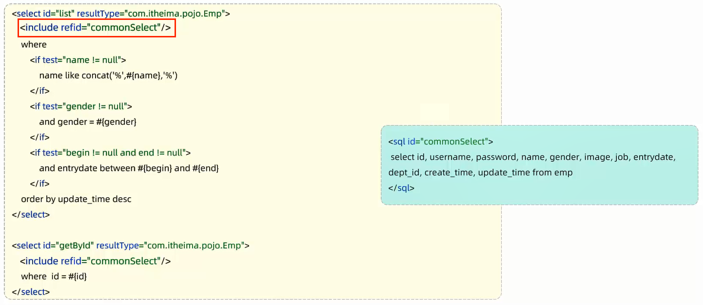

# 动态SQL

动态SQL:随着用户的输入或外部条件的变化而变化的SQL语句

# `<if>`

作用:用于判断条件是否成立,使用test属性进行条件判断,如果条件为true,则拼接SQL

范例:

```xml
<if test="name!=null">
    name like concat('%',#{name},'%')
</if>
```

# `<where>`

作用:
1. 只会在子元素有内容的情况下才插入where子句
2. 自动的去除子句开头的and/or

范例:

```xml
<!--resultType:单条记录所封装的类型-->
<select id="list3" resultType="com.jinzhao.pojo.Emp">
    select *
    from emp
    <where>
        <if test="name != null">
            name like concat('%', #{name}, '%')
        </if>
        <if test="gender != null">
            and gender = #{gender}
        </if>
        <if test="begin != null and end != null">
            and entry_date between #{begin} and #{end}
        </if>
    </where>
    order by update_time desc
</select>
```

# `<set>`

作用:动态的在行首插入set关键字,并会删除额外的逗号(用在update语句中)

范例:

```xml
<update id="update2">
    update emp
    <set>
        <if test="username != null">username=#{username},</if>
        <if test="name != null">name=#{name},</if>
        <if test="gender != null">gender=#{gender},</if>
        <if test="image != null">image=#{image},</if>
        <if test="job != null">job=#{job},</if>
        <if test="entryDate != null">entry_date=#{entryDate}</if>
        <if test="deptId != null">dept_id=#{deptId},</if>
        <if test="updateTime != null">update_time=#{updateTime}</if>
    </set>
    where id = #{id}
</update>
```

# `<foreach>`

作用:循环遍历

属性:
1. collection:集合名称
2. item:集合遍历出来的元素/项
3. separator:每一次遍历使用的分隔符
4. open:遍历开始前拼接的片段
5. close:遍历开始后拼接的片段

范例:

```xml
<delete id="deleteByIdList">
    delete from emp where id in
    <foreach collection="idList" item="id" separator="," open="(" close=")">
        #{id}
    </foreach>
</delete>
```

# `<sql>`和`<include>`



- `<sql id="...">...</sql>`:抽取片段        
- `<include refid="..."/>`:引用片段

范例:

```xml
<!--抽取片段-->
<sql id="commonSelect">select id,
                                  username,
                                  password,
                                  name,
                                  gender,
                                  image,
                                  job,
                                  entry_date,
                                  dept_id,
                                  create_time,
                                  update_time
                           from emp</sql>
    
<select id="list3" resultType="com.jinzhao.pojo.Emp">
<!--引用片段-->
<include refid="commonSelect"/>
<where>
    <if test="name != null">
        name like concat('%', #{name}, '%')
    </if>
    <if test="gender != null">
        and gender = #{gender}
    </if>
    <if test="begin != null and end != null">
        and entry_date between #{begin} and #{end}
    </if>
</where>
order by update_time desc
</select>
```