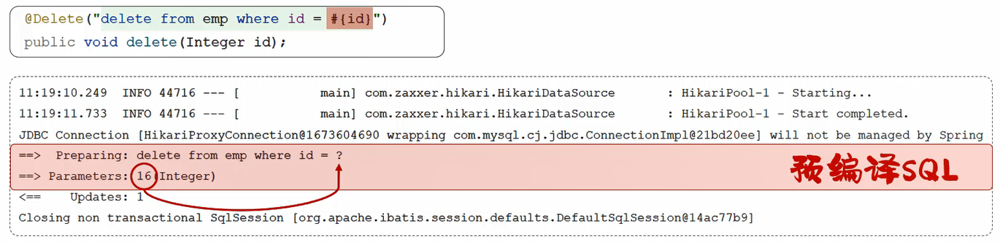
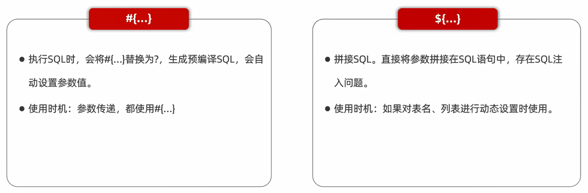
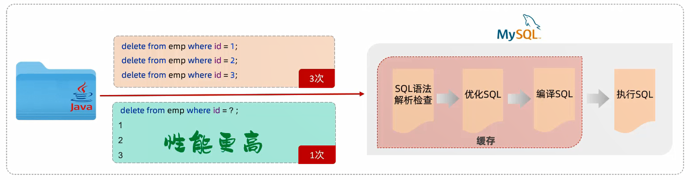
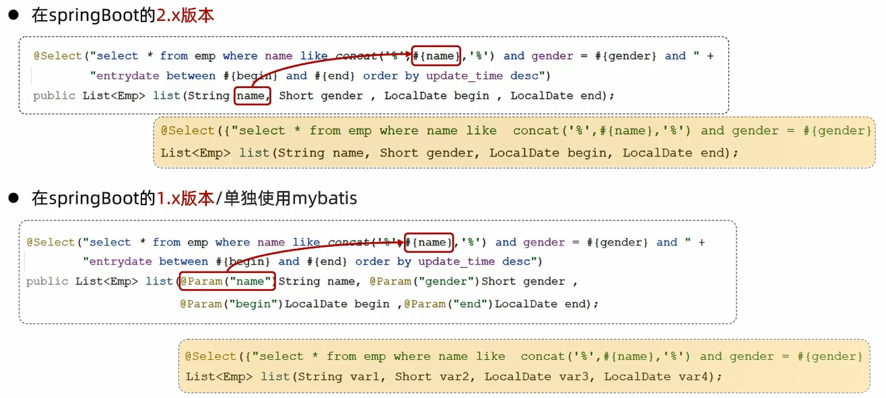
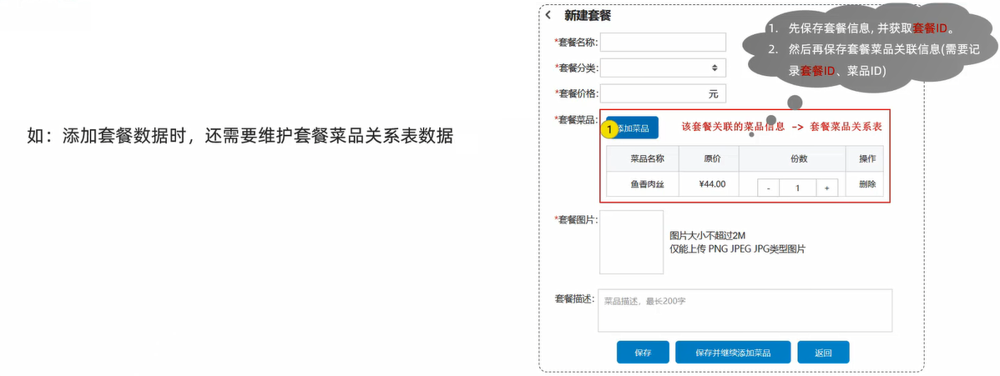
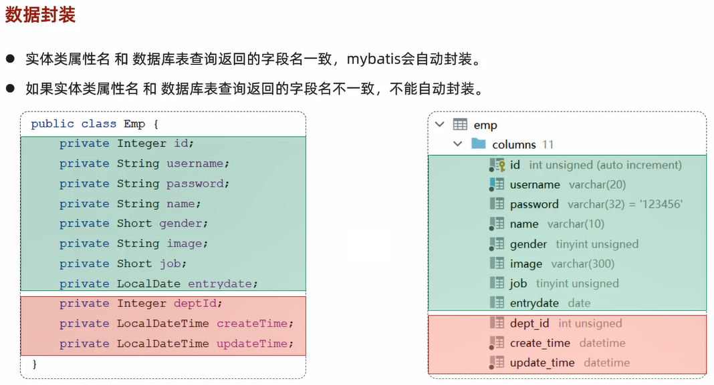
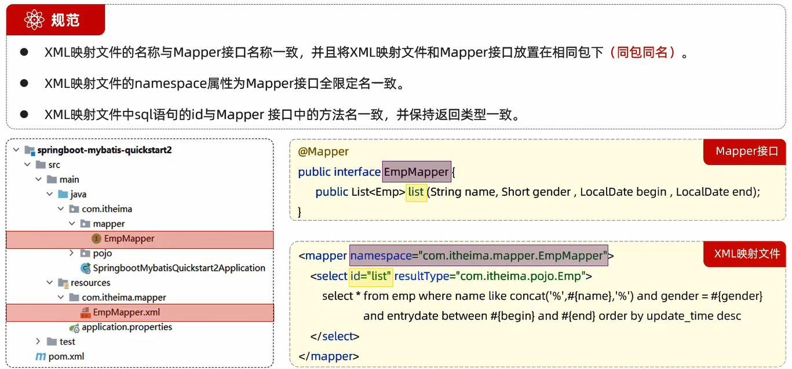
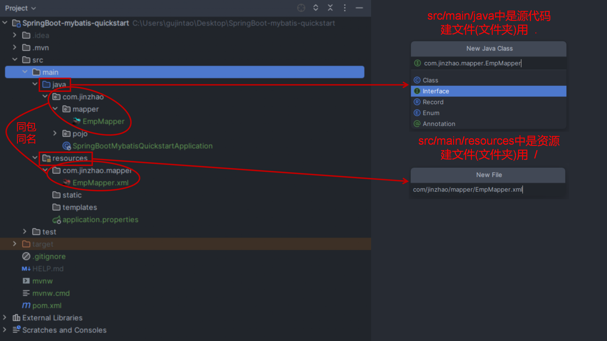
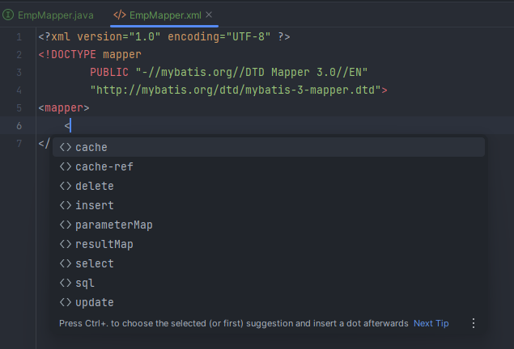

# MyBatis

1. **实现一些简单的增删改查功能:推荐使用MyBatis注解**
2. **实现复杂的SQL功能:推荐使用XML配置映射语句**

# 准备工作

以员工管理功能的增、删、改、查为例:


1. 准备数据库表

```sql
-- 创建部门表
create table dept
(
    id          int unsigned primary key auto_increment comment '主键ID',
    name        varchar(10) not null unique comment '部门名称',
    create_time datetime    not null comment '创建时间',
    update_time datetime    not null comment '修改时间'
) comment '部门表';

-- 部门表导入数据
insert into dept (id, name, create_time, update_time)
values (1, '学工部', now(), now()),
       (2, '教研部', now(), now()),
       (3, '咨询部', now(), now()),
       (4, '就业部', now(), now()),
       (5, '人事部', now(), now());


-- 创建员工表
create table emp
(
    id          int unsigned primary key auto_increment comment 'ID',
    username    varchar(20)      not null unique comment '用户名',
    password    varchar(32) default '123456' comment '密码',
    name        varchar(10)      not null comment '姓名',
    gender      tinyint unsigned not null comment '性别, 说明: 1 男, 2 女',
    image       varchar(300) comment '图像',
    job         tinyint unsigned comment '职位, 说明: 1 班主任,2 讲师, 3 学工主管, 4 教研主管, 5 咨询师',
    entry_date  date comment '入职时间',
    dept_id     int unsigned comment '部门ID',
    create_time datetime         not null comment '创建时间',
    update_time datetime         not null comment '修改时间'
) comment '员工表';

-- 员工表导入数据
insert into emp
(id, username, password, name, gender, image, job, entry_date, dept_id, create_time, update_time)
VALUES (1, 'jinyong', '123456', '金庸', 1, '1.jpg', 4, '2000-01-01', 2, now(), now()),
       (2, 'zhangwuji', '123456', '张无忌', 1, '2.jpg', 2, '2015-01-01', 2, now(), now()),
       (3, 'yangxiao', '123456', '杨逍', 1, '3.jpg', 2, '2008-05-01', 2, now(), now()),
       (4, 'weiyixiao', '123456', '韦一笑', 1, '4.jpg', 2, '2007-01-01', 2, now(), now()),
       (5, 'changyuchun', '123456', '常遇春', 1, '5.jpg', 2, '2012-12-05', 2, now(), now()),
       (6, 'xiaozhao', '123456', '小昭', 2, '6.jpg', 3, '2013-09-05', 1, now(), now()),
       (7, 'jixiaofu', '123456', '纪晓芙', 2, '7.jpg', 1, '2005-08-01', 1, now(), now()),
       (8, 'zhouzhiruo', '123456', '周芷若', 2, '8.jpg', 1, '2014-11-09', 1, now(), now()),
       (9, 'dingminjun', '123456', '丁敏君', 2, '9.jpg', 1, '2011-03-11', 1, now(), now()),
       (10, 'zhaomin', '123456', '赵敏', 2, '10.jpg', 1, '2013-09-05', 1, now(), now()),
       (11, 'luzhangke', '123456', '鹿杖客', 1, '11.jpg', 5, '2007-02-01', 3, now(), now()),
       (12, 'hebiweng', '123456', '鹤笔翁', 1, '12.jpg', 5, '2008-08-18', 3, now(), now()),
       (13, 'fangdongbai', '123456', '方东白', 1, '13.jpg', 5, '2012-11-01', 3, now(), now()),
       (14, 'zhangsanfeng', '123456', '张三丰', 1, '14.jpg', 2, '2002-08-01', 2, now(), now()),
       (15, 'yulianzhou', '123456', '俞莲舟', 1, '15.jpg', 2, '2011-05-01', 2, now(), now()),
       (16, 'songyuanqiao', '123456', '宋远桥', 1, '16.jpg', 2, '2010-01-01', 2, now(), now()),
       (17, 'chenyouliang', '123456', '陈友谅', 1, '17.jpg', NULL, '2015-03-21', NULL, now(), now());
```

2. 创建SpringBoot项目工程,引入相关依赖:`Spring Web`、`Mybatis Framework`、`MySQL Driver`、`Lombok`

```xml
<dependency>
    <groupId>org.springframework.boot</groupId>
    <artifactId>spring-boot-starter-web</artifactId>
</dependency>
<dependency>
    <groupId>org.mybatis.spring.boot</groupId>
    <artifactId>mybatis-spring-boot-starter</artifactId>
    <version>3.0.3</version>
</dependency>
<dependency>
    <groupId>com.mysql</groupId>
    <artifactId>mysql-connector-j</artifactId>
    <scope>runtime</scope>
</dependency>
<dependency>
    <groupId>org.springframework.boot</groupId>
    <artifactId>spring-boot-starter-test</artifactId>
    <scope>test</scope>
</dependency>
<dependency>
    <groupId>org.mybatis.spring.boot</groupId>
    <artifactId>mybatis-spring-boot-starter-test</artifactId>
    <version>3.0.3</version>
    <scope>test</scope>
</dependency>
<dependency>
    <groupId>org.projectlombok</groupId>
    <artifactId>lombok</artifactId>
    <version>1.18.24</version>
    <scope>provided</scope>
</dependency>
```

3. application.properties中引入数据库连接信息

```properties
spring.datasource.driver-class-name=com.mysql.cj.jdbc.Driver
spring.datasource.url=jdbc:mysql://192.168.1.13:3306/springboot_web
spring.datasource.username=root
spring.datasource.password=123456
```

4. 创建对应的实体类Emp

```java
package com.jinzhao.pojo;

import lombok.AllArgsConstructor;
import lombok.Data;
import lombok.NoArgsConstructor;

import java.time.LocalDate;
import java.time.LocalDateTime;

@Data
@NoArgsConstructor
@AllArgsConstructor
public class Emp {
    private Integer id;
    private String username;
    private String password;
    private String name;
    private Short gender;
    private String image;
    private Short job;
    private LocalDate entryDate;
    private Integer deptId;
    private LocalDateTime createTime;
    private LocalDateTime updateTime;
}
```

5. 准备Mapper接口EmpMapper

```java
package com.jinzhao.mapper;

import org.apache.ibatis.annotations.Mapper;

@Mapper
public interface EmpMapper {

}
```

# 删除操作

EmpMapper接口:

```java
// 根据ID删除员工
@Delete("delete from emp where id = #{id}")
public void delete(Integer id);
```

单元测试:

```java
@Autowired
private EmpMapper empMapper;

// 测试 根据ID删除员工
@Test
public void testDelete() {
    empMapper.delete(17);
}
```

细节:**如果mapper接口方法的形参只有一个普通类型的参数,那么`#{...}`里面的属性名可以随便写,例如#{id}、#{value},但是建议实际开发中两者保持一致,增强可读性**

# 预编译SQL



## 参数占位符



## 预编译SQL的优势

1. 性能更高



2. 更安全(防止SQL注入)

SQL注入:通过操作输入的数据来修改事先定义好的SQL语句,以达到执行代码对服务器进行攻击的方法

## 参数名说明



# 新增操作

EmpMapper接口:

```java
// 新增员工
@Insert("insert into emp(username, name, gender, image, job, entry_date, dept_id, create_time, update_time) " +
        "values(#{username},#{name},#{gender},#{image},#{job},#{entryDate},#{deptId},#{createTime},#{updateTime})")
public void insert(Emp emp);
```

单元测试:

```java
// 测试 新增员工
@Test
public void testInsert() {
    Emp emp = new Emp();
    emp.setUsername("zhangsan");
    emp.setName("张三");
    emp.setGender((short) 1);
    emp.setImage("1.jpg");
    emp.setJob((short) 2);
    emp.setEntryDate(LocalDate.of(2022, 2, 1));
    emp.setDeptId(2);
    emp.setCreateTime(LocalDateTime.now());
    emp.setUpdateTime(LocalDateTime.now());
    empMapper.insert(emp);
}
```

# 主键返回

在数据添加成功后,需要获取插入数据库数据的主键           

范例:



EmpMapper接口:

```java
// 新增员工
@Options(keyProperty = "id", useGeneratedKeys = true)
@Insert("insert into emp(username, name, gender, image, job, entry_date, dept_id, create_time, update_time) " +
        "values(#{username},#{name},#{gender},#{image},#{job},#{entryDate},#{deptId},#{createTime},#{updateTime})")
public void insert(Emp emp);
```

其中`@Options(keyProperty = "id", useGeneratedKeys = true)`会自动将生成的主键值,赋值给emp对象的id属性

# 更新操作

EmpMapper接口:

```java
// 更新员工
@Update("update emp set username=#{username},name=#{name},gender=#{gender},image=#{image},job=#{job}," +
        "entry_date=#{entryDate}, dept_id=#{deptId}, update_time=#{updateTime} where id = #{id}")
public void update(Emp emp);
```

单元测试:

```java
// 测试 更新员工
@Test
public void testUpdate() {
    Emp emp = new Emp();
    emp.setId(21);
    emp.setUsername("zhangsan22");
    emp.setName("张三");
    emp.setGender((short) 2);
    emp.setImage("2.jpg");
    emp.setJob((short) 1);
    emp.setEntryDate(LocalDate.of(1011, 1, 1));
    emp.setDeptId(1);
    emp.setUpdateTime(LocalDateTime.now());
    empMapper.update(emp);
}
```

# 数据封装



## 解决方案

1. 给字段起别名,让别名与实体类的属性名保持一致

范例:

```java
@Select("select id, username, password, name, gender, image, job, entry_date entryDate, dept_id deptId, " +
        "create_time createTime, update_time updateTime from emp where id=#{id}")
public Emp getById1(Integer id);
```

2. 通过`@Result`、`@Results`注解,手动映射封装

范例:

```java
@Results({
        @Result(column = "entry_date", property = "entryDate"),
        @Result(column = "dept_id", property = "deptId"),
        @Result(column = "create_time", property = "createTime"),
        @Result(column = "update_time", property = "updateTime")
})
@Select("select id, username, password, name, gender, image, job, entry_date, dept_id, create_time, update_time " +
        "from emp where id=#{id}")
public Emp getById2(Integer id);
```

3. 开启MyBatis的驼峰命名自动映射开关(推荐)

细节:**需要严格保证数据库字段名是下划线命名,实体类的属性名是驼峰命名**

```properties
# 开启MyBatis的驼峰命名自动映射开关
mybatis.configuration.map-underscore-to-camel-case=true
```

范例:

```java
@Select("select id, username, password, name, gender, image, job, entry_date, dept_id, create_time, update_time " +
        "from emp where id=#{id}")
public Emp getById3(Integer id);
```

# 查询操作

## 根据ID查询

EmpMapper接口:

```java
// 根据ID查询员工

// 方案一:给字段起别名,让别名与实体类的属性名保持一致
@Select("select id, username, password, name, gender, image, job, entry_date entryDate, dept_id deptId, " +
        "create_time createTime, update_time updateTime from emp where id=#{id}")
public Emp getById1(Integer id);

// 方案二:通过@Result、@Results注解,手动映射封装
@Results({
        @Result(column = "entry_date", property = "entryDate"),
        @Result(column = "dept_id", property = "deptId"),
        @Result(column = "create_time", property = "createTime"),
        @Result(column = "update_time", property = "updateTime")
})
@Select("select id, username, password, name, gender, image, job, entry_date, dept_id, create_time, update_time " +
        "from emp where id=#{id}")
public Emp getById2(Integer id);

// 方案三:开启MyBatis的驼峰命名自动映射开关(推荐)
@Select("select id, username, password, name, gender, image, job, entry_date, dept_id, create_time, update_time " +
        "from emp where id=#{id}")
public Emp getById3(Integer id);
```

单元测试:

```java
// 测试 根据ID查询员工

// 测试 方案一
@Test
public void testGetById1() {
    Emp emp = empMapper.getById1(1);
    System.out.println(emp.toString());
}

// 测试 方案二
@Test
public void testGetById2() {
    Emp emp = empMapper.getById2(2);
    System.out.println(emp.toString());
}

// 测试 方案三
@Test
public void testGetById3() {
    Emp emp = empMapper.getById3(3);
    System.out.println(emp.toString());
}
```

## 条件查询

EmpMapper接口:

```java
// 根据条件查询员工

// 方案一:使用的是$参数占位符(导致性能低、不安全、存在SQL注入问题)
@Select("select * from emp where name like '%${name}%' " +
        "and gender = #{gender} " +
        "and entry_date between #{begin} and #{end} " +
        "order by update_time desc")
public List<Emp> list(String name, Short gender, LocalDate begin, LocalDate end);

// 方案二:使用concat字符串拼接函数,从而可以使用#参数占位符(推荐)
@Select("select * from emp where name like concat('%',#{name},'%') " +
        "and gender = #{gender} " +
        "and entry_date between #{begin} and #{end} " +
        "order by update_time desc")
public List<Emp> list(String name, Short gender, LocalDate begin, LocalDate end);
```

单元测试:

```java
// 测试 根据条件查询员工

// 测试 方案一
@Test
public void testList1() {
    List<Emp> empList = empMapper.list1("张", (short) 1,
            LocalDate.of(2000, 1, 1), LocalDate.of(2024, 12, 12));
    empList.forEach(emp -> {
        System.out.println(emp.toString());
    });
}

// 测试 方案二
@Test
public void testList2() {
    List<Emp> empList = empMapper.list2("周", (short) 2,
            LocalDate.of(2000, 1, 1), LocalDate.of(2024, 12, 12));
    empList.forEach(emp -> {
        System.out.println(emp.toString());
    });
}
```

# 日志输出

在application.properties中

```properties
# 配置mybatis的日志,指定输出到控制台
mybatis.configuration.log-impl=org.apache.ibatis.logging.stdout.StdOutImpl
```

# XML映射文件





XML配置映射语句范例:

```xml
<?xml version="1.0" encoding="UTF-8" ?>
<!DOCTYPE mapper
        PUBLIC "-//mybatis.org//DTD Mapper 3.0//EN"
        "http://mybatis.org/dtd/mybatis-3-mapper.dtd">
<mapper>
    
</mapper>
```



范例:

EmpMapper接口:

```java
@Mapper
public interface EmpMapper {
    public List<Emp> list3(String name, Short gender, LocalDate begin, LocalDate end);
}
```

XML配置映射语句:

```xml
<?xml version="1.0" encoding="UTF-8" ?>
<!DOCTYPE mapper
        PUBLIC "-//mybatis.org//DTD Mapper 3.0//EN"
        "http://mybatis.org/dtd/mybatis-3-mapper.dtd">
<mapper namespace="com.jinzhao.mapper.EmpMapper">
    <!--resultType:单条记录所封装的类型-->
    <select id="list3" resultType="com.jinzhao.pojo.Emp">
        select *
        from emp
        where name like concat('%', #{name}, '%')
          and gender = #{gender}
          and entry_date between #{begin} and #{end}
        order by update_time desc
    </select>
</mapper>
```

单元测试:

```java
// 测试 XML配置映射语句
@Test
public void testList3(){
    List<Emp> empList = empMapper.list3("周", (short) 2,
            LocalDate.of(2000, 1, 1), LocalDate.of(2024, 12, 12));
    empList.forEach(emp -> {
        System.out.println(emp.toString());
    });
}
```