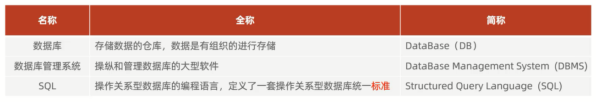
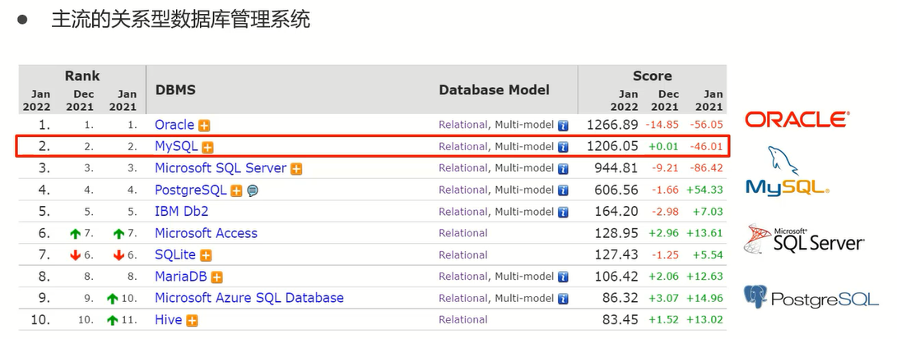
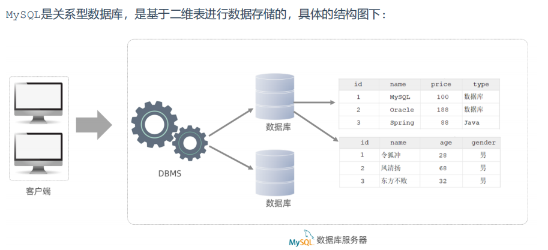
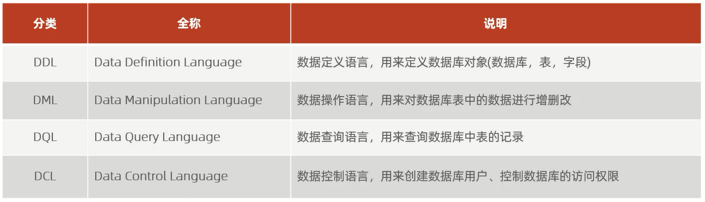

# 数据库相关概念

# CMD操作MySQL

## 启动/停止MySQL

`net start mysql80`:启动MySQL                    
`net stop mysql80`:停止MySQL              

## 连接MySQL

`mysql [-h 127.0.0.1] [-P 3306] -u root -p`

参数:               
- `h`:MySQL服务所在的主机IP              
- `P`:MySQL服务端口号,默认3306            
- `u`:MySQL数据库用户名                 
- `p`:MySQL数据库用户名对应的密码                    

步骤:
1. `win + r`输入cmd,`ctrl + shift + enter`启动管理员终端
2. `mysql -u root -p`后输入密码进入MySQL

# 关系型数据库

关系型数据库(RDBMS)是建立在关系模型基础上,由多张相互连接的二维表组成的数据库

特点:
1. 使用表存储数据,格式统一,便于维护
2. 使用SQL语言操作,标准统一,使用方便

# MySQL的数据模型

# SQL

SQL全称Structured Query Language,结构化查询语言,是操作关系型数据库的编程语言,定义了一套操作关系型数据库统一标准          

## 通用语法

1. SQL语句可以单行或多行书写,以分号结尾
2. SQL语句可以使用空格/缩进来增强语句的可读性
3. MySQL数据库的SQL语句不区分大小写,关键字建议使用大写
4. 注释:                
单行注释:`-- 注释内容`或`# 注释内容`                   
多行注释:`/* 注释内容 */`

## 分类

