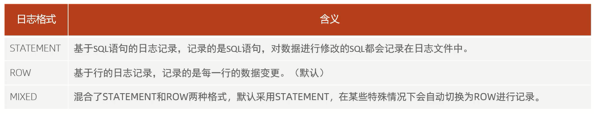
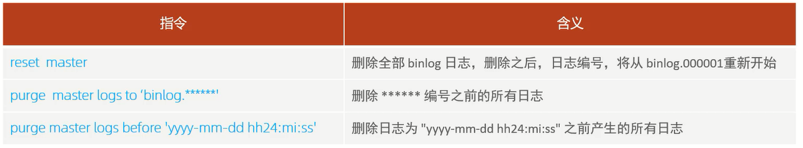

# 错误日志

错误日志是MySQL中最重要的日志之一,它记录了当mysqld启动和停止时,以及服务器在运行过程中发生任何严重错误时的相关信息               
当数据库出现任何故障导致无法正常使用时,建议首先查看此日志                   
该日志是默认开启的,默认存放目录`/var/log/`,默认的日志文件名为mysqld.log         
查看日志位置:`show variables like '%log_error%';`               
 
# 二进制日志

二进制日志(binlog)记录了所有的DDL(数据定义语言)语句和DML(数据操纵语言)语句,但不包括数据查询(select、show)语句             

作用:
1. 灾难时的数据恢复                       
2. MySQL的主从复制,在MySQL8版本中,默认二进制日志是开启着的,通过`show variables like '%log_bin%';`查看相应的参数                       

参数说明:
- log_bin_basename:当前数据库服务器的binlog日志的基础名称(前缀),具体的binlog文件名需要再该basename的基础上加上编号(编号从000001开始)              
- log_bin_index:binlog的索引文件,里面记录了当前服务器关联的binlog文件有哪些                 

## 格式

通过`show variables like '%binlog_format%';`查看日志格式



## 查看

由于日志是以二进制方式存储的,不能直接读取,需要通过二进制日志查询工具mysqlbinlog来查看:       
`mysqlbinlog [参数选项] logfilename`

参数选项:
- `-d`:指定数据库名称,只列出指定的数据库相关操作
- `-o`:忽略掉日志中的前n行命令
- `-v`:将行事件(数据变更)重构为SQL语句
- `-vv`:将行事件(数据变更)重构为SQL语句,并输出注释信息

## 删除

对于比较繁忙的业务系统,每天生成的binlog数据巨大,如果长时间不清除,将会占用大量磁盘空间      
可以通过以下几种方式清理日志:



也可以在MySQL的配置文件中配置二进制日志的过期时间,设置了之后,二进制日志过期(默认是30天)会自动删除:        
`show variables like '%binlog_expire_logs_seconds%';`

# 查询日志

查询日志中记录了客户端的所有操作语句,而二进制日志不包含查询数据的SQL语句         
默认情况下,查询日志是未开启的

通过`show variables like '%general%';`查看查询日志的开启状态

如果需要开启查询日志,可以修改MySQL的配置文件/etc/my.cnf文件,添加如下内容:

```sql
# 该选项用来开启查询日志,可选值:0或者1;0代表关闭,1代表开启
general_log = 1
# 设置日志的文件名,如果没有指定,默认的文件名为host_name.log
general_log_file = mysql_query.log
```

开启了查询日志之后,在MySQL的数据存放目录,也就是/var/lib/mysql/目录下就会出现mysql_query.log文件  
之后所有的客户端的增删改查操作都会记录在该日志文件之中,长时间运行后,该日志文件将会非常大

# 慢查询日志

慢查询日志记录了所有执行时间超过参数long_query_time设置值并且扫描记录数不小于min_examined_row_limit的所有的SQL语句的日志,默认未开启,long_query_time默认为10秒,最小为0,精度可以到微秒

如果需要开启慢查询日志,需要在MySQL的配置文件/etc/my.cnf中配置如下参数:

```sql
# 该选项用来开启慢查询日志,可选值:0或者1;0代表关闭,1代表开启
slow_query_log = 1
# 执行时间参数
long_query_time = 2
```

默认情况下,不会记录管理语句,也不会记录不使用索引进行查找的查询            
如果需要记录管理语句,记录不使用索引进行查找的查询,可以使用log_slow_admin_statements和log_queries_not_using_indexes更改此行为,修改MySQL的配置文件/etc/my.cnf文件,添加如下内容:

```sql
# 记录执行较慢的管理语句
log_slow_admin_statements = 1
# 记录执行较慢的未使用索引的语句
log_queries_not_using_indexes = 1
```

细节:**上述所有的参数配置完成之后,都需要重新启动MySQL服务器才可以生效**