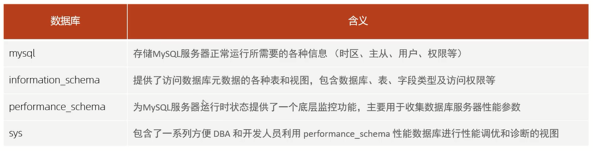

# 系统数据库



# 常用工具

## mysql

语法:`mysql [options] [database]`

options:
- `-u,--user=name`:指定用户名
- `-p,--password[=name]`:指定密码
- `-h,--host=name`:指定服务器IP或域名
- `-p,--port=port`:指定连接端口
- `-e,--execute=name`:执行SQL语句并退出

`-e`选项可以在MySQL客户端执行SQL语句,而不用连接到MySQL数据库再执行,对于处理一些批处理脚本很方便

范例:

```sql
mysql -uroot -p -e "show databases"
mysql -uroot -p test -e "select * from tb_user"
```

## mysqladmin

mysqladmin是一个执行管理操作的客户端程序,可以用它来检查服务器的配置和当前状态、创建并删除数据库等

通过帮助文档查看选项:`mysqladmin --help`

语法:`mysqladmin [options] command ...`

options:
- `-u,--user=name`:指定用户名
- `-p,--password[=name]`:指定密码
- `-h,--host=name`:指定服务器IP或域名
- `-P,--port=port`:指定连接端口

范例:

```sql
mysqladmin -uroot -p version
```

## mysqlbinlog

由于服务器生成的二进制日志文件以二进制格式保存,所以如果想要检查这些文本的文本格式,就会使用到mysqlbinlog日志管理工具

语法:`mysqlbinlog [options] log-files1 log-files2 ...`

选项:
- `-d,--database=name`:指定数据库名称,只列出指定的数据库相关操作
- `-o,--offset=#`:忽略掉日志中的前n行命令
- `-r,--result-file=name`:将输出的文本格式日志输出到指定文件
- `-s,--short-form`:显示简单格式,省略掉一些信息
- `--start-datatime=date1 --stop-datetime=date2`:指定日期间隔内的所有日志
- `--start-position=pos1 --stop-position=pos2`:指定位置间隔内的所有日志

## mysqlshow

mysqlshow客户端对象查找工具,用来很快地查找存在哪些数据库、数据库中的表、表中的列或者索引

语法:`mysqlshow [options] [db_name [table_name [col_name]]]`

选项:
- `--count`:显示数据库及表的统计信息(数据库,表均可以不指定)
- `-i`:显示指定数据库或者指定表的状态信息

范例:

```sql
# 查询每个数据库的表的数量及表中记录的数量
mysqlshow -uroot -p --count

# 查询test库中每个表中的字段书,及行数
mysqlshow -uroot -p test --count

# 查询test库中tb_user表的详细情况
mysqlshow -uroot -p test tb_user --count

# 查询test库中tb_user表中的name字段的详细情况
mysqlshow -uroot -p test tb_user name --count
```

## mysqldump

mysqldump客户端工具用来备份数据库或在不同数据库之间进行数据迁移,备份内容包含创建表,及插入表的SQL语句

语法:
- `mysqldump [options] db_name [tables]`
- `mysqldump [options] --database/-B db1 [db2 db3...]`
- `mysqldump [options] --all-databases/-A`

连接选项:
- `-u, --user=name`:指定用户名
- `-p, --password[=name]`:指定密码
- `-h, --host=name`:指定服务器ip或域名
- `-P, --port=#`:指定连接端口

输出选项:
- `--add-drop-database`:在每个数据库创建语句前加上drop database语句
- `--add-drop-table`:在每个表创建语句前加上drop table语句,默认开启;不开启 (--skip-add-drop-table)
- `-n, --no-create-db`:不包含数据库的创建语句
- `-t, --no-create-info`:不包含数据表的创建语句
- `-d --no-data`:不包含数据
- `-T, --tab=name`:自动生成两个文件:一个.sql文件,创建表结构的语句；一个.txt文件,数据文件

备份出来的数据包含:
- 删除表的语句
- 创建表的语句
- 数据插入语句

如果在数据备份时,不需要创建表,或者不需要备份数据,只需要备份表结构,都可以通过对应的参数来实现

范例:

```sql
# 备份test数据库
mysqldump -uroot -p test > test.sql

# 备份test数据库中的表数据,不备份表结构(-t)
mysqldump -uroot -p -t test > test.sql

# 将test数据库的表结构与数据分开备份(-T)
mysqldump -uroot -p -T /var/lib/mysql-files/ test score
```

## mysqlimport

mysqlimport是客户端数据导入工具,用来导入mysqldump加-T参数后导出的文本文件

语法:`mysqlimport [options] db_name textfile1 [textfile2...]`

范例:

```sql
mysqlimport -uroot -p test /var/lib/mysql-files/XXX.txt
```

## source

如果需要导入sql文件,可以使用mysql中的source指令

语法:`source /XXX/XXX.sql`