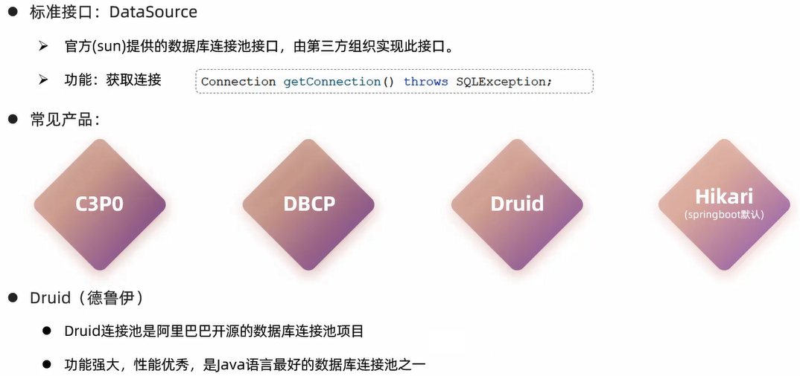

# MyBatis

MyBatis是一款优秀的**持久层**框架,用于简化JDBC的开发

[官方网站](https://mybatis.org/mybatis-3/zh_CN/index.html)

# 快速入门

步骤:
1. 准备工作(**创建SpringBoot工程,数据库表及其对应的实体类**)

创建SpringBoot工程时,添加依赖:勾选`Mybatis Framework`和`MySQL Driver`

创建对应的数据库表:

```sql
use springboot_web;

create table user
(
    id     int unsigned primary key auto_increment comment 'ID',
    name   varchar(100) comment '姓名',
    age    tinyint unsigned comment '年龄',
    gender tinyint unsigned comment '性别, 1:男, 2:女',
    phone  varchar(11) comment '手机号'
) comment '用户表';

insert into user(id, name, age, gender, phone)
VALUES (null, '白眉鹰王', 55, '1', '18800000000');
insert into user(id, name, age, gender, phone)
VALUES (null, '金毛狮王', 45, '1', '18800000001');
insert into user(id, name, age, gender, phone)
VALUES (null, '青翼蝠王', 38, '1', '18800000002');
insert into user(id, name, age, gender, phone)
VALUES (null, '紫衫龙王', 42, '2', '18800000003');
insert into user(id, name, age, gender, phone)
VALUES (null, '光明左使', 37, '1', '18800000004');
insert into user(id, name, age, gender, phone)
VALUES (null, '光明右使', 48, '1', '18800000005');
```

在com.jinzhao/pojo中创建User类:

```java
package com.jinzhao.pojo;

public class User {
    private Integer id;
    private String name;
    private Short age;
    private Short gender;
    private String phone;

    public User() {
    }

    public User(Integer id, String name, Short age, Short gender, String phone) {
        this.id = id;
        this.name = name;
        this.age = age;
        this.gender = gender;
        this.phone = phone;
    }

    /**
     * 获取
     *
     * @return id
     */
    public Integer getId() {
        return id;
    }

    /**
     * 设置
     *
     * @param id
     */
    public void setId(Integer id) {
        this.id = id;
    }

    /**
     * 获取
     *
     * @return name
     */
    public String getName() {
        return name;
    }

    /**
     * 设置
     *
     * @param name
     */
    public void setName(String name) {
        this.name = name;
    }

    /**
     * 获取
     *
     * @return age
     */
    public Short getAge() {
        return age;
    }

    /**
     * 设置
     *
     * @param age
     */
    public void setAge(Short age) {
        this.age = age;
    }

    /**
     * 获取
     *
     * @return gender
     */
    public Short getGender() {
        return gender;
    }

    /**
     * 设置
     *
     * @param gender
     */
    public void setGender(Short gender) {
        this.gender = gender;
    }

    /**
     * 获取
     *
     * @return phone
     */
    public String getPhone() {
        return phone;
    }

    /**
     * 设置
     *
     * @param phone
     */
    public void setPhone(String phone) {
        this.phone = phone;
    }

    public String toString() {
        return "User{id = " + id + ", name = " + name + ", age = " + age + ", gender = " + gender + ", phone = " + phone + "}";
    }
}
```

2. 引入Mybatis的相关依赖,配置Mybatis(**数据库的连接信息**)

在resources/application.properties中配置:

```properties
spring.application.name=SpringBoot-mybatis-quickstart
# 驱动类名称
spring.datasource.driver-class-name=com.mysql.cj.jdbc.Driver
# 数据库连接的url
spring.datasource.url=jdbc:mysql://192.168.1.13:3306/springboot_web
# 连接数据库的用户名
spring.datasource.username=root
# 连接数据库的密码
spring.datasource.password=123456
```

3. 编写SQL语句(**注解/XML**)

在com.jinzhao/mapper中创建UserMapper接口:

```java
package com.jinzhao.mapper;

import com.jinzhao.pojo.User;
import org.apache.ibatis.annotations.Mapper;
import org.apache.ibatis.annotations.Select;

import java.util.List;

// 在运行时会自动生成该接口的实现类对象(代理对象),并且将该对象交给IOC容器管理
@Mapper
public interface UserMapper {
    // 查询全部用户的信息
    @Select("select id, name, age, gender, phone from user")
    public List<User> list();
}
```

4. 单元测试

```java
package com.jinzhao;

import com.jinzhao.mapper.UserMapper;
import com.jinzhao.pojo.User;
import org.junit.jupiter.api.Test;
import org.springframework.beans.factory.annotation.Autowired;
import org.springframework.boot.test.context.SpringBootTest;

import java.util.List;

// SpringBoot整合单元测试的注解
@SpringBootTest
class SpringBootMybatisQuickstartApplicationTests {
    // 通过依赖注入,创建代理对象
    @Autowired
    private UserMapper userMapper;

    @Test
    public void testListUser() {
        List<User> userList = userMapper.list();
        userList.forEach(user -> System.out.println(user.toString()));
    }
}
```

# JDBC

JDBC(Java DataBase Connectivity),是SUN公司提供的一套使用Java语言操作关系型数据库的API(规范)


## JDBC VS MyBatis

1. JDBC程序

```java
@Test
public void testJdbc() throws Exception {
    // 注册驱动
    Class.forName("com.mysql.cj.jdbc.Driver");

    // 获取连接对象
    String url = "jdbc:mysql://192.168.1.13:3306/springboot_web";
    String username = "root";
    String password = "123456";
    Connection connection = DriverManager.getConnection(url, username, password);

    // 获取执行SQL的对象Statement,执行SQL,返回结果
    String sql = "select * from user";
    Statement statement = connection.createStatement();
    ResultSet resultSet = statement.executeQuery(sql);

    // 封装结果数据
    List<User> userList = new ArrayList<>();
    while (resultSet.next()) {
        int id = resultSet.getInt("id");
        String name = resultSet.getString("name");
        short age = resultSet.getShort("age");
        short gender = resultSet.getShort("gender");
        String phone = resultSet.getString("phone");

        User user = new User(id, name, age, gender, phone);
        userList.add(user);
    }

    // 释放资源
    statement.close();
    connection.close();
}
```

2. MyBatis程序

application.properties:

```properties
spring.application.name=SpringBoot-mybatis-quickstart
# 驱动类名称
spring.datasource.driver-class-name=com.mysql.cj.jdbc.Driver
# 数据库连接的url
spring.datasource.url=jdbc:mysql://192.168.1.13:3306/springboot_web
# 连接数据库的用户名
spring.datasource.username=root
# 连接数据库的密码
spring.datasource.password=123456
```

mapper接口:

```java
package com.jinzhao.mapper;

import com.jinzhao.pojo.User;
import org.apache.ibatis.annotations.Mapper;
import org.apache.ibatis.annotations.Select;

import java.util.List;

// 在运行时会自动生成该接口的实现类对象(代理对象),并且将该对象交给IOC容器管理
@Mapper
public interface UserMapper {
    // 查询全部用户的信息
    @Select("select id, name, age, gender, phone from user")
    public List<User> list();
}
```

再通过数据库连接池进行连接复用,减少资源浪费

# 数据库连接池

数据库连接池是一个容器,负责分配、管理数据库连接

它允许应用程序重复使用一个现有的数据库连接,而不是再重新建立一个

释放空闲时间超过最大空闲时间的连接,来避免因为没有释放连接而引起的数据库连接泄露

优势:
1. 资源重用
2. 提升系统响应速度
3. 避免数据库连接泄露



[Druid官方网站](https://github.com/alibaba/druid)

## 切换Druid数据库连接池

步骤:

1. 引入Druid的相关依赖

```xml
<dependency>
     <groupId>com.alibaba</groupId>
     <artifactId>druid</artifactId>
     <version>1.2.22</version>
</dependency>
```

2. 进行JDBC配置

```properties
spring.datasource.driver-class-name=com.mysql.cj.jdbc.Driver
spring.datasource.url=jdbc:mysql://192.168.1.13:3306/springboot_web
spring.datasource.username=root
spring.datasource.password=123456
```

或者

```properties
spring.datasource.druid.driver-class-name=com.mysql.cj.jdbc.Driver
spring.datasource.druid.url=jdbc:mysql://192.168.1.13:3306/springboot_web
spring.datasource.druid.username=root
spring.datasource.druid.password=123456
```

# Lombok

Lombok是一个实用的Java类库,能通过注解的形式自动生成构造器、getter/setter、equals、hashcode、toString等方法,并自动化生成日志变量,简化Java开发、提高效率


细节:**Lombok会在编译时自动生成对应的Java代码,实用Lombok时,还需要安装一个Lombok插件(IDEA自带)**

范例:

1. 引入Lombok依赖

```xml
<dependency>
    <groupId>org.projectlombok</groupId>
    <artifactId>lombok</artifactId>
    <version>1.18.24</version>
    <scope>provided</scope>
</dependency>
```

2. 添加Lomback注解

```java
package com.jinzhao.pojo;

import lombok.*;

@Data
@NoArgsConstructor
@AllArgsConstructor
public class User {
    private Integer id;
    private String name;
    private Short age;
    private Short gender;
    private String phone;
}
```