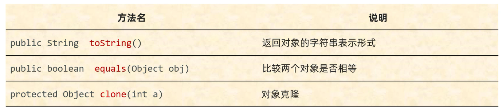
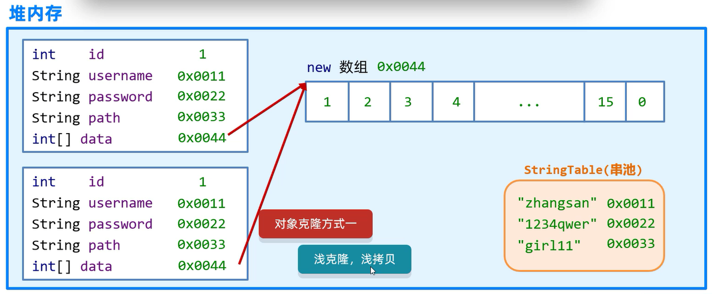
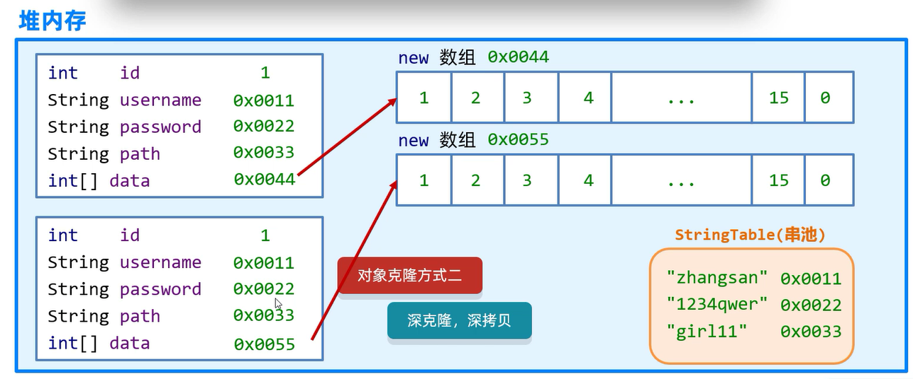
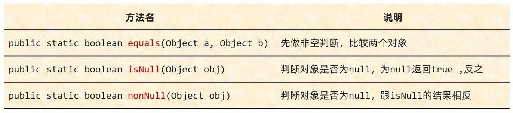

# Object

Object是Java中的顶级父类,所有的类都直接或间接的继承于Object类    
Object类中的方法可以被所有子类访问   

## 构造方法

`public Object()` -- 空参构造

## 成员方法



## toString()

返回对象的字符串表示形式: `包名 + @ + 地址值`

**如果想要看到对象的属性值,重写父类Object类中的toString方法,在重写的方法中把对象的属性值进行拼接**

范例: 

```java
public class Student {
    private String name;
    private int age;

    public Student() {
    }

    public Student(String name,int age) {
        this.name = name;
        this.age = age;
    }

    public String getName() {
        return name;
    }

    public void setName(String name) {
        this.name = name;
    }

    public int getAge() {
        return age;
    }

    public void setAge(int age) {
        this.age = age;
    }
}
```

```java
public class Test {
    public static void main(String[] args) {
        Object obj = new Object();
        String str1 = obj.toString();
        Student stu = new Student();
        String str2 = stu.toString();
        // 打印结果:"java.lang.Object@880ec60"(包名 + @ + 地址值)
        System.out.println(str1);
        // 打印结果:"Student@7f63425a"(包名 + @ + 地址值)
        System.out.println(str2);
        
        // 打印结果:"Student@7f63425a"(包名 + @ + 地址值)
        System.out.println(stu);
    }
}
```

其中`System.out.println(stu);`的细节:   
- System: 类名
- `out`: 静态变量
- `System.out`: 获取打印的对象
- `prinln()`: 方法   

**核心逻辑**: 当打印一个对象的时候,底层会调用对象的toString方法   
把对象变成字符串,然后再打印在控制台上,打印完毕换行处理    

思考: 默认情况下,toString方法返回的是地址值,但是地址值无意义,想要看到对象的属性值,怎么办?    
**处理方案**:  重写父类Object类中的toString方法

范例:    

```java
public class Student {
    private String name;
    private int age;

    public Student() {
    }

    public Student(String name,int age) {
        this.name = name;
        this.age = age;
    }

    public String getName() {
        return name;
    }

    public void setName(String name) {
        this.name = name;
    }

    public int getAge() {
        return age;
    }

    public void setAge(int age) {
        this.age = age;
    }

    @Override
    public String toString() {
        return "Student{" +
                "name='" + name + '\'' +
                ",age=" + age +
                '}';
    }
}
```

```java
public class Test {
    public static void main(String[] args) {
        Student stu = new Student();
        // 打印结果:"Student{name='null',age=0}"
        System.out.println(stu);
    }
}
```

## equals(Object obj)

比较两个对象(默认: 比较两个对象的地址值)是否相等

**如果想要比较对象的属性值,重写父类Object类中的equals方法,在重写的方法中把对象的属性值进行比较**

范例: 

```java
public class Student {
    private String name;
    private int age;

    public Student() {
    }

    public Student(String name,int age) {
        this.name = name;
        this.age = age;
    }

    public String getName() {
        return name;
    }

    public void setName(String name) {
        this.name = name;
    }

    public int getAge() {
        return age;
    }

    public void setAge(int age) {
        this.age = age;
    }

    @Override
    public String toString() {
        return "Student{" +
                "name='" + name + '\'' +
                ",age=" + age +
                '}';
    }
}
```

```java
public class Test {
    public static void main(String[] args) {
        Student stu1 = new Student("张三",23);
        Student stu2 = new Student("张三",23);
        // 打印结果:"false"
        System.out.println(stu1.equals(stu2));
    }
}
```

如果equals方法不能满足需求,可以重写equals方法    

快速重写equals方法:     
快捷键`alt + insert`选择equals()和hashCode()   
**重写之后的equals方法,比较的就是对象内部的属性值**

范例: 

```java
import java.util.Objects;

public class Student {
    private String name;
    private int age;

    public Student() {
    }

    public Student(String name,int age) {
        this.name = name;
        this.age = age;
    }

    public String getName() {
        return name;
    }

    public void setName(String name) {
        this.name = name;
    }

    public int getAge() {
        return age;
    }

    public void setAge(int age) {
        this.age = age;
    }

    @Override
    public boolean equals(Object o) {
        if (this == o) return true;
        if (o == null || getClass() != o.getClass()) return false;
        Student student = (Student) o;
        return age == student.age && Objects.equals(name,student.name);
    }

    @Override
    public int hashCode() {
        return Objects.hash(name,age);
    }

    @Override
    public String toString() {
        return "Student{" +
                "name='" + name + '\'' +
                ",age=" + age +
                '}';
    }
}
```

```java
public class Test {
    public static void main(String[] args) {
        Student stu1 = new Student("张三",23);
        Student stu2 = new Student("张三",23);
        // 打印结果:"true"
        System.out.println(stu1.equals(stu2));
    }
}
```

范例: 

```java
public class Test {
    public static void main(String[] args) {
        String str = "abc";
        StringBuilder sb = new StringBuilder("abc");
        // 打印结果:"false"
        // 调用的是String类中的equals方法
        // 先判断是否是字符串: 如果是字符串,再比较内部的属性; 如果不是字符串,直接返回false
        System.out.println(str.equals(sb));
        // 打印结果:"false"
        // 调用的是StringBuilder类中的equals方法
        // StringBuilder类中没有重写equals方法,默认继承Object类中的equals方法
        System.out.println(sb.equals(str));
    }
}
```

## clone(int a)

对象克隆: 把A对象里的属性值完全拷贝给B对象,也叫对象拷贝/对象复制

步骤:    
1. 重写Object类中的clone方法     
2. JavaBean类需要实现Cloneable接口      
3. 创建原对象并调用原方法      

范例: 

```java
import java.util.StringJoiner;

// 以拼图游戏的用户为例
// Cloneable接口是一个标记性接口
// 表示Cloneable被实现了,当前类的对象就可以被克隆
// 如果Cloneable没有被实现,当前类的对象不可以被克隆
public class User implements Cloneable {
    // 用户角色
    private int id;

    // 用户名
    private String username;

    // 密码
    private String password;

    // 游戏照片
    private String path;

    // 游戏进度,即图片的顺序,为[1,2,3,4,5,6,7,8,9,10,11,12,13,14,15,0]时通关
    private int[] data;

    public User() {
    }

    public User(int id,String username,String password,String path,int[] data) {
        this.id = id;
        this.username = username;
        this.password = password;
        this.path = path;
        this.data = data;
    }

    public int getId() {
        return id;
    }

    public void setId(int id) {
        this.id = id;
    }

    public String getUsername() {
        return username;
    }

    public void setUsername(String username) {
        this.username = username;
    }

    public String getPassword() {
        return password;
    }

    public void setPassword(String password) {
        this.password = password;
    }

    public String getPath() {
        return path;
    }

    public void setPath(String path) {
        this.path = path;
    }

    public int[] getData() {
        return data;
    }

    public void setData(int[] data) {
        this.data = data;
    }

    @Override
    public String toString() {
        return "角色编号为:" + id + ",用户名为:" + username + "密码为:" + password + ",游戏图片为:" + path + ",游戏进度:" + arrToString();
    }

    // 游戏进度: 显示数组data里的元素(属性值),而不是数组data的地址值
    // 因此将数组内的所有元素拼接成字符串
    public String arrToString() {
        StringJoiner sj = new StringJoiner(",","[","]");
        for (int i = 0; i < data.length; i++) {
            sj.add(data[i] + " ");
        }
        return sj.toString();
    }

    // 调用父类Object中的clone方法(浅克隆,浅拷贝)
    // 相当于让Java克隆一个对象,并把克隆之后的对象返回出去
    @Override
    protected Object clone() throws CloneNotSupportedException {
        return super.clone();
    }
}
```

```java
public class CloneUser {
    public static void main(String[] args) throws CloneNotSupportedException {
        // 定义user1的游戏进度data1
        int[] data1 = {1,2,3,4,5,6,7,8,9,10,11,12,13,14,15,0};
        // 创建用户对象
        User user1 = new User(1,"张三","123456","animal7",data1);

        // 克隆对象
        // Java会在底层创建一个对象,并把原对象的数据拷贝过去
        User user2 = (User) user1.clone();
        // 打印结果:"角色编号为:1,用户名为:张三密码为:123456,游戏图片为:animal7,游戏进度:[1 ,2 ,3 ,4 ,5 ,6 ,7 ,8 ,9 ,10 ,11 ,12 ,13 ,14 ,15 ,0 ]"
        System.out.println(user1);
        // 打印结果:"角色编号为:1,用户名为:张三密码为:123456,游戏图片为:animal7,游戏进度:[1 ,2 ,3 ,4 ,5 ,6 ,7 ,8 ,9 ,10 ,11 ,12 ,13 ,14 ,15 ,0 ]"
        System.out.println(user2);
    }
}
```

### 浅克隆(浅拷贝)

不管对象内部的属性是基本数据类型还是引用数据类型,**都完全拷贝过来**    

以数组数据为例,由于是浅克隆,存储的数据在同一个数组中,记录的是同一个数组的地址值    
因此,**如果原对象的数组中的数据改变,则克隆对象的数组中的数据也会发生改变**   



范例:   

```java
// 浅克隆,浅拷贝
@Override
protected Object clone() throws CloneNotSupportedException {
    // 调用父类Object中的clone方法(浅克隆,浅拷贝)
    return super.clone();
}
```

```java
public class CloneUser {
    public static void main(String[] args) throws CloneNotSupportedException {
        // 定义user1的游戏进度data1
        int[] data1 = {1,2,3,4,5,6,7,8,9,10,11,12,13,14,15,0};
        // 创建用户对象
        User user1 = new User(1,"张三","123456","animal7",data1);
        // 打印结果:"原对象数组:角色编号为:1,用户名为:张三密码为:123456,游戏图片为:animal7,游戏进度:[1 ,2 ,3 ,4 ,5 ,6 ,7 ,8 ,9 ,10 ,11 ,12 ,13 ,14 ,15 ,0 ]"
        System.out.println("原对象数组:" + user1);
        // 克隆对象
        // Java会在底层创建一个对象,并把原对象的数据拷贝过去
        User user2 = (User) user1.clone();
        data1[0] = 100;
        // 打印结果:"原对象数组:角色编号为:1,用户名为:张三密码为:123456,游戏图片为:animal7,游戏进度:[100 ,2 ,3 ,4 ,5 ,6 ,7 ,8 ,9 ,10 ,11 ,12 ,13 ,14 ,15 ,0 ]"
        System.out.println("原对象数组:" + user1);
        // 打印结果:"克隆对象数组:角色编号为:1,用户名为:张三密码为:123456,游戏图片为:animal7,游戏进度:[100 ,2 ,3 ,4 ,5 ,6 ,7 ,8 ,9 ,10 ,11 ,12 ,13 ,14 ,15 ,0 ]"
        System.out.println("克隆对象数组:" + user2);
    }
}
```

### 深克隆(深拷贝)

- **基本数据类型拷贝过来**
- **字符串复用**
- **引用数据类型会重新创建新的**

以数组数据为例,由于是深克隆,存储的数据分别在两个数组中,记录的分别是两个数组的地址值      
因此,**如果原对象的数组中的数据改变,但克隆对象的数组中的数据不会发生改变**    



范例:   

```java
// 深克隆,深拷贝
@Override
protected Object clone() throws CloneNotSupportedException {
    // 先把被克隆对象中的数组获取出来
    int[] data = this.data;
    // 创建新的数组
    int[] newData = new int[data.length];
    // 拷贝数组中的数据
    System.arraycopy(data,0,newData,0,data.length);
    // 调用父类中的方法克隆对象
    User u = (User) super.clone();
    // 因为父类中的克隆方法是浅克隆,替换克隆出来对象中的数组地址值
    u.data = newData;
    return u;
}
```

```java
public class CloneUser {
    public static void main(String[] args) throws CloneNotSupportedException {
        // 定义user1的游戏进度data1
        int[] data1 = {1,2,3,4,5,6,7,8,9,10,11,12,13,14,15,0};
        // 创建用户对象
        User user1 = new User(1,"张三","123456","animal7",data1);
        // 打印结果:"原对象数组:角色编号为:1,用户名为:张三密码为:123456,游戏图片为:animal7,游戏进度:[1 ,2 ,3 ,4 ,5 ,6 ,7 ,8 ,9 ,10 ,11 ,12 ,13 ,14 ,15 ,0 ]"
        System.out.println("原对象数组:" + user1);
        // 克隆对象
        // Java会在底层创建一个对象,并把原对象的数据拷贝过去
        User user2 = (User) user1.clone();
        data1[0] = 100;
        // 打印结果:"原对象数组:角色编号为:1,用户名为:张三密码为:123456,游戏图片为:animal7,游戏进度:[100 ,2 ,3 ,4 ,5 ,6 ,7 ,8 ,9 ,10 ,11 ,12 ,13 ,14 ,15 ,0 ]"
        System.out.println("原对象数组:" + user1);
        // 打印结果:"克隆对象数组:角色编号为:1,用户名为:张三密码为:123456,游戏图片为:animal7,游戏进度:[1 ,2 ,3 ,4 ,5 ,6 ,7 ,8 ,9 ,10 ,11 ,12 ,13 ,14 ,15 ,0 ]"
        System.out.println("克隆对象数组:" + user2);
    }
}
```

### 实际开发中实现深克隆   

利用第三方的工具: Gson   

步骤: 
1. 把第三方写的代码导入到项目中     
a.项目中新建lib目录   
b.将第三方代码XXX.jar复制到目录中     
c.右键选择添加到库      
2. 编写代码   

```java
Gson gson = new Gson();
        // 把对象变成一个字符串
        String str = gson.toJson(user1);
        // 再把字符串变回对象
        User user2 = gson.fromJson(str,User.class);
```

范例:     

```java
import com.google.gson.Gson;

public class CloneUser {
    public static void main(String[] args) throws CloneNotSupportedException {
        // 定义user1的游戏进度data1
        int[] data1 = {1,2,3,4,5,6,7,8,9,10,11,12,13,14,15,0};
        // 创建用户对象
        User user1 = new User(1,"张三","123456","animal7",data1);
        // 打印结果:"原对象数组:角色编号为:1,用户名为:张三密码为:123456,游戏图片为:animal7,游戏进度:[1 ,2 ,3 ,4 ,5 ,6 ,7 ,8 ,9 ,10 ,11 ,12 ,13 ,14 ,15 ,0 ]"
        System.out.println("原对象数组:" + user1);

        Gson gson = new Gson();
        // 把对象变成一个字符串
        String str = gson.toJson(user1);
        // 再把字符串变回对象
        User user2 = gson.fromJson(str,User.class);
        
        data1[0] = 100;
        // 打印结果:"原对象数组:角色编号为:1,用户名为:张三密码为:123456,游戏图片为:animal7,游戏进度:[100 ,2 ,3 ,4 ,5 ,6 ,7 ,8 ,9 ,10 ,11 ,12 ,13 ,14 ,15 ,0 ]"
        System.out.println("原对象数组:" + user1);
        // 打印结果:"克隆对象数组:角色编号为:1,用户名为:张三密码为:123456,游戏图片为:animal7,游戏进度:[1 ,2 ,3 ,4 ,5 ,6 ,7 ,8 ,9 ,10 ,11 ,12 ,13 ,14 ,15 ,0 ]"
        System.out.println("克隆对象数组:" + user2);
    }
}
```

# Objects

Objects是一个工具类,提供了一些方法去完成一些功能    

## 成员方法

    

## Objects.equals(Object o1,Object o2)

先做非空判断,比较两个对象    

范例:    

```java
import java.util.Objects;

public class Test {
    public static void main(String[] args) {
        Student student1 = new Student("张三",23);
        Student student2 = null;

        // 打印结果:"false"
        System.out.println(Objects.equals(student1,student2));
    }
}
```

细节:      
1. 方法的底层先判断student1是否为空,如果student1为空,直接返回false     
2. 如果student1不为空,则利用student1再次调用equals方法     
3. 此时的student1是Student类型,即最终会调用Student类中的equals方法     
4. Student类中的equals方法: 如果没有重写,比较两者的地址值; 如果重写了,比较两者内部的属性值       

## Objects.isNull(Object o)

判断对象是否为空: 为空返回true; 不为空返回false    

范例:            

```java
import java.util.Objects;

public class Test {
    public static void main(String[] args) {
        Student student1 = new Student("张三",23);
        Student student2 = null;

        // 打印结果:"true"
        System.out.println(Objects.isNull(student2));
    }
}
```

## Objects.nonNull(Object o)                 

判断对象是否为空: 不为空返回true; 为空返回false      

范例:            

```java
import java.util.Objects;

public class Test {
    public static void main(String[] args) {
        Student student1 = new Student("张三",23);
        Student student2 = null;

        // 打印结果:"true"
        System.out.println(Objects.nonNull(student1));
    }
}
```  