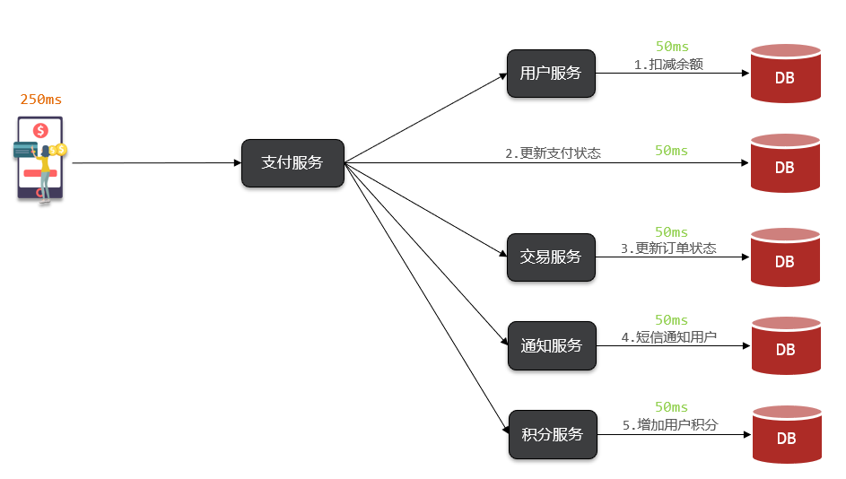

# 同步调用

以黑马商城的余额支付为例:

同步调用的优势:
- 时效性强,等待到结果后才返回

同步调用的问题:
- 拓展性差
- 性能下降
- 级联失败问题

# 异步调用

以黑马商城的余额支付为例:

支付服务不再同步调用业务关联度低的服务,而是发送消息通知到Broker

异步调用的优势:
- 耦合度低,拓展性强
- 异步调用,无需等待,性能好
- 故障隔离,下游服务故障不影响上游业务
- 缓存消息,流量削峰填谷

异步调用的问题:
- 不能立即得到调用结果,时效性差
- 不确定下游业务执行是否成功
- 业务安全依赖于Broker的可靠性

# MQ技术选型

MQ(MessageQueue)中文是消息队列,字面来看就是存放消息的队列,也就是异步调用中的Broker

# RabbitMQ

