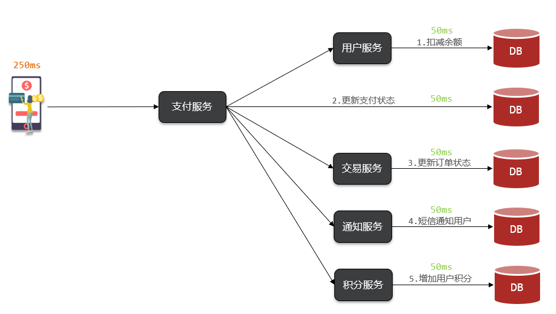
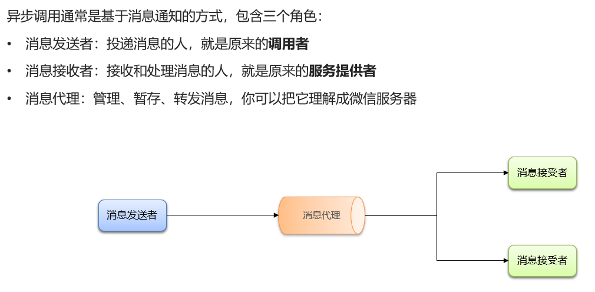
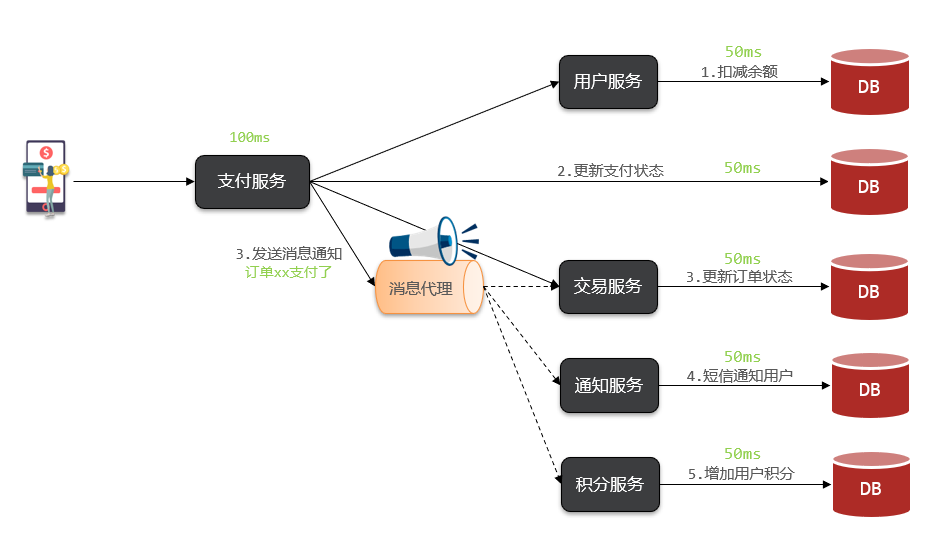
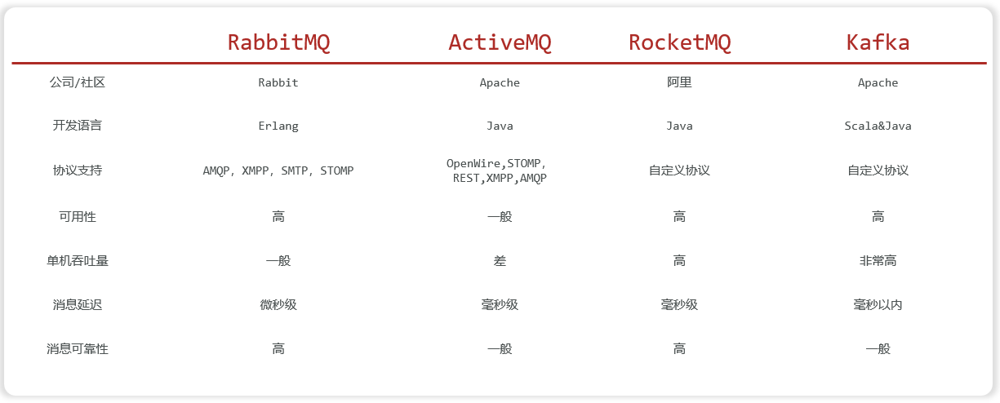
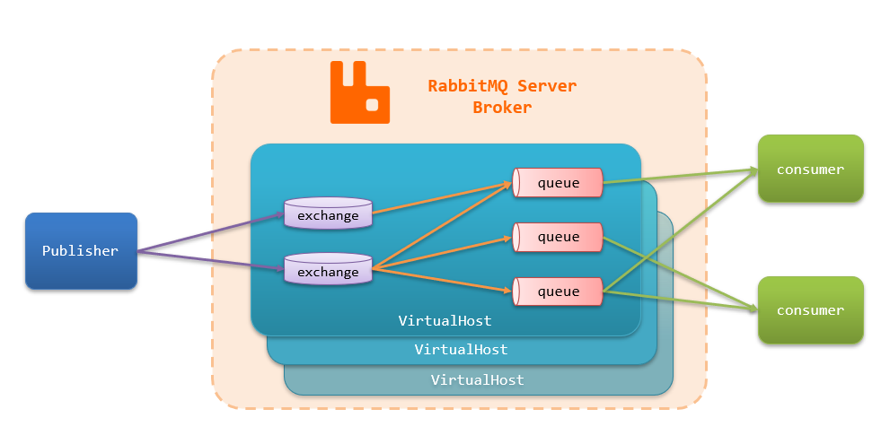
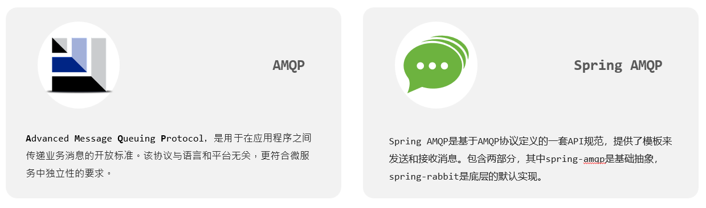
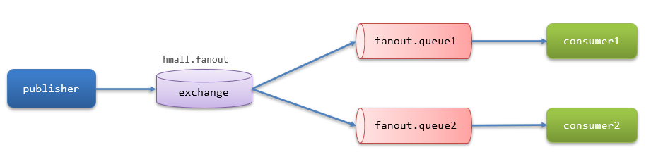
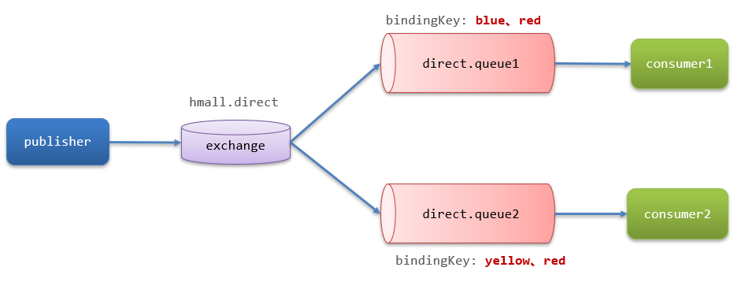
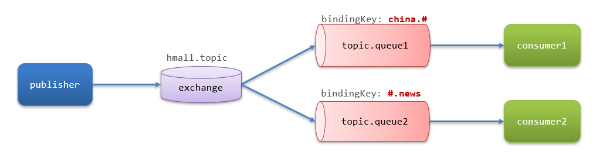
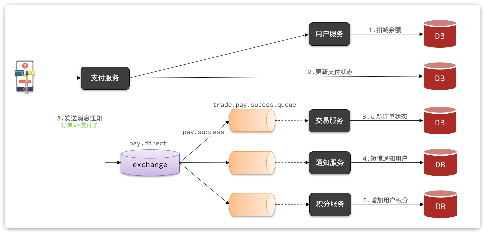

# 同步调用

以黑马商城的余额支付为例:



同步调用的优势:
- 时效性强,等待到结果后才返回

同步调用的问题:
- 拓展性差
- 性能下降
- 级联失败问题

# 异步调用



细节:**消息发送者即生产者,消息接收者即消费者**

以黑马商城的余额支付为例:



支付服务不再同步调用业务关联度低的服务,而是发送消息通知到Broker

异步调用的优势:
- 耦合度低,拓展性强
- 异步调用,无需等待,性能好
- 故障隔离,下游服务故障不影响上游业务
- 缓存消息,流量削峰填谷

异步调用的问题:
- 不能立即得到调用结果,时效性差
- 不确定下游业务执行是否成功
- 业务安全依赖于Broker的可靠性

# MQ技术选型

MQ(MessageQueue)中文是消息队列,字面来看就是存放消息的队列,也就是异步调用中的Broker



# RabbitMQ

RabbitMQ的整体架构及核心概念:
- `virtual-host`:虚拟主机,起到数据隔离的作用
- `publisher`:消息生产者
- `consumer`:消息的消费者
- `queue`:队列,存储消息
- `exchange`:交换机,负责路由消息



注意事项:
- **交换机只能路由消息,无法存储消息**
- **交换机只会路由消息给与其绑定的队列,因此队列必须与交换机绑定**

# SpringAMQP



[Spring AMQP官方网站](https://spring.io/projects/spring-amqp)

SpringAMQP收发消息步骤:
1. 引入spring-boot-starter-amqp依赖
2. 配置rabbitmq服务端信息
3. 利用RabbitTemplate发送消息
4. 利用`@RabbitListener`注解声明要监听的队列,监听消息

## 快速入门

1. 父工程引入Spring AMQP的依赖

```xml
<!--AMQP依赖,包含RabbitMQ-->
<dependency>
    <groupId>org.springframework.boot</groupId>
    <artifactId>spring-boot-starter-amqp</artifactId>
</dependency>
```

2. 在每个微服务中引入MQ服务端信息,这样微服务才能连接到RabbitMQ

```yaml
spring:
  rabbitmq:
    host: 192.168.149.127 # 主机名
    port: 5672 # 端口
    virtual-host: /hmall # 虚拟主机
    username: hmall # 用户名
    password: 123456 # 密码
```

3. SpringAMQP提供了RabbitTemplate工具类,方便发送消息

```java
package com.itheima.publisher;

import org.junit.jupiter.api.Test;
import org.springframework.amqp.rabbit.core.RabbitTemplate;
import org.springframework.beans.factory.annotation.Autowired;
import org.springframework.boot.test.context.SpringBootTest;

@SpringBootTest
class PublisherApplicationTest {
    @Autowired
    private RabbitTemplate rabbitTemplate;

    @Test
    public void testSimpleQueue() {
        // 队列名称
        String queueName = "simple.queue";
        // 消息
        String message = "hello, RabbitMQ";
        // 发送消息
        rabbitTemplate.convertAndSend(queueName, message);
    }
}
```

4. SpringAMQP提供声明式的消息监听,只需要通过注解`@RabbitListener`在方法上声明要监听的队列名称,将来SpringAMQP就会把消息传递给当前方法

```java
package com.itheima.consumer.mq;

import lombok.extern.slf4j.Slf4j;
import org.springframework.amqp.rabbit.annotation.RabbitListener;
import org.springframework.stereotype.Component;

@Slf4j
@Component
public class SimpleQueueListener {

    @RabbitListener(queues = "simple.queue")
    public void listenSimpleQueue(String msg) {
        log.info("消费者接收到了消息" + msg);
    }
}
```

## Work Queues

Work queues,任务模型,简单来说就是**让多个消费者绑定到一个队列,共同消费队列中的消息**

Work模型的使用:
- 多个消费者绑定到一个队列,可以加快消息处理速度
- 同一条消息只会被一个消费者处理
- 通过设置prefetch来控制消费者预取的消息数量,处理完一条再处理下一条,实现能者多劳

### 范例

需求:
- 在RabbitMQ的控制台创建一个队列,名为work.queue
- 在publisher服务中定义测试方法,发送50条消息到work.queue
- 在consumer服务中定义两个消息监听者,都监听work.queue队列
- 消费者1每秒处理40条消息,消费者2每秒处理5条消息

修改配置文件:

```yaml
spring:
  rabbitmq:
    listener:
      simple:
        prefetch: 1 # 每次只能获取一条消息,处理完成才能获取下一个消息
```

生产者:

```java
@Test
public void testWorkQueue() {
    // 队列名称
    String queueName = "work.queue";
    for (int i = 1; i <= 50; i++) {
        // 消息
        String message = "第" + i + "次hello, RabbitMQ";
        // 发送消息
        rabbitTemplate.convertAndSend(queueName, message);
    }
}
```

消费者:

```java
@RabbitListener(queues = "work.queue")
public void listenWorkQueue1(String msg) throws InterruptedException {
    log.info("消费者1接收到了消息" + msg);
    Thread.sleep(25);
}

@RabbitListener(queues = "work.queue")
public void listenWorkQueue2(String msg) throws InterruptedException {
    log.info("消费者2接收到了消息" + msg);
    Thread.sleep(200);
}
```

## 交换机

交换机(Exchange)的作用主要是**接收**生产者发送的消息,并将消息**路由**到与其绑定的队列

常见交换机的类型有以下三种:
- Fanout:广播
- Direct:定向
- Topic:话题

交换机的作用:
- 接收publisher发送的消息
- 将消息按照规则路由到与之绑定的队列

### Fanout交换机

Fanout Exchange会**将接收到的消息路由到每一个跟其绑定的Queue**,所以也叫**广播模式**



#### 范例

需求:
- 在RabbitMQ控制台中,声明队列fanout.queue1和fanout.queue2
- 在RabbitMQ控制台中,声明交换机hmall.fanout,将两个队列与其绑定
- 在consumer服务中,编写两个消费者方法,分别监听fanout.queue1和fanout.queue2
- 在publisher中编写测试方法,向hmall.fanout发送消息

生产者:

```java
@Test
public void testFanoutQueue() {
    // 交换机名称
    String exchangeName = "hmall.fanout";
    // 消息
    String message = "hello, RabbitMQ";
    // 发送消息
    rabbitTemplate.convertAndSend(exchangeName, "", message);
}
```

消费者:

```java
@RabbitListener(queues = "fanout.queue1")
public void listenFanoutQueue1(String msg) {
    log.info("消费者1接收到了消息" + msg);
}

@RabbitListener(queues = "fanout.queue2")
public void listenFanoutQueue2(String msg) {
    log.info("消费者2接收到了消息" + msg);
}
```

### Direct交换机

Direct Exchange会**将接收到的消息根据规则路由到指定的Queue**,因此称为**定向路由**

- 每一个Queue都与Exchange设置一个BindingKey
- 发布者发送消息时,指定消息的RoutingKey
- Exchange将消息路由到BindingKey与消息RoutingKey一致的队列



#### 范例

需求:
- 在RabbitMQ控制台中,声明队列direct.queue1和direct.queue2
- 在RabbitMQ控制台中,声明交换机hmall.direct,将两个队列与其绑定
- 在consumer服务中,编写两个消费者方法,分别监听direct.queue1和direct.queue2
- 在publisher中编写测试方法,利用不同的RoutingKey向hmall. direct发送消息

生产者:

```java
@Test
public void testDirectQueue1() {
    // 交换机名称
    String exchangeName = "hmall.direct";
    // 消息
    String message = "hello, RabbitMQ, red";
    // 发送消息
    rabbitTemplate.convertAndSend(exchangeName, "red", message);
}

@Test
public void testDirectQueue2() {
    // 交换机名称
    String exchangeName = "hmall.direct";
    // 消息
    String message = "hello, RabbitMQ, blue";
    // 发送消息
    rabbitTemplate.convertAndSend(exchangeName, "blue", message);
}

@Test
public void testDirectQueue3() {
    // 交换机名称
    String exchangeName = "hmall.direct";
    // 消息
    String message = "hello, RabbitMQ, yellow";
    // 发送消息
    rabbitTemplate.convertAndSend(exchangeName, "yellow", message);
}
```

消费者:

```java
@RabbitListener(queues = "direct.queue1")
public void listenDirectQueue1(String msg) {
    log.info("消费者1接收到了消息" + msg);
}

@RabbitListener(queues = "direct.queue2")
public void listenDirectQueue2(String msg) {
    log.info("消费者2接收到了消息" + msg);
}
```

### Direct交换机与Fanout交换机的差异

- Fanout交换机将消息路由给每一个与之绑定的队列
- Direct交换机根据RoutingKey判断路由给哪个队列
- 如果多个队列具有相同RoutingKey,则与Fanout功能类似

### Topic交换机

TopicExchange与DirectExchange类似,区别在于routingKey可以是多个单词的列表,并且以`.`分割。

Queue与Exchange指定BindingKey时可以使用通配符:
- `#`:代指0个或多个单词
- `*`:代指一个单词



#### 范例

需求:
- 在RabbitMQ控制台中,声明队列topic.queue1和topic.queue2
- 在RabbitMQ控制台中,声明交换机hmall. topic ,将两个队列与其绑定
- 在consumer服务中,编写两个消费者方法,分别监听topic.queue1和topic.queue2
- 在publisher中编写测试方法,利用不同的RoutingKey向hmall.topic发送消息

生产者:

```java
@Test
public void testTopicQueue1() {
    // 交换机名称
    String exchangeName = "hmall.topic";
    // 消息
    String message = "hello, RabbitMQ, china.news";
    // 发送消息
    rabbitTemplate.convertAndSend(exchangeName, "china.news", message);
}

@Test
public void testTopicQueue2() {
    // 交换机名称
    String exchangeName = "hmall.topic";
    // 消息
    String message = "hello, RabbitMQ, china.China,GGB";
    // 发送消息
    rabbitTemplate.convertAndSend(exchangeName, "china.China.GGB", message);
}

@Test
public void testTopicQueue3() {
    // 交换机名称
    String exchangeName = "hmall.topic";
    // 消息
    String message = "hello, RabbitMQ, GGB.News.news";
    // 发送消息
    rabbitTemplate.convertAndSend(exchangeName, "GGB.News.news", message);
}
```

消费者:

```java
@RabbitListener(queues = "topic.queue1")
public void listenTopicQueue1(String msg) {
    log.info("消费者1接收到了消息" + msg);
}

@RabbitListener(queues = "topic.queue2")
public void listenTopicQueue2(String msg) {
    log.info("消费者2接收到了消息" + msg);
}
```

###  Direct交换机与Topic交换机的差异

- Topic交换机接收的消息RoutingKey可以是多个单词,以`.`分割
- Topic交换机与队列绑定时的bindingKey可以指定通配符

## 声明队列和交换机

1. 方式一:

SpringAMQP提供了几个类,用来声明队列、交换机及其绑定关系:
- `Queue`:用于声明队列,可以用工厂类QueueBuilder构建
- `Exchange`:用于声明交换机,可以用工厂类ExchangeBuilder构建
- `Binding`:用于声明队列和交换机的绑定关系,可以用工厂类BindingBuilder构建

2. 方式二:

SpringAMQP提供了基于`@RabbitListener`注解来声明队列和交换机的方式

### 范例

声明direct类型的队列和交换机并绑定关系

1. 方式一:

```java
import org.springframework.amqp.core.*;
import org.springframework.context.annotation.Bean;
import org.springframework.context.annotation.Configuration;

@Configuration
public class DirectConfig {
    // 声明direct.exchange
    @Bean
    public DirectExchange directExchange() {
        return new DirectExchange("direct.exchange");
        // return ExchangeBuilder.directExchange("direct.exchange").build();
    }

    // 声明direct.queue
    @Bean
    public Queue directQueue() {
        return new Queue("direct.queue");
        // return QueueBuilder.durable("direct.queue").build();
    }

    // 绑定direct.queue和direct.exchange
    @Bean
    public Binding bindingDirectQueue() {
        return BindingBuilder.bind(directQueue()).to(directExchange()).with("color");
    }
}
```

2. 方式二:

```java
@RabbitListener(bindings = @QueueBinding(
        value = @Queue(name = "topic.queue"),
        exchange = @Exchange(name = "topic.exchange", type = ExchangeTypes.TOPIC),
        key = {"red", "blue"}))
public void listenTopicQueue(String msg) {
    log.info("消费者接收到了消息" + msg);
}
```

## 消息转换器

Spring的对消息对象的处理是由org.springframework.amqp.support.converter.MessageConverter来处理的

而默认实现是SimpleMessageConverter,基于JDK的ObjectOutputStream完成序列化

存在下列问题:
- JDK的序列化有安全风险
- JDK序列化的消息太大
- JDK序列化的消息可读性差

### 配置JSON转换器

1. 在publisher和consumer中都要引入jackson依赖,即直接父工程引入依赖

```xml
<!--jackson-->
<dependency>
    <groupId>com.fasterxml.jackson.core</groupId>
    <artifactId>jackson-databind</artifactId>
</dependency>
```

2. 在publisher和consumer中都要配置MessageConverter

```yaml
@Bean
public MessageConverter messageConverter() {
    return new Jackson2JsonMessageConverter();
}
```

### 范例

生产者:

```java
@Test
public void testObjectQueue(){
    // 交换机名称
    String exchangeName = "object.topic";
    // 消息
    Map<String, Object> map = new HashMap<>(2);
    map.put("name","张三");
    map.put("age",18);
    // 发送消息
    rabbitTemplate.convertAndSend(exchangeName, "red", map);
}
```

消费者:

```java
@RabbitListener(queues = "object.queue")
public void listenObjectQueue(Map<String, Object> msg) {
    log.info("消费者接收到了消息" + msg);
}
```

# 黑马商城支付业务改造

改造余额支付功能,将支付成功后基于OpenFeign的交易服务的更新订单状态接口的同步调用,改为基于RabbitMQ的异步通知



改造步骤:

说明:目前没有通知服务和积分服务,因此只关注交易服务
1. 定义direct类型交换机,命名为pay.direct
2. 定义消息队列,命名为trade.pay.success.queue
3. 将trade.pay.success.queue与pay.direct绑定,BindingKey为pay.success
4. 支付成功时不再调用交易服务更新订单状态的接口,而是发送一条消息到pay.direct,发送消息的RoutingKey为pay.success,消息内容是订单id

pay-service(生产者)和trade-service(消费者)中添加SpringAMQP依赖:

```xml
<!--AMQP依赖,包含RabbitMQ-->
<dependency>
    <groupId>org.springframework.boot</groupId>
    <artifactId>spring-boot-starter-amqp</artifactId>
</dependency>
```

添加nacos注册中心共享配置文件shared-rabbitmq.yaml并应用于pay-service和trade-service:

```yaml
spring:
  rabbitmq:
    host: 192.168.149.127 # RabbitMQ服务器的IP地址
    port: 5672 # 指定RabbitMQ服务器的端口号
    virtual-host: /hmall # 指定RabbitMQ的虚拟主机名
    username: rabbitmq # 指定连接RabbitMQ的用户名
    password: rabbitmq # 指定连接RabbitMQ的密码
```

hm-common中添加config文件RabbitMQConfig.java,并通过Spring自动装配:

```java
package com.hmall.common.config;

import org.springframework.amqp.support.converter.Jackson2JsonMessageConverter;
import org.springframework.amqp.support.converter.MessageConverter;
import org.springframework.context.annotation.Bean;
import org.springframework.context.annotation.Configuration;

@Configuration
@ConditionalOnClass(RabbitTemplate.class)
public class RabbitMQConfig {
    @Bean
    public MessageConverter messageConverter(){
        return new Jackson2JsonMessageConverter();
    }
}
```

5. 交易服务监听trade.pay.success.queue队列,接收到消息后更新订单状态为已支付

pay-service中实现生产者:

```java
// private final TradeClient tradeClient;

private final RabbitTemplate rabbitTemplate;

@Override
@Transactional
public void tryPayOrderByBalance(PayOrderFormDTO payOrderFormDTO) {
    // 1.查询支付单
    PayOrder po = getById(payOrderFormDTO.getId());
    // 2.判断状态
    if (!PayStatus.WAIT_BUYER_PAY.equalsValue(po.getStatus())) {
        // 订单不是未支付，状态异常
        throw new BizIllegalException("交易已支付或关闭！");
    }
    // 3.尝试扣减余额
    userClient.deductMoney(payOrderFormDTO.getPw(), po.getAmount());
    // 4.修改支付单状态
    boolean success = markPayOrderSuccess(payOrderFormDTO.getId(), LocalDateTime.now());
    if (!success) {
        throw new BizIllegalException("交易已支付或关闭！");
    }
    // 5.修改订单状态
    // tradeClient.markOrderPaySuccess(po.getBizOrderNo());
    try {
        rabbitTemplate.convertAndSend("pay.direct", "pay.success", po.getBizOrderNo());
    } catch (Exception e) {
        log.error("发送支付通知状态失败", e);
        // TODO 兜底方案
    }
}
```

trade-service中实现消费者:

```java
package com.hmall.trade.listener;

import com.hmall.trade.service.IOrderService;
import lombok.RequiredArgsConstructor;
import org.springframework.amqp.rabbit.annotation.Exchange;
import org.springframework.amqp.rabbit.annotation.Queue;
import org.springframework.amqp.rabbit.annotation.QueueBinding;
import org.springframework.amqp.rabbit.annotation.RabbitListener;
import org.springframework.stereotype.Component;

@Component
@RequiredArgsConstructor
public class PayStatusListener {

    private final IOrderService orderService;

    @RabbitListener(bindings = @QueueBinding(
            value = @Queue(value = "trade.pay.success.queue", durable = "true"),
            exchange = @Exchange(value = "pay.direct"),
            key = "pay.success"))
    public void listenPayStatus(Long orderId) {
        orderService.markOrderPaySuccess(orderId);
    }
}
```