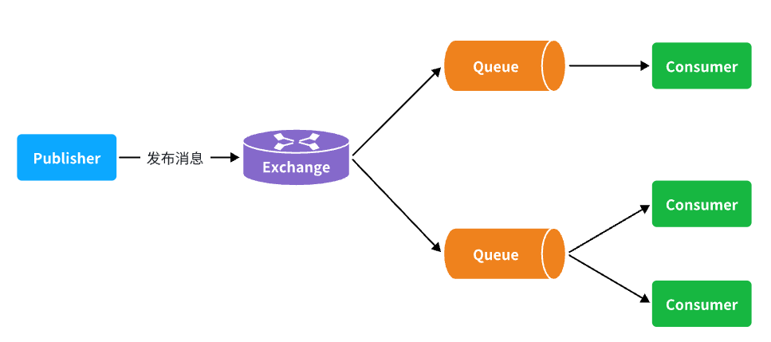
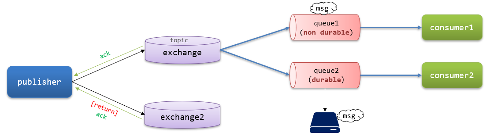

# 消息的可靠性



消息从生产者到消费者的每一步都可能导致消息丢失:

**发送消息时丢失**:
- 生产者发送消息时连接MQ失败
- 生产者发送消息到达MQ后未找到Exchange
- 生产者发送消息到达MQ的Exchange后,未找到合适的Queue
- 消息到达MQ后,处理消息的进程发生异常

**MQ导致消息丢失**:
- 消息到达MQ,保存到队列后,尚未消费就突然宕机

**消费者处理消息时**:
- 消息接收后尚未处理突然宕机
- 消息接收后处理过程中抛出异常

综上,要解决消息丢失问题,保证MQ的可靠性,必须从3个方面入手:
- 确保生产者一定把消息发送到MQ
- 确保MQ不会将消息弄丢
- 确保消费者一定要处理消息

# 发送者的可靠性

## 发送者重连

有的时候由于网络波动,可能会出现发送者连接MQ失败的情况

通过配置可以开启连接失败后的重连机制:

```yaml
spring:
  rabbitmq:
    connection-timeout: 1s # 设置MQ的连接超时时间
    template:
      retry:
        enabled: true # 开启超时重试机制
        initial-interval: 1000ms # 失败后的初始等待时间
        multiplier: 1 # 失败后下次的等待时长倍数,下次等待时长 = initial-interval * multiplier
        max-attempts: 3 # 最大重试次数
```

当网络不稳定的时候,利用重试机制可以有效提高消息发送的成功率,不过SpringAMQP提供的重试机制是**阻塞式**的重试,也就是说多次重试等待的过程中,当前线程是被阻塞的,会影响业务性能,如果对于业务性能有要求,**建议禁用重试机制**,如果一定要使用,请合理配置等待时长和重试次数,当然也**可以考虑使用异步线程来执行发送消息的代码**

## 发送者确认

SpringAMQP提供了**Publisher Confirm**和**Publisher Return**两种确认机制

开启确认机制后,当发送者发送消息给MQ后,MQ会返回确认结果给发送者,返回的结果有以下几种情况:
- 消息投递到了MQ,但是路由失败,此时会通过PublisherReturn返回路由异常原因,然后返回**ACK**,告知投递成功
- 临时消息投递到了MQ,并且入队成功,返回**ACK**,告知投递成功
- 持久消息投递到了MQ,并且入队完成持久化,返回**ACK**,告知投递成功
- 其它情况都会返回**NACK**,告知投递失败



如何处理发送者的确认消息:
- 发送者确认需要额外的网络和系统资源开销,尽量不要使用
- 对于nack消息可以有限次数重试,依然失败则记录异常消息

开启生产者确认比较消耗MQ性能,**一般不建议开启**

触发确认的几种情况:
- 路由失败:一般是因为RoutingKey错误导致,往往是编程导致
- 交换机名称错误:同样是编程错误导致
- MQ内部故障:这种需要处理,但概率往往较低,因此只有对消息可靠性要求非常高的业务才需要开启,而且仅仅需要开启ConfirmCallback处理nack就可以

### 实现发送者确认

1. 在publisher这个微服务的application.yml中添加配置

```yaml
spring:
  rabbitmq:
    publisher-confirm-type: correlated # 开启publisher confirm机制,并设置confirm类型
    publisher-returns: true # 开启publisher return机制
```

配置说明:
这里publisher-confirm-type有三种模式可选:
- `none`:关闭confirm机制(默认)
- `simple`:同步阻塞等待MQ的回执消息
- `correlated`:MQ异步回调方式返回回执消息

2. 每个RabbitTemplate**只能配置一个**ReturnCallback,因此需要在项目启动过程中配置

```java
import lombok.AllArgsConstructor;
import lombok.extern.slf4j.Slf4j;
import org.springframework.amqp.core.ReturnedMessage;
import org.springframework.amqp.rabbit.core.RabbitTemplate;
import org.springframework.context.annotation.Configuration;

import javax.annotation.PostConstruct;

@Slf4j
@AllArgsConstructor
@Configuration
public class MqConfig {
    private final RabbitTemplate rabbitTemplate;

    @PostConstruct
    public void init(){
        rabbitTemplate.setReturnsCallback(new RabbitTemplate.ReturnsCallback() {
            @Override
            public void returnedMessage(ReturnedMessage returned) {
                log.error("触发return callback,");
                log.debug("exchange: {}", returned.getExchange());
                log.debug("routingKey: {}", returned.getRoutingKey());
                log.debug("message: {}", returned.getMessage());
                log.debug("replyCode: {}", returned.getReplyCode());
                log.debug("replyText: {}", returned.getReplyText());
            }
        });
    }
}
```

3. 发送消息,指定消息ID、消息ConfirmCallback

由于每个消息发送时的处理逻辑不一定相同,因此ConfirmCallback需要在每次发消息时定义

具体来说,是在调用RabbitTemplate中的convertAndSend方法时,多传递一个参数:CorrelationData

CorrelationData中包含两个核心的东西:
- `id`:消息的唯一标示,MQ对不同的消息的回执以此做判断,避免混淆
- `SettableListenableFuture`:回执结果的Future对象

将来MQ的回执就会通过这个Future来返回,可以提前给CorrelationData中的Future添加回调函数来处理消息回执

```java
@Test
void testPublisherConfirm() {
    // 1.创建CorrelationData
    CorrelationData cd = new CorrelationData();
    // 2.给Future添加ConfirmCallback
    cd.getFuture().addCallback(new ListenableFutureCallback<CorrelationData.Confirm>() {
        @Override
        public void onFailure(Throwable ex) {
            // 2.1.Future发生异常时的处理逻辑,基本不会触发
            log.error("send message fail", ex);
        }
        @Override
        public void onSuccess(CorrelationData.Confirm result) {
            // 2.2.Future接收到回执的处理逻辑,参数中的result就是回执内容
            if(result.isAck()){ // result.isAck(),boolean类型,true代表ack回执,false代表nack回执
                log.debug("发送消息成功,收到 ack!");
            }else{ // result.getReason(),String类型,返回nack时的异常描述
                log.error("发送消息失败,收到 nack, reason : {}", result.getReason());
            }
        }
    });
    // 3.发送消息
    rabbitTemplate.convertAndSend("hmall.direct", "red", "hello", cd);
}
```

### 范例

publisher的配置文件:

```yaml
logging:
  pattern:
    dateformat: MM-dd HH:mm:ss:SSS
spring:
  rabbitmq:
    host: 192.168.149.127 # 主机名
    port: 5672
    virtual-host: /hmall
    username: hmall
    password: 123456
    listener:
      simple:
        prefetch: 1 # 每次只能获取一条消息,处理完成才能获取下一个消息
    template:
      retry:
        enabled: true # 开启超时重试机制
        initial-interval: 1000ms # 失败后的初始等待时间
        multiplier: 2 # 失败后下次的等待时长倍数,下次等待时长 = initial-interval * multiplier
        max-attempts: 3 # 最大重试次数
    publisher-confirm-type: correlated # 开启publisher confirm机制,并设置confirm类型
    publisher-returns: true # 开启publisher return机制
```

定义ReturnCallback:

```java
package com.itheima.publisher.config;

import lombok.RequiredArgsConstructor;
import lombok.extern.slf4j.Slf4j;
import org.springframework.amqp.rabbit.core.RabbitTemplate;
import org.springframework.context.annotation.Configuration;

import javax.annotation.PostConstruct;

@Slf4j
@Configuration
@RequiredArgsConstructor
public class MqConfig {
    private final RabbitTemplate rabbitTemplate;

    @PostConstruct
    public void init() {
        rabbitTemplate.setReturnsCallback(returned -> {
            log.error("监听到了消息:return callback,");
            log.debug("exchange: {}", returned.getExchange());
            log.debug("routingKey: {}", returned.getRoutingKey());
            log.debug("message: {}", returned.getMessage());
            log.debug("replyCode: {}", returned.getReplyCode());
            log.debug("replyText: {}", returned.getReplyText());
        });
    }
}
```

创建correlationData:

```java
@Test
public void testConfirmCallback() {
    // 创建CorrelationData
    CorrelationData cd = new CorrelationData();
    // 给Future添加ConfirmCallback
    cd.getFuture().addCallback(new ListenableFutureCallback<CorrelationData.Confirm>() {
        @Override
        public void onFailure(Throwable ex) {
            // Future发生异常时的处理逻辑,基本不会触发
            log.error("SpringAMQP处理确认结果异常", ex);
        }

        @Override
        public void onSuccess(CorrelationData.Confirm result) {
            // 判断是否成功,true代表ack回执,false代表nack回执
            if (result.isAck()) {
                log.debug("发送消息成功,收到 ack!");
            } else {
                log.error("发送消息失败,收到 nack, 失败原因 : {}", result.getReason());
            }
        }
    });
    // 交换机名称
    String exchangeName = "object.topic";
    // 消息
    Map<String, Object> map = new HashMap<>(2);
    map.put("name", "张三");
    map.put("age", 18);
    // 发送消息
    rabbitTemplate.convertAndSend(exchangeName, "red", map, cd);
}
```

# MQ的可靠性


# 消费者的可靠性


# 延迟消息