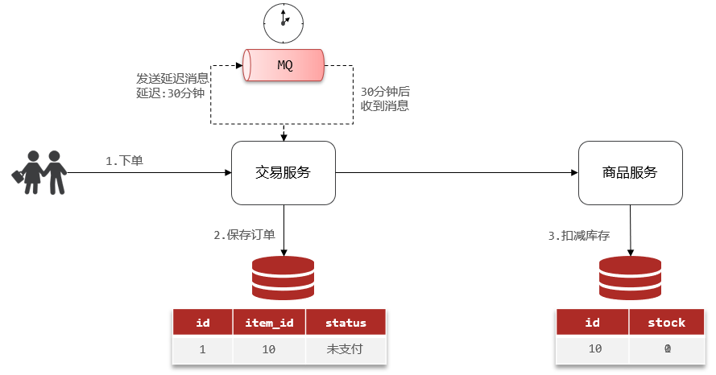
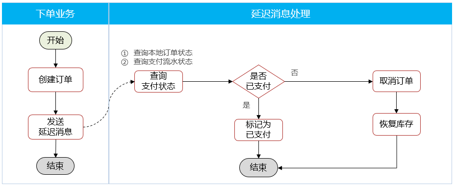

# 消息的可靠性


消息从生产者到消费者的每一步都可能导致消息丢失:

**发送消息时丢失**:
- 生产者发送消息时连接MQ失败
- 生产者发送消息到达MQ后未找到Exchange
- 生产者发送消息到达MQ的Exchange后,未找到合适的Queue
- 消息到达MQ后,处理消息的进程发生异常

**MQ导致消息丢失**:
- 消息到达MQ,保存到队列后,尚未消费就突然宕机

**消费者处理消息时**:
- 消息接收后尚未处理突然宕机
- 消息接收后处理过程中抛出异常

综上,要解决消息丢失问题,保证MQ的可靠性,必须从3个方面入手:
- 确保生产者一定把消息发送到MQ(生产者的可靠性)
- 确保MQ不会将消息弄丢(MQ的可靠性)
- 确保消费者一定要处理消息(消费者的可靠性)

# 生产者的可靠性

## 生产者重连机制

有的时候由于网络波动,可能会出现生产者连接MQ失败的情况

通过配置可以开启连接失败后的重连机制:

```yaml
spring:
  rabbitmq:
    connection-timeout: 1s # 设置MQ的连接超时时间
    template:
      retry:
        enabled: true # 开启超时重连机制
        initial-interval: 1000ms # 失败后的初始等待时间
        multiplier: 1 # 失败后下次的等待时长倍数,下次等待时长 = initial-interval * multiplier
        max-attempts: 3 # 最大重连次数
```

当网络不稳定的时候,利用重试机制可以有效提高消息发送的成功率,不过SpringAMQP提供的重试机制是**阻塞式**的重试,也就是说多次重试等待的过程中,当前线程是被阻塞的,会影响业务性能,如果对于业务性能有要求,**建议禁用重试机制**,如果一定要使用,请合理配置等待时长和重试次数,当然也**可以考虑使用异步线程来执行发送消息的代码**

## 生产者确认机制

SpringAMQP提供了**Publisher Confirm**和**Publisher Return**两种确认机制

开启确认机制后,当生产者发送消息给MQ后,MQ会返回确认结果给生产者,返回的结果有以下几种情况:
- 消息投递到了MQ,但是路由失败,此时会通过PublisherReturn返回路由异常原因,然后返回**ACK**,告知投递成功
- 临时消息投递到了MQ,并且入队成功,返回**ACK**,告知投递成功
- 持久消息投递到了MQ,并且入队完成持久化,返回**ACK**,告知投递成功
- 其它情况都会返回**NACK**,告知投递失败


如何处理生产者的确认消息:
- 生产者确认需要额外的网络和系统资源开销,尽量不要使用
- 对于nack消息可以有限次数重试,依然失败则记录异常消息

开启生产者确认比较消耗MQ性能,**一般不建议开启**

触发确认的几种情况:
- 路由失败:一般是因为RoutingKey错误导致,往往是编程导致
- 交换机名称错误:同样是编程错误导致
- MQ内部故障:这种需要处理,但概率往往较低,因此只有对消息可靠性要求非常高的业务才需要开启,而且仅仅需要开启ConfirmCallback处理nack就可以

### 实现生产者确认

1. 在publisher这个微服务的application.yml中添加配置

```yaml
spring:
  rabbitmq:
    publisher-confirm-type: correlated # 开启publisher confirm机制,并设置confirm类型
    publisher-returns: true # 开启publisher return机制
```

配置说明:
这里publisher-confirm-type有三种模式可选:
- `none`:关闭confirm机制(默认)
- `simple`:同步阻塞等待MQ的回执消息
- `correlated`:MQ异步回调方式返回回执消息

2. 每个RabbitTemplate**只能配置一个**ReturnCallback,因此需要在项目启动过程中配置

```java
import lombok.AllArgsConstructor;
import lombok.extern.slf4j.Slf4j;
import org.springframework.amqp.core.ReturnedMessage;
import org.springframework.amqp.rabbit.core.RabbitTemplate;
import org.springframework.context.annotation.Configuration;

import javax.annotation.PostConstruct;

@Slf4j
@AllArgsConstructor
@Configuration
public class MqConfig {
    private final RabbitTemplate rabbitTemplate;

    @PostConstruct
    public void init(){
        rabbitTemplate.setReturnsCallback(new RabbitTemplate.ReturnsCallback() {
            @Override
            public void returnedMessage(ReturnedMessage returned) {
                log.error("触发return callback,");
                log.debug("exchange: {}", returned.getExchange());
                log.debug("routingKey: {}", returned.getRoutingKey());
                log.debug("message: {}", returned.getMessage());
                log.debug("replyCode: {}", returned.getReplyCode());
                log.debug("replyText: {}", returned.getReplyText());
            }
        });
    }
}
```

3. 发送消息,指定消息ID、消息ConfirmCallback

由于每个消息发送时的处理逻辑不一定相同,因此ConfirmCallback需要在每次发消息时定义

具体来说,是在调用RabbitTemplate中的convertAndSend方法时,多传递一个参数:CorrelationData

CorrelationData中包含两个核心的东西:
- `id`:消息的唯一标示,MQ对不同的消息的回执以此做判断,避免混淆
- `SettableListenableFuture`:回执结果的Future对象

将来MQ的回执就会通过这个Future来返回,可以提前给CorrelationData中的Future添加回调函数来处理消息回执

```java
@Test
void testPublisherConfirm() {
    // 1.创建CorrelationData
    CorrelationData cd = new CorrelationData();
    // 2.给Future添加ConfirmCallback
    cd.getFuture().addCallback(new ListenableFutureCallback<CorrelationData.Confirm>() {
        @Override
        public void onFailure(Throwable ex) {
            // 2.1.Future发生异常时的处理逻辑,基本不会触发
            log.error("send message fail", ex);
        }
        @Override
        public void onSuccess(CorrelationData.Confirm result) {
            // 2.2.Future接收到回执的处理逻辑,参数中的result就是回执内容
            if(result.isAck()){ // result.isAck(),boolean类型,true代表ack回执,false代表nack回执
                log.debug("发送消息成功,收到 ack!");
            }else{ // result.getReason(),String类型,返回nack时的异常描述
                log.error("发送消息失败,收到 nack, reason : {}", result.getReason());
            }
        }
    });
    // 3.发送消息
    rabbitTemplate.convertAndSend("hmall.direct", "red", "hello", cd);
}
```

### 范例

publisher的配置文件:

```yaml
logging:
  pattern:
    dateformat: MM-dd HH:mm:ss:SSS
spring:
  rabbitmq:
    host: 192.168.149.127 # 主机名
    port: 5672
    virtual-host: /hmall
    username: hmall
    password: 123456
    listener:
      simple:
        prefetch: 1 # 每次只能获取一条消息,处理完成才能获取下一个消息
    template:
      retry:
        enabled: true # 开启超时重试机制
        initial-interval: 1000ms # 失败后的初始等待时间
        multiplier: 2 # 失败后下次的等待时长倍数,下次等待时长 = initial-interval * multiplier
        max-attempts: 3 # 最大重试次数
    publisher-confirm-type: correlated # 开启publisher confirm机制,并设置confirm类型
    publisher-returns: true # 开启publisher return机制
```

定义ReturnCallback:

```java
package com.itheima.publisher.config;

import lombok.RequiredArgsConstructor;
import lombok.extern.slf4j.Slf4j;
import org.springframework.amqp.rabbit.core.RabbitTemplate;
import org.springframework.context.annotation.Configuration;

import javax.annotation.PostConstruct;

@Slf4j
@Configuration
@RequiredArgsConstructor
public class MqConfig {
    private final RabbitTemplate rabbitTemplate;

    @PostConstruct
    public void init() {
        rabbitTemplate.setReturnsCallback(returned -> {
            log.error("监听到了消息:return callback,");
            log.debug("exchange: {}", returned.getExchange());
            log.debug("routingKey: {}", returned.getRoutingKey());
            log.debug("message: {}", returned.getMessage());
            log.debug("replyCode: {}", returned.getReplyCode());
            log.debug("replyText: {}", returned.getReplyText());
        });
    }
}
```

创建correlationData:

```java
@Test
public void testConfirmCallback() {
    // 创建CorrelationData
    CorrelationData cd = new CorrelationData();
    // 给Future添加ConfirmCallback
    cd.getFuture().addCallback(new ListenableFutureCallback<CorrelationData.Confirm>() {
        @Override
        public void onFailure(Throwable ex) {
            // Future发生异常时的处理逻辑,基本不会触发
            log.error("SpringAMQP处理确认结果异常", ex);
        }

        @Override
        public void onSuccess(CorrelationData.Confirm result) {
            // 判断是否成功,true代表ack回执,false代表nack回执
            if (result.isAck()) {
                log.debug("发送消息成功,收到 ack!");
            } else {
                log.error("发送消息失败,收到 nack, 失败原因 : {}", result.getReason());
            }
        }
    });
    // 交换机名称
    String exchangeName = "object.topic";
    // 消息
    Map<String, Object> map = new HashMap<>(2);
    map.put("name", "张三");
    map.put("age", 18);
    // 发送消息
    rabbitTemplate.convertAndSend(exchangeName, "red", map, cd);
}
```

# MQ的可靠性

在默认情况下,RabbitMQ会将接收到的信息保存在内存中以降低消息收发的延迟,这样会导致两个问题:
- 一旦MQ宕机,内存中的消息会丢失
- 内存空间有限,当消费者故障或处理过慢时,会导致消息积压,引发MQ阻塞

## 数据持久化

RabbitMQ实现数据持久化包括3个方面:

- 交换机持久化(添加时默认Durable)


- 队列持久化(添加时默认Durable)


- 消息持久化


细节:
1. **SpringAMQP中的交换机、队列、消息默认持久化**
2. **开启持久化和发送者确认时,RabbitMQ只有在消息持久化完成后才会给发送者返回ACK回执**

## 惰性队列

从RabbitMQ的3.6.0版本开始,就增加了Lazy Queue的概念,也就是**惰性队列**

惰性队列的特征如下:
- 接收到消息后直接存入磁盘,不再存储到内存
- 消费者要消费消息时才会从磁盘中读取并加载到内存(可以提前缓存部分消息到内存,最多2048条)

**在RabbitMQ的3.12版本后,所有队列都是Lazy Queue模式,无法更改**

### 实现

1. 控制台设置Lazy Queue


2. 代码实现Lazy Queue

```java
@Bean
public Queue lazyQueue(){
    return QueueBuilder            
            .durable("lazy.queue")
            .lazy() // 开启Lazy模式
            .build();
}
```

```java
@RabbitListener(bindings = @QueueBinding(
        value = @Queue(name = "topic.queue", durable = "true", arguments = @Argument(name = "x-queue-mode", value = "lazy")),
        exchange = @Exchange(name = "topic.exchange", type = ExchangeTypes.TOPIC),
        key = {"red", "blue"}))
public void listenTopicQueue(String msg) {
    log.info("消费者接收到了消息" + msg);
}
```

# 消费者的可靠性

## 消费者确认机制

消费者确认机制(Consumer Acknowledgement)是为了确认消费者是否成功处理消息

当消费者处理消息结束后,应该向RabbitMQ发送一个回执,告知RabbitMQ自己消息处理状态:
- `ack`:成功处理消息,RabbitMQ从队列中删除该消息
- `nack`:消息处理失败,RabbitMQ需要再次投递消息
- `reject`:消息处理失败并拒绝该消息,RabbitMQ从队列中删除该消息


SpringAMQP已经实现了消息确认功能,并允许通过配置文件选择ACK处理方式,有三种方式:
- `none`:不处理,即消息投递给消费者后立刻ack,消息会立刻从MQ删除。非常不安全,不建议使用
- `manual`:手动模式,需要自己在业务代码中调用api,发送ack或reject,存在业务入侵,但更灵活
- `auto`:自动模式,SpringAMQP利用AOP对消息处理逻辑做了环绕增强,当业务正常执行时则自动返回ack,当业务出现异常时,根据异常判断返回不同结果:
    - 如果是业务异常,会自动返回nack
    - 如果是消息处理或校验异常,自动返回reject

```yaml
spring:
  rabbitmq:
    listener:
      simple:
        acknowledge-mode: auto # none,关闭ack;manual,手动ack;auto,自动ack
```

## 消费者失败重试机制

SpringAMQP提供了消费者失败重试机制,在消费者出现异常时利用本地重试,而不是无限的requeue到mq

可以通过配置文件来开启重试机制:

```yaml
spring:
  rabbitmq:
    listener:
      simple:
        retry:
          enabled: true # 开启消费者失败重试机制
          initial-interval: 1000ms # 失败后的初始等待时间
          multiplier: 2 # 失败后下次的等待时长倍数,下次等待时长 = initial-interval * multiplier
          max-attempts: 3 # 最大重试次数
          stateless: true # true无状态;false有状态,如果业务中包含事务,这里改为false
```

在开启重试模式后,重试次数耗尽,如果消息依然失败,则需要有MessageRecoverer接口来处理,它包含三种不同的实现:
- `RejectAndDontRequeueRecoverer`:重试耗尽后,直接reject,丢弃消息(默认)
- `ImmediateRequeueMessageRecoverer`:重试耗尽后,返回nack,消息重新入队
- `RepublishMessageRecoverer`:重试耗尽后,将失败消息投递到指定的交换机


### 范例

```java
package com.itheima.consumer.config;

import org.springframework.amqp.core.Binding;
import org.springframework.amqp.core.BindingBuilder;
import org.springframework.amqp.core.DirectExchange;
import org.springframework.amqp.core.Queue;
import org.springframework.amqp.rabbit.core.RabbitTemplate;
import org.springframework.amqp.rabbit.retry.MessageRecoverer;
import org.springframework.amqp.rabbit.retry.RepublishMessageRecoverer;
import org.springframework.context.annotation.Bean;
import org.springframework.context.annotation.Configuration;

@Configuration
public class ErrorMessageConfiguration {

    @Bean
    public DirectExchange errorExchange() {
        return new DirectExchange("error.direct");
    }

    @Bean
    public Queue errorQueue() {
        return new Queue("error.queue");
    }

    @Bean
    public Binding errorQueueBinding(DirectExchange errorExchange, Queue errorQueue) {
        return BindingBuilder.bind(errorQueue).to(errorExchange).with("error");
    }

    @Bean
    public MessageRecoverer messageRecoverer(RabbitTemplate rabbitTemplate) {
        return new RepublishMessageRecoverer(rabbitTemplate, "error.direct", "error");
    }
}
```

## 业务幂等性

**幂等**是一个数学概念,用函数表达式来描述是这样的:f(x) = f(f(x)) 

在程序开发中,则是**指同一个业务,执行一次或多次对业务状态的影响是一致的**


### 唯一消息id

方案一是给每个消息都设置一个**唯一id**,利用id区分是否是重复消息:
1. 每一条消息都生成一个唯一的id,与消息一起投递给消费者
2. 消费者接收到消息后处理自己的业务,业务处理成功后将消息ID保存到数据库
3. 如果下次又收到相同消息,去数据库查询判断是否存在,存在则为重复消息放弃处理

生产者:消息发送时,修改消息转换器,配置自动创建消息id

```java
@Bean
public MessageConverter messageConverter(){
    // 1.定义消息转换器
    Jackson2JsonMessageConverter jjmc = new Jackson2JsonMessageConverter();
    // 2.配置自动创建消息id,用于识别不同消息,也可以在业务中基于ID判断是否是重复消息
    jjmc.setCreateMessageIds(true);
    return jjmc;
}
```

消费者:修改接收值为Message,并通过消息属性获取消息id

```java
@RabbitListener(queues = "simple.queue")
public void listenSimpleQueue(Message msg) {
    log.info("消息id:" + msg.getMessageProperties().getMessageId());
    log.info("消费者接收到了消息" + new String(msg.getBody()));
}
```

### 业务判断


```java
package com.hmall.trade.listener;

import com.hmall.trade.domain.po.Order;
import com.hmall.trade.service.IOrderService;
import lombok.RequiredArgsConstructor;
import org.springframework.amqp.rabbit.annotation.Exchange;
import org.springframework.amqp.rabbit.annotation.Queue;
import org.springframework.amqp.rabbit.annotation.QueueBinding;
import org.springframework.amqp.rabbit.annotation.RabbitListener;
import org.springframework.stereotype.Component;

@Component
@RequiredArgsConstructor
public class PayStatusListener {

    private final IOrderService orderService;

    @RabbitListener(bindings = @QueueBinding(
            value = @Queue(value = "trade.pay.success.queue", durable = "true"),
            exchange = @Exchange(value = "pay.direct"),
            key = "pay.success"))
    public void listenPayStatus(Long orderId) {
        // 查询订单
        Order order = orderService.getById(orderId);

        // 判断订单状态是否为未支付
        if (order == null || order.getStatus() != 1) {
            // 不做处理
            return;
        }

        // 标记订单状态为已支付
        orderService.markOrderPaySuccess(orderId);
    }
}
```

# 延迟消息

**延迟消息**:发送者发送消息时指定一个时间,消费者不会立刻收到消息,而是在指定时间之后才收到消息

**延迟任务**:设置在一定时间之后才执行的任务



## 死信交换机

当一个队列中的消息满足下列情况之一时,就会成为死信(dead letter):
- 消费者使用basic.reject或 basic.nack声明消费失败,并且消息的requeue参数设置为false
- 消息是一个过期消息(达到了队列或消息本身设置的过期时间),超时无人消费
- 要投递的队列消息堆积满了,最早的消息可能成为死信

如果队列通过dead-letter-exchange属性指定了一个交换机,那么该队列中的死信就会投递到这个交换机中,这个交换机称为**死信交换机**(Dead Letter Exchange,简称DLX)


### 范例

1. 声明死信交换机:

```java
@RabbitListener(bindings = @QueueBinding(
        value = @Queue(name = "dlx.queue", durable = "true"),
        exchange = @Exchange(name = "dlx.direct", type = ExchangeTypes.DIRECT),
        key = {"dlx-key"}))
public void listenDlxQueue(String msg) {
    log.info("消费者接收到了dlx" + msg);
}
```

2. 声明带有死信交换机的普通队列:

```java
package com.itheima.consumer.config;

import org.springframework.amqp.core.*;
import org.springframework.context.annotation.Bean;
import org.springframework.context.annotation.Configuration;

@Configuration
public class NormalConfig {
    @Bean
    public DirectExchange normalDirect() {
        return new DirectExchange("normal.direct");
    }

    @Bean
    public Queue normalQueue() {
        return QueueBuilder.durable("normal.queue").deadLetterExchange("dlx.direct").build();
    }

    @Bean
    public Binding bindingNormalDirectQueue() {
        return BindingBuilder.bind(normalQueue()).to(normalDirect()).with("dlx-key");
    }
}
```

3. 生产者发消息:通过`setExpiration`设置延迟时间

```java
@Test
public void testSendDelayMessage() {
    rabbitTemplate.convertAndSend("normal.direct", "dlx-key", "hello,DLX", message -> {
        message.getMessageProperties().setExpiration("10000");
        return message;
    });
}
```

## 延迟消息插件

添加插件后可以使用插件实现延迟消息

1. 通过`delayed = "true"`声明具备延迟消息功能的普通队列:

```java
@RabbitListener(bindings = @QueueBinding(
        value = @Queue(name = "delay.queue", durable = "true"),
        exchange = @Exchange(name = "delay.direct", type = ExchangeTypes.DIRECT, delayed = "true"),
        key = {"dlx-key"}))
public void listenDlxQueue(String msg) {
    log.info("消费者接收到了dlx" + msg);
}
```

2. 生产者发消息:通过`setDelay`设置延迟时间

```java
@Test
public void testSendDelayMessage() {
    rabbitTemplate.convertAndSend("delay.direct", "dlx-key", "hello,delay", message -> {
        message.getMessageProperties().setDelay(10000);
        return message;
    });
}
```

# 黑马商城取消超时订单




## 查询支付状态

PayOrderDTO.java:

```java
package com.hmall.api.dto;

import io.swagger.annotations.ApiModel;
import io.swagger.annotations.ApiModelProperty;
import lombok.Data;

import java.time.LocalDateTime;

/**
 * <p>
 * 支付订单
 * </p>
 */
@Data
@ApiModel(description = "支付单数据传输实体")
public class PayOrderDTO {
    @ApiModelProperty("id")
    private Long id;
    @ApiModelProperty("业务订单号")
    private Long bizOrderNo;
    @ApiModelProperty("支付单号")
    private Long payOrderNo;
    @ApiModelProperty("支付用户id")
    private Long bizUserId;
    @ApiModelProperty("支付渠道编码")
    private String payChannelCode;
    @ApiModelProperty("支付金额,单位分")
    private Integer amount;
    @ApiModelProperty("付类型,1：h5,2:小程序,3：公众号,4：扫码,5：余额支付")
    private Integer payType;
    @ApiModelProperty("付状态,0：待提交,1:待支付,2：支付超时或取消,3：支付成功")
    private Integer status;
    @ApiModelProperty("拓展字段,用于传递不同渠道单独处理的字段")
    private String expandJson;
    @ApiModelProperty("第三方返回业务码")
    private String resultCode;
    @ApiModelProperty("第三方返回提示信息")
    private String resultMsg;
    @ApiModelProperty("支付成功时间")
    private LocalDateTime paySuccessTime;
    @ApiModelProperty("支付超时时间")
    private LocalDateTime payOverTime;
    @ApiModelProperty("支付二维码链接")
    private String qrCodeUrl;
    @ApiModelProperty("创建时间")
    private LocalDateTime createTime;
    @ApiModelProperty("更新时间")
    private LocalDateTime updateTime;
}
```

PayClientFallback.java:

```java
package com.hmall.api.client.fallback;

import com.hmall.api.client.PayClient;
import com.hmall.api.dto.PayOrderDTO;
import lombok.extern.slf4j.Slf4j;
import org.springframework.cloud.openfeign.FallbackFactory;

@Slf4j
public class PayClientFallback implements FallbackFactory<PayClient> {
    @Override
    public PayClient create(Throwable cause) {
        return new PayClient() {
            @Override
            public PayOrderDTO queryPayOrderByBizOrderNo(Long id) {
                return null;
            }
        };
    }
}
```

PayClient.java:

```java
package com.hmall.api.client;

import com.hmall.api.client.fallback.PayClientFallback;
import com.hmall.api.dto.PayOrderDTO;
import org.springframework.cloud.openfeign.FeignClient;
import org.springframework.web.bind.annotation.GetMapping;
import org.springframework.web.bind.annotation.PathVariable;

@FeignClient(value = "pay-service", fallbackFactory = PayClientFallback.class)
public interface PayClient {
    /**
     * 根据交易订单id查询支付单
     * @param id 业务订单id
     * @return 支付单信息
     */
    @GetMapping("/pay-orders/biz/{id}")
    PayOrderDTO queryPayOrderByBizOrderNo(@PathVariable("id") Long id);
}
```

## 改造下单业务

MQConstants.java:

```java
package com.hmall.trade.constants;

public interface MQConstants {
    String DELAY_EXCHANGE_NAME = "trade.delay.direct";
    String DELAY_ORDER_QUEUE_NAME = "trade.delay.order.queue";
    String DELAY_ORDER_KEY = "delay.order.query";
}
```

OrderDelayMessageListener.java:

```java
package com.hmall.trade.listener;

import com.hmall.api.client.PayClient;
import com.hmall.api.dto.PayOrderDTO;
import com.hmall.trade.constants.MQConstants;
import com.hmall.trade.domain.po.Order;
import com.hmall.trade.service.IOrderService;
import lombok.RequiredArgsConstructor;
import org.springframework.amqp.rabbit.annotation.Exchange;
import org.springframework.amqp.rabbit.annotation.Queue;
import org.springframework.amqp.rabbit.annotation.QueueBinding;
import org.springframework.amqp.rabbit.annotation.RabbitListener;
import org.springframework.stereotype.Component;

@Component
@RequiredArgsConstructor
public class OrderDelayMessageListener {
    private final IOrderService orderService;
    private final PayClient payClient;

    @RabbitListener(bindings = @QueueBinding(
            value = @Queue(value = MQConstants.DELAY_ORDER_QUEUE_NAME, durable = "true"),
            exchange = @Exchange(value = MQConstants.DELAY_EXCHANGE_NAME, delayed = "true"),
            key = MQConstants.DELAY_ORDER_KEY
    ))
    public void listenOrderDelayMessage(Long orderId) {
        // 查询订单
        Order order = orderService.getById(orderId);

        // 检测本地订单状态,判断是否已支付
        if (order.getStatus() == null || order.getStatus() != 1) {
            // 订单不存在或者订单已支付
            return;
        }

        // 未支付,需要查询支付流水状态
        PayOrderDTO payOrderDTO = payClient.queryPayOrderByBizOrderNo(orderId);
        if (payOrderDTO != null && payOrderDTO.getStatus() == 3) {
            // 已支付,标记订单状态为已支付
            orderService.markOrderPaySuccess(orderId);
        } else {
            // 未支付,取消订单,恢复库存
            orderService.cancelOrder(orderId);
        }

        System.out.println("订单延迟队列监听");
    }
}
```

IOrderService.java:

```java
void cancelOrder(Long orderId);
```

OrderServiceImpl.java:

```java
@Override
@GlobalTransactional
public Long createOrder(OrderFormDTO orderFormDTO) {
    // 1.订单数据
    Order order = new Order();
    // 1.1.查询商品
    List<OrderDetailDTO> detailDTOS = orderFormDTO.getDetails();
    // 1.2.获取商品id和数量的Map
    Map<Long, Integer> itemNumMap = detailDTOS.stream()
            .collect(Collectors.toMap(OrderDetailDTO::getItemId, OrderDetailDTO::getNum));
    Set<Long> itemIds = itemNumMap.keySet();
    // 1.3.查询商品
    List<ItemDTO> items = itemClient.queryItemByIds(itemIds);
    if (items == null || items.size() < itemIds.size()) {
        throw new BadRequestException("商品不存在");
    }
    // 1.4.基于商品价格、购买数量计算商品总价：totalFee
    int total = 0;
    for (ItemDTO item : items) {
        total += item.getPrice() * itemNumMap.get(item.getId());
    }
    order.setTotalFee(total);
    // 1.5.其它属性
    order.setPaymentType(orderFormDTO.getPaymentType());
    order.setUserId(UserContext.getUser());
    order.setStatus(1);
    // 1.6.将Order写入数据库order表中
    save(order);

    // 2.保存订单详情
    List<OrderDetail> details = buildDetails(order.getId(), items, itemNumMap);
    detailService.saveBatch(details);

    // 3.清理购物车商品
    cartClient.removeByItemIds(itemIds);

    // 4.扣减库存
    try {
        itemClient.deductStock(detailDTOS);
    } catch (Exception e) {
        throw new RuntimeException("库存不足！");
    }

    // 5.发送延迟消息,检测订单支付状态
    rabbitTemplate.convertAndSend(MQConstants.DELAY_EXCHANGE_NAME,
            MQConstants.DELAY_ORDER_KEY,
            order.getId(),
            message -> {
                message.getMessageProperties().setDelay(900000);
                return message;
            });

    return order.getId();
}


@Override
public void cancelOrder(Long orderId) {
    // 修改订单为已关闭
    lambdaUpdate().set(Order::getStatus, 5).eq(Order::getId, orderId).update();
    // 修改支付单状态为已取消
    payClient.updatePayOrderStatusByBizOrderNo(orderId, 5);
    // 恢复库存
    List<OrderDetail> list = detailService.lambdaQuery().eq(OrderDetail::getOrderId, orderId).list();
    List<OrderDetailDTO> orderDetailDTOS = BeanUtil.copyToList(list, OrderDetailDTO.class);
    itemClient.restoreStock(orderDetailDTOS);
}
```

修改支付单状态为已取消,PayClient.java:

```java
/**
 * 根据业务订单id修改支付单状态
 *
 * @param orderId
 * @param status
 */
@PutMapping("/status/{id}/{status}")
void updatePayOrderStatusByBizOrderNo(@PathVariable("id") Long orderId, @PathVariable("status") Integer status);
```

PayController.java:

```java
@ApiOperation("修改支付单状态")
@PutMapping("/status/{id}/{status}")
public void updatePayOrderStatusByBizOrderNo(@PathVariable("id") Long orderId, @PathVariable("status") Integer status) {
    payOrderService.updateStatusByOrderId(orderId, status);
}
```

IPayOrderService.java:

```java
void updateStatusByOrderId(Long orderId, Integer status);
```

PayOrderServiceImpl.java:

```java
/**
 * 根据订单号,修改支付单状态
 *
 * @param orderId
 * @param status
 */
@Override
public void updateStatusByOrderId(Long orderId, Integer status) {
    lambdaUpdate().set(PayOrder::getStatus, status)
            .eq(PayOrder::getBizOrderNo, orderId)
            .update();
}
```

恢复库存,ItemClient.java:

```java
/**
 * 恢复库存
 * 
 * @param orderDetailDTOS
 */
@PutMapping("/stock/restore")
void restoreStock(List<OrderDetailDTO> orderDetailDTOS);
```

ItemController.java:

```java
@ApiOperation("批量恢复库存")
@PutMapping("/stock/restore")
public void restoreStock(@RequestBody List<OrderDetailDTO> orderDetails){
    itemService.restoreStock(orderDetails);
}
```

IItemService.java:

```java
void restoreStock(List<OrderDetailDTO> orderDetails);
```

ItemServiceImpl.java:

```java
/**
 * 批量恢复库存
 *
 * @param orderDetails
 */
@Override
public void restoreStock(List<OrderDetailDTO> orderDetails) {
    for (OrderDetailDTO orderDetail : orderDetails) {
        // 根据商品id查询商品
        Item item = lambdaQuery().eq(Item::getId, orderDetail.getItemId()).one();
        // 恢复库存,原来的库存 = 现在的库存 + 购买数量
        lambdaUpdate()
                .set(Item::getStock, item.getStock() + orderDetail.getNum())
                .eq(Item::getId, orderDetail.getItemId())
                .update();
    }
}
```

# 面试问题 

1. 如何保证支付服务与交易服务之间的订单状态一致性?
    - 首先,支付服务会正在用户支付成功以后利用MQ消息通知交易服务,完成订单状态同步                       
    - 其次,为了保证MQ消息的可靠性,采用了生产者确认机制、消费者确认、消费者失败重试等策略,确保消息投递和处理的可靠性,同时也开启了MQ的持久化,避免因服务宕机导致消息丢失                
    - 最后,还在交易服务更新订单状态时做了业务幂等判断,避免因消息重复消费导致订单状态异常          

2. 如果交易服务消息处理失败,有没有什么兜底方案?
可以在交易服务设置定时任务,定期查询订单支付状态,这样即便MQ通知失败,还可以利用定时任务作为兜底方案,确保订单支付状态的最终一致性