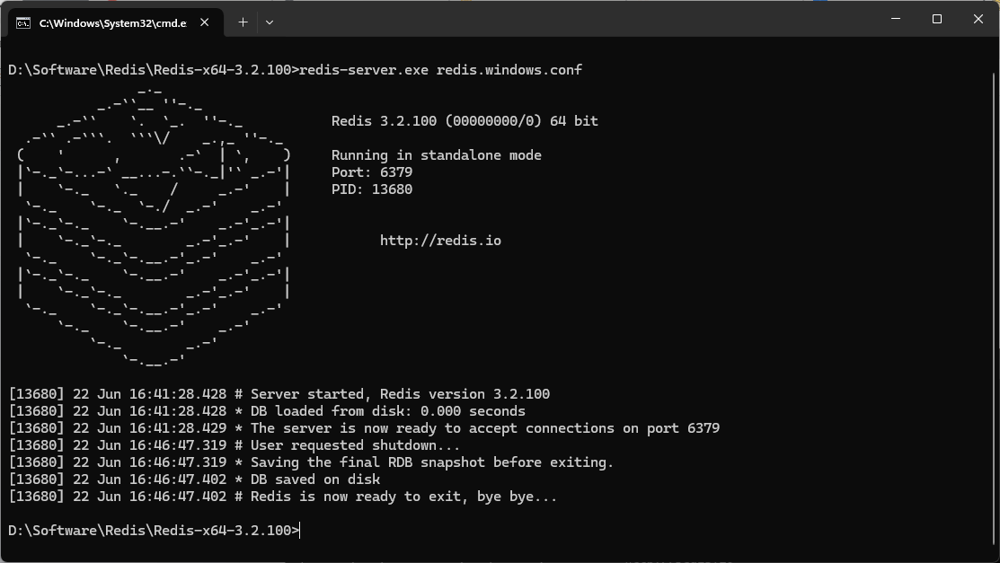
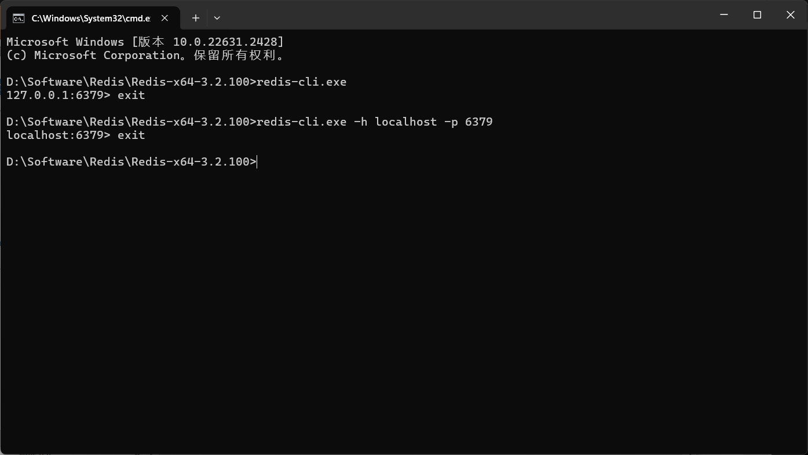
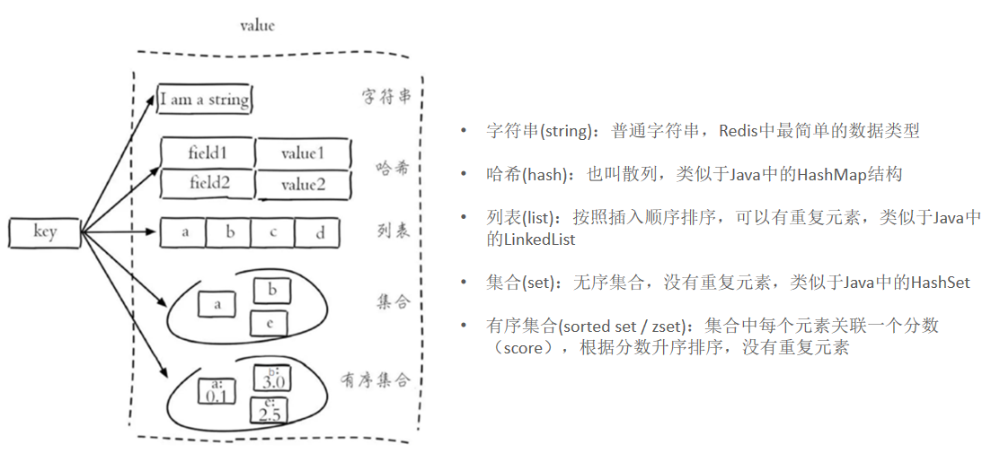

# Redis

Redis是一个基于**内存**的**key-value(键值对)**结构数据库,

特点:
1. 基于内存存储,读写性能高
2. 适合存储热点数据(热点商品、资讯、新闻)
3. 企业应用广泛

[Redis官网](https://redis.io)

[Redis中文网](https://www.redis.net.cn/)

# 入门

## 服务端

启动服务端:`redis-server.exe redis.windows.conf`

停止服务端:CTRL + C



## 客户端

启动客户端:`redis-cli.exe`或者`redis-cli.exe -h localhost -p 6379`

停止客户端:`exit`



## 指定登录密码

修改redis.windows.conf文件中的`# requirepass foobared`为`requirepass 123456`,即设置密码为123456

登录客户端时,需要加上`-a 123456`后,才能登录

## 设置Redis服务开机自启

步骤:
1. 将Redis的解压目录添加到系统环境变量Path中
2. 将Redis服务写入windows服务:在解压的Redis文件目录下新建命令行,输入命令`redis-server.exe --service-install redis.windows.conf --loglevel verbose`
3. 查看并设置Redis的服务                 
鼠标右键任务栏 --> 点击任务管理器 --> 选择服务选项 --> 点击下方打开服务按钮 --> 找到Redis的服务                    
鼠标右键Redis服务 --> 点击属性按钮 --> 在弹出的窗口中,将启动类型设置为手动 --> 点击确定即可     
4. 重启电脑使环境变量生效                 

基本命令:

- 开启服务:`redis-server --service-start`
- 关闭服务:`redis-server --service-stop`
- 卸载服务:`redis-server --service-uninstall`
- 服务重命名:`redis-server --service-name server-name`

# 数据类型

Redis存储的是key-value结构的数据,其中key是字符串类型,而value有5种常用的数据类型:
1. 字符串 string
2. 哈希 hash
3. 列表 list
4. 集合 set
5. 有序集合 sorted set / zset



# 常用命令

## 字符串操作命令

1. `SET key value`:设置指定key的值
2. `GET key`:获取指定key的值
3. `SETEX key seconds value`:设置指定key的值,并将key的过期时间设为seconds秒
4. `SETNX key value`:只有在key不存在时设置key的值

## 哈希操作命令

Redis hash是一个string类型的field和value的映射表,hash特别适合用于存储对象,常用命令:

1. `HSET key field value`:将哈希表key中的字段field的值设为value
2. `HGET key field`:获取存储在哈希表中指定字段的值
3. `HDEL key field`:删除存储在哈希表中的指定字段
4. `HKEYS key`:获取哈希表中所有字段
5. `HVALS key`:获取哈希表中所有值

## 列表操作命令

Redis列表是简单的字符串列表,按照插入顺序排序,常用命令:

1. `LPUSH key value1 [value2]`:将一个或多个值插入到列表头部(左边)
2. `LRANGE key start stop`:获取列表指定范围内的元素
3. `RPOP key`:移除并获取列表最后一个元素(右边)
4. `LLEN key`:获取列表长度

## 集合操作命令

Redis set是string类型的无序集合,集合成员是唯一的,集合中不能出现重复的数据,常用命令:

1. `SADD key member1 [member2]`:向集合添加一个或多个成员
2. `SMEMBERS key`:返回集合中的所有成员
3. `SCARD key`:获取集合的成员数
4. `SINTER key1 [key2]`:返回给定所有集合的交集
5. `SUNION key1 [key2]`:返回所有给定集合的并集
6. `SREM key member1 [member2]`:删除集合中一个或多个成员

## 有序集合操作命令

Redis有序集合是string类型元素的集合,且不允许有重复成员,每个元素都会关联一个double类型的分数,常用命令:

1. `ZADD key score1 member1 [score2 member2]`:向有序集合添加一个或多个成员
2. `ZRANGE key start stop [WITHSCORES]`:通过索引区间返回有序集合中指定区间内的成员
3. `ZINCRBY key increment member`:有序集合中对指定成员的分数加上增量increment
4. `ZREM key member [member ...]`:移除有序集合中的一个或多个成员

## 通用操作命令

Redis的通用命令是不分数据类型的,都可以使用的命令:

1. `KEYS pattern`:查找所有符合给定模式(pattern)的key 
2. `EXISTS key`:检查给定key是否存在
3. `TYPE key`:返回key所储存的值的类型
4. `DEL key`:该命令用于在key存在时删除key

# 在Java中操作Redis

## Redis的Java客户端

Redis的Java客户端很多,常用的几种:

- Jedis
- Lettuce
- Spring Data Redis

Spring Data Redis是Spring的一部分,对Redis底层开发包进行了高度封装

## Spring Data Redis的使用方式

步骤:

1. 导入Spring Data Redis的maven坐标

```xml
<dependency>
    <groupId>org.springframework.boot</groupId>
    <artifactId>spring-boot-starter-data-redis</artifactId>
</dependency>
```

2. 配置Redis数据源

```yml
spring:
    redis:
        host: localhost
        port: 6379
        password: 123456
        database: 0
```

3. 编写配置类,创建RedisTemplate对象

```java
@Configuration
@Slf4j
public class RedisConfiguration {
    @Bean
    public RedisTemplate redisTemplate(RedisConnectionFactory redisConnectionFactory) {
        log.info("开始创建redis模板对象...");
        RedisTemplate redisTemplate = new RedisTemplate();
        // 设置redis的连接工厂对象
        redisTemplate.setConnectionFactory(redisConnectionFactory);
        // 设置redis key的序列化器
        redisTemplate.setKeySerializer(new StringRedisSerializer());
        return redisTemplate;
    }
}
```

4. 通过RedisTemplate对象操作Redis

`redisTemplate.opsForXXX`

RedisTemplate针对大量api进行了归类封装,将同一数据类型的操作封装为对应的Operation接口,具体分类如下:

1. ValueOperations:string数据操作
2. SetOperations:set类型数据操作
3. ZSetOperations:zset类型数据操作
4. HashOperations:hash类型的数据操作
5. ListOperations:list类型的数据操作

范例:

```java
package com.sky.test;

import org.junit.jupiter.api.Test;
import org.springframework.beans.factory.annotation.Autowired;
import org.springframework.boot.test.context.SpringBootTest;
import org.springframework.data.redis.connection.DataType;
import org.springframework.data.redis.core.*;

import java.util.List;
import java.util.Set;
import java.util.concurrent.TimeUnit;

@SpringBootTest
public class SpringDataRedisTest {
    @Autowired
    private RedisTemplate redisTemplate;

    @Test
    public void testRedisTemplate() {
        System.out.println(redisTemplate);
        ValueOperations valueOperations = redisTemplate.opsForValue();
        HashOperations hashOperations = redisTemplate.opsForHash();
        ListOperations listOperations = redisTemplate.opsForList();
        SetOperations setOperations = redisTemplate.opsForSet();
        ZSetOperations zSetOperations = redisTemplate.opsForZSet();
    }

    /**
     * 操作字符串类型的数据
     */
    @Test
    public void testString() {
        ValueOperations valueOperations = redisTemplate.opsForValue();

        // set
        valueOperations.set("city", "北京");

        // get
        String city = (String) valueOperations.get("city");
        System.out.println(city);

        // setex
        valueOperations.set("code", "1234", 3, TimeUnit.MINUTES);

        // setnx
        valueOperations.setIfAbsent("lock", "1");
        valueOperations.setIfAbsent("lock", "2");
    }

    /**
     * 操作哈希类型的数据
     */
    @Test
    public void testHash() {
        HashOperations hashOperations = redisTemplate.opsForHash();

        // hset
        hashOperations.put("100", "name", "Tom");
        hashOperations.put("100", "age", "23");

        // hget
        String name = (String) hashOperations.get("100", "name");
        System.out.println(name);

        // hkeys
        Set keys = hashOperations.keys("100");
        System.out.println(keys);

        // hvals
        List values = hashOperations.values("100");
        System.out.println(values);

        // hdel
        hashOperations.delete("100", "age");
    }

    /**
     * 操作列表类型的数据
     */
    @Test
    public void testList() {
        ListOperations listOperations = redisTemplate.opsForList();

        // lpush
        listOperations.leftPushAll("myList", "a", "b", "c");
        listOperations.leftPush("myList", "d");

        // lrange
        List myList = listOperations.range("myList", 0, -1);
        System.out.println(myList);

        // rpop
        listOperations.rightPop("myList");

        // llen
        Long size = listOperations.size("myList");
        System.out.println(size);
    }

    /**
     * 操作集合类型的数据
     */
    @Test
    public void testSet() {
        SetOperations setOperations = redisTemplate.opsForSet();

        // sadd
        setOperations.add("set1", "a", "b", "c");
        setOperations.add("set2", "c", "d", "e");

        // smembers
        Set members = setOperations.members("set1");
        System.out.println(members);

        // scard
        Long size = setOperations.size("set1");
        System.out.println(size);

        // sinter
        Set intersect = setOperations.intersect("set1", "set2");
        System.out.println(intersect);

        // sunion
        Set union = setOperations.union("set1", "set2");
        System.out.println(union);

        // srem
        setOperations.remove("set1", "a");
    }

    /**
     * 操作有序集合类型的数据
     */
    @Test
    public void testZSet() {
        ZSetOperations zSetOperations = redisTemplate.opsForZSet();

        // zadd
        zSetOperations.add("zset", "a", 10);
        zSetOperations.add("zset", "b", 12);
        zSetOperations.add("zset", "c", 9);

        // zrange
        zSetOperations.range("zset", 0, -1);
        Set zset = zSetOperations.rangeWithScores("zset", 0, -1);
        System.out.println(zset);

        // zincrby
        zSetOperations.incrementScore("zset", "c", 10);

        // zrem
        zSetOperations.remove("zset", "a", "b");
    }

    /**
     * 通用操作命令
     */
    @Test
    public void testCommon() {
        // keys
        Set keys = redisTemplate.keys("*");
        System.out.println(keys);

        // exists
        Boolean name = redisTemplate.hasKey("name");
        System.out.println(name);
        Boolean city = redisTemplate.hasKey("city");
        System.out.println(city);

        // type
        System.out.println();
        for (Object key : keys) {
            DataType type = redisTemplate.type(key);
            System.out.println(type.name());
        }

        // del
        redisTemplate.delete("zset");
    }
}
```