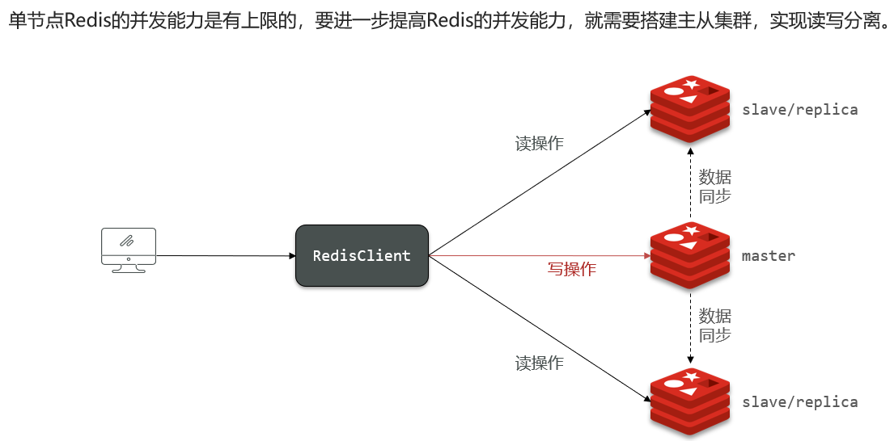

# 主从

## 搭建主从集群

如图所示,集群中有一个master节点、两个slave(replica)节点

当通过Redis的Java客户端访问主从集群时,应该做好路由:
- 如果是写操作,应该访问master节点,master会自动将数据同步给两个slave节点
- 如果是读操作,建议访问各个slave节点,从而分担并发压力

## 主从同步原理

## 主从集群优化

## 哨兵原理

## 搭建哨兵集群

# 分片集群

## 搭建分片集群

## 散列插槽

# 数据结构

## RedisObject

## SkipList

## SortedSet

# 内存回收

## 过期key处理

## 内存淘汰策略

# 缓存

## 缓存一致性

## 缓存穿透

## 缓存雪崩

## 缓存击穿
