# 主从集群原理

如图所示,集群中有一个master节点、两个slave(replica)节点

当通过Redis的Java客户端访问主从集群时,应该做好路由:
- 如果是写操作,应该访问master节点,master会自动将数据同步给两个slave节点
- 如果是读操作,建议访问各个slave节点,从而分担并发压力

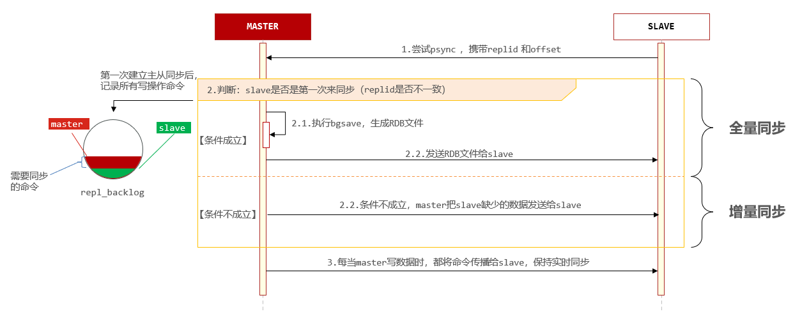

## 全量同步

**全量同步:master将完整内存数据生成RDB,发送RDB到slave,后续命令则记录在repl_baklog,逐个发送给slave**

主从第一次建立连接时,会执行**全量同步**,将master节点的所有数据都拷贝给slave节点,流程:

master如何得知salve是否是第一次来同步呢?

有几个概念,可以作为判断依据:
- `Replication Id`:简称replid,是数据集的标记,replid一致则是同一数据集,每个master都有唯一的replid,slave则会继承master节点的replid
- `offset`:偏移量,随着记录在repl_baklog中的数据增多而逐渐增大,slave完成同步时也会记录当前同步的offset,如果slave的offset小于master的offset,说明slave数据落后于master,需要更新

因此slave做数据同步,必须向master声明自己的replication id 和offset,master才可以判断到底需要同步哪些数据

**master判断一个节点是否是第一次同步的依据,就是看replid是否一致**

全量同步步骤:
- slave节点请求增量同步
- master节点判断replid,发现不一致,拒绝增量同步
- master将完整内存数据生成RDB,发送RDB到slave
- slave清空本地数据,加载master的RDB
- master将RDB期间的命令记录在repl_baklog,并持续将log中的命令发送给slave
- slave执行接收到的命令,保持与master之间的同步

**什么时候执行全量同步?**
- **slave节点第一次连接master节点时**
- **slave节点断开时间太久,repl_baklog中的offset已经被覆盖时**

## 增量同步

**增量同步:slave提交自己的offset到master,master获取repl_baklog中从offset之后的命令给slave**

**除了第一次做全量同步,其它大多数时候slave与master都是做增量同步**

master怎么知道slave与自己的数据差异在哪里呢?

全量同步时的repl_baklog文件是一个固定大小的数组,只不过数组是环形,也就是说**角标到达数组末尾后,会再次从0开始读写,这样数组头部的数据就会被覆盖**

repl_baklog中会记录Redis处理过的命令及offset,包括master当前的offset,和slave已经拷贝到的offset

slave与master的offset之间的差异,就是salve需要增量拷贝的数据

**什么时候执行增量同步?**
- **slave节点断开又恢复,并且在repl_baklog中能找到offset时**

## 主从同步优化

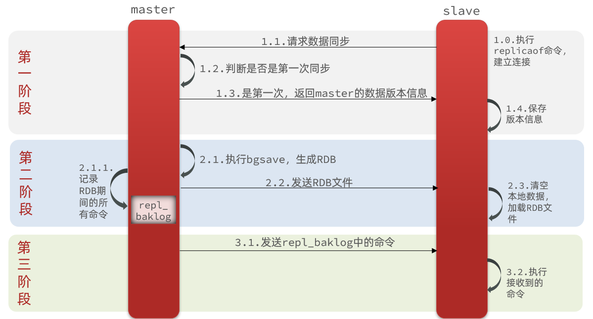

- 在master中配置repl-diskless-sync  yes启用无磁盘复制,避免全量同步时的磁盘IO
- Redis单节点上的内存占用不要太大,减少RDB导致的过多磁盘IO
- 适当提高repl_baklog的大小,发现slave宕机时尽快实现故障恢复,尽可能避免全量同步
- 限制一个master上的slave节点数量,如果实在是太多slave,则可以采用主-从-从链式结构,减少master压力

主-从-从链式结构:

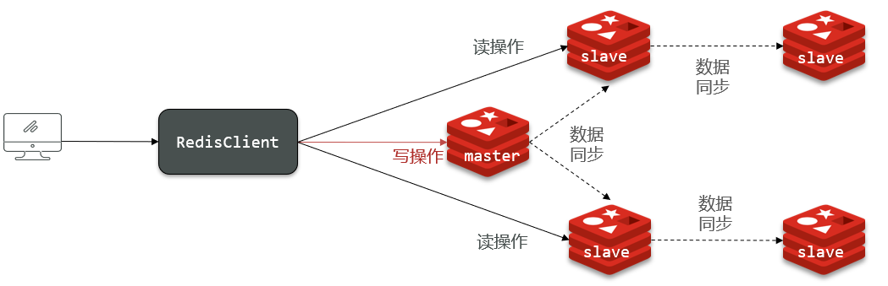

# 哨兵集群原理

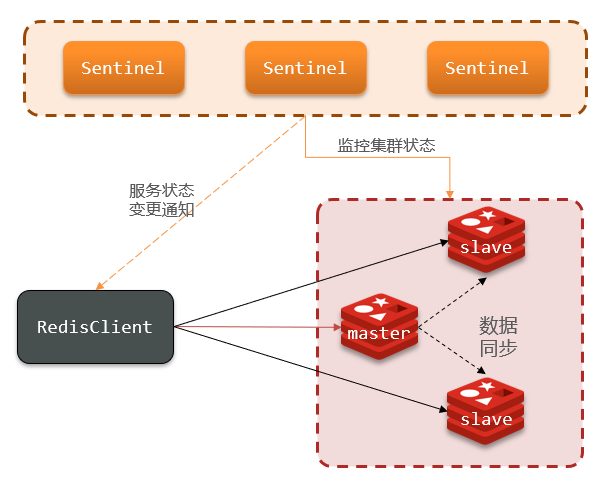

Redis提供了哨兵(Sentinel)机制来实现主从集群的自动故障恢复

哨兵的具体作用如下:
- **监控**:Sentinel会不断检查您的master和slave是否按预期工作
- **自动故障切换**:如果master故障,Sentinel会将一个slave提升为master,当故障实例恢复后也以新的master为主
- **通知**:当集群发生故障转移时,Sentinel会将最新节点角色信息推送给Redis的客户端

## 服务状态监控

Sentinel基于心跳机制监测服务状态,每隔1秒向集群的每个实例发送ping命令:
- 主观下线:如果某sentinel节点发现某实例未在规定时间响应,则认为该实例**主观下线**
- 客观下线:若超过指定数量(quorum)的sentinel都认为该实例主观下线,则该实例**客观下线**(**quorum值最好超过Sentinel实例数量的一半**)

## 选举新的master

一旦发现master故障,sentinel需要在salve中选择一个作为新的master,选择依据是这样的:
- 首先会判断slave节点与master节点断开时间长短,如果超过指定值(down-after-milliseconds * 10)则会排除该slave节点
- 然后判断slave节点的slave-priority值,越小优先级越高,如果是0则永不参与选举
- 如果slave-prority一样,则判断slave节点的offset值,越大说明数据越新,优先级越高
- 最后是判断slave节点的运行id大小,越小优先级越高

## 如何实现故障转移

当选中了其中一个slave为新的master后(例如slave1),故障的转移的步骤如下:

- sentinel给备选的slave1节点发送`slaveof no one`命令,让该节点成为master
- sentinel给所有其它slave发送`slaveof 192.168.149.100 7002`命令,让这些slave成为新master的从节点,开始从新的master上同步数据
- 最后,sentinel将故障节点标记为slave,当故障节点恢复后会自动成为新的master的slave节点

# 分片集群原理

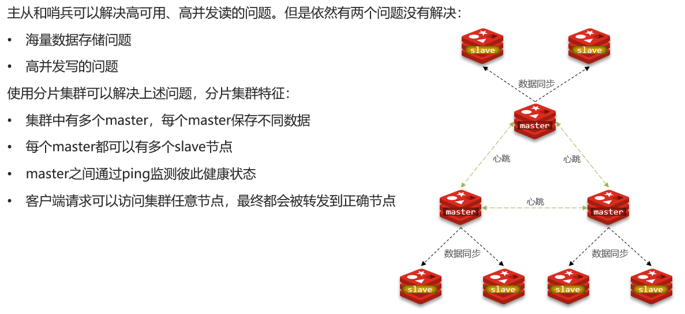

## 散列插槽

在Redis集群中,共有16384个hash slots,集群中的每一个master节点都会分配一定数量的hash slots

Redis数据不是与节点绑定,而是与插槽slot绑定,当读写数据时,Redis基于CRC16 算法对key做hash运算,得到的结果与16384取余,就计算出了这个key的slot值,然后到slot所在的Redis节点执行读写操作

redis在计算key的hash值是不一定是根据整个key计算,分两种情况:
- 当key中包含{}时,根据{}之间的字符串计算hash slot
- 当key中不包含{}时,则根据整个key字符串计算hash slot
    例如:key是num,那么就根据num计算,如果是{itcast}num,则根据itcast计算

Redis分片集群如何判断某个key应该在哪个实例?
- 将16384个插槽分配到不同的实例
- 根据key的有效部分计算哈希值,对16384取余
- 余数作为插槽,寻找插槽所在实例

# 数据结构

常用的Redis数据类型有5种,分别是:
- String
- List
- Set
- SortedSet
- Hash

还有一些高级数据类型,比如Bitmap、HyperLogLog、GEO等,其底层都是基于上述5种基本数据类型,因此在Redis的源码中,其实只有5种数据类型

## RedisObject

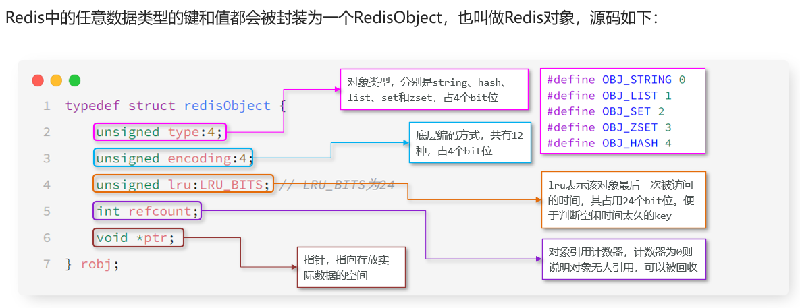

整个结构体中并不包含真实的数据,仅仅是对象头信息,内存占用的大小为4+4+24+32+64=128bit

也就是16字节,然后指针ptr指针指向的才是真实数据存储的内存地址,所以RedisObject的内存开销是很大的

## Redis编码方式

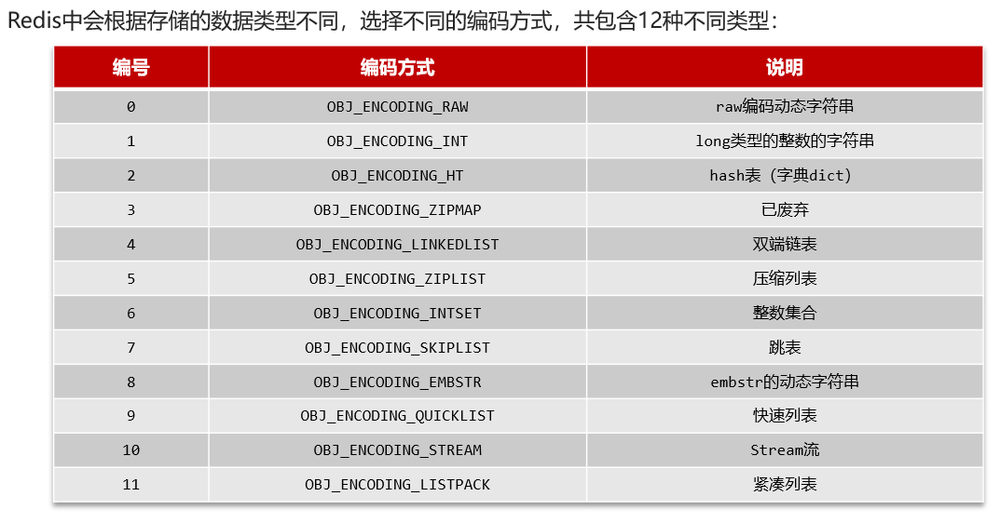

## Redis五种数据结构的编码方式

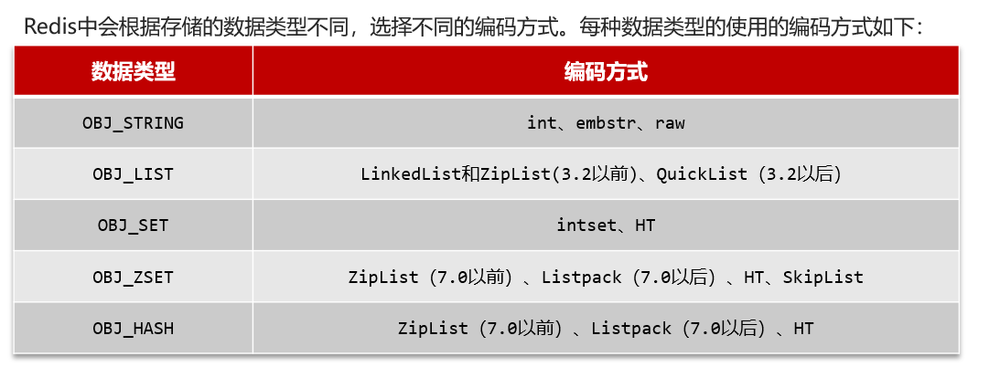

## 编码方式-SkipList跳表

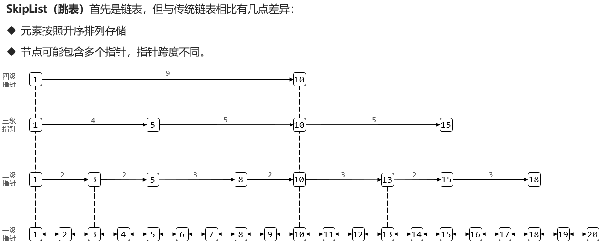

SkipList的特点:
- 跳表是一个有序的双向链表
- 每个节点都可以包含多层指针,层数是1到32之间的随机数
- 不同层指针到下一个节点的跨度不同,层级越高,跨度越大
- 增删改查效率与红黑树基本一致,实现却更简单,但空间复杂度更高

## 数据结构-SortedSet/ZSet

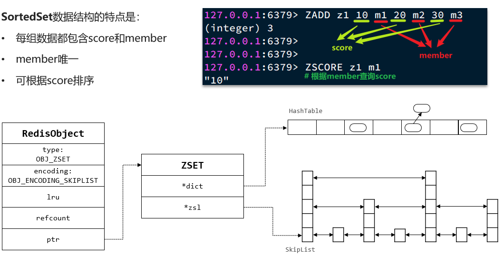

SortedSet的底层数据结构是怎样的?

SortedSet是有序集合,底层的存储的每个数据都包含element和score两个值

score是得分,element则是字符串值,SortedSet会根据每个element的score值排序,形成有序集合

它支持的操作很多,比如:
- 根据element查询score值
- 按照score值升序或降序查询element

要实现根据element查询对应的score值,就必须实现element与score之间的键值映射,SortedSet底层是基于HashTable来实现的

要实现对score值排序,并且查询效率还高,就需要有一种高效的有序数据结构,SortedSet是基于跳表实现的

因为SortedSet底层需要用到两种数据结构,对内存占用比较高,因此Redis底层会对SortedSet中的元素大小做判断

如果元素大小小于128且每个元素都小于64字节,SortedSet底层会采用ZipList,也就是压缩列表来代替HashTable和SkipList

不过,ZipList存在连锁更新问题,因此而在Redis7.0版本以后,ZipList又被替换为Listpack(紧凑列表)

# 内存回收

## 过期key处理

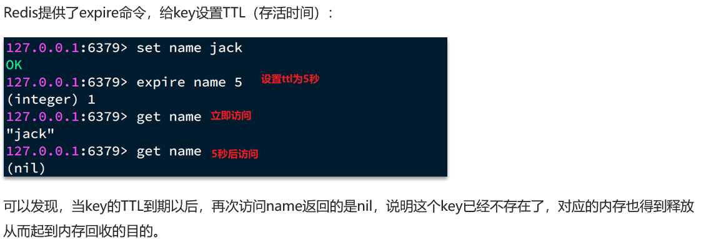

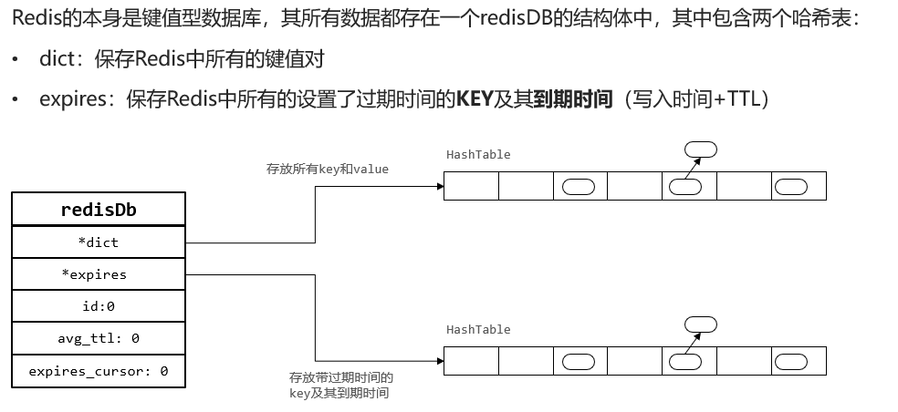

Redis并不会实时监测key的过期时间,在key过期后立刻删除,而是采用两种延迟删除的策略:
- **惰性删除**:当有命令需要操作一个key的时候,检查该key的存活时间,如果已经过期才执行删除
- **定期删除(周期删除)**:通过一个定时任务,周期性的抽样部分有TTL的key,如果过执行删除

### 定期删除

定期删除的定时任务执行周期有两种:
- **SLOW模式**:Redis会设置一个定时任务serverCron(),默认执行频率为每秒10次,但每次执行时长不能超过25ms,受server.hz参数影响
- **FAST模式**:频率不固定,跟随Redis的每个事件循环前执行过期key清理(事件循环就是NIO事件处理的循环),两次任务之间间隔不低于2ms,执行时长不超过1ms

SLOW模式规则:
- 执行频率受server.hz影响,默认为10,即每秒执行10次,每个执行周期100ms
- 执行清理耗时不超过一次执行周期的25%,即25ms
- 逐个遍历db,逐个遍历db中的bucket,抽取20个key判断是否过期
- 如果没达到时间上限（25ms）并且过期key比例大于10%,再进行一次抽样,否则结束

FAST模式规则(过期key比例小于10%不执行):
- 执行频率受beforeSleep()调用频率影响,但两次FAST模式间隔不低于2ms
- 执行清理耗时不超过1ms
- 逐个遍历db,逐个遍历db中的bucket,抽取20个key判断是否过期
- 如果没达到时间上限（1ms）并且过期key比例大于10%,再进行一次抽样,否则结束

## 内存淘汰策略

内存淘汰:就是当Redis内存使用达到设置的阈值时,Redis主动挑选**部分key**删除以释放更多内存的流程

Redis会在**每次处理客户端命令时**都会对内存使用情况做判断,如果必要则执行内存淘汰

内存淘汰的策略有:
- noeviction:不淘汰任何key,但是内存满时不允许写入新数据,默认就是这种策略
- volatile-ttl:对设置了TTL的key,比较key的剩余TTL值,TTL越小越先被淘汰
- allkeys-random:对全体key,随机进行淘汰,也就是直接从db->dict中随机挑选
- volatile-random:对设置了TTL的key,随机进行淘汰,也就是从db->expires中随机挑选
- allkeys-lru:对全体key,基于LRU算法进行淘汰
- volatile-lru:对设置了TTL的key,基于LRU算法进行淘汰
- allkeys-lfu:对全体key,基于LFU算法进行淘汰
- volatile-lfu:对设置了TTL的key,基于LFU算法进行淘汰

比较容易混淆的有两个:
- **LRU(Least Recently Used)**,最近最少使用,用当前时间减去最后一次访问时间即多久未访问的时间,这个值越大则淘汰优先级越高
- **LFU(Least Frequently Used)**,最少频率使用,会统计每个key的访问频率,值越小淘汰优先级越高,**推荐使用LFU的淘汰策略**

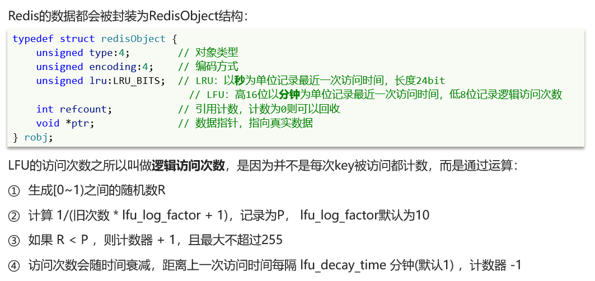

### 内存淘汰的执行时间

Redis的内存淘汰是在**每次执行命令时处理**的,如果每次执行命令都先对全量数据做内存排序,那命令的执行时长肯定会非常长,这是不现实的

因此Redis采取的是抽样法,即每次抽样一定数量(maxmemory_smples)的key,然后基于内存策略做排序,找出淘汰优先级最高的,删除这个key

这就导致Redis的算法并不是真正的LRU,而是一种基于抽样的近似LRU算法

不过,在Redis3.0以后改进了这个算法,引入了一个淘汰候选池,抽样的key要与候选池中的key比较淘汰优先级,优先级更高的才会被放入候选池

然后在候选池中找出优先级最高的淘汰掉,这就使算法的结果更接近与真正的LRU算法了,特别是在抽样值较高的情况下(例如10),可以达到与真正的LRU接近的效果

# 缓存

## 缓存一致性

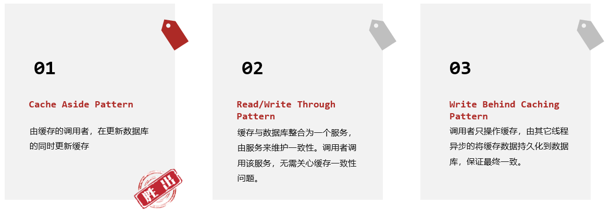

- Cache Aside:有缓存调用者自己维护数据库与缓存的一致性
  - 查询时:命中则直接返回,未命中则查询数据库并写入缓存
  - 更新时:更新数据库并删除缓存,查询时自然会更新缓存

- Read/Write Through:数据库自己维护一份缓存,底层实现对调用者透明
  - 查询时:命中则直接返回,未命中则查询数据库并写入缓存
  - 更新时:判断缓存是否存在,不存在直接更新数据库。存在则更新缓存,同步更新数据库

- Write Behind Cahing:读写操作都直接操作缓存,由线程异步的将缓存数据同步到数据库

### 主动更新-Cache Aside Pattern

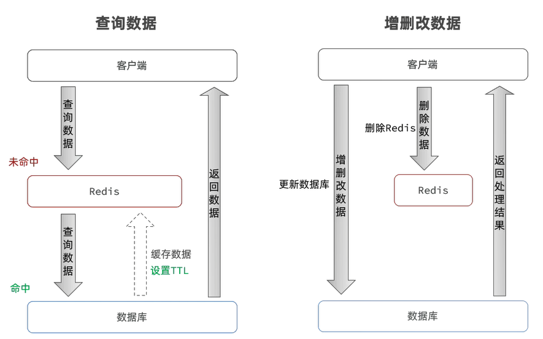

缓存更新策略的最佳实践方案:
- 低一致性需求:使用Redis自带的内存淘汰机制,例如商品分类、菜品分类等很长时间不变的数据信息
- 高一致性需求:主动更新,并以超时剔除作为兜底方案,例如商品、菜品查询的缓存
    - 读操作
        缓存命中则直接返回
        缓存未命中则查询数据库,并写入缓存,设定超时时间
    - 写操作
        先写数据库,然后再删除缓存
        要确保数据库与缓存操作的原子性

## 缓存穿透

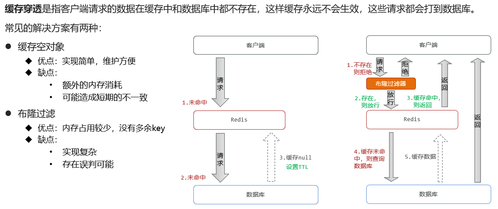

缓存穿透的解决方案有哪些?
- 缓存null值
- 布隆过滤器
- 做好数据的基础格式校验
- 加强用户权限校验
- 做好热点参数的限流

### 布隆过滤器

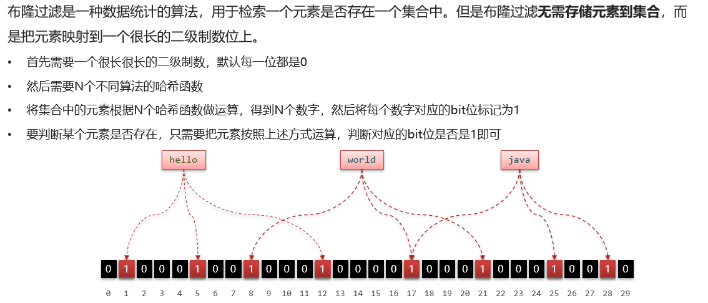

## 缓存雪崩

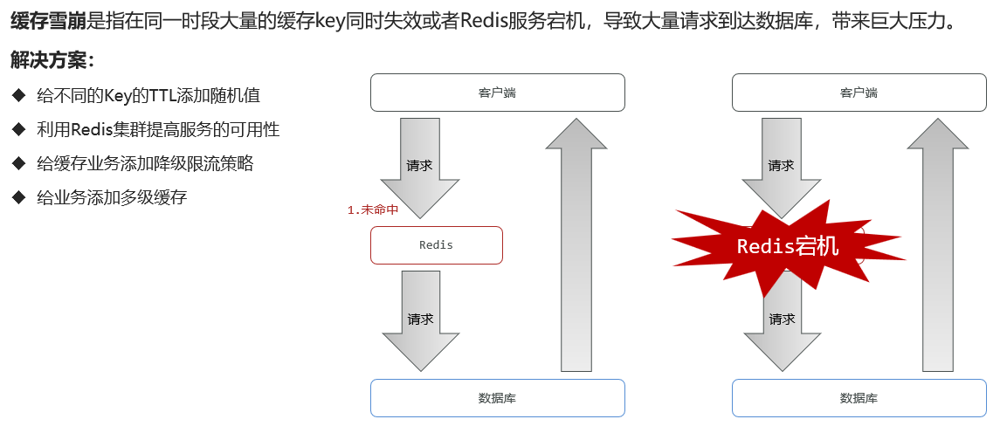

给业务添加多级缓存,比如先查询本地缓存,本地缓存未命中再查询Redis,Redis未命中再查询数据库,即便Redis宕机,也还有本地缓存可以抗压力

## 缓存击穿

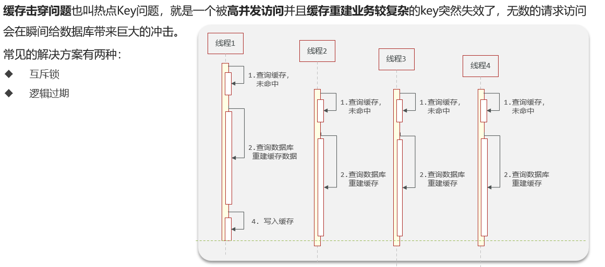

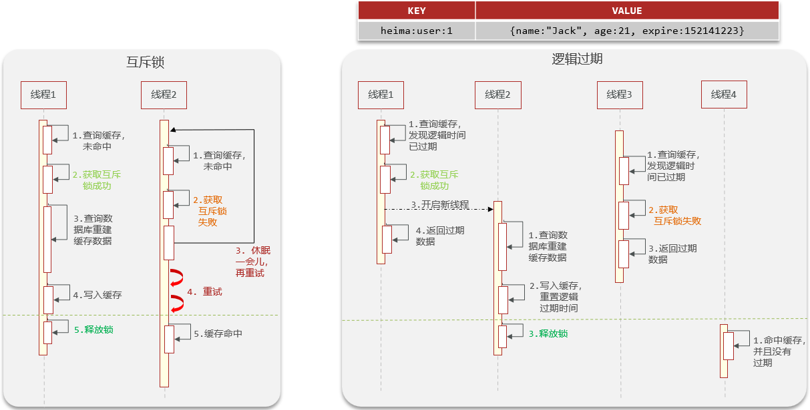

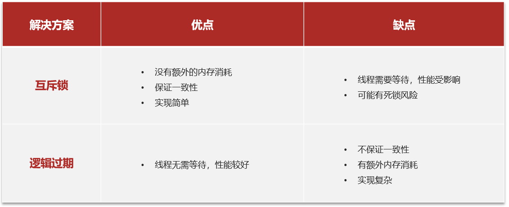

## 面试题总结

### 如何保证缓存的双写一致性?

缓存的双写一致性很难保证强一致,只能尽可能降低不一致的概率,确保最终一致

采用的是Cache Aside模式,简单来说,就是在更新数据库之后删除缓存;在查询时先查询缓存,如果未命中则查询数据库并写入缓存

同时给缓存设置过期时间作为兜底方案,如果真的出现了不一致的情况,也可以通过缓存过期来保证最终一致

追问:为什么不采用延迟双删机制?

延迟双删的第一次删除并没有实际意义,第二次采用延迟删除主要是解决数据库主从同步的延迟问题,这是数据库主从的一致性问题,与缓存同步无关

既然主节点数据已经更新,Redis的缓存理应更新,而且延迟双删会增加缓存业务复杂度,也没能完全避免缓存一致性问题,投入回报比太低

### 如何解决缓存穿透问题?

缓存穿透也可以说是穿透攻击,具体来说是因为请求访问到了数据库不存在的值,这样缓存无法命中,必然访问数据库

如果高并发的访问这样的接口,会给数据库带来巨大压力

可以基于布隆过滤器来解决缓存穿透问题的,当缓存未命中时基于布隆过滤器判断数据是否存在,如果不存在则不去访问数据库

当然,也可以使用缓存空值的方式解决,不过这种方案比较浪费内存

### 如何解决缓存雪崩问题?

缓存雪崩的常见原因有两个,第一原因是因为大量key同时过期,针对这个问题,可以给缓存key设置不同的TTL值,避免key同时过期

第二个原因是Redis宕机导致缓存不可用,针对这个问题,可以利用集群提高Redis的可用性,也可以添加多级缓存,当Redis宕机时还有本地缓存可用

### 如何解决缓存击穿问题?

缓存击穿往往是由热点Key引起的,当热点Key过期时,大量请求涌入同时查询,发现缓存未命中都会去访问数据库,导致数据库压力激增

解决这个问题的主要思路就是避免多线程并发去重建缓存,因此方案有两种

第一种是基于互斥锁,当发现缓存未命中时需要先获取互斥锁,再重建缓存,缓存重建完成释放锁,这样就可以保证缓存重建同一时刻只会有一个线程执行.不过这种做法会导致缓存重建时性能下降严重

第二种是基于逻辑过期,也就是不给热点Key设置过期时间,而是给数据添加一个过期时间的字段,这样热点Key就不会过期,缓存中永远有数据

查询到数据时基于其中的过期时间判断key是否过期,如果过期开启独立新线程异步的重建缓存,而查询请求先返回旧数据即可

当然,这个过程也要加互斥锁,但由于重建缓存是异步的,而且获取锁失败也无需等待,而是返回旧数据,这样性能几乎不受影响

需要注意的是,无论是采用哪种方式,在获取互斥锁后一定要再次判断缓存是否命中,因为当获取锁成功时,可能是在之前有其它线程已经重建缓存了