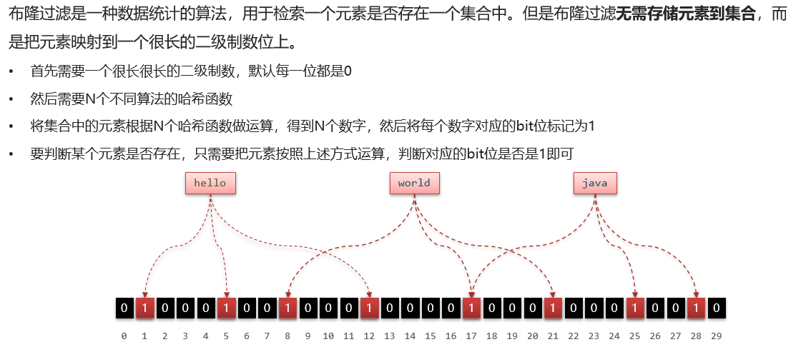
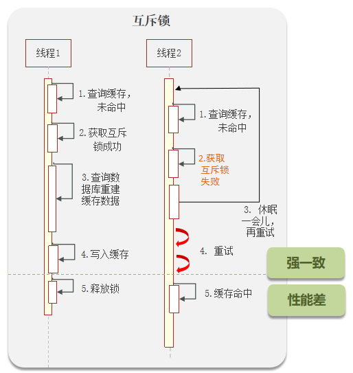

# 缓存穿透

**缓存穿透是指请求查询一个不存在的数据,由于数据不存在,也就没有写入缓存,缓存没有命中,导致请求直接查询数据库,每次都这样查询,会造成数据库压力过大**

一般这种情况是就是被恶意攻击了

解决方案:

保底策略:给缓存业务添加降级限流策略

1. 查询返回空值


如果查询数据库,数据不存在,就返回空值给redis缓存起来

该解决方案的优点:简单

缺点是消耗内存,而且可能会出现数据不一致的情况,比如缓存的数据是空值,但是此时有新的数据写入数据库,这样缓存中的空值和数据库中的实际值就不一致

2. 在查询缓存之前先查询布隆过滤器


查询缓存之前,先查询布隆过滤器,如果布隆过滤器中没有,直接返回空值,如果有,再查询缓存

## 什么是布隆过滤器?

**布隆过滤器主要用来查询一个元素在不在一个集合中**



布隆过滤器的底层原理:

1. 位数组初始化:先初始化一个比较大的数组,里面存放二进制1和0,一开始全部都是0

2. 元素插入:当存入一个key之后,就根据key进行几次hash函数计算,映射这几次hash值对应的数组位置,将数组位置设置为1,使用多个hash函数是为了确保元素能均匀地分布到位数组中

3. 元素查询:那每次判断一个元素在不在一个集合中,就判断那些hash值对应的数组位置是否为1,如果都为1,就可能在集合中,如果有一个为0,那肯定不在集合中

布隆过滤器的三大特性:

- 误判率:布隆过滤器的一个重要特性是它允许一定比例的误判,即可能错误地报告一个实际上不存在的元素存在于集合中
这种误判是由于位数组的重叠标记造成的,而且误判率随着位数组的大小、hash函数的数量和插入元素的数量而变化

- 无误漏报:布隆过滤器永远不会误报一个元素不存在,这意味着如果它说一个元素不存在,那么该元素确实不在集合中

- 不可删除性:一旦一个元素被添加到布隆过滤器中,它不能被移除,这是因为任何尝试清除一个元素的操作都可能影响其他元素的查询结果,因为这些位置可能也被其他元素的hash值所共享

### 使用Guava库提供的布隆过滤器来实现

```xml
<dependency>
    <groupId>com.google.guava</groupId>
    <artifactId>guava</artifactId>
    <version>30.1.1-jre</version>
</dependency>
```

```java
import com.google.common.hash.BloomFilter;
import com.google.common.hash.Funnels;
import org.springframework.boot.SpringApplication;
import org.springframework.boot.autoconfigure.SpringBootApplication;

import javax.annotation.PostConstruct;

@SpringBootApplication
public class BloomFilterApplication {

    private BloomFilter<Integer> bloomFilter;

    public static void main(String[] args) {
        SpringApplication.run(BloomFilterApplication.class, args);
    }

    @PostConstruct // 用于在Spring Bean的初始化完成后执行init方法
    public void init() {
        // 创建一个布隆过滤器,预计存储1000个整数,误判率为0.01
        bloomFilter = BloomFilter.create(Funnels.integerFunnel(), 1000, 0.01);

        // 通过循环向布隆过滤器中添加一些数据
        for (int i = 0; i < 1000; i++) {
            bloomFilter.put(i);
        }
    }

    // 提供mightContain方法检查元素是否可能存在于布隆过滤器中
    public boolean mightContain(int value) {
        return bloomFilter.mightContain(value);
    }
}
```

# 缓存击穿


**缓存击穿指的是对于设置了过期时间的key,在过期的时间点有大量的并发请求过来,这些请求发现缓存过期后会先去DB查询数据并重写缓存,这些大量的并发请求可能会使数据库崩溃**

缓存击穿问题也叫热点key问题,就是一个被高并发访问并且缓存重建业务较复杂的key突然失效了,无数的请求访问会在瞬间给数据库造成巨大的冲击

保底策略:给缓存业务添加降级限流策略

解决方案:

1. 添加互斥锁



当缓存的key过期了,线程会使用Redis的setExNx去设置一个互斥锁,如果线程拿锁成功,就去查询DB并重写缓存,之后释放锁,如果线程拿锁失败,就等待锁释放后重试

例如,线程1查询缓存未命中,这时它会去获取互斥锁,然后查询数据库获取结果并将结果写入缓存中,最后释放锁,而在线程1释放锁之前,其它线程都不能获取锁,只能睡眠一段时间后重试,如果能命中缓存,则返回数据,否则继续尝试获取互斥锁

该解决方案的优点:没有额外的内存消耗、保证强一致性、实现简单

缺点是线程需要等待,性能受到影响,而且可能有死锁的风险(一个方法里有多个查询操作,另一个方法也有多个重合的查询操作)

2. 设置当前key逻辑过期


例如,线程1到来之后发现逻辑过期,于是获取互斥锁,再开启一个新线程,线程2去进行缓存重建,当线程3到来时,发现缓存已过期,尝试获取互斥锁也失败,但是此时不进行等待重试,而是直接返回过期数据,之后线程1成功缓存数据释放互斥锁,线程4继续来访,发现命中缓存并且没有过期,返回重建数据

该解决方案的优点:高可用性,性能比较高

缺点是无法保证强一致性、实现复杂,有额外的内存消耗(同时缓存了逻辑过期时间的字段)

## 通过setExNx(互斥锁)实现分布式锁

基本使用流程如下：

1. 创建锁:在Redis中使用SETNX命令尝试设置一个键值对,其中键表示锁的名称,值可以是任意唯一标识符(例如客户端ID或随机生成的唯一字符串)                          
    如果SETNX命令返回1,表示成功设置了键值对,即锁创建成功,此时,该客户端获得了该锁
    如果SETNX命令返回0,表示该锁已经被其他客户端占用,锁创建失败

2. 释放锁:客户端在完成任务后,使用DEL命令删除对应的锁键,释放锁资源

3. 锁的过期时间:为了防止某个客户端在获取锁后发生故障或崩溃,导致锁无法被释放,可以设置锁的过期时间,可以在创建锁时使用SETNX命令同时设置一个过期时间

通过lua脚本+redis可以实现分布式锁

- 加锁原子性:通过redis自身的setnxex命令即可,`setIfAbsent(“lockKey”, value, timeOut, TimeUnit);`
- 解锁原子性:通过redis+lua脚本实现

定义一个lua脚本(位置Resource/lua/redisLock.lua):

```lua
if redis.call('get',KEYS[1]) == ARGV[1] then
     redis.call('del', KEYS[1])
     return '1';
else
    return '0'
end
```

Lua脚本配置:

```java
import org.springframework.context.annotation.Configuration;
import org.springframework.core.io.ClassPathResource;
import org.springframework.data.redis.core.StringRedisTemplate;
import org.springframework.data.redis.core.script.DefaultRedisScript;
import org.springframework.scripting.support.ResourceScriptSource;

import javax.annotation.Resource;
import java.util.Collections;
import java.util.List;

@Configuration
public class RedisLuaConfig {
    @Resource
    private StringRedisTemplate stringRedisTemplate;

    /**
     * @return result 返回1表示,正常,0表示限制访问
     */
    public boolean runLuaScript(String lockKey, String value) {
        List<String> keyList = Collections.singletonList(lockKey);

        // 执行脚本 删除锁
        DefaultRedisScript<String> redisScript = new DefaultRedisScript<>();
        redisScript.setScriptSource(new ResourceScriptSource(new ClassPathResource("lua/redisLock.lua")));
        redisScript.setResultType(String.class);
        String execute = stringRedisTemplate.execute(redisScript, keyList, value);
        return "1".equals(execute);
    }
}
```

Lock锁配置:

```java
@Component
public class RedisLockServer {

    @Resource
    private StringRedisTemplate stringRedisTemplate;

    @Resource
    private RedisLuaConfig redisLuaConfig;

    // 加锁
    public boolean setLock(String lockKey, String value, long time, TimeUnit timeUnit) {
        return stringRedisTemplate.opsForValue().setIfAbsent(lockKey, value, time, timeUnit);
    }

    // 释放锁
    public void deleteLock(String lockKey, String value) {
        boolean script = redisLuaConfig.runLuaScript(lockKey, value);
    }
}
```

逻辑代码实现:

```java
@RestController
@RequestMapping("/redis")
public class Test {
    @Resource
    private RedisLockServer redisLockServer;

    @RequestMapping(value = "/lock")
    public String reduceSku() throws Exception {
        String value = UUID.randomUUID().toString();
        // value值任意即可,设置自动过期时间为10S
        boolean lock = redisLockServer.setLock("key", value, 10, TimeUnit.SECONDS);
        if (lock) {
            // 当前key没有锁,加锁成功 执行数据库查询
            System.out.println("===>>>加锁成功");

            // 模拟耗时8S
            TimeUnit.SECONDS.sleep(8);

            // 所以要保证验证value值和验证成功必须满足原子性,通过redis+lua实现
            redisLockServer.deleteLock("key", value);
        } else {
            // 当前key已经存在锁,加锁失败
            System.out.println("===>>>加锁失败,等待重试...");
        }
        return "操作成功";
    }
}
```

## 通过逻辑过期解决缓存击穿问题

为了使整个系统具有可拓展性,应该新建一个类来填充要存入redis的数据:

```java
@Data
public class RedisData {
    private LocalDateTime expireTime;
    private Object data;
}
```

开启独立线程去重建缓存,创建一个新的线程池:

```java
private static final ExecutorService CACHE_REBUILD_EXECUTOR = Executors.newFixedThreadPool(10);
```

缓存重建:缓存重建就是直接查询数据库,将查询到的数据缓存到redis中:

```java
public void saveShop2Redis(Long id, Long expireSeconds) throws InterruptedException {
    //1.查询店铺数据
    Shop shop = getById(id);
    //2.封装逻辑过期时间
    RedisData redisData = new RedisData();
    redisData.setData(shop);
    //设置逻辑过期时间
    redisData.setExpireTime(LocalDateTime.now().plusSeconds(expireSeconds));
    stringRedisTemplate.opsForValue().set(CACHE_SHOP_KEY + id, JSONUtil.toJsonStr(redisData));
}
```

编写业务方法并调用缓存击穿方法:

```java
@Override
public Result queryById(Long id) {
    //逻辑过期解决 缓存击穿
    Shop shop = queryWithLogicalExpire(id);
    if (shop == null) {
        return Result.fail("店铺不存在！");
    }
    return Result.ok(shop);
}

public Shop queryWithLogicalExpire(Long id) {
    //1.从redis查询商铺缓存
    String key = CACHE_SHOP_KEY + id;
    String shopJson = stringRedisTemplate.opsForValue().get(key);
    //2.判断是否存在
    if (StrUtil.isBlank(shopJson)) {
        //未命中,直接返回空
        return null;
    }
    //3.命中,判断是否过期
    RedisData redisData = JSONUtil.toBean(shopJson, RedisData.class);
    Shop cacheShop = JSONUtil.toBean((JSONObject) redisData.getData(), Shop.class);
    if (redisData.getExpireTime().isAfter(LocalDateTime.now())) {
        //3.1未过期,直接返回店铺信息
        return cacheShop;
    }
    //3.2.已过期,缓存重建
    //3.3.获取锁
    String lockKey = LOCK_SHOP_KEY + id;
    boolean flag = tryLock(lockKey);
    if (flag) {
        //3.4.获取成功
        //4再次检查redis缓存是否过期,做double check
        shopJson = stringRedisTemplate.opsForValue().get(key);
        //4.1.判断是否存在
        if (StrUtil.isBlank(shopJson)) {
            //未命中,直接返回空
            return null;
        }
        //4.2.命中,判断是否过期
        redisData = JSONUtil.toBean(shopJson, RedisData.class);
        cacheShop = JSONUtil.toBean((JSONObject) redisData.getData(), Shop.class);
        if (redisData.getExpireTime().isAfter(LocalDateTime.now())) {
            //4.3.未过期,直接返回店铺信息
            return cacheShop;
        }
        CACHE_REBUILD_EXECUTOR.submit(() -> {
            //5.重建缓存
            try {
                this.saveShop2Redis(id, 20L);
            } catch (Exception e) {
                throw new RuntimeException(e);
            } finally {
                //释放锁
                unLock(lockKey);
            }
        });
    }
    //7.获取失败,返回旧数据
    return cacheShop;
}
```

# 缓存雪崩

**缓存雪崩指的是同一时段大量的缓存key同时失效或者Redis的服务宕机,导致大量并发请求访问DB,DB压力过大,影响正常业务**

缓存雪崩与缓存击穿的区别:缓存击穿是某一个key失效,缓存雪崩是很多key失效

保底策略:给缓存业务添加降级限流策略

解决方案:
- 给不同的Key的过期时间TTL添加随机值
- 利用Redis集群提高服务的可用性,比如哨兵模式、集群模式
- 给缓存业务添加降级限流策略
- 给业务添加多级缓存

# 双写一致性

**双写一致性指的是数据库与缓存的数据一致**

缓存的双写一致性很难保证强一致,只能尽可能降低不一致的概率,确保最终一致

如果采用Cache Aside模式,简单来说,就是在更新数据库之后删除缓存;在查询时先查询缓存,如果未命中则查询数据库并写入缓存

同时给缓存设置过期时间作为兜底方案,如果真的出现了不一致的情况,也可以通过缓存过期来保证最终一致

## 强一致性,但性能低


共享锁(基于Redisson的readLock):加锁之后,其他线程可以共享读操作


排他锁(基于Redisson的writeLock),也叫独占锁:加锁之后,阻塞其他线程的读写操作


- 在读数据的时候添加共享锁,可以保证读读不互斥,读写互斥
- 在更新数据的时候,添加排他锁,它是读写,读读都互斥,这样就能保证在写数据的同时,不让其他线程读数据,避免了脏数据的产生

细节:**读方法和写方法上需要使用同一把锁才行**

### 延迟双删

延迟双删,如果是写操作,我们先把缓存中的数据删除,然后更新数据库,最后再延时删除缓存中的数据,其中这个延时多久不太好确定,在延时的过程中可能会出现脏数据,并不能保证强一致性

延迟双删的第一次删除并没有实际意义,第二次采用延迟删除主要是解决数据库主从同步的延迟问题,这是数据库主从的一致性问题,与缓存同步无关

既然主节点数据已经更新,Redis的缓存理应更新,而且延迟双删会增加缓存业务复杂度,也没能完全避免缓存一致性问题,投入回报比太低

## 短暂的不一致

采用异步通知的数据同步可以有一定的延时

#### MQ的异步通知


#### 基于Canal的异步通知


# 持久化


