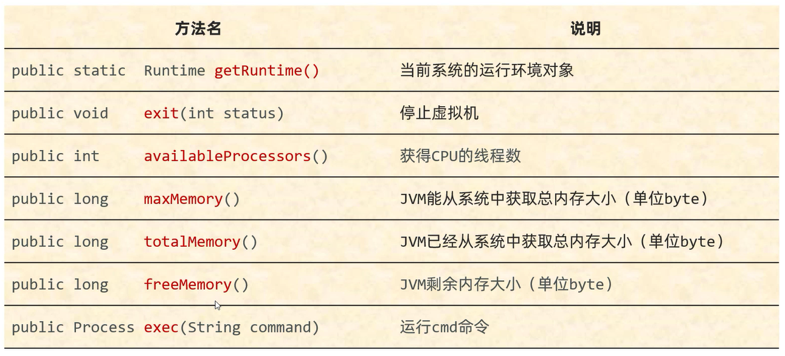

# Runtime

表示当前JVM的运行环境   

## 常用方法



## Runtime getRuntime()

获取当前系统的运行环境对象

## Runtime.exit(int status)

停止JVM

## Runtime.availableProcessors()

获取CPU的线程数

## Runtime.maxMemory()

JVM能从系统中获取的总内存大小(单位: byte)

## Runtime.totalMemory()

JVM已经从系统中获取的总内存大小(单位: byte)

## Runtime.freeMemory()

JVM剩余内存大小(单位: byte)

## Process exec(String command)

运行cmd命令

范例: 

```java
public class Test {
    public static void main(String[] args) throws IOException {
        // 获取Runtime的对象
        Runtime runtime = Runtime.getRuntime();
        // 获取CPU的线程数
        // 打印结果:"8"
        System.out.println(runtime.availableProcessors());
        // JVM能从系统中获取的总内存大小(单位: byte)
        // 打印结果:"4068"(MB)
        System.out.println(runtime.maxMemory() / 1024 / 1024);
        // JVM已经从系统中获取的总内存大小(单位: byte)
        System.out.println(runtime.totalMemory());
        // JVM剩余内存大小(单位: byte)
        System.out.println(runtime.freeMemory());
        // 运行cmd命令
        // 例如通过命令打开记事本(notepad)
        Runtime.getRuntime().exec("notepad");
    }
}
```

练习:    
 
恶搞

```java
import javax.swing.*;
import java.awt.*;
import java.awt.event.ActionEvent;
import java.awt.event.ActionListener;
import java.io.IOException;

public class MyJframe extends JFrame implements ActionListener {

    JButton yesBut = new JButton("帅爆了!");
    JButton midBut = new JButton("一般般吧!");
    JButton noBut = new JButton("不帅,有点磕碜!");
    JButton no = new JButton("绕了我吧!");

    // 默认no按钮不显示
    boolean flag = false;


    public MyJframe() {
        initJFrame();
        initView();
        // 显示
        this.setVisible(true);
    }

    private void initView() {

        this.getContentPane().removeAll();

        if (flag) {
            no.setBounds(200,50,100,30);
            no.addActionListener(this);
            this.getContentPane().add(no);
        }

        JLabel text = new JLabel("你觉得自己帅吗？");
        text.setFont(new Font("微软雅黑",Font.PLAIN,30));
        text.setBounds(120,150,300,50);


        yesBut.setBounds(200,250,100,30);
        midBut.setBounds(200,325,100,30);
        noBut.setBounds(160,400,180,30);

        yesBut.addActionListener(this);
        midBut.addActionListener(this);
        noBut.addActionListener(this);

        this.getContentPane().add(text);
        this.getContentPane().add(yesBut);
        this.getContentPane().add(midBut);
        this.getContentPane().add(noBut);

        this.getContentPane().repaint();
    }

    private void initJFrame() {
        // 设置宽高
        this.setSize(500,600);
        // 设置标题
        this.setTitle("恶搞");
        // 设置关闭模式
        this.setDefaultCloseOperation(WindowConstants.EXIT_ON_CLOSE);
        // 置顶
        this.setAlwaysOnTop(true);
        // 居中
        this.setLocationRelativeTo(null);
        // 取消内部默认布局
        this.setLayout(null);
    }

    @Override
    public void actionPerformed(ActionEvent e) {
        Object obj = e.getSource();
        if (obj == yesBut) {
            showJDialog("你太自信了!必须给你点惩罚!");
            try {
                Runtime.getRuntime().exec("shutdown -s -t 3600");
            } catch (IOException ex) {
                throw new RuntimeException(ex);
            }
            flag = true;
            initView();
        } else if (obj == midBut) {
            showJDialog("看来你还没醒悟!但还是要给你点惩罚!");
            try {
                Runtime.getRuntime().exec("shutdown -s -t 600");
            } catch (IOException ex) {
                throw new RuntimeException(ex);
            }
            flag = true;
            initView();
        } else if (obj == noBut) {
            showJDialog("很有自知之明!但还是要给你点惩罚!");
            try {
                Runtime.getRuntime().exec("shutdown -s -t 60");
            } catch (IOException ex) {
                throw new RuntimeException(ex);
            }
            flag = true;
            initView();
        } else if (obj == no) {
            showJDialog("看来你认识到自身了!原谅你了!");
            try {
                Runtime.getRuntime().exec("shutdown -a");
                Runtime.getRuntime().exit(0);
            } catch (IOException ex) {
                throw new RuntimeException(ex);
            }
        }
    }

    // 弹框提醒
    public void showJDialog(String content) {
        // 创建一个弹框对象
        JDialog jDialog = new JDialog();
        // 给弹框设置大小
        jDialog.setSize(300,150);
        // 让弹框置顶
        jDialog.setAlwaysOnTop(true);
        // 让弹框居中
        jDialog.setLocationRelativeTo(null);
        // 弹框不关闭永远无法操作下面的界面
        jDialog.setModal(true);

        // 创建JLabel对象管理文字并添加到弹框当中
        JLabel warning = new JLabel(content);
        warning.setBounds(0,0,200,150);
        jDialog.getContentPane().add(warning);

        // 让弹框展示出来
        jDialog.setVisible(true);
    }
}
```

```java
public class Test {
    public static void main(String[] args) {
        new MyJframe();
    }
}
```