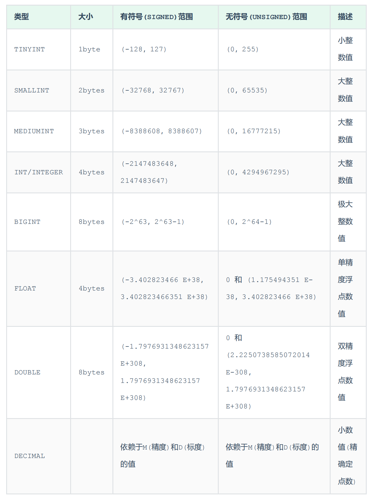
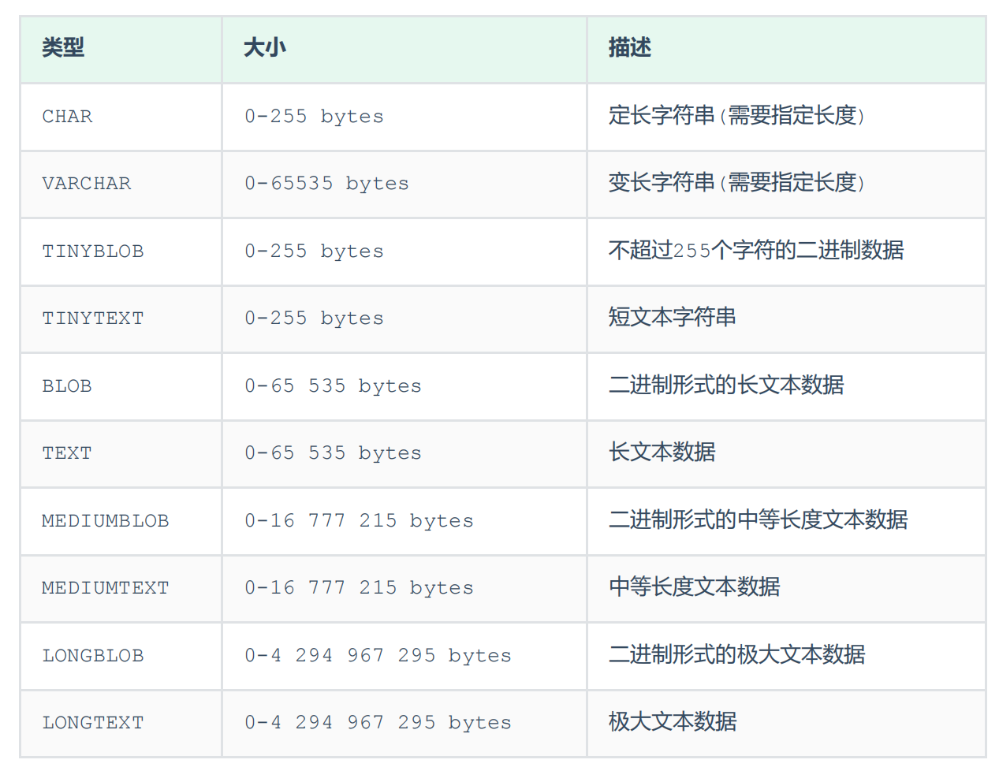
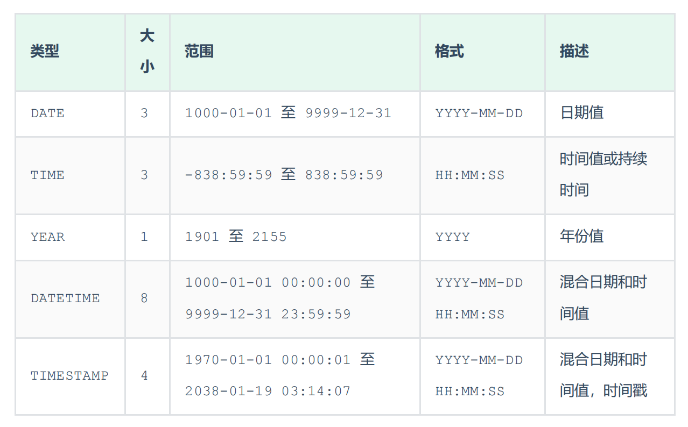

# DDL

DDL全称Data Definition Language(数据定义语言),用来定义数据库对象(数据库,表,字段)

# 数据库操作

1. `show databases;`:查询所有数据库                  
2. `select database();`:查询当前数据库
3. `create database [if not exists] 数据库名 [default charset 字符集] [collate 排序规则];`:创建数据库                  
数据库中默认字符集:`utf8mb4`
4. `drop database [if exists] 数据库名;`:删除数据库
5. `use 数据库名;`:切换数据库

# 表操作

## 查询表

1. `show tables;`:查询当前数据库所有表
2. `desc 表名;`:查询表结构
3. `show create table 表名;`:查询指定表的建表语句

## 创建表

```cmd
create table 表名(
字段1 字段1类型 [comment '字段1注释'],
字段2 字段2类型 [comment '字段2注释'],
字段3 字段3类型 [comment '字段3注释'],
......
字段n 字段n类型 [comment '字段n注释'] 
) [comment '表注释'];
```

## 数据类型

MySQL中的数据类型有很多,主要分为三类:数值类型、字符串类型、日期时间类型

### 数值类型



细节:                   
1. 精度和标度,例如:123.23的精度M为5,标度D为2           
2. `age - tinyint unsigned`:年龄为正数且一般情况下不会超过255
3. `score - double(4,1)`: 分数为0.0-100.0        

### 字符串类型



细节:
1. `char(10)`:当前字符串最多存储10个字符,定长即占10个字符空间,不足的用空格补位,性能较好
2. `varchar(20)`:当前字符串最多存储20个字符,变长即用几个字符就占几个字符空间,性能较差
3. `username - varchar(50)`:用户名用变长字符串,用户名长度不一
4. `gender - char(1)`:性别用定长字符串,要么男,要么女

### 日期时间类型



细节:`birthday - date`:生日用日期值就足够了

## 建表练习

设计一张员工信息表,要求如下：
1. 编号(纯数字)
2. 员工工号 (字符串类型,长度不超过10位)
3. 员工姓名(字符串类型,长度不超过10位)
4. 性别(男/女,存储一个汉字)
5. 年龄(正常人年龄,不可能存储负数)
6. 身份证号(二代身份证号均为18位,身份证中有X这样的字符)
7. 入职时间(取值年月日即可)

```cmd
create table tb_emp (
  id int comment '编号',
  empid varchar(10) comment '员工工号',
  name varchar(10) comment '姓名',
  gender char(1) comment '性别',
  age tinyint unsigned comment '年龄',
  idcard char(18) comment '身份证号',
  entrydate date comment '入职时间'
)  comment '用户表'; 
```

## 修改表

### 添加字段

`alter table 表名 add 字段名 类型(长度) [comment '注释'] [约束];`

### 修改字段类型

`alter table 表名 modify 字段名 新字段类型(长度);`

### 修改字段名和字段类型

`alter table 表名 change 旧字段名 新字段名 (新)字段类型(长度) [comment '注释'] [约束];`

### 删除字段

`alter table 表名 drop 字段名;`

### 修改表名

`alter table 表名 rename to 新表名;`

## 删除表

1. `drop table [if exists] 表名;`:删除表
2. `truncate table 表名;`:删除指定表,并重新创建该表(**清空数据,保留表结构**)