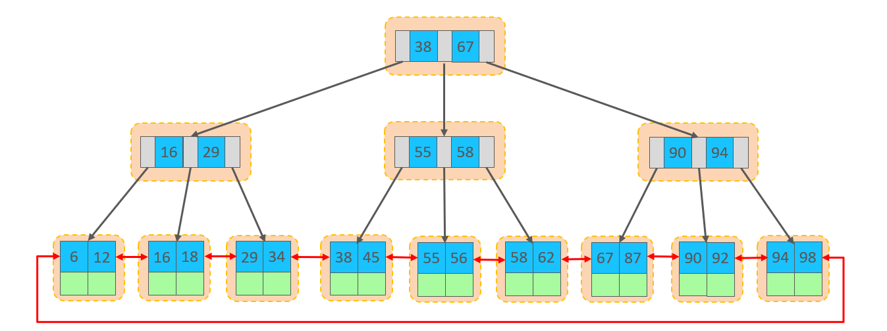
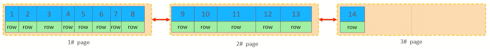
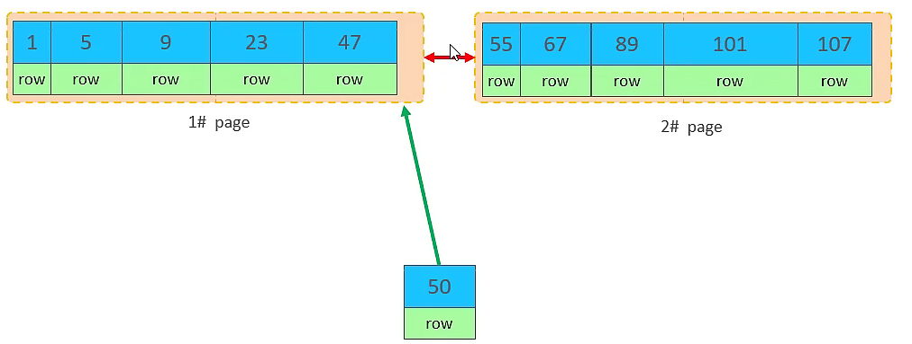
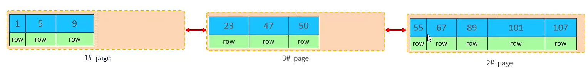
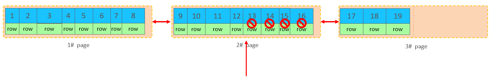
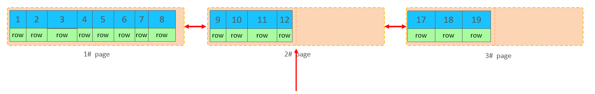
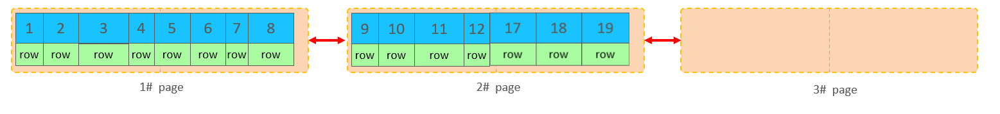
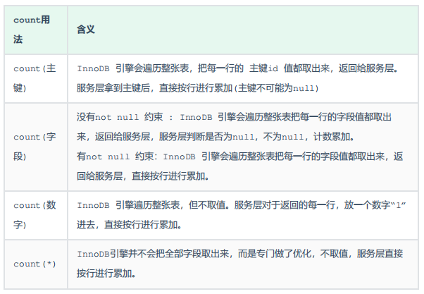

# 插入数据优化

## insert

1. 批量插入              
`insert into tb_test values(1,'Tom'),(2,'Cat'),(3,'Jerry');`

2. 手动控制事务

```sql
start transaction;
insert into tb_test values(1,'Tom'),(2,'Cat'),(3,'Jerry');
insert into tb_test values(4,'Tom'),(5,'Cat'),(6,'Jerry');
insert into tb_test values(7,'Tom'),(8,'Cat'),(9,'Jerry');
commit;
```

3. 主键顺序插入,性能要高于乱序插入

主键乱序插入:8 1 9 21 88 2 4 15 89 5 7 3                

主键顺序插入:1 2 3 4 5 7 8 9 15 21 88 89

## 大批量插入数据

如果一次性需要插入大批量数据(比如几百万的记录),使用insert语句插入性能较低,此时可以使用MySQL数据库提供的load指令进行插入         

```sql
# 客户端连接服务端时,加上参数--local-infile
mysql --local-infile -u root -p

# 查看全局参数local_infile
select @@local_infile;

# 设置全局参数local_infile为1,开启从本地加载文件导入数据的开关
set global local_infile = 1;

# 执行load指令将准备好的数据,加载到表结构中
load data local infile '/root/sql1.log' into table tb_user fields terminated by ',' lines terminated by '\n' ;
```

**在load时,主键顺序插入性能高于乱序插入**

# 主键优化

## 数据组织方式

在InnoDB存储引擎中,表数据都是根据主键顺序组织存放的,这种存储方式的表称为**索引组织表**(index organized table IOT)



行数据,都是存储在聚集索引的叶子节点上的     

InnoDB的逻辑结构图:


在InnoDB引擎中,数据行是记录在逻辑结构page页中的,而每一个页的大小是固定的,默认16K                       
那也就意味着,一个页中所存储的行也是有限的,如果插入的数据行row在该页存储不小,将会存储到下一个页中,页与页之间会通过指针连接

## 页分裂

页可以为空,也可以填充一半,也可以填充100%,每个页包含了2-N行数据(如果一行数据过大,会行溢出),根据主键排列

1. 主键顺序插入:



2. 主键乱序插入:

假如1#,2#页都已经写满了,存放了如图所示的数据,此时再插入id为50的记录,按照顺序,应该存储在47之后



但是47所在的1#页,已经写满了,存储不了50对应的数据了,那么此时会开辟一个新的页3#


但是并不会直接将50存入3#页,而是会将1#页后一半的数据,移动到3#页,然后在3#页,插入50


移动数据,并插入id为50的数据之后,那么此时,这三个页之间的数据顺序是有问题的                                                  
1#的下一个页应该是3#, 3#的下一个页是2#,所以此时需要重新设置链表指针



上述的这种现象,称之为**页分裂**,是比较耗费性能的操作

## 页合并

当删除一行记录时,实际上记录并没有被物理删除,只是记录被标记(flaged)为删除并且它的空间变得允许被其他记录声明使用


继续删除2#的数据记录



当页中删除的记录达到`MERGE_THRESHOLD`(默认为页的50%),InnoDB会开始寻找最靠近的页(前或后),看看是否可以将两个页合并以优化空间使用

**MERGE_THRESHOLD:合并页的阈值,可以自己设置,在创建表或者创建索引时指定**





删除数据,并将页合并之后,再次插入新的数据21,则直接插入3#页


这个里面所发生的合并页的这个现象,就称之为**页合并**

## 主键设计原则

1. 满足业务需求的情况下,尽量减少主键的长度
2. 插入数据时,尽量选择顺序插入,选择使用`auto_increment`自增主键
3. 尽量不要使用`UUID`(通用唯一识别码)做主键或者是其他自然主键,如身份证号
4. 业务操作时,避免对主键的修改

# order by优化

1. `Using filesort`           

通过表的索引或全表扫描,读取满足条件的数据行,然后在排序缓冲区sort buffer中完成排序操作      

所有不是通过索引直接返回排序结果的排序都叫FileSort排序               

2. `Using index`     

通过有序索引顺序扫描直接返回有序数据,这种情况即为Using index,不需要额外排序,操作效率高                        

对于以上的两种排序方式,Using index的性能高,而Using filesort的性能低,在优化排序操作时,**尽量要优化为Using index**                   

## order by优化原则

1. **根据排序字段建立合适的索引,多字段排序时,也遵循最左前缀法则**
2. **尽量使用覆盖索引**
3. **多字段排序,一个升序一个降序,此时需要注意联合索引在创建时的规则(ASC/DESC)**
4. **如果不可避免的出现filesort,大数据量排序时,可以适当增大排序缓冲区大小`sort_buffer_size`(默认256k)**

# group by优化

## group by优化原则

1. **在分组操作时,可以通过索引来提高效率**              
2. **分组操作时,索引的使用也是满足最左前缀法则的**           

# limit优化

在数据量比较大时,如果进行limit分页查询,在查询时,越往后,分页查询效率越低

## 优化思路

一般分页查询时,通过创建覆盖索引,能够比较好地提高性能,可以**通过覆盖索引 + 子查询形式进行优化**

# count优化

MyISAM引擎把一个表的总行数存在了磁盘上,因此执行count(*)的时候会直接返回这个数,效率很高           
但是如果是带条件的count,MyISAM引擎也慢

InnoDB引擎就麻烦了,它执行count(*)的时候,需要把数据一行一行地从引擎里面读出来,然后累积计数

## count用法

count()是一个聚合函数,对于返回的结果集,一行行地判断,如果count函数的参数不是null,累计值就加1,否则不加,最后返回累计值         



按照性能排序:`count(字段)`<`count(主键 id)`<`count(1)`≈`count(*)`,所以**尽量使用`count(*)`**

# update优化

## 优化思路

InnoDB的行锁是针对索引加的锁,不是针对记录加的锁,并且该索引不能失效,否则会从行锁升级为表锁

在update语句执行时,**一定要根据索引字段进行更新**