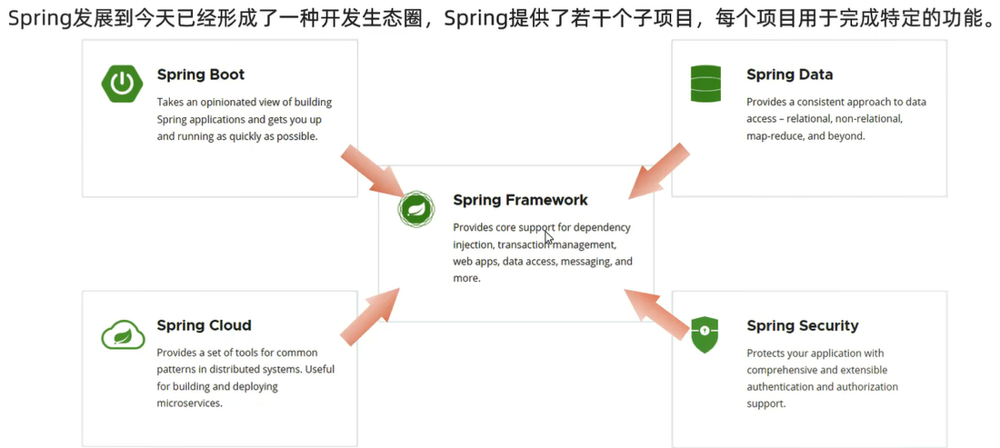
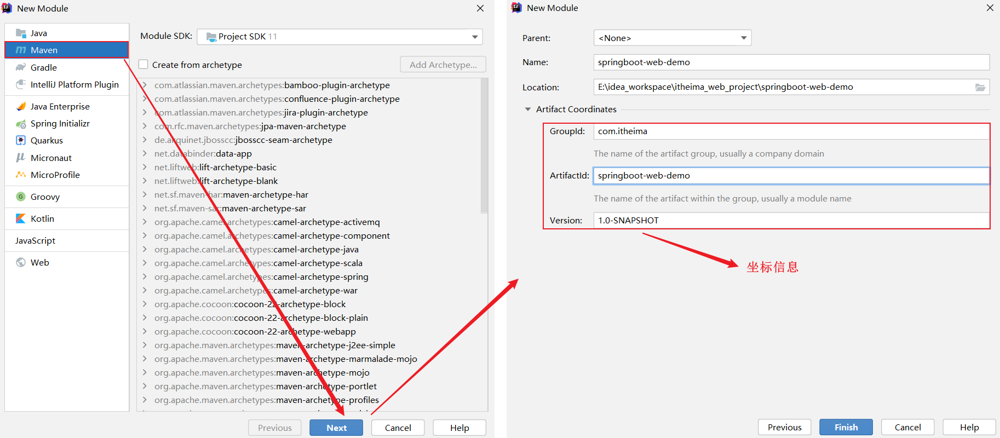
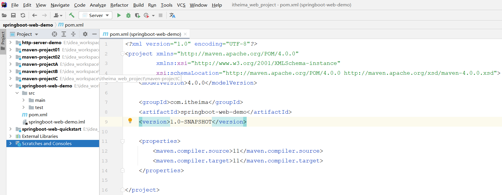

# Spring  

[Spring官方网站](https://spring.io)

[Spring官方模板](https://start.spring.io/)



Spring家族旗下这么多的技术,最基础、最核心的是SpringFramework               
其他的Spring家族的技术,都是基于SpringFramework的,SpringFramework中提供很多实用功能,如:依赖注入、事务管理、web开发支持、数据访问、消息服务等等         

# 快速入门


步骤:
1. 创建SpringBoot工程,并勾选web开发相关依赖
2. 定义HelloController类,添加方法hello(),并添加注解
3. 运行测试


```java
package com.jinzhao.controller;

import org.springframework.web.bind.annotation.RequestMapping;
import org.springframework.web.bind.annotation.RestController;

// 请求处理类
@RestController
public class HelloController {
    @RequestMapping("/hello")
    public String hello() {
        System.out.println("hello,world");
        return "hello,world";
    }
}
```

# 手动构建SpringBoot项目

## 创建maven项目

在IDEA中创建一个maven项目,正常填写项目的坐标信息,如下图所示:

 

输入项目的基本信息之后,点击finish,就可以创建一个maven项目

 

但是这个maven项目目前并不是springboot项目,还需要做如下两步操作

## pom.xml配置

1. 在pom.xml中指定springboot的父工程

```xml
<!--SpringBoot父工程-->
<parent>
    <groupId>org.springframework.boot</groupId>
    <artifactId>spring-boot-starter-parent</artifactId>
    <version>2.7.4</version>
    <relativePath/>
</parent>
```

2. 添加springboot项目的起步依赖以及maven插件

```xml
<dependencies>
    <dependency>
        <groupId>org.springframework.boot</groupId>
        <artifactId>spring-boot-starter-web</artifactId>
    </dependency>
	
    <dependency>
        <groupId>org.springframework.boot</groupId>
        <artifactId>spring-boot-starter-test</artifactId>
        <scope>test</scope>
    </dependency>
</dependencies>

<build>
    <plugins>
        <plugin>
            <groupId>org.springframework.boot</groupId>
            <artifactId>spring-boot-maven-plugin</artifactId>
        </plugin>
    </plugins>
</build>
```

## 基本结构

1. 创建基本的包结构com.jinzhao,并创建启动类SpringBootDemoApplication

2. 并在resources目录下准备一份配置文件,application.properties(创建一个新的file文件,命名为application.properties)

 

到此呢,就手动创建好了这样一个springboot项目