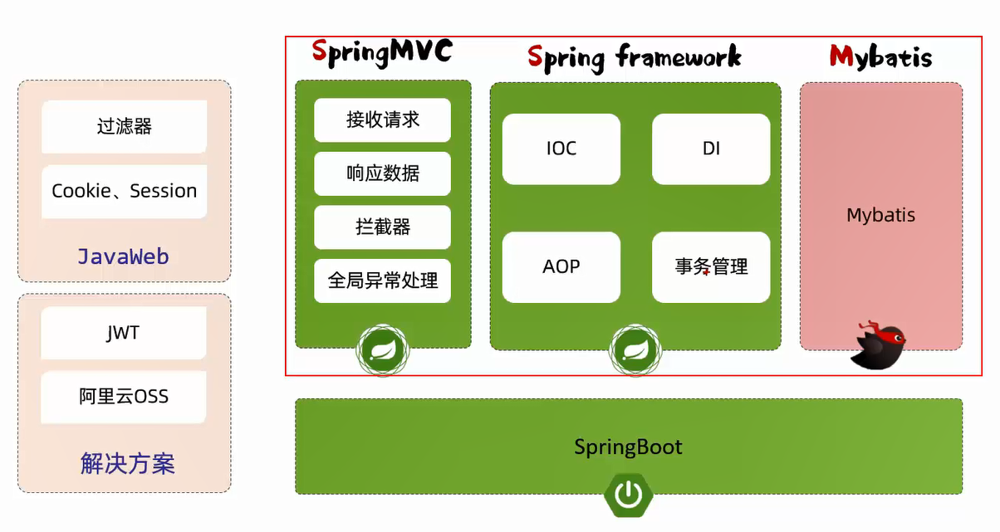
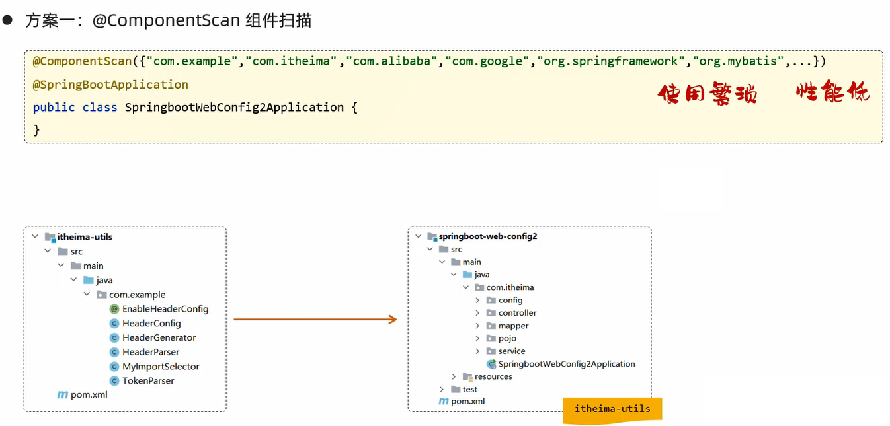
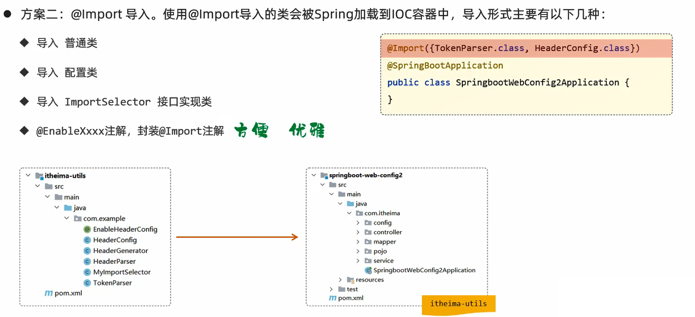
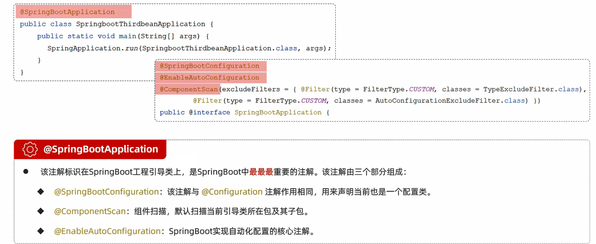
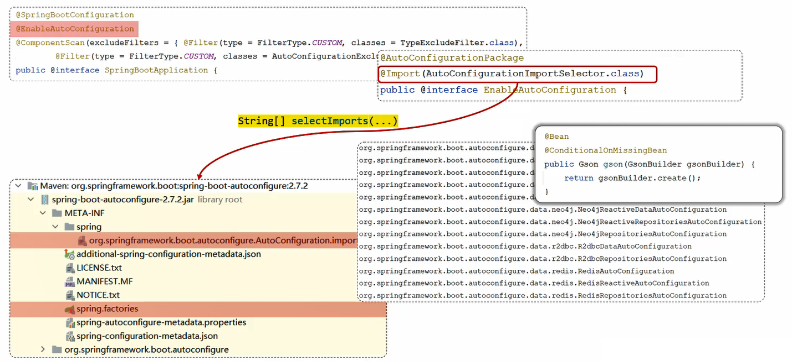
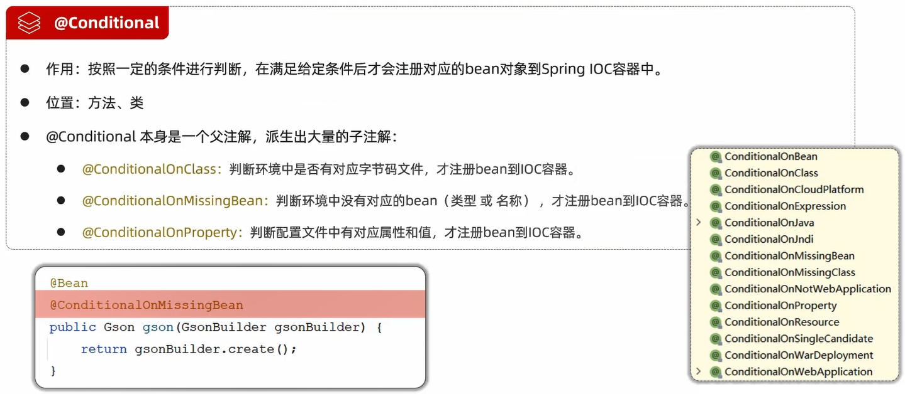

# SpringBoot原理

# 起步依赖

起步依赖:即Maven的依赖传递

# 自动配置

自动配置:当spring容器启动后,一些配置类、bean对象就自动存入到了IOC容器中,不需要再手动声明,从而简化了开发,省去了繁琐的配置操作

## 自动配置的原理

## 源码跟踪

SpringBoot会根据@Conditional注解进行条件装配

## @Conditonal

# 案例:自定义starter

在实际开发中,经常会定义一些公共组件,提供给各个项目团队使用,在SpringBoot的项目中,一般会将这些公共组件封装为SpringBoot的starter

案例需求:自定义aliyun-oss-spring-boot-starter,完成阿里云OSS操作工具类AliyunOSSUtils的自动配置

目标:引入起步依赖之后,注入AliyunOSSUtils即可直接使用阿里云OSS

步骤:
1. 创建aliyun-oss-spring-boot-starter模块
2. 创建aliyun-oss-spring-boot-autoconfigure模块,在starter中引入该模块
3. 在aliyun-oss-spring-boot-autoconfigure模块中定义自动配置功能,并定义自动配置文件META-INF/spring/xxxx.imports