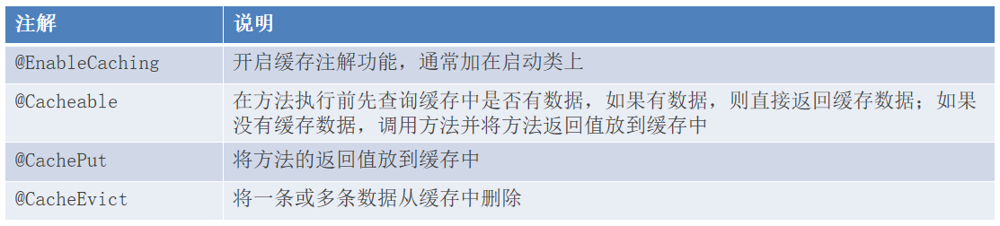

# SpringCache

SpringCache是一个框架,实现了基于**注解**的缓存功能,只需要简单地加一个注解,就能实现缓存功能

SpringCache提供了一层抽象,底层可以切换不同的缓存实现,例如:
- EHCache
- Caffeine
- Redis

# Maven依赖引入

```xml
<dependency>
    <groupId>org.springframework.boot</groupId>
    <artifactId>spring-boot-starter-cache</artifactId>
    <version>2.7.3</version>
</dependency>
```

# 常用注解



- `@Cacheable(cacheNames = "...",key = "...")`:在方法执行前先查询缓存中是否有数据,如果有数据,则直接返回缓存数据;如果没有缓存数据,调用方法并将方法返回值放到缓存中
- `@CachePut(cacheNames = "...",key = "...")`:将方法的返回值放到缓存中
- `@CacheEvict(cacheNames = "...", key = "...")`:将一条数据从缓存中删除
- `@CacheEvict(cacheNames = "...", allEntries = true)`:将所有数据从缓存中删除

# 注意事项

1. **如果使用SpringCache缓存数据,key的生成是cacheName::key**                 

例如`@CachePut(cacheNames = "userCache",key = "zhangsan")`缓存数据,生成的key是`userCache::zhangsan`

2. 通过**SpEL**(Spring Expression Language,Spring的表达式语言)可以生成动态的key

范例:

```java
@PostMapping
// @CachePut(cacheNames = "userCache",key = "#reuslt.id")
// @CachePut(cacheNames = "userCache",key = "#p0.id")
// @CachePut(cacheNames = "userCache",key = "#a0.id")
// @CachePut(cacheNames = "userCache",key = "#root.args[0].id")
@CachePut(cacheNames = "userCache",key = "#user.id")
public User save(@RequestBody User user){
    userMapper.insert(user);
    return user;
}
```

- `#user.id`:取得方法的参数user的id
- `#reuslt.id`:取得方法的返回对象user的id
- `#p0.id`:取得方法第1个参数的id
- `#a0.id`:取得方法第1个参数的id
- `#root.args[0].id`:取得方法第1个参数的id

其中`.`是对象导航