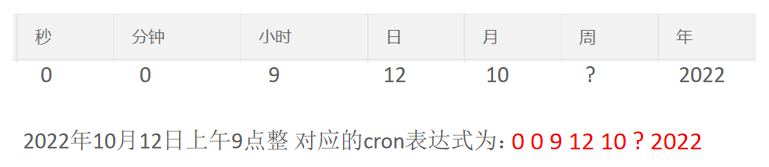

# SpringTask

Spring Task是Spring框架提供的任务调度工具,可以按照约定的时间自动执行某个代码逻辑

定位:定时任务框架

作用:定时自动执行某段Java代码

应用场景:
- 信用卡每月还款提醒
- 银行贷款每月还款提醒
- 火车票售票系统处理未支付订单
- 入职纪念日为用户发送通知

**只要是需要定时处理的场景都可以使用Spring Task**

# cron表达式

cron表达式其实就是一个字符串,通过cron表达式可以**定义任务触发的时间**

构成规则:分为6或7个域,由空格分隔开,每个域代表一个含义

每个域的含义分别为:秒、分钟、小时、日、月、周、年(可选)



[cron表达式在线生成器](https://cron.qqe2.com/)

# 使用步骤

1. 导入maven坐标spring-context(已存在)
2. 启动类添加注解`@EnableScheduling`开启任务调度
3. 自定义定时任务类

# 入门案例

```java
package com.sky.task;

import lombok.extern.slf4j.Slf4j;
import org.springframework.scheduling.annotation.Scheduled;
import org.springframework.stereotype.Component;

import java.util.Date;

@Component
@Slf4j
public class MyTask {
    @Scheduled(cron = "0/5 * * * * ? *")
    public void executeTask() {
        log.info("定时任务开始执行:{}", new Date());
    }
}
```