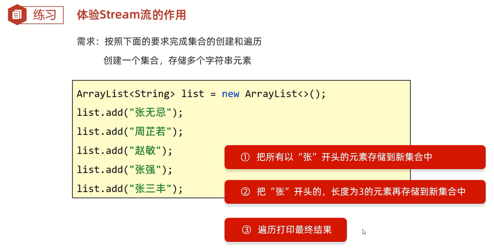
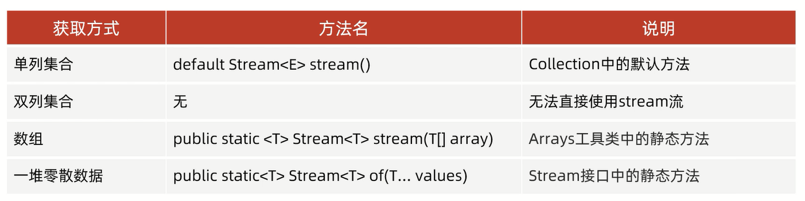

# Stream流

练习:



```java
import java.util.ArrayList;

public class Test {
    public static void main(String[] args) {
        ArrayList<String> list = new ArrayList<>();
        list.add("张无忌");
        list.add("周芷若");
        list.add("赵敏");
        list.add("张强");
        list.add("张三丰");
        ArrayList<String> zhangAllList = new ArrayList<>();
        ArrayList<String> zhang3List = new ArrayList<>();
        for (String name : list) {
            if (name.startsWith("张")) {
                zhangAllList.add(name);
            }
        }
        for (String name : zhangAllList) {
            if (name.length() == 3) {
                zhang3List.add(name);
            }
        }
        // 打印结果:"[张无忌, 张强, 张三丰]"
        System.out.println(zhangAllList);
        // 打印结果:"[张无忌, 张三丰]"
        System.out.println(zhang3List);

        // 打印结果:"张无忌 张强 张三丰"
        list.stream().filter(name -> name.startsWith("张")).forEach(name -> System.out.print(name + " "));
        System.out.println();
        // 打印结果:"张无忌 张三丰"
        list.stream().filter(name -> name.startsWith("张")).filter(name -> name.length() == 3).forEach(name -> System.out.print(name + " "));
    }
}
```

# 作用

Stream流结合了Lambda表达式,简化集合、数组的操作

# 使用步骤

1. 先得到一条Stream流(流水线),并把数据放上去
2. 使用中间方法(方法调用完毕之后,还可以调用其他方法)对流水线上的数据进行操作,例如过滤、转换        
3. 使用终结方法(最后一步:方法调用完毕之后,不能调用其他方法)对流水线上的数据进行操作,例如统计、打印    

## 获取流水线



### 单列集合

通过调用Collection中的默认方法获取Stream流

范例:

```java
import java.util.ArrayList;
import java.util.Collections;

public class Test {
    public static void main(String[] args) {
        ArrayList<String> list = new ArrayList<>();
        Collections.addAll(list, "张无忌", "张强", "张三丰", "赵敏", "周芷若");

        // 获取到一条流水线,并把集合中的数据放到流水线上
        // Stream<String> stream = list.stream();
        // 使用终结方法打印流水线上的数据
        // stream.forEach(new Consumer<String>() {
        //     @Override
        //     public void accept(String s) {
        //         System.out.println(s);
        //     }
        // });

        // 打印结果:"张无忌 张强 张三丰"
        list.stream().filter(name -> name.startsWith("张")).forEach(name -> System.out.print(name + " "));
    }
}
```

### 双列集合

1. 通过keySet方法获取键的集合,再获取Stream流
2. 通过entrySet方法获取键值对对象,再获取Stream流

范例:

```java
import java.util.HashMap;

public class Test {
    public static void main(String[] args) {
        HashMap<String, String> hashMap = new HashMap<>();
        hashMap.put("1", "A");
        hashMap.put("2", "B");
        hashMap.put("3", "C");

        // 获取到一条流水线,并把集合中的数据放到流水线上
        // Set<String> key = hashMap.keySet();
        // Stream<String> stream = key.stream();
        // 打印结果:"1 2 3"
        // stream.forEach(s -> System.out.print(s + " "));

        // 方法一:通过keySet方法获取键的集合,再获取Stream流
        // 打印结果:"1 2 3"
        hashMap.keySet().stream().forEach(s -> System.out.print(s + " "));
        System.out.println();

        // 方法二:通过entrySet方法获取键值对对象,再获取Stream流
        // 打印结果:"1=A 2=B 3=C"
        hashMap.entrySet().stream().forEach(s -> System.out.print(s + " "));
    }
}
```

### 数组

通过Arrays工具类中的静态方法stream获取Stream流

范例:

```java
import java.util.Arrays;

public class Test {
    public static void main(String[] args) {
        int[] arr1 = {1, 2, 3, 4, 5, 6};
        // 打印结果:"1 2 3 4 5 6"
        Arrays.stream(arr1).forEach(s -> System.out.print(s + " "));

        System.out.println();

        String[] arr2 = {"A", "B", "C", "D"};
        // 打印结果:"A B C D"
        Arrays.stream(arr2).forEach(s -> System.out.print(s + " "));
    }
}
```

### 一堆零散数据

通过Stream接口中的静态方法of获取Stream流

范例:

```java
import java.util.stream.Stream;

public class Test {
    public static void main(String[] args) {
        // 打印结果:"1 2 3 二 四"
        Stream.of(1, 2, 3, "二", "四").forEach(s -> System.out.print(s + " "));
    }
}
```

Stream接口中的静态方法of的细节:         
方法的形参是一个可变参数,可以传递一堆零散数据,也可以传递数组           
**但是数组必须是引用数据类型的,如果传递基本数据类型的,是会把整个数组当作以恶搞元素,放到Stream中**

## 中间方法


## 终结方法