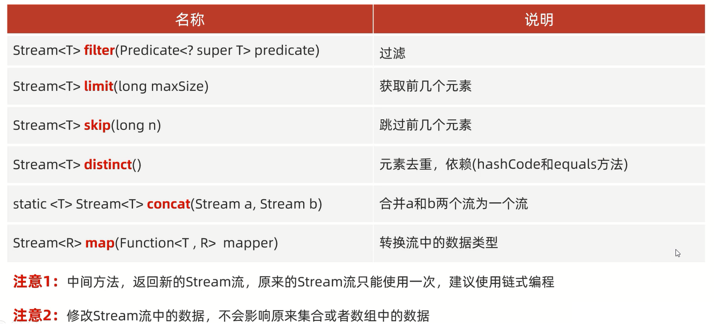
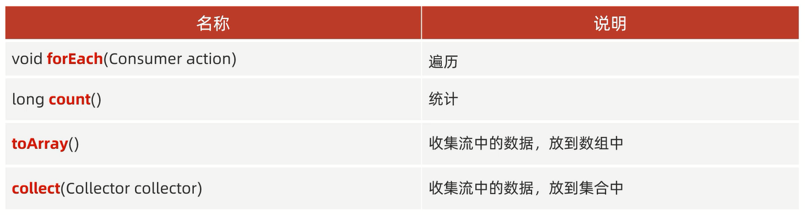

# Stream流

练习:


```java
import java.util.ArrayList;

public class Test {
    public static void main(String[] args) {
        ArrayList<String> list = new ArrayList<>();
        list.add("张无忌");
        list.add("周芷若");
        list.add("赵敏");
        list.add("张强");
        list.add("张三丰");
        ArrayList<String> zhangAllList = new ArrayList<>();
        ArrayList<String> zhang3List = new ArrayList<>();
        for (String name : list) {
            if (name.startsWith("张")) {
                zhangAllList.add(name);
            }
        }
        for (String name : zhangAllList) {
            if (name.length() == 3) {
                zhang3List.add(name);
            }
        }
        // 打印结果:"[张无忌, 张强, 张三丰]"
        System.out.println(zhangAllList);
        // 打印结果:"[张无忌, 张三丰]"
        System.out.println(zhang3List);

        // 打印结果:"张无忌 张强 张三丰"
        list.stream().filter(name -> name.startsWith("张"))
                .forEach(name -> System.out.print(name + " "));
        System.out.println();
        // 打印结果:"张无忌 张三丰"
        list.stream().filter(name -> name.startsWith("张"))
                .filter(name -> name.length() == 3)
                .forEach(name -> System.out.print(name + " "));
    }
}
```

# 作用

Stream流结合了Lambda表达式,简化集合、数组的操作

# 使用步骤

1. 先得到一条Stream流(流水线),并把数据放上去
2. 使用中间方法(方法调用完毕之后,还可以调用其他方法)对流水线上的数据进行操作,例如过滤、转换        
3. 使用终结方法(最后一步:方法调用完毕之后,不能调用其他方法)对流水线上的数据进行操作,例如统计、打印    

## 获取流水线


### 单列集合

通过调用Collection中的默认方法获取Stream流

范例:

```java
import java.util.ArrayList;
import java.util.Collections;

public class Test {
    public static void main(String[] args) {
        ArrayList<String> list = new ArrayList<>();
        Collections.addAll(list, "张无忌", "张强", "张三丰", "赵敏", "周芷若");

        // 获取到一条流水线,并把集合中的数据放到流水线上
        // Stream<String> stream = list.stream();
        // 使用终结方法打印流水线上的数据
        // stream.forEach(new Consumer<String>() {
        //     @Override
        //     public void accept(String s) {
        //         System.out.println(s);
        //     }
        // });

        // 打印结果:"张无忌 张强 张三丰"
        list.stream().filter(name -> name.startsWith("张"))
                .forEach(name -> System.out.print(name + " "));
    }
}
```

### 双列集合

1. 通过keySet方法获取键的集合,再获取Stream流
2. 通过entrySet方法获取键值对对象,再获取Stream流

范例:

```java
import java.util.HashMap;

public class Test {
    public static void main(String[] args) {
        HashMap<String, String> hashMap = new HashMap<>();
        hashMap.put("1", "A");
        hashMap.put("2", "B");
        hashMap.put("3", "C");

        // 获取到一条流水线,并把集合中的数据放到流水线上
        // Set<String> key = hashMap.keySet();
        // Stream<String> stream = key.stream();
        // 打印结果:"1 2 3"
        // stream.forEach(s -> System.out.print(s + " "));

        // 方法一:通过keySet方法获取键的集合,再获取Stream流
        // 打印结果:"1 2 3"
        hashMap.keySet().stream().forEach(s -> System.out.print(s + " "));
        System.out.println();

        // 方法二:通过entrySet方法获取键值对对象,再获取Stream流
        // 打印结果:"1=A 2=B 3=C"
        hashMap.entrySet().stream().forEach(s -> System.out.print(s + " "));
    }
}
```

### 数组

通过Arrays工具类中的静态方法stream获取Stream流

范例:

```java
import java.util.Arrays;

public class Test {
    public static void main(String[] args) {
        int[] arr1 = {1, 2, 3, 4, 5, 6};
        // 打印结果:"1 2 3 4 5 6"
        Arrays.stream(arr1).forEach(s -> System.out.print(s + " "));

        System.out.println();

        String[] arr2 = {"A", "B", "C", "D"};
        // 打印结果:"A B C D"
        Arrays.stream(arr2).forEach(s -> System.out.print(s + " "));
    }
}
```

### 一堆零散数据

通过Stream接口中的静态方法of获取Stream流

范例:

```java
import java.util.stream.Stream;

public class Test {
    public static void main(String[] args) {
        // 打印结果:"1 2 3 二 四"
        Stream.of(1, 2, 3, "二", "四").forEach(s -> System.out.print(s + " "));
    }
}
```

Stream接口中的静态方法of的细节:         
方法的形参是一个可变参数,可以传递一堆零散数据,也可以传递数组           
**但是数组必须是引用数据类型的,如果传递基本数据类型的,是会把整个数组当作以恶搞元素,放到Stream中**

## 中间方法



### 过滤

filter(Predicate<?super T> predicate)

范例:

```java
import java.util.ArrayList;
import java.util.Collections;

public class Test {
    public static void main(String[] args) {
        ArrayList<String> list = new ArrayList<>();
        Collections.addAll(list, "张无忌", "张强", "张三丰", "赵敏", "周芷若", "张良", "谢广坤");
        // 打印结果:"张无忌 张强 张三丰 张良"
        list.stream().filter(name -> name.startsWith("张"))
                .forEach(name -> System.out.print(name + " "));
    }
}
```

### 获取和跳过前几个元素

- 获取:limit(long maxSize)
- 跳过:skip(long n)

注意:**参数是个数,不是索引**

范例:

```java
import java.util.ArrayList;
import java.util.Collections;

public class Test {
    public static void main(String[] args) {
        ArrayList<String> list = new ArrayList<>();
        Collections.addAll(list, "张无忌", "张强", "张三丰", "赵敏", "周芷若", "张良", "谢广坤");
        
        // 打印结果:"张无忌 张强 张三丰 赵敏 周芷若"
        list.stream().limit(5).forEach(name -> System.out.print(name + " "));
        System.out.println();
        
        // 打印结果:"张良 谢广坤"
        list.stream().skip(5).forEach(name -> System.out.print(name + " "));
        System.out.println();
        
        // 打印结果:"赵敏 周芷若"
        list.stream().skip(3)
                .limit(2)
                .forEach(name -> System.out.print(name + " "));
        System.out.println();
        
        // 打印结果:"赵敏 周芷若"
        list.stream().limit(5)
                .skip(3)
                .forEach(name -> System.out.print(name + " "));
    }
}
```

### 元素去重

distinct()

细节:**如果是引用数据类型,需要重写hashCode和equals方法**

范例:

```java
import java.util.ArrayList;
import java.util.Collections;

public class Test {
    public static void main(String[] args) {
        ArrayList<String> list = new ArrayList<>();
        Collections.addAll(list, "张无忌", "张强", "张三丰", "张无忌", "张强", "张三丰", "赵敏", "周芷若", "张良", "谢广坤");
    
        // 打印结果:"张无忌 张强 张三丰 赵敏 周芷若 张良 谢广坤"
        list.stream().distinct()
                .forEach(name -> System.out.print(name + " "));
    }
}
```

### 合并a和b两个流为一个流

concat(Stream a,Stream b)

细节:
1. **要尽可能保证两个流的数据类型一致**
2. **如果两个流中的数据类型不一致,则数据类型为a、b流的共同父类(相当于类型提升,可能会无法使用子类中的特有功能)**

范例:

```java
import java.util.ArrayList;
import java.util.Collections;
import java.util.stream.Stream;

public class Test {
    public static void main(String[] args) {
        ArrayList<String> list1 = new ArrayList<>();
        Collections.addAll(list1, "张无忌", "张强", "张三丰", "张良", "谢广坤");
        ArrayList<String> list2 = new ArrayList<>();
        Collections.addAll(list2, "赵敏", "周芷若");

        // 打印结果:"张无忌 张强 张三丰 张良 谢广坤 赵敏 周芷若"
        Stream.concat(list1.stream(), list2.stream())
                .forEach(name -> System.out.print(name + " "));
    }
}
```

### 转换流中的数据类型

map(Function<T,R> mapper)

1. 第一个参数:表示流中原本的数据类型
2. 第二个参数:表示要转成之后的类型

范例:

```java
import java.util.ArrayList;
import java.util.Collections;

public class Test {
    public static void main(String[] args) {
        ArrayList<String> list = new ArrayList<>();
        Collections.addAll(list, "张无忌-20", "张强-40", "张三丰-100", "张良-46", "谢广坤-68", "赵敏-22", "周芷若-23");

        // 第一个参数:表示流中原本的数据类型
        // 第二个参数:表示要转成之后的类型
        // apply方法的形参依次表示流里面的每一个数据,返回值表示转换之后的数据
        // list.stream().map(new Function<String, Integer>() {
        //     @Override
        //     public Integer apply(String s) {
        //         // 切割字符串:-前面的为0索引,-后面的为1索引
        //         String[] splitArr = s.split("-");
        //         return Integer.parseInt(splitArr[1]);
        //     }
        // }).forEach(age -> System.out.print(age + " "));
        // 打印结果:"20 40 100 46 68 22 23"

        // 打印结果:"20 40 100 46 68 22 23"
        list.stream().map(s -> Integer.parseInt(s.split("-")[1]))
                .forEach(age -> System.out.print(age + " "));
    }
}
```

## 终结方法



### 遍历

forEach(Consumer action)

范例:

```java
import java.util.ArrayList;
import java.util.Collections;

public class Test {
    public static void main(String[] args) {
        ArrayList<String> list = new ArrayList<>();
        Collections.addAll(list, "张无忌", "张强", "张三丰", "张良", "谢广坤", "赵敏", "周芷若");
        
        // Consumer的泛型:表示流中数据的类型
        // accept方法的形参:依次表示流里面的每一个数据
        // list.stream().forEach(new Consumer<String>() {
        //     @Override
        //     public void accept(String s) {
        //         System.out.print(s + " ");
        //     }
        // });

        // 打印结果:"张无忌 张强 张三丰 张良 谢广坤 赵敏 周芷若"
        list.stream().forEach(name -> System.out.print(name + " "));
    }
}
```

### 统计

count()

范例:

```java
import java.util.ArrayList;
import java.util.Collections;

public class Test {
    public static void main(String[] args) {
        ArrayList<String> list = new ArrayList<>();
        Collections.addAll(list, "张无忌", "张强", "张三丰", "张良", "谢广坤", "赵敏", "周芷若");
        
        // 打印结果:"7"
        System.out.println(list.stream().count());
    }
}
```

### 收集流中的数据,放到数组中

toArray()

范例:

```java
import java.util.ArrayList;
import java.util.Arrays;
import java.util.Collections;
import java.util.function.IntFunction;

public class Test {
    public static void main(String[] args) {
        ArrayList<String> list = new ArrayList<>();
        Collections.addAll(list, "张无忌", "张强", "张三丰", "张良", "谢广坤", "赵敏", "周芷若");

        Object[] arr1 = list.stream().filter(name -> name.startsWith("张")).toArray();
        for (Object o : arr1) {
            // 打印结果:"张无忌 张强 张三丰 张良"
            System.out.print(o + " ");
        }

        System.out.println();

        // toArray方法的参数作用:创建一个指定类型的数组
        // toArray方法的底层:会依次得到流里面的每一个数据,并把数据放到数组当中
        // toArray方法的返回值:一个装着流里面所有数据的数组

        // IntFunction的泛型:表示具体类型的数组
        // apply方法的形参:表示流中数据的个数,要跟数组的长度保持一致
        // apply方法的返回值:表示具体类型的数组
        // apply方法体:创建数组
        String[] arr2 = list.stream().filter(name -> name.startsWith("赵")).toArray(new IntFunction<String[]>() {
            @Override
            public String[] apply(int value) {
                return new String[value];
            }
        });
        // 打印结果:"[赵敏]"
        System.out.println(Arrays.toString(arr2));

        String[] arr3 = list.stream().filter(name -> name.startsWith("谢")).toArray(value -> new String[value]);
        // 打印结果:"[[谢广坤]]"
        System.out.println(Arrays.toString(arr3));
    }
}
```

### 收集流中的数据,放到集合中

Collect(Collector collector)

细节:**如果收集到Map集合当中,键不能重复,否则会报错**

范例:

```java
import java.util.*;
import java.util.function.Function;
import java.util.stream.Collectors;

public class Test {
    public static void main(String[] args) {
        ArrayList<String> list1 = new ArrayList<>();
        Collections.addAll(list1, "张无忌-男-23", "张强-男-24", "张三丰-男-100", "张良-男-43", "谢广坤-男-55", "赵敏-女-22", "周芷若-女-20");

        ArrayList<String> list2 = new ArrayList<>();
        for (String s : list1) {
            String[] split = s.split("-");
            if (split[1].equals("男")) {
                list2.add(s);
            }
        }
        for (String s : list2) {
            // 打印结果:"张无忌-男-23 张强-男-24 张三丰-男-100 张良-男-43 谢广坤-男-55"
            System.out.print(s + " ");
        }
        System.out.println();

        // 收集所有女性到List集合当中
        List<String> list3 = list1.stream().filter(s -> "女".equals(s.split("-")[1])).collect(Collectors.toList());
        for (String s : list3) {
            // 打印结果:"赵敏-女-22 周芷若-女-20"
            System.out.print(s + " ");
        }
        System.out.println();

        // 收集所有男性到Set集合当中
        Set<String> set = list1.stream().filter(s -> "男".equals(s.split("-")[1])).collect(Collectors.toSet());
        for (String s : set) {
            // 打印结果:"张良-男-43 张三丰-男-100 张强-男-24 张无忌-男-23 谢广坤-男-55"
            System.out.print(s + " ");
        }
        System.out.println();

        // 收集所有男性到Map集合当中
        // 键:姓名
        // 值:年龄
        Map<String, String> map1 = list1.stream().filter(s -> "男".equals(s.split("-")[1])).collect(Collectors.toMap(new Function<String, String>() {
            // toMap方法参数一:表示键的生成规则
            // Function方法泛型一:表示流中每一个数据的类型
            // Function方法泛型二:表示Map集合中键的数据类型
            // apply方法形参:依次表示流里面的每一个数据
            // apply方法体:生成键
            // apply方法返回值:键
            @Override
            public String apply(String s) {
                return s.split("-")[0];
            }
        }, new Function<String, String>() {
            // toMap方法参数二:表示值的生成规则
            // Function方法泛型一:表示流中每一个数据的类型
            // Function方法泛型二:表示Map集合中值的数据类型
            // apply方法形参:依次表示流里面的每一个数据
            // apply方法体:生成值
            // apply方法返回值:值
            @Override
            public String apply(String s) {
                return s.split("-")[2];
            }
        }));
        // 打印结果:"张强:24 张良:43 张三丰:100 张无忌:23 谢广坤:55"
        map1.forEach((key, value) -> System.out.print(key + ":" + value + " "));
        System.out.println();

        // 收集所有女性到Map集合当中
        Map<String, String> map2 = list1.stream()
                .filter(s -> "女".equals(s.split("-")[1]))
                .collect(Collectors.toMap(s1 -> s1.split("-")[0], s2 -> s2.split("-")[2]));
        // 打印结果:"赵敏:22 周芷若:20"
        map2.forEach((key, value) -> System.out.print(key + ":" + value + " "));
    }
}
```