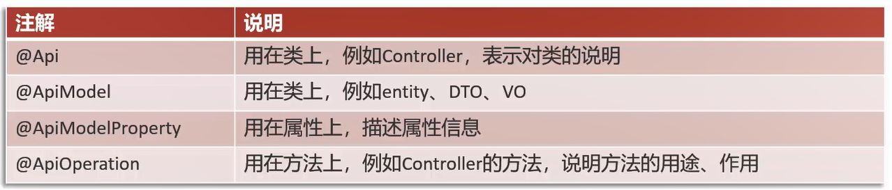

# Swagger

使用Swagger,只需要按照它的规范去定义接口及接口相关的信息,就可以做到生成接口文档,以及**在线接口调试**页面

[Swagger官方网站](https://swagger.io/)

Knife4j是为Java MVC框架集成Swagger生成Api文档的增强解决方案

# Knife4j使用步骤

1. 导入Knife4j的maven坐标

```xml
<dependency>
    <groupId>com.github.xiaoymin</groupId>
    <artifactId>knife4j-spring-boot-starter</artifactId>
    <version>3.0.2</version>
</dependency>
```

2. 在配置类(WebMvcConfiguration.java)中加入Knife4j相关配置,并设置静态资源映射

```java
/**
 * 通过knife4j生成接口文档
 * @return
 */
@Bean
public Docket docket() {
    log.info("准备生成接口文档...");
    ApiInfo apiInfo = new ApiInfoBuilder()
            .title("苍穹外卖项目接口文档")
            .version("2.0")
            .description("苍穹外卖项目接口文档")
            .build();
    Docket docket = new Docket(DocumentationType.SWAGGER_2)
            .apiInfo(apiInfo)
            .select()
            //指定生成接口需要扫描的包
            .apis(RequestHandlerSelectors.basePackage("com.sky.controller"))
            .paths(PathSelectors.any())
            .build();
    return docket;
}

/**
 * 设置静态资源映射
 * @param registry
 */
protected void addResourceHandlers(ResourceHandlerRegistry registry) {
    log.info("开始设置静态资源映射...");
    registry.addResourceHandler("/doc.html").addResourceLocations("classpath:/META-INF/resources/");
    registry.addResourceHandler("/webjars/**").addResourceLocations("classpath:/META-INF/resources/webjars/");
}
```

3. 通过`localhost:8080/doc.html`进入接口文档

# ApiFox和Swagger

- ApiFox是设计阶段使用的工具,管理和维护接口
- Swagger在开发阶段使用的框架,帮助后端开发人员做后端的接口测试

# 常用注解



## @Api()

用在请求的类上,表示对类的说明,也代表了这个类是swagger2的资源

参数:
    `tags`=说明该类的作用,参数是个数组,可以填多个
    `value`="该参数没什么意义,在UI界面上不显示,所以不用配置"
    `description`="用户基本信息操作"

## @ApiOperation()

用于方法,表示一个http请求访问该方法的操作

参数:
    `value`="方法的用途和作用"
    `notes`="方法的注意事项和备注"
    `tags`=说明该方法的作用,参数是个数组,可以填多个
    格式:tags={"作用1","作用2"}
    (在这里建议不使用这个参数,会使界面看上去有点乱,前两个常用)

## @ApiModel()

用于响应实体类上,用于说明实体作用

参数:
    `description`="描述实体的作用"

## @ApiModelProperty

用在属性上,描述实体类的属性

参数:
    `value`="用户名" 描述参数的意义
    `name`="name" 参数的变量名
    `required`="true/false" 参数是否必选

## @ApiImplicitParams

用在请求的方法上,包含多`@ApiImplicitParam`

```java
@ApiImplicitParams({
    @ApiImplicitParam(name="param1", value="参数1"),
    @ApiImplicitParam(name="param2", value="参数2") 
})
```

## @ApiImplicitParam

用于方法,表示单独的请求参数

参数:
    `name`="参数ming"
    `value`="参数说明"
    `dataType`="数据类型"
    `paramType`="query" 表示参数放在哪里
        -header –> 请求参数的获取:`@RequestHeader`(代码中接收注解)
    ​    -query –> 请求参数的获取:`@RequestParam`(代码中接收注解)
        -path(用于restful接口)–>请求参数的获取:`@PathVariable`(代码中接收注解)
        -body–>请求参数的获取:`@RequestBody`(代码中接收注解)
        -form(不常用,form.serilize())
    `defaultValue`="参数的默认值"
    `required`="true" 表示参数是否必须传

## @ApiParam()

用于方法,参数,字段说明 表示对参数的要求和说明

参数:
    `name`="参数名称"
    `value`="参数的简要说明"
    `defaultValue`="参数默认值"
    `required`="true/false" 表示属性是否必填,默认为false

## @ApiResponses

用于请求的方法上,根据响应码表示不同响应

一个`@ApiResponses`包含多个`@ApiResponse`

## @ApiResponse

用在请求的方法上,表示不同的响应

参数:
    `code`="404" 表示响应码(int型),可自定义
    `message`="状态码对应的响应信息"

## @ApiIgnore()

用于类或者方法上,不被显示在页面上

## @Profile({"dev", "test"})

用于配置类上,表示只对开发和测试环境有用

# 苍穹外卖接口文档优化

把接口文档分为管理端接口文档、用户端接口文档

WebMvcConfiguration.java:

```java
package com.sky.config;

import com.sky.interceptor.JwtTokenAdminInterceptor;
import com.sky.json.JacksonObjectMapper;
import lombok.extern.slf4j.Slf4j;
import org.springframework.beans.factory.annotation.Autowired;
import org.springframework.context.annotation.Bean;
import org.springframework.context.annotation.Configuration;
import org.springframework.http.converter.HttpMessageConverter;
import org.springframework.http.converter.json.MappingJackson2HttpMessageConverter;
import org.springframework.web.servlet.config.annotation.InterceptorRegistry;
import org.springframework.web.servlet.config.annotation.ResourceHandlerRegistry;
import org.springframework.web.servlet.config.annotation.WebMvcConfigurationSupport;
import springfox.documentation.builders.ApiInfoBuilder;
import springfox.documentation.builders.PathSelectors;
import springfox.documentation.builders.RequestHandlerSelectors;
import springfox.documentation.service.ApiInfo;
import springfox.documentation.spi.DocumentationType;
import springfox.documentation.spring.web.plugins.Docket;

import java.util.List;

/**
 * 配置类,注册web层相关组件
 */
@Configuration
@Slf4j
public class WebMvcConfiguration extends WebMvcConfigurationSupport {

    @Autowired
    private JwtTokenAdminInterceptor jwtTokenAdminInterceptor;

    /**
     * 注册自定义拦截器
     *
     * @param registry
     */
    protected void addInterceptors(InterceptorRegistry registry) {
        log.info("开始注册自定义拦截器...");
        registry.addInterceptor(jwtTokenAdminInterceptor)
                .addPathPatterns("/admin/**")
                .excludePathPatterns("/admin/employee/login");
    }

    /**
     * 通过knife4j生成接口文档
     *
     * @return
     */
    @Bean
    public Docket docket1() {
        log.info("准备生成管理端接口文档...");
        ApiInfo apiInfo = new ApiInfoBuilder()
                .title("苍穹外卖项目接口文档")
                .version("2.0")
                .description("苍穹外卖项目接口文档")
                .build();
        Docket docket = new Docket(DocumentationType.SWAGGER_2)
                .groupName("管理端接口")
                .apiInfo(apiInfo)
                .select()
                //指定生成接口需要扫描的包
                .apis(RequestHandlerSelectors.basePackage("com.sky.controller.admin"))
                .paths(PathSelectors.any())
                .build();
        return docket;
    }

    @Bean
    public Docket docket2() {
        log.info("准备生成用户端接口文档...");
        ApiInfo apiInfo = new ApiInfoBuilder()
                .title("苍穹外卖项目接口文档")
                .version("2.0")
                .description("苍穹外卖项目接口文档")
                .build();
        Docket docket = new Docket(DocumentationType.SWAGGER_2)
                .groupName("用户端接口")
                .apiInfo(apiInfo)
                .select()
                //指定生成接口需要扫描的包
                .apis(RequestHandlerSelectors.basePackage("com.sky.controller.user"))
                .paths(PathSelectors.any())
                .build();
        return docket;
    }

    /**
     * 设置静态资源映射
     *
     * @param registry
     */
    protected void addResourceHandlers(ResourceHandlerRegistry registry) {
        log.info("开始设置静态资源映射...");
        registry.addResourceHandler("/doc.html").addResourceLocations("classpath:/META-INF/resources/");
        registry.addResourceHandler("/webjars/**").addResourceLocations("classpath:/META-INF/resources/webjars/");
    }

    /**
     * 扩展Spring MVC框架的消息转换器
     *
     * @param converters
     */
    @Override
    protected void extendMessageConverters(List<HttpMessageConverter<?>> converters) {
        log.info("开始扩展消息转换器...");
        // 创建一个消息转化器对象
        MappingJackson2HttpMessageConverter converter = new MappingJackson2HttpMessageConverter();
        // 设置对象转换器,将Java对象序列化为json字符串
        converter.setObjectMapper(new JacksonObjectMapper());
        // 将转换器放入Spring MVC框架的容器中
        converters.add(0, converter);
    }
}
```