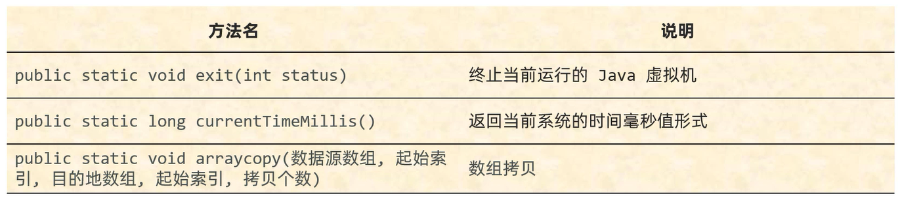

# System
  
System是一个工具类,提供了一些与系统相关的方法   

## 常用方法



## System.exit(int status)

终止JVM   

status: 状态码     
0: 表示当前JVM是正常停止   
非0: 表示当前JVM是异常停止   

范例: 

```java
public class Test {
    public static void main(String[] args) {
        System.exit(0);
    }
}
```

## System.currentTimeMillis()

返回当前系统的时间毫秒值形式   

计算机中的时间原点(国际时间): 1970年1月1日 00: 00: 00(C语言的生日)    
中国(东八区): 1970年1月1日 08: 00: 00   

范例: 

```java
public class Test {
    public static void main(String[] args) {
        long start = System.currentTimeMillis();
        for (int i = 1; i <= 10000; i++) {
            System.out.println("第" + i + "年,我爱中国!");
        }
        System.out.println("我爱中国一万年!");
        long end = System.currentTimeMillis();
        long time = end - start;
        System.out.println("程序用时: " + time + "毫秒");
    }
}
```

## System.arraycopy(数据源数组,起始索引,目的地数组,起始索引,拷贝个数)

数组拷贝   

1. 数据源数组: 要拷贝的数据从哪个数组而来    
2. 起始索引: 从数据源数组中的第几个索引开始拷贝   
3. 目的地数组: 把数据拷贝到哪个数组去  
4. 起始索引: 从目的地数组中的第几个索引开始拷贝   
5. 拷贝个数: 拷贝的元素的个数  

范例: 

```java
public class Test {
    public static void main(String[] args) {
        int[] arr1 = {1,2,3,4,5,6,7,8,9,10};
        int[] arr2 = new int[10];
        // 从arr1的索引4开始拷贝3个元素,即5,6,7
        // 从arr2的索引2开始拷贝3个元素,即5,6,7
        System.arraycopy(arr1,4,arr2,2,3);
        // 打印结果:"0 0 5 6 7 0 0 0 0 0"
        for (int i: arr2) {
            System.out.print(i + " ");
        }
    }
}
```

注意事项: 
1. **如果数据源数组和目的地数组都是基本数据类型,那么两者的类型必须保持一致,否则会报错**   
2. **如果数据源数组和目的地数组都是引用数据类型,那么子类类型可以赋值给父类类型**  
3. **拷贝时需要考虑拷贝的长度,超出范围会报错**   

范例: 

```java
public class Person {
    private String name;
    private int age;

    public Person() {
    }

    public Person(String name,int age) {
        this.name = name;
        this.age = age;
    }

    public String getName() {
        return name;
    }

    public void setName(String name) {
        this.name = name;
    }

    public int getAge() {
        return age;
    }

    public void setAge(int age) {
        this.age = age;
    }
}
```

```java
public class Student extends Person {
    public Student() {
    }

    public Student(String name,int age) {
        super(name,age);
    }
}
```

```java
import java.util.Scanner;

public class Test {
    public static void main(String[] args) {
        Student s1 = new Student("张三",23);
        Student s2 = new Student("李四",24);
        Student s3 = new Student("王五",25);
        Student[] arr1 = {s1,s2,s3};
        Student[] arr2 = new Student[3];

        // 正常情况
        System.arraycopy(arr1,0,arr2,0,3);
        for (Student student1: arr2) {
            System.out.println(student1.getName() + "," + student1.getAge());
        }
        System.out.println();

        // 特殊情况: 数据源数组和目的地数组都是引用数据类型,那么子类类型可以赋值给父类类型
        Person[] arr3 = new Person[3];
        System.arraycopy(arr1,0,arr3,0,3);
        // 使用普通for循环,需要强制类型转换
        for (int i = 0; i < arr3.length; i++) {
            Student student2 = (Student) arr3[i];
            System.out.println(student2.getName() + "," + student2.getAge());
        }
        System.out.println();

        // 而使用增强型for循环 ,则无需强制类型转换
        for (Person p: arr3) {
            System.out.println(p.getName() + "," + p.getAge());
        }
    }
}
```