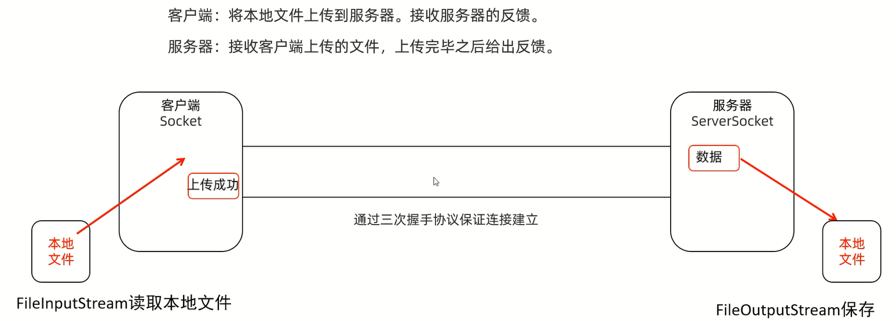

# 多发多收

客户端:多次发送数据            
服务器:多次接收数据并打印

```java
import java.io.*;
import java.net.ServerSocket;
import java.net.Socket;

public class Server {
    public static void main(String[] args) throws IOException {
        ServerSocket serverSocket = new ServerSocket(10000);
        Socket socket = serverSocket.accept();
        InputStreamReader isr = new InputStreamReader(socket.getInputStream());
        int read;
        while ((read = isr.read()) != -1) {
            System.out.print((char) read);
        }
        socket.close();
        serverSocket.close();
    }
}
```

```java
import java.io.IOException;
import java.io.OutputStream;
import java.net.Socket;
import java.util.Scanner;

public class Client {
    public static void main(String[] args) throws IOException {
        Socket socket = new Socket("192.168.1.4", 10000);
        OutputStream os = socket.getOutputStream();
        Scanner sc = new Scanner(System.in);
        while (true) {
            System.out.println("请输入数据:");
            String str = sc.nextLine();
            if (str.equals("886")) {
                break;
            }
            os.write(str.getBytes());
        }
        socket.close();
    }
}
```

# 接收和反馈

客户端:发送一条数据,接收服务端反馈的消息并打印                      
服务器:接收数据并打印,再给客户端反馈消息

```java
import java.io.*;
import java.net.ServerSocket;
import java.net.Socket;

public class Server {
    public static void main(String[] args) throws IOException {
        ServerSocket serverSocket = new ServerSocket(10000);
        Socket socket = serverSocket.accept();
        InputStreamReader isr = new InputStreamReader(socket.getInputStream());
        int read;
        while ((read = isr.read()) != -1) {
            System.out.print((char) read);
        }
        // 给出反馈
        String str = "服务器接收到信息!";
        OutputStream os = socket.getOutputStream();
        os.write(str.getBytes());
        socket.close();
        serverSocket.close();
    }
}
```

```java
import java.io.IOException;
import java.io.InputStreamReader;
import java.io.OutputStream;
import java.net.Socket;
import java.util.Scanner;

public class Client {
    public static void main(String[] args) throws IOException {
        Socket socket = new Socket("192.168.1.4", 10000);
        OutputStream os = socket.getOutputStream();
        Scanner sc = new Scanner(System.in);
        System.out.print("请输入一条数据:");
        String str = sc.nextLine();
        os.write(str.getBytes());
        socket.shutdownOutput();
        // 接收反馈
        InputStreamReader isr = new InputStreamReader(socket.getInputStream());
        int read;
        while ((read = isr.read()) != -1) {
            System.out.print((char) read);
        }
        socket.close();
    }
}
```

# 上传文件



```java
import java.io.*;
import java.net.ServerSocket;
import java.net.Socket;

public class Server {
    public static void main(String[] args) throws IOException {
        // 连接客户端
        ServerSocket serverSocket = new ServerSocket(10000);
        Socket socket = serverSocket.accept();
        // 读取服务器数据并写入本地文件中
        File file = new File("C:\\Users\\gujintao\\Desktop\\untitled\\File\\gujintao2.JPG");
        BufferedInputStream bis = new BufferedInputStream(socket.getInputStream());
        BufferedOutputStream bos = new BufferedOutputStream(new FileOutputStream(file));
        int read1;
        byte[] bytes = new byte[1024];
        while ((read1 = bis.read(bytes)) != -1) {
            bos.write(bytes, 0, read1);
        }
        // 给出反馈
        BufferedWriter bw = new BufferedWriter(new OutputStreamWriter(socket.getOutputStream()));
        bw.write("服务器成功接收文件!");
        bw.newLine();
        bw.flush();
        // 释放资源
        socket.close();
        serverSocket.close();
    }
}
```

```java
import java.io.*;
import java.net.Socket;

public class Client {
    public static void main(String[] args) throws IOException {
        // 连接服务器
        Socket socket = new Socket("192.168.1.4", 10000);
        // 读取本地文件数据并写入到服务器中
        File file = new File("C:\\Users\\gujintao\\Desktop\\untitled\\File\\gujintao.JPG");
        BufferedInputStream bis = new BufferedInputStream(new FileInputStream(file));
        BufferedOutputStream bos = new BufferedOutputStream(socket.getOutputStream());
        int read1;
        byte[] bytes = new byte[1024];
        while ((read1 = bis.read(bytes)) != -1) {
            bos.write(bytes, 0, read1);
        }
        socket.shutdownOutput();
        // 接收反馈
        BufferedReader br = new BufferedReader(new InputStreamReader(socket.getInputStream()));
        System.out.println(br.readLine());
        // 释放资源
        socket.close();
    }
}
```

# 上传文件(文件名重复问题)

解决上传的文件的文件名重复的问题

```java
import java.io.*;
import java.net.ServerSocket;
import java.net.Socket;
import java.util.UUID;

public class Server {
    public static void main(String[] args) throws IOException {
        // 连接客户端
        ServerSocket serverSocket = new ServerSocket(10000);
        Socket socket = serverSocket.accept();
        // 文件名不重复
        String str = UUID.randomUUID().toString().replace("-", "");
        // 读取服务器数据并写入本地文件中
        File file = new File("C:\\Users\\gujintao\\Desktop\\untitled\\File\\" + str + ".JPG");
        BufferedInputStream bis = new BufferedInputStream(socket.getInputStream());
        BufferedOutputStream bos = new BufferedOutputStream(new FileOutputStream(file));
        int read1;
        byte[] bytes = new byte[1024];
        while ((read1 = bis.read(bytes)) != -1) {
            bos.write(bytes, 0, read1);
        }
        // 给出反馈
        BufferedWriter bw = new BufferedWriter(new OutputStreamWriter(socket.getOutputStream()));
        bw.write("服务器成功接收文件!");
        bw.newLine();
        bw.flush();
        // 释放资源
        socket.close();
        serverSocket.close();
    }
}
```

```java
import java.io.*;
import java.net.Socket;

public class Client {
    public static void main(String[] args) throws IOException {
        // 连接服务器
        Socket socket = new Socket("192.168.1.4", 10000);
        // 读取本地文件数据并写入到服务器中
        File file = new File("C:\\Users\\gujintao\\Desktop\\untitled\\File\\gujintao.JPG");
        BufferedInputStream bis = new BufferedInputStream(new FileInputStream(file));
        BufferedOutputStream bos = new BufferedOutputStream(socket.getOutputStream());
        int read1;
        byte[] bytes = new byte[1024];
        while ((read1 = bis.read(bytes)) != -1) {
            bos.write(bytes, 0, read1);
        }
        socket.shutdownOutput();
        // 接收反馈
        BufferedReader br = new BufferedReader(new InputStreamReader(socket.getInputStream()));
        System.out.println(br.readLine());
        // 释放资源
        socket.close();
    }
}
```

# 上传文件(多线程)

实现服务器不停止,能接收很多用户上传的图片

```java
import java.io.*;
import java.net.Socket;
import java.util.UUID;

public class MyRunnable implements Runnable {
    Socket socket;

    public MyRunnable(Socket socket) {
        this.socket = socket;
    }

    @Override
    public void run() {
        try {
            // 文件名不重复
            String str = UUID.randomUUID().toString().replace("-", "");
            // 读取服务器数据并写入本地文件中
            File file = new File("C:\\Users\\gujintao\\Desktop\\untitled\\File\\" + str + ".JPG");
            BufferedInputStream bis = new BufferedInputStream(socket.getInputStream());
            BufferedOutputStream bos = new BufferedOutputStream(new FileOutputStream(file));
            int read1;
            byte[] bytes = new byte[1024];
            while ((read1 = bis.read(bytes)) != -1) {
                bos.write(bytes, 0, read1);
            }
            // 给出反馈
            BufferedWriter bw = new BufferedWriter(new OutputStreamWriter(socket.getOutputStream()));
            bw.write("服务器成功接收文件!");
            bw.newLine();
            bw.flush();

        } catch (IOException e) {
            throw new RuntimeException(e);
        } finally {
            // 释放资源
            if (socket != null) {
                try {
                    socket.close();
                } catch (IOException e) {
                    e.printStackTrace();
                }
            }
        }
    }
}
```

```java
import java.io.IOException;
import java.net.ServerSocket;
import java.net.Socket;

public class Server {
    public static void main(String[] args) throws IOException {
        // 连接客户端
        ServerSocket serverSocket = new ServerSocket(10000);
        while (true) {
            Socket socket = serverSocket.accept();
            // 一个用户对应一条线程
            new Thread(new MyRunnable(socket)).start();
        }
    }
}
```

```java
import java.io.*;
import java.net.Socket;

public class Client {
    public static void main(String[] args) throws IOException {
        // 连接服务器
        Socket socket = new Socket("192.168.1.4", 10000);
        // 读取本地文件数据并写入到服务器中
        File file = new File("C:\\Users\\gujintao\\Desktop\\untitled\\File\\gujintao.JPG");
        BufferedInputStream bis = new BufferedInputStream(new FileInputStream(file));
        BufferedOutputStream bos = new BufferedOutputStream(socket.getOutputStream());
        int read1;
        byte[] bytes = new byte[1024];
        while ((read1 = bis.read(bytes)) != -1) {
            bos.write(bytes, 0, read1);
        }
        socket.shutdownOutput();
        // 接收反馈
        BufferedReader br = new BufferedReader(new InputStreamReader(socket.getInputStream()));
        System.out.println(br.readLine());
        // 释放资源
        socket.close();
    }
}
```

# 上传文件(线程池优化)

```java
import java.io.*;
import java.net.Socket;
import java.util.UUID;

public class MyRunnable implements Runnable {
    Socket socket;

    public MyRunnable(Socket socket) {
        this.socket = socket;
    }

    @Override
    public void run() {
        try {
            // 文件名不重复
            String str = UUID.randomUUID().toString().replace("-", "");
            // 读取服务器数据并写入本地文件中
            File file = new File("C:\\Users\\gujintao\\Desktop\\untitled\\File\\" + str + ".JPG");
            BufferedInputStream bis = new BufferedInputStream(socket.getInputStream());
            BufferedOutputStream bos = new BufferedOutputStream(new FileOutputStream(file));
            int read1;
            byte[] bytes = new byte[1024];
            while ((read1 = bis.read(bytes)) != -1) {
                bos.write(bytes, 0, read1);
            }
            // 给出反馈
            BufferedWriter bw = new BufferedWriter(new OutputStreamWriter(socket.getOutputStream()));
            bw.write("服务器成功接收文件!");
            bw.newLine();
            bw.flush();
        } catch (IOException e) {
            throw new RuntimeException(e);
        } finally {
            // 释放资源
            if (socket != null) {
                try {
                    socket.close();
                } catch (IOException e) {
                    e.printStackTrace();
                }
            }
        }
    }
}
```

```java
import java.io.IOException;
import java.net.ServerSocket;
import java.net.Socket;
import java.util.concurrent.ArrayBlockingQueue;
import java.util.concurrent.Executors;
import java.util.concurrent.ThreadPoolExecutor;
import java.util.concurrent.TimeUnit;

public class Server {
    public static void main(String[] args) throws IOException {
        // 创建线程池
        ThreadPoolExecutor pool = new ThreadPoolExecutor(
                3,// 核心线程数量
                16,// 线程池总大小
                60,// 空闲时间
                TimeUnit.SECONDS,// 空闲时间(单位)
                new ArrayBlockingQueue<>(2),// 队列
                Executors.defaultThreadFactory(),// 线程工厂,让线程池如何创建线程对象
                new ThreadPoolExecutor.AbortPolicy()// 阻塞队列
        );

        // 连接客户端
        ServerSocket serverSocket = new ServerSocket(10000);
        while (true) {
            Socket socket = serverSocket.accept();
            // 一个用户对应一条线程
            pool.submit(new MyRunnable(socket));
        }
    }
}
```

```java
import java.io.*;
import java.net.Socket;

public class Client {
    public static void main(String[] args) throws IOException {
        // 连接服务器
        Socket socket = new Socket("192.168.1.4", 10000);
        // 读取本地文件数据并写入到服务器中
        File file = new File("C:\\Users\\gujintao\\Desktop\\untitled\\File\\gujintao.JPG");
        BufferedInputStream bis = new BufferedInputStream(new FileInputStream(file));
        BufferedOutputStream bos = new BufferedOutputStream(socket.getOutputStream());
        int read1;
        byte[] bytes = new byte[1024];
        while ((read1 = bis.read(bytes)) != -1) {
            bos.write(bytes, 0, read1);
        }
        socket.shutdownOutput();
        // 接收反馈
        BufferedReader br = new BufferedReader(new InputStreamReader(socket.getInputStream()));
        System.out.println(br.readLine());
        // 释放资源
        socket.close();
    }
}
```

# BS(接收浏览器的消息并打印)

客户端:不需要写           
服务器:接收数据并打印

```markdown
GET / HTTP/1.1
Host: 192.168.1.4:10000
Connection: keep-alive
Cache-Control: max-age=0
Upgrade-Insecure-Requests: 1
User-Agent: Mozilla/5.0 (Windows NT 10.0; Win64; x64) AppleWebKit/537.36 (KHTML, like Gecko) Chrome/124.0.0.0 Safari/537.36
Accept: text/html,application/xhtml+xml,application/xml;q=0.9,image/avif,image/webp,image/apng,*/*;q=0.8,application/signed-exchange;v=b3;q=0.7
Accept-Encoding: gzip, deflate
Accept-Language: zh-CN,zh;q=0.9
```