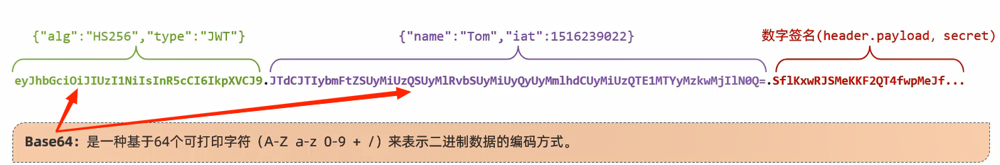

- [TLIAS项目-Gitee仓库](https://gitee.com/gjt_1538048299/tlias)

# 登录功能(无校验)

controller类:

```java
@Slf4j
@RestController
@RequestMapping("/login")
public class LoginController {
    @Autowired
    private EmpService empService;

    @PostMapping
    public Result login(@RequestBody Emp emp) {
        // 日志记录
        log.info("员工登录,{}", emp.getName());
        // 员工登录
        Emp e = empService.login(emp);
        return e != null ? Result.success() : Result.error("用户名/密码错误");
    }
}
```

service接口类:

```java
public interface EmpService {
    // 员工登录
    Emp login(Emp emp);
}
```

service实现类:

```java
@Service
public class EmpServiceImpl implements EmpService {
    @Autowired
    private EmpMapper empMapper;
    
    // 员工登录
    @Override
    public Emp login(Emp emp) {
        return empMapper.getByUsernameAndPassword(emp);
    }
}
```

mapper接口类:

```java
@Mapper
public interface EmpMapper {
    // 根据用户名和密码查询员工
    Emp getByUsernameAndPassword(Emp emp);
}
```

xml配置文件:

```xml
<?xml version="1.0" encoding="UTF-8" ?>
<!DOCTYPE mapper
        PUBLIC "-//mybatis.org//DTD Mapper 3.0//EN"
        "http://mybatis.org/dtd/mybatis-3-mapper.dtd">
<mapper namespace="com.jinzhao.mapper.EmpMapper">
    <!--根据用户名和密码查询员工-->
    <select id="getByUsernameAndPassword" resultType="com.jinzhao.pojo.Emp">
        select id,
               username,
               password,
               name,
               gender,
               image,
               job,
               entrydate,
               dept_id,
               create_time,
               update_time
        from emp
        where username = #{username}
          and password = #{password}
    </select>
</mapper>
```

# 登录校验


# 会话技术

会话:用户打开浏览器,访问Web服务器的资源,会话建立,直到有一方断开连接,会话结束,**一次会话中可以包含多次请求和响应**

会话跟踪:一种维护浏览器状态的方法,服务器需要识别多次请求是否来自于同一浏览器,**以便在同一次会话的多次请求间共享数据**

会话跟踪方案:
1. 客户端会话跟踪技术:Cookie(传统方案)
2. 服务端会话跟踪技术:Session(传统方案)
3. 令牌技术(主流方案)
 
# Cookie


范例:

```java
package com.jinzhao.controller;

import com.itheima.pojo.Result;
import lombok.extern.slf4j.Slf4j;
import org.springframework.web.bind.annotation.GetMapping;
import org.springframework.web.bind.annotation.RestController;

import javax.servlet.http.Cookie;
import javax.servlet.http.HttpServletRequest;
import javax.servlet.http.HttpServletResponse;

@Slf4j
@RestController
public class SessionController {

    // 设置Cookie
    @GetMapping("/c1")
    public Result cookie1(HttpServletResponse response){
        // 设置Cookie响应
        response.addCookie(new Cookie("login_username","itheima"));
        return Result.success();
    }

    // 获取Cookie
    @GetMapping("/c2")
    public Result cookie2(HttpServletRequest request){
        Cookie[] cookies = request.getCookies();
        for (Cookie cookie : cookies) {
            if(cookie.getName().equals("login_username")){
                // 输出name为login_username的cookie
                System.out.println("login_username: "+cookie.getValue()); 
            }
        }
        return Result.success();
    }
}
```

# Session


范例:

```java
package com.jinzhao.controller;

import com.itheima.pojo.Result;
import lombok.extern.slf4j.Slf4j;
import org.springframework.web.bind.annotation.GetMapping;
import org.springframework.web.bind.annotation.RestController;

import javax.servlet.http.HttpServletRequest;
import javax.servlet.http.HttpSession;

@Slf4j
@RestController
public class SessionController {
    @GetMapping("/s1")
    public Result session1(HttpSession session){
        log.info("HttpSession-s1: {}", session.hashCode());

        // 往session中存储数据
        session.setAttribute("loginUser", "tom"); 
        return Result.success();
    }

    @GetMapping("/s2")
    public Result session2(HttpServletRequest request){
        HttpSession session = request.getSession();
        log.info("HttpSession-s2: {}", session.hashCode());

        // 从session中获取数据
        Object loginUser = session.getAttribute("loginUser"); 
        log.info("loginUser: {}", loginUser);
        return Result.success(loginUser);
    }
}
```

# 令牌技术


## JWT令牌

[JWT官方网站](https://jwt.io/)

全称:JSON Web Token 

JWT令牌:定义了一种简洁的、自含的格式,用于在通信双方以json数据格式安全的传输信息,由于数字签名的存在,这些信息是可靠的

### 组成

1. 第一部分:Header(头),记录令牌类型、签名算法等                     
例如:`{"alg":"HS256","type":"JWT"}`

2. 第二部分:Payload(有效载荷),携带一些自定义信息、默认信息等             
例如:`{"name":"Tom","iat":1516239022}`

3. 第三部分:Signature(签名),防止Token被篡改、确保安全性,签名是header、payload、secret(指定秘钥)通过指定签名算法计算而来



### 应用场景


### 生成和解析JWT令牌

Maven依赖引入:

```xml
<dependency>
    <groupId>io.jsonwebtoken</groupId>
    <artifactId>jjwt</artifactId>
    <version>0.9.1</version>
</dependency>
```

生成和解析JWT令牌:

```java
package com.jinzhao;

import io.jsonwebtoken.Claims;
import io.jsonwebtoken.Jwts;
import io.jsonwebtoken.SignatureAlgorithm;
import org.junit.jupiter.api.Test;

import java.util.Date;
import java.util.HashMap;
import java.util.Map;
import java.util.Objects;

class ClassManagementSystemApplicationTests {

    @Test
    void contextLoads() {
    }

    // 测试 生成JWT令牌
    @Test
    public void testGenJwt() {
        Map<String, Object> claims = new HashMap<>();
        claims.put("id", 1);
        claims.put("name", "Tom");
        String jwt = Jwts.builder()
                // 指定签名算法
                .signWith(SignatureAlgorithm.HS256, "jinzhao")
                // 自定义内容(载荷)
                .setClaims(claims)
                // 设置有效期为1小时
                .setExpiration(new Date(System.currentTimeMillis() + 3600 * 1000))
                .compact();
        System.out.println(jwt);
    }

    // 测试 解析JWT令牌
    @Test
    public void testParseJwt() {
        Claims claims = Jwts.parser()
                // 指定签名算法
                .setSigningKey("jinzhao")
                // 解析JWT令牌
                .parseClaimsJws("eyJhbGciOiJIUzI1NiJ9." +
                        "eyJuYW1lIjoiVG9tIiwiaWQiOjEsImV4cCI6MTcxNjk0OTYzM30." +
                        "pa2zmfo_k8RF6j3PF4i9FpAw_70TOviKkkuOlL8gld4")
                .getBody();
        System.out.println(claims);
    }
}
```

细节:
1. **JWT校验时使用的签名秘钥,必须和生成JWT令牌时所使用的秘钥是配套的**
2. **如果JWT令牌解析校验时报错,则说明JWT令牌被篡改或失效了,令牌非法**

# 登录功能(生成JWT令牌)

思路:
1. 令牌生成:登录成功后生成JWT令牌,并返回给前端
2. 令牌校验:在请求到达服务端后,对令牌进行统一拦截、校验

Maven依赖引入:

```xml
<dependency>
    <groupId>io.jsonwebtoken</groupId>
    <artifactId>jjwt</artifactId>
    <version>0.9.1</version>
</dependency>
```

JWT令牌工具类:

```java
package com.jinzhao.utils;

import io.jsonwebtoken.Claims;
import io.jsonwebtoken.Jwts;
import io.jsonwebtoken.SignatureAlgorithm;

import java.util.Date;
import java.util.Map;

// JWT令牌工具类
public class JwtUtils {

    // 指定签名算法
    private static String signKey = "jinzhao";

    // 指定过期时间
    private static Long expire = 43200000L;

    // 生成JWT令牌
    public static String generateJwt(Map<String, Object> claims) {
        String jwt = Jwts.builder()
                .addClaims(claims)
                .signWith(SignatureAlgorithm.HS256, signKey)
                .setExpiration(new Date(System.currentTimeMillis() + expire))
                .compact();
        return jwt;
    }

    // 解析JWT令牌
    public static Claims parseJWT(String jwt) {
        Claims claims = Jwts.parser()
                .setSigningKey(signKey)
                .parseClaimsJws(jwt)
                .getBody();
        return claims;
    }
}
```

LoginController类:

```java
package com.jinzhao.controller;

import com.jinzhao.pojo.Emp;
import com.jinzhao.pojo.Result;
import com.jinzhao.service.EmpService;
import com.jinzhao.utils.JwtUtils;
import lombok.extern.slf4j.Slf4j;
import org.springframework.beans.factory.annotation.Autowired;
import org.springframework.web.bind.annotation.PostMapping;
import org.springframework.web.bind.annotation.RequestBody;
import org.springframework.web.bind.annotation.RequestMapping;
import org.springframework.web.bind.annotation.RestController;

import java.util.HashMap;
import java.util.Map;

@Slf4j
@RestController
@RequestMapping("/login")
public class LoginController {
    @Autowired
    private EmpService empService;

    @PostMapping
    public Result login(@RequestBody Emp emp) {
        // 日志记录
        log.info("员工登录,{}", emp.getName());
        // 员工登录
        Emp e = empService.login(emp);

        // 登录成功,生成并下发JWT令牌
        if (e != null) {
            Map<String, Object> claims = new HashMap<>();
            claims.put("id", e.getId());
            claims.put("name", e.getName());
            claims.put("username", e.getUsername());
            // jwt中包含了当前登录的员工信息
            String jwt = JwtUtils.generateJwt(claims);
            return Result.success(jwt);
        }

        // 登录失败,返回错误信息
        return Result.error("用户名/密码错误!");
    }
}
```

# 统一拦截


统一拦截:
1. 过滤器:Filter
2. 拦截器:Interceptor

执行流程:**过滤器优化于拦截器**


Filter和Interceptor的区别:


# 过滤器(Filter)


## 快速入门


范例:

启动类加上`@ServletComponentScan`注解

DemoFilter类:过滤器

```java
package com.jinzhao.filter;

import jakarta.servlet.*;
import jakarta.servlet.annotation.WebFilter;

import java.io.IOException;

@WebFilter(urlPatterns = "/*")
public class DemoFilter implements Filter {
    // 初始化方法,只调用一次
    @Override
    public void init(FilterConfig filterConfig) throws ServletException {
        System.out.println("init初始化方法运行");
    }

    // 拦截到请求之后调用,调用多次
    @Override
    public void doFilter(ServletRequest request, ServletResponse response, FilterChain chain) throws IOException, ServletException {
        // 放行操作
        chain.doFilter(request, response);
        System.out.println("拦截到请求");
    }

    // 销毁方法,只调用一次
    @Override
    public void destroy() {
        System.out.println("destroy销毁方法运行");
    }
}
```

细节:**放行后访问对应的资源,资源访问完成后,还会回到Filter中,然后继续执行放行后的逻辑**

## 详解

### 拦截路径


### 过滤器链

一个Web应用中,可以配置多个过滤器,多个过滤器链就形成了一个过滤器链


细节:**注解配置的Filter,优先级是按照过滤器名(字符串)的自然排序**

# 拦截器(Interceptor)


## 快速入门


WebConfig类:配置拦截器

```java
package com.jinzhao.config;

import com.jinzhao.interceptor.LoginInterceptor;
import org.springframework.beans.factory.annotation.Autowired;
import org.springframework.context.annotation.Configuration;
import org.springframework.web.servlet.config.annotation.InterceptorRegistry;
import org.springframework.web.servlet.config.annotation.WebMvcConfigurer;

// 配置类
@Configuration
public class WebConfig implements WebMvcConfigurer {

    @Autowired
    private LoginInterceptor loginInterceptor;

    // 指定拦截器、拦截的资源路径、不拦截的资源路径
    @Override
    public void addInterceptors(InterceptorRegistry registry) {
        registry.addInterceptor(loginInterceptor).addPathPatterns("/**").excludePathPatterns("/login");
    }
}
```

LoginInterceptor类:拦截器

```java
package com.jinzhao.interceptor;

import jakarta.servlet.http.HttpServletRequest;
import jakarta.servlet.http.HttpServletResponse;
import org.springframework.stereotype.Component;
import org.springframework.web.servlet.HandlerInterceptor;
import org.springframework.web.servlet.ModelAndView;

// 拦截器
@Component
public class LoginInterceptor implements HandlerInterceptor {
    // 目标资源方法运行之前运行,返回true,放行;返回false,不放行
    @Override
    public boolean preHandle(HttpServletRequest request, HttpServletResponse response, Object handler) throws Exception {
        System.out.println("preHandle方法运行");
        return true;
    }

    // 目标资源方法运行后运行
    @Override
    public void postHandle(HttpServletRequest request, HttpServletResponse response, Object handler, ModelAndView modelAndView) throws Exception {
        System.out.println("postHandle方法运行");
    }

    // 视图渲染完毕后运行,最后运行
    @Override
    public void afterCompletion(HttpServletRequest request, HttpServletResponse response, Object handler, Exception ex) throws Exception {
        System.out.println("afterCompletion方法运行");
    }
}
```

## 详解

### 拦截路径


# 登录功能(带校验)

思路:
1. 除了登录请求,其他的所有请求拦截到了之后,都需要校验令牌
2. 拦截到请求后,有令牌且令牌校验通过(合法),才可以放行,执行业务操作;否则都返回未登录错误结果

.png)

## 选择过滤器

Maven依赖引入:

```xml
<dependency>
    <groupId>com.alibaba.fastjson2</groupId>
    <artifactId>fastjson2</artifactId>
    <version>2.0.50</version>
</dependency>
```

启动类加上`@ServletComponentScan`注解

LoginFilter类:

```java
package com.jinzhao.filter;

import com.alibaba.fastjson2.JSONObject;
import com.jinzhao.pojo.Result;
import com.jinzhao.utils.JwtUtils;
import jakarta.servlet.*;
import jakarta.servlet.annotation.WebFilter;
import jakarta.servlet.http.HttpServletRequest;
import jakarta.servlet.http.HttpServletResponse;
import lombok.extern.slf4j.Slf4j;
import org.springframework.util.StringUtils;

import java.io.IOException;

// 过滤器

@Slf4j
@WebFilter(urlPatterns = "/*")
public class LoginFilter implements Filter {
    @Override
    public void doFilter(ServletRequest request, ServletResponse response, FilterChain chain) throws IOException, ServletException {
        // 请求、响应
        HttpServletRequest req = (HttpServletRequest) request;
        HttpServletResponse resp = (HttpServletResponse) response;

        // 获取请求的url
        String url = req.getRequestURI();
        log.info("请求的url:{}", url);

        // 判断url是否为登录请求,如果包含login,说明是登录请求,则放行
        if (url.contains("login")) {
            log.info("登录请求,放行");
            chain.doFilter(request, response);
            return;
        }

        // 获取请求头中的令牌(请求头名称token)
        String jwt = req.getHeader("token");

        // 判断令牌是否存在,如果不存在,返回错误结果
        if (!StringUtils.hasLength(jwt)) {
            log.info("令牌不存在,未登录");
            Result error = Result.error("NOT_LOGIN");
            // 手动转换对象-->JSON
            String notLogin = JSONObject.toJSONString(error);
            resp.getWriter().write(notLogin);
            return;
        }

        // 解析jwt,如果解析失败,返回错误结果
        try {
            JwtUtils.parseJWT(jwt);
        } catch (Exception e) {
            e.printStackTrace();
            // jwt解析失败,返回错误结果
            log.info("令牌解析失败,登录失败");
            Result error = Result.error("NOT_LOGIN");
            // 手动转换对象-->JSON
            String notLogin = JSONObject.toJSONString(error);
            resp.getWriter().write(notLogin);
        }

        // 放行
        log.info("令牌合法,放行");
        chain.doFilter(request, response);
    }
}
```

## 选择拦截器

WebConfig类:配置拦截器

```java
package com.jinzhao.config;

import com.jinzhao.interceptor.LoginInterceptor;
import org.springframework.beans.factory.annotation.Autowired;
import org.springframework.context.annotation.Configuration;
import org.springframework.web.servlet.config.annotation.InterceptorRegistry;
import org.springframework.web.servlet.config.annotation.WebMvcConfigurer;

// 配置类
@Configuration
public class WebConfig implements WebMvcConfigurer {

    @Autowired
    private LoginInterceptor loginInterceptor;

    // 指定拦截器、拦截的资源路径、不拦截的资源路径
    @Override
    public void addInterceptors(InterceptorRegistry registry) {
        registry.addInterceptor(loginInterceptor).addPathPatterns("/**").excludePathPatterns("/login");
    }
}
```

LoginInterceptor类:拦截器

```java
package com.jinzhao.interceptor;

import com.alibaba.fastjson2.JSONObject;
import com.jinzhao.pojo.Result;
import com.jinzhao.utils.JwtUtils;
import jakarta.servlet.http.HttpServletRequest;
import jakarta.servlet.http.HttpServletResponse;
import lombok.extern.slf4j.Slf4j;
import org.springframework.stereotype.Component;
import org.springframework.util.StringUtils;
import org.springframework.web.servlet.HandlerInterceptor;

// 拦截器
@Slf4j
@Component
public class LoginInterceptor implements HandlerInterceptor {
    @Override
    public boolean preHandle(HttpServletRequest request, HttpServletResponse response, Object handler) throws Exception {
        // 获取请求的url
        String url = request.getRequestURI();
        log.info("请求的url:{}", url);

        // 判断url是否为登录请求,如果包含login,说明是登录请求,则放行
        if (url.contains("login")) {
            log.info("登录请求,放行");
            return true;
        }

        // 获取请求头中的令牌(请求头名称token)
        String jwt = request.getHeader("token");

        // 判断令牌是否存在,如果不存在,返回错误结果
        if (!StringUtils.hasLength(jwt)) {
            log.info("令牌不存在,未登录");
            Result error = Result.error("NOT_LOGIN");
            // 手动转换对象-->JSON
            String notLogin = JSONObject.toJSONString(error);
            response.getWriter().write(notLogin);
            return false;
        }

        // 解析jwt,如果解析失败,返回错误结果
        try {
            JwtUtils.parseJWT(jwt);
        } catch (Exception e) {
            e.printStackTrace();
            // jwt解析失败,返回错误结果
            log.info("令牌解析失败,登录失败");
            Result error = Result.error("NOT_LOGIN");
            // 手动转换对象-->JSON
            String notLogin = JSONObject.toJSONString(error);
            response.getWriter().write(notLogin);
            return false;
        }

        // 放行
        log.info("令牌合法,放行");
        return true;
    }
}
```