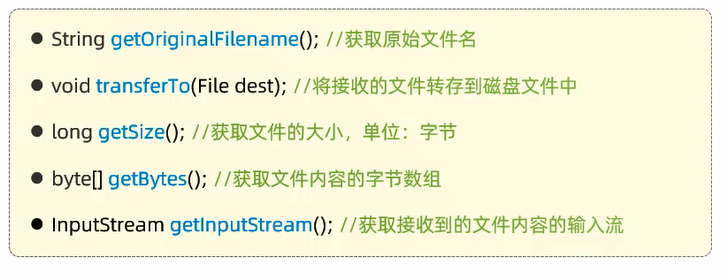

- [TLIAS项目-Gitee仓库](https://gitee.com/gjt_1538048299/tlias)

# 准备工作


## 准备数据库表

```sql
-- 创建部门表
create table dept
(
    id          int unsigned primary key auto_increment comment '主键ID',
    name        varchar(10) not null unique comment '部门名称',
    create_time datetime    not null comment '创建时间',
    update_time datetime    not null comment '修改时间'
) comment '部门表';

-- 部门表导入数据
insert into dept (id, name, create_time, update_time)
values (1, '学工部', now(), now()),
       (2, '教研部', now(), now()),
       (3, '咨询部', now(), now()),
       (4, '就业部', now(), now()),
       (5, '人事部', now(), now());

-- 创建员工表
create table emp
(
    id          int unsigned primary key auto_increment comment 'ID',
    username    varchar(20) not null unique comment '用户名',
    password    varchar(32) default '123456' comment '密码',
    name        varchar(10) not null comment '姓名',
    gender      tinyint unsigned not null comment '性别, 说明: 1 男, 2 女',
    image       varchar(300) comment '图像',
    job         tinyint unsigned comment '职位, 说明: 1 班主任,2 讲师, 3 学工主管, 4 教研主管, 5 咨询师',
    entrydate   date comment '入职时间',
    dept_id     int unsigned comment '部门ID',
    create_time datetime    not null comment '创建时间',
    update_time datetime    not null comment '修改时间'
) comment '员工表';

-- 员工表导入数据
INSERT INTO emp
(id, username, password, name, gender, image, job, entrydate, dept_id, create_time, update_time)
VALUES (1, 'jinyong', '123456', '金庸', 1, '1.jpg', 4, '2000-01-01', 2, now(), now()),
       (2, 'zhangwuji', '123456', '张无忌', 1, '2.jpg', 2, '2015-01-01', 2, now(), now()),
       (3, 'yangxiao', '123456', '杨逍', 1, '3.jpg', 2, '2008-05-01', 2, now(), now()),
       (4, 'weiyixiao', '123456', '韦一笑', 1, '4.jpg', 2, '2007-01-01', 2, now(), now()),
       (5, 'changyuchun', '123456', '常遇春', 1, '5.jpg', 2, '2012-12-05', 2, now(), now()),
       (6, 'xiaozhao', '123456', '小昭', 2, '6.jpg', 3, '2013-09-05', 1, now(), now()),
       (7, 'jixiaofu', '123456', '纪晓芙', 2, '7.jpg', 1, '2005-08-01', 1, now(), now()),
       (8, 'zhouzhiruo', '123456', '周芷若', 2, '8.jpg', 1, '2014-11-09', 1, now(), now()),
       (9, 'dingminjun', '123456', '丁敏君', 2, '9.jpg', 1, '2011-03-11', 1, now(), now()),
       (10, 'zhaomin', '123456', '赵敏', 2, '10.jpg', 1, '2013-09-05', 1, now(), now()),
       (11, 'luzhangke', '123456', '鹿杖客', 1, '11.jpg', 5, '2007-02-01', 3, now(), now()),
       (12, 'hebiweng', '123456', '鹤笔翁', 1, '12.jpg', 5, '2008-08-18', 3, now(), now()),
       (13, 'fangdongbai', '123456', '方东白', 1, '13.jpg', 5, '2012-11-01', 3, now(), now()),
       (14, 'zhangsanfeng', '123456', '张三丰', 1, '14.jpg', 2, '2002-08-01', 2, now(), now()),
       (15, 'yulianzhou', '123456', '俞莲舟', 1, '15.jpg', 2, '2011-05-01', 2, now(), now()),
       (16, 'songyuanqiao', '123456', '宋远桥', 1, '16.jpg', 2, '2007-01-01', 2, now(), now()),
       (17, 'chenyouliang', '123456', '陈友谅', 1, '17.jpg', NULL, '2015-03-21', NULL, now(), now());
```

## 准备对应的实体类

部门Dept类:

```java
package pojo;

import lombok.AllArgsConstructor;
import lombok.Data;
import lombok.NoArgsConstructor;

import java.time.LocalDateTime;

@Data
@NoArgsConstructor
@AllArgsConstructor
public class Dept {
    private Integer id;
    private String name;
    private LocalDateTime createTime;
    private LocalDateTime updateTime;
}
```

员工Emp类:

```java
package pojo;

import lombok.AllArgsConstructor;
import lombok.Data;
import lombok.NoArgsConstructor;

import java.time.LocalDate;
import java.time.LocalDateTime;

@Data
@NoArgsConstructor
@AllArgsConstructor
public class Emp {
    private Integer id;
    private String username;
    private String password;
    private String name;
    private Short gender;
    private String image;
    private Short job;
    private LocalDate entryDate;
    private Integer deptId;
    private LocalDateTime createTime;
    private LocalDateTime updateTime;
}
```

统一响应结果Result类:

```java
package pojo;

import lombok.AllArgsConstructor;
import lombok.Data;
import lombok.NoArgsConstructor;

@Data
@NoArgsConstructor
@AllArgsConstructor
public class Result {
    private Integer code;
    private String msg;
    private Object data;

    public static Result success() {
        return new Result(1, "success", null);
    }

    public static Result success(Object data) {
        return new Result(1, "success", data);
    }

    public static Result error(String msg) {
        return new Result(0, msg, null);
    }
}
```

## 引入MyBatis配置信息

```properties
spring.application.name=ClassManagementSystem

# 服务器
server.port=8080
server.address=localhost

# 数据库
spring.datasource.driver-class-name=com.mysql.cj.jdbc.Driver
spring.datasource.url=jdbc:mysql://192.168.1.13:3306/springboot_web
spring.datasource.username=root
spring.datasource.password=123456

# 驼峰命名
mybatis.configuration.map-underscore-to-camel-case=true

# 日志记录
mybatis.configuration.log-impl=org.apache.ibatis.logging.stdout.StdOutImpl
```

# 部门管理


## 部门列表查询

controller类:

```java
@Slf4j
@RestController
public class DeptController {
    @Autowired
    private DeptService deptService;

    @GetMapping("/depts")
    public Result listDept() {
        // 日志记录
        log.info("查询全部部门数据");
        // 部门列表查询
        List<Dept> deptList = deptService.list();
        return Result.success(deptList);
    }
}
```

service接口类:

```java
public interface DeptService {
    // 部门列表查询
    List<Dept> list();
}
```

service实现类:

```java
@Service
public class DeptServiceImpl implements DeptService {
    @Autowired
    private DeptMapper deptMapper;

    // 部门列表查询
    @Override
    public List<Dept> list() {
        return deptMapper.list();
    }
}
```

mapper类:

```java
@Mapper
public interface DeptMapper {
    // 部门列表查询
    List<Dept> list();
}
```

xml配置文件:

```xml
<?xml version="1.0" encoding="UTF-8" ?>
<!DOCTYPE mapper
        PUBLIC "-//mybatis.org//DTD Mapper 3.0//EN"
        "http://mybatis.org/dtd/mybatis-3-mapper.dtd">
<mapper namespace="com.jinzhao.mapper.DeptMapper">
    <!--部门列表查询-->
    <select id="list" resultType="com.jinzhao.pojo.Dept">
        select id, name, create_time, update_time
        from dept
    </select>
</mapper>
```

## 删除部门

controller类:

```java
@Slf4j
@RestController
public class DeptController {
    @Autowired
    private DeptService deptService;

    @DeleteMapping("/depts/{id}")
    public Result deleteDept(@PathVariable Integer id) {
        // 日志记录
        log.info("根据Id删除部门,{}", id);
        // 根据Id删除部门
        deptService.delete(id);
        return Result.success();
    }
}
```

service接口类:

```java
public interface DeptService {
    // 根据Id删除部门
    void delete(Integer id);
}
```

service实现类:

```java
@Service
public class DeptServiceImpl implements DeptService {
    @Autowired
    private DeptMapper deptMapper;

    // 根据Id删除部门
    @Override
    public void delete(Integer id) {
        deptMapper.deleteById(id);
    }
}
```

mapper类:

```java
@Mapper
public interface DeptMapper {
    // 根据Id删除部门
    void deleteById(Integer id);
}
```

xml配置文件:

```xml
<?xml version="1.0" encoding="UTF-8" ?>
<!DOCTYPE mapper
        PUBLIC "-//mybatis.org//DTD Mapper 3.0//EN"
        "http://mybatis.org/dtd/mybatis-3-mapper.dtd">
<mapper namespace="com.jinzhao.mapper.DeptMapper">
    <!--根据Id删除部门-->
    <delete id="deleteById">
        delete
        from dept
        where id = #{id}
    </delete>
</mapper>
```

## 添加部门

controller类:

```java
@Slf4j
@RestController
public class DeptController {
    @Autowired
    private DeptService deptService;

    @PostMapping("/depts")
    public Result addDept(@RequestBody Dept dept){
        // 日志记录
        log.info("添加部门,{}",dept.getName());
        // 添加部门
        deptService.add(dept);
        return Result.success();
    }
}
```

service接口类:

```java
public interface DeptService {
    // 添加部门
    void add(Dept dept);
}
```

service实现类:

```java
@Service
public class DeptServiceImpl implements DeptService {
    @Autowired
    private DeptMapper deptMapper;

    // 添加部门
    @Override
    public void add(Dept dept) {
        // 补全基本属性
        dept.setCreateTime(LocalDateTime.now());
        dept.setUpdateTime(LocalDateTime.now());
        deptMapper.add(dept);
    }
}
```

mapper类:

```java
@Mapper
public interface DeptMapper {
    // 添加部门
    void add(Dept dept);
}
```

xml配置文件:

```xml
<?xml version="1.0" encoding="UTF-8" ?>
<!DOCTYPE mapper
        PUBLIC "-//mybatis.org//DTD Mapper 3.0//EN"
        "http://mybatis.org/dtd/mybatis-3-mapper.dtd">
<mapper namespace="com.jinzhao.mapper.DeptMapper">
    <!--添加部门-->
    <insert id="add">
        insert into dept(name, create_time, update_time)
        values (#{name}, #{createTime}, #{updateTime})
    </insert>
</mapper>
```

## 根据Id查询部门

controller类:

```java
@Slf4j
@RestController
public class DeptController {
    @Autowired
    private DeptService deptService;

    @GetMapping("/depts/{id}")
    public Result getDeptById(@PathVariable Integer id) {
        // 日志记录
        log.info("根据Id查询部门,{}", id);
        // 根据Id查询部门
        Dept dept = deptService.getById(id);
        return Result.success(dept);
    }
}
```

service接口类:

```java
public interface DeptService {
    // 根据Id查询部门
    Dept getById(Integer id);
}
```

service实现类:

```java
@Service
public class DeptServiceImpl implements DeptService {
    @Autowired
    private DeptMapper deptMapper;

    // 根据Id查询部门
    @Override
    public Dept getById(Integer id) {
        return deptMapper.getById(id);
    }
}
```

mapper类:

```java
@Mapper
public interface DeptMapper {
    // 根据Id查询部门
    Dept getById(Integer id);
}
```

xml配置文件:

```xml
<?xml version="1.0" encoding="UTF-8" ?>
<!DOCTYPE mapper
        PUBLIC "-//mybatis.org//DTD Mapper 3.0//EN"
        "http://mybatis.org/dtd/mybatis-3-mapper.dtd">
<mapper namespace="com.jinzhao.mapper.DeptMapper">
    <!--根据Id查询部门-->
    <select id="getById" resultType="com.jinzhao.pojo.Dept">
        select id, name, create_time, update_time
        from dept
        where id = #{id}
    </select>
</mapper>
```

## 修改部门

controller类:

```java
@Slf4j
@RestController
public class DeptController {
    @Autowired
    private DeptService deptService;

    @PutMapping("/depts")
    public Result updateDept(@RequestBody Dept dept){
        // 日志记录
        log.info("修改部门名称,{}",dept.getName());
        // 修改部门
        deptService.update(dept);
        return Result.success();
    }
}
```

service接口类:

```java
public interface DeptService {
    // 修改部门
    void update(Dept dept);
}
```

service实现类:

```java
@Service
public class DeptServiceImpl implements DeptService {
    @Autowired
    private DeptMapper deptMapper;

    // 修改部门
    @Override
    public void update(Dept dept) {
        // 补全基本属性
        dept.setUpdateTime(LocalDateTime.now());
        deptMapper.update(dept);
    }
}
```

mapper类:

```java
@Mapper
public interface DeptMapper {
    // 修改部门
    void update(Dept dept);
}
```

xml配置文件:

```xml
<?xml version="1.0" encoding="UTF-8" ?>
<!DOCTYPE mapper
        PUBLIC "-//mybatis.org//DTD Mapper 3.0//EN"
        "http://mybatis.org/dtd/mybatis-3-mapper.dtd">
<mapper namespace="com.jinzhao.mapper.DeptMapper">
    <!--修改部门-->
    <update id="update">
        update dept
        set name=#{name},
            update_time=#{updateTime}
        where id = #{id}
    </update>
</mapper>
```

## 综合代码

controller类:

```java
package com.jinzhao.controller;

import com.jinzhao.service.DeptService;
import com.jinzhao.pojo.Dept;
import com.jinzhao.pojo.Result;
import lombok.extern.slf4j.Slf4j;
import org.springframework.beans.factory.annotation.Autowired;
import org.springframework.web.bind.annotation.*;

import java.util.List;

@Slf4j
@RestController
// 将方法上共有的请求路径抽取到类上
// 细节:一个完整的请求路径,应该是类上的@RequestMapping的value属性+方法上的@RequestMapping的value属性
@RequestMapping("/depts")
public class DeptController {
    @Autowired
    private DeptService deptService;

    @GetMapping
    public Result listDept() {
        // 日志记录
        log.info("查询全部部门数据");
        // 查询全部部门数据
        List<Dept> deptList = deptService.list();
        return Result.success(deptList);
    }

    @DeleteMapping("/{id}")
    public Result deleteDept(@PathVariable Integer id) {
        // 日志记录
        log.info("根据Id删除部门,{}", id);
        // 根据Id删除部门
        deptService.delete(id);
        return Result.success();
    }

    @PostMapping
    public Result addDept(@RequestBody Dept dept) {
        // 日志记录
        log.info("添加部门,{}", dept.getName());
        // 添加部门
        deptService.add(dept);
        return Result.success();
    }

    @GetMapping("/{id}")
    public Result getDeptById(@PathVariable Integer id) {
        // 日志记录
        log.info("根据Id查询部门,{}", id);
        // 根据Id查询部门
        Dept dept = deptService.getById(id);
        return Result.success(dept);
    }

    @PutMapping
    public Result updateDept(@RequestBody Dept dept){
        // 日志记录
        log.info("修改部门名称,{}",dept.getName());
        // 修改部门
        deptService.update(dept);
        return Result.success();
    }
}
```
service接口类:

```java
package com.jinzhao.service;

import com.jinzhao.pojo.Dept;

import java.util.List;

public interface DeptService {
    // 查询全部部门数据
    List<Dept> list();

    // 根据Id删除部门
    void delete(Integer id);

    // 添加部门
    void add(Dept dept);

    // 根据Id查询部门
    Dept getById(Integer id);

    // 修改部门
    void update(Dept dept);
}
```

service实现类:

```java
package com.jinzhao.service.impl;

import com.jinzhao.mapper.DeptMapper;
import com.jinzhao.service.DeptService;
import com.jinzhao.pojo.Dept;
import org.springframework.beans.factory.annotation.Autowired;
import org.springframework.stereotype.Service;

import java.time.LocalDateTime;
import java.util.List;

@Service
public class DeptServiceImpl implements DeptService {
    @Autowired
    private DeptMapper deptMapper;

    // 查询全部部门数据
    @Override
    public List<Dept> list() {
        return deptMapper.list();
    }

    // 根据Id删除部门
    @Override
    public void delete(Integer id) {
        deptMapper.deleteById(id);
    }

    // 添加部门
    @Override
    public void add(Dept dept) {
        // 补全基本属性
        dept.setCreateTime(LocalDateTime.now());
        dept.setUpdateTime(LocalDateTime.now());
        deptMapper.add(dept);
    }

    // 根据Id查询部门
    @Override
    public Dept getById(Integer id) {
        return deptMapper.getById(id);
    }

    // 修改部门
    @Override
    public void update(Dept dept) {
        // 补全基本属性
        dept.setUpdateTime(LocalDateTime.now());
        deptMapper.update(dept);
    }
}
```

mapper类:

```java
package com.jinzhao.mapper;

import com.jinzhao.pojo.Dept;
import org.apache.ibatis.annotations.Mapper;

import java.util.List;

@Mapper
public interface DeptMapper {
    // 查询全部部门数据
    List<Dept> list();

    // 根据Id删除部门
    void deleteById(Integer id);

    // 添加部门
    void add(Dept dept);

    // 根据Id查询部门
    Dept getById(Integer id);

    // 修改部门
    void update(Dept dept);
}
```

xml配置文件:

```xml
<?xml version="1.0" encoding="UTF-8" ?>
<!DOCTYPE mapper
        PUBLIC "-//mybatis.org//DTD Mapper 3.0//EN"
        "http://mybatis.org/dtd/mybatis-3-mapper.dtd">
<mapper namespace="com.jinzhao.mapper.DeptMapper">
    <!--添加部门-->
    <insert id="add">
        insert into dept(name, create_time, update_time)
        values (#{name}, #{createTime}, #{updateTime})
    </insert>
    <!--修改部门-->
    <update id="update">
        update dept
        set name=#{name},
            update_time=#{updateTime}
        where id = #{id}
    </update>
    <!--根据Id删除部门-->
    <delete id="deleteById">
        delete
        from dept
        where id = #{id}
    </delete>
    <!--查询全部部门数据-->
    <select id="list" resultType="com.jinzhao.pojo.Dept">
        select id, name, create_time, update_time
        from dept
    </select>
    <!--根据Id查询部门-->
    <select id="getById" resultType="com.jinzhao.pojo.Dept">
        select id, name, create_time, update_time
        from dept
        where id = #{id}
    </select>
</mapper>
```

# 员工管理


## 员工列表查询

### 分页查询


PageBean类:

```java
package com.jinzhao.pojo;

import lombok.AllArgsConstructor;
import lombok.Data;
import lombok.NoArgsConstructor;

import java.util.List;

// 分页查询中,查询到的数据列表、总记录数封装成的实体类
@Data
@AllArgsConstructor
@NoArgsConstructor
public class PageBean {
    // 总记录数
    private Long total;
    // 数据列表
    private List rows;
}
```

controller类:

```java
@Slf4j
@RestController
@RequestMapping("/emps")
public class EmpController {
    @Autowired
    private EmpService empService;

    @GetMapping
    // @RequestParam(defaultValue = "默认值"):设置请求参数默认值
    public Result listEmp(@RequestParam(defaultValue = "1") Integer page,
                          @RequestParam(defaultValue = "10") Integer pageSize) {
        // 日志记录
        log.info("分页查询,参数:{},{}", page, pageSize);
        // 根据当前页码、每页展示记录数进行分页查询,返回数据列表、总记录数
        PageBean pageBean = empService.list(page, pageSize);
        return Result.success(pageBean);
    }
}
```

service接口类:

```java
public interface EmpService {
    // 根据当前页码、每页展示记录数进行分页查询,返回数据列表、总记录数
    PageBean list(Integer page, Integer pageSize);
}
```

service实现类:

```java
@Service
public class EmpServiceImpl implements EmpService {
    @Autowired
    private EmpMapper empMapper;

    // 根据当前页码、每页展示记录数进行分页查询,返回数据列表、总记录数
    @Override
    public PageBean list(Integer page, Integer pageSize) {
        // 获取总记录数
        Long total = empMapper.getTotal();
        // 根据每页展示记录数计算出每页的起始索引
        Integer start = (page - 1) * pageSize;
        // 获取数据列表
        List<Emp> rows = empMapper.getRows(start, pageSize);
        // 将获取到的数据列表、总记录数封装成实体类返回
        return new PageBean(total, rows);
    }
}
```

mapper类:

```java
@Mapper
public interface EmpMapper {
    // 查询总记录数
    Long getTotal();
    // 查询数据列表
    List<Emp> getRows(Integer page, Integer pageSize);
}
```

xml配置文件:

```xml
<?xml version="1.0" encoding="UTF-8" ?>
<!DOCTYPE mapper
        PUBLIC "-//mybatis.org//DTD Mapper 3.0//EN"
        "http://mybatis.org/dtd/mybatis-3-mapper.dtd">
<mapper namespace="com.jinzhao.mapper.EmpMapper">
    <!--查询数据列表-->
    <select id="getRows" resultType="com.jinzhao.pojo.Emp">
        select id,
               username,
               password,
               name,
               gender,
               image,
               job,
               entrydate,
               dept_id,
               create_time,
               update_time
        from emp
        limit #{page},#{pageSize}
    </select>
    <!--查询总记录数-->
    <select id="getTotal" resultType="java.lang.Long">
        select count(*)
        from emp
    </select>
</mapper>
```

### 分页插件PageHelper

Maven引入:

```xml
<dependency>
    <groupId>com.github.pagehelper</groupId>
    <artifactId>pagehelper-spring-boot-starter</artifactId>
    <version>2.1.0</version>
</dependency>
```

PageBean类:

```java
package com.jinzhao.pojo;

import lombok.AllArgsConstructor;
import lombok.Data;
import lombok.NoArgsConstructor;

import java.util.List;

// 分页查询中,查询到的数据列表、总记录数封装成的实体类
@Data
@AllArgsConstructor
@NoArgsConstructor
public class PageBean {
    // 总记录数
    private Long total;
    // 数据列表
    private List rows;
}
```

controller类:

```java
@Slf4j
@RestController
@RequestMapping("/emps")
public class EmpController {
    @Autowired
    private EmpService empService;

    @GetMapping
    // @RequestParam(defaultValue = "默认值"):设置请求参数默认值
    public Result listEmp(@RequestParam(defaultValue = "1") Integer page,
                          @RequestParam(defaultValue = "10") Integer pageSize) {
        // 日志记录
        log.info("分页查询,参数:{},{}", page, pageSize);
        // 根据当前页码、每页展示记录数进行分页查询,返回数据列表、总记录数
        PageBean pageBean = empService.list(page, pageSize);
        return Result.success(pageBean);
    }
}
```

service接口类:

```java
public interface EmpService {
    // 根据当前页码、每页展示记录数进行分页查询,返回数据列表、总记录数
    PageBean list(Integer page, Integer pageSize);
}
```

service实现类:

```java
@Service
public class EmpServiceImpl implements EmpService {
    @Autowired
    private EmpMapper empMapper;

    // 使用分页插件PageHelper根据当前页码、每页展示记录数进行分页查询,返回数据列表、总记录数
    @Override
    public PageBean list(Integer page, Integer pageSize) {
        // 设置分页参数:当前页码、每页展示
        PageHelper.startPage(page, pageSize);

        // 执行查询操作
        List<Emp> empList = empMapper.list();
        Page<Emp> p = (Page<Emp>) empList;

        // 封装PageBean对象
        // p.getTotal()获取总记录数
        // p.getResult()获取数据列表
        return new PageBean(p.getTotal(), p.getResult());
    }
}
```

mapper类:

```java
@Mapper
public interface EmpMapper {
    // 根据当前页码、每页展示记录数进行分页查询,返回数据列表、总记录数
    // 根据条件进行分页查询
    List<Emp> list();
}
```

xml配置文件:

```xml
<?xml version="1.0" encoding="UTF-8" ?>
<!DOCTYPE mapper
        PUBLIC "-//mybatis.org//DTD Mapper 3.0//EN"
        "http://mybatis.org/dtd/mybatis-3-mapper.dtd">
<mapper namespace="com.jinzhao.mapper.EmpMapper">
    <!--只需要最简单的查询即可,PageHelper会自动的对这个查询进行分页操作,并对操作结果封装到Page对象中-->
    <select id="list" resultType="com.jinzhao.pojo.Emp">
        select id,
               username,
               password,
               name,
               gender,
               image,
               job,
               entrydate,
               dept_id,
               create_time,
               update_time
        from emp
    </select>
</mapper>
```

### 分页查询(带条件)

Maven引入:

```xml
<dependency>
    <groupId>com.github.pagehelper</groupId>
    <artifactId>pagehelper-spring-boot-starter</artifactId>
    <version>2.1.0</version>
</dependency>
```

PageBean类:

```java
package com.jinzhao.pojo;

import lombok.AllArgsConstructor;
import lombok.Data;
import lombok.NoArgsConstructor;

import java.util.List;

// 分页查询中,查询到的数据列表、总记录数封装成的实体类
@Data
@AllArgsConstructor
@NoArgsConstructor
public class PageBean {
    // 总记录数
    private Long total;
    // 数据列表
    private List rows;
}
```

controller类:

```java
@Slf4j
@RestController
@RequestMapping("/emps")
public class EmpController {
    @Autowired
    private EmpService empService;

    @GetMapping
    public Result listEmp(String name,
                          Short gender,
                          @DateTimeFormat(pattern = "yyyy-MM-dd") LocalDate begin,
                          @DateTimeFormat(pattern = "yyyy-MM-dd") LocalDate end,
                          @RequestParam(defaultValue = "1") Integer page,
                          @RequestParam(defaultValue = "10") Integer pageSize) {
        // 日志记录
        log.info("分页查询,参数:{},{},{},{},{},{}", name, gender, begin, end, page, pageSize);
        // 根据当前页码、每页展示记录数进行分页查询,返回数据列表、总记录数
        // 根据条件进行分页查询
        PageBean pageBean = empService.list(name, gender, begin, end, page, pageSize);
        return Result.success(pageBean);
    }
}

```

service接口类:

```java
public interface EmpService {
    // 根据当前页码、每页展示记录数进行分页查询,返回数据列表、总记录数
    // 根据条件进行分页查询
    PageBean list(String name, Short gender, LocalDate begin, LocalDate end, Integer page, Integer pageSize);
}
```

service实现类:

```java
@Service
public class EmpServiceImpl implements EmpService {
    @Autowired
    private EmpMapper empMapper;

    // 根据当前页码、每页展示记录数进行分页查询,返回数据列表、总记录数
    // 根据条件进行分页查询
    @Override
    public PageBean list(String name, Short gender, LocalDate begin, LocalDate end, Integer page, Integer pageSize) {
        // 使用分页插件PageHelper
        // 设置分页参数:当前页码、每页展示
        PageHelper.startPage(page, pageSize);

        // 执行查询操作
        List<Emp> empList = empMapper.list(name, gender, begin, end);
        Page<Emp> p = (Page<Emp>) empList;

        // 封装PageBean对象
        // p.getTotal()获取总记录数
        // p.getResult()获取数据列表
        return new PageBean(p.getTotal(), p.getResult());
    }
}
```

mapper类:

```java
@Mapper
public interface EmpMapper {
    // 根据当前页码、每页展示记录数进行分页查询,返回数据列表、总记录数
    // 根据条件进行分页查询
    List<Emp> list(String name, Short gender, LocalDate begin, LocalDate end);
}
```

xml配置文件:

```xml
<?xml version="1.0" encoding="UTF-8" ?>
<!DOCTYPE mapper
        PUBLIC "-//mybatis.org//DTD Mapper 3.0//EN"
        "http://mybatis.org/dtd/mybatis-3-mapper.dtd">
<mapper namespace="com.jinzhao.mapper.EmpMapper">
    <select id="list" resultType="com.jinzhao.pojo.Emp">
        select id,username,password,name,gender,image,job,entrydate,dept_id,create_time,update_time
        from emp
        <!--条件查询-->
        <where>
            <if test="name != null">
                name like concat('%', #{name}, '%')
            </if>
            <if test="gender != null">
                and gender = #{gender}
            </if>
            <if test="begin != null and end != null">
                and entrydate between #{begin} and #{end}
            </if>
        </where>
        order by update_time desc
    </select>
</mapper>
```

## 删除员工

controller类:

```java
@Slf4j
@RestController
@RequestMapping("/emps")
public class EmpController {
    @Autowired
    private EmpService empService;

    @DeleteMapping("/{ids}")
    public Result deleteEmp(@PathVariable List<Integer> ids) {
        // 日志记录
        log.info("删除员工,{}", ids);
        // 批量删除员工
        empService.delete(ids);
        return Result.success();
    }
}
```

service接口类:

```java
public interface EmpService {
    // 批量删除员工
    void delete(List<Integer> ids);
}
```

service实现类:

```java
@Service
public class EmpServiceImpl implements EmpService {
    @Autowired
    private EmpMapper empMapper;

    // 批量删除员工
    @Override
    public void delete(List<Integer> ids) {
        empMapper.delete(ids);
    }
}
```

mapper类:

```java
@Mapper
public interface EmpMapper {
    // 批量删除员工
    void delete(List<Integer> ids);
}
```

xml配置文件:

```xml
<?xml version="1.0" encoding="UTF-8" ?>
<!DOCTYPE mapper
        PUBLIC "-//mybatis.org//DTD Mapper 3.0//EN"
        "http://mybatis.org/dtd/mybatis-3-mapper.dtd">
<mapper namespace="com.jinzhao.mapper.EmpMapper">
    <!--批量删除员工-->
    <delete id="delete">
        delete from emp where id in
        <foreach collection="ids" item="id" separator="," open="(" close=")">
            #{id}
        </foreach>
    </delete>
</mapper>
```

## 添加员工

controller类:

```java
@Slf4j
@RestController
@RequestMapping("/emps")
public class EmpController {
    @Autowired
    private EmpService empService;

    @PostMapping
    public Result addEmp(@RequestBody Emp emp) {
        // 日志记录
        log.info("添加员工,{}", emp.toString());
        // 添加员工
        empService.add(emp);
        return Result.success();
    }
}
```

service接口类:

```java
public interface EmpService {
    // 添加员工
    void add(Emp emp);
}
```

service实现类:

```java
@Service
public class EmpServiceImpl implements EmpService {
    @Autowired
    private EmpMapper empMapper;

    // 添加员工
    @Override
    public void add(Emp emp) {
        // 补全基本属性
        emp.setCreateTime(LocalDateTime.now());
        emp.setUpdateTime(LocalDateTime.now());
        empMapper.add(emp);
    }
}
```

mapper类:

```java
@Mapper
public interface EmpMapper {
     // 添加员工
    void add(Emp emp);
}
```

xml配置文件:

```xml
<?xml version="1.0" encoding="UTF-8" ?>
<!DOCTYPE mapper
        PUBLIC "-//mybatis.org//DTD Mapper 3.0//EN"
        "http://mybatis.org/dtd/mybatis-3-mapper.dtd">
<mapper namespace="com.jinzhao.mapper.EmpMapper">
    <!--添加员工-->
    <insert id="add">
        insert into emp(username, name, gender, image, job, entrydate, dept_id, create_time, update_time)
        VALUES (#{username}, #{name}, #{gender}, #{image}, #{job},
                #{entrydate}, #{deptId}, #{createTime}, #{updateTime})
    </insert>
</mapper>
```

## 根据Id查询员工

controller类:

```java
@Slf4j
@RestController
@RequestMapping("/emps")
public class EmpController {
    @Autowired
    private EmpService empService;

    @GetMapping("/{id}")
    public Result getById(@PathVariable Integer id) {
        // 日志记录
        log.info("根据Id查询员工:{}", id);
        // 根据Id查询员工
        Emp emp = empService.getById(id);
        return Result.success(emp);
    }
}
```

service接口类:

```java
public interface EmpService {
    // 根据Id查询员工
    Emp getById(Integer id);
}
```

service实现类:

```java
@Service
public class EmpServiceImpl implements EmpService {
    @Autowired
    private EmpMapper empMapper;

    // 根据Id查询员工
    @Override
    public Emp getById(Integer id) {
        return empMapper.getById(id);
    }
}
```

mapper类:

```java
@Mapper
public interface EmpMapper {
    // 根据Id查询员工
    Emp getById(Integer id);
}
```

xml配置文件:

```xml
<?xml version="1.0" encoding="UTF-8" ?>
<!DOCTYPE mapper
        PUBLIC "-//mybatis.org//DTD Mapper 3.0//EN"
        "http://mybatis.org/dtd/mybatis-3-mapper.dtd">
<mapper namespace="com.jinzhao.mapper.EmpMapper">
     <!--根据Id查询员工-->
    <select id="getById" resultType="com.jinzhao.pojo.Emp">
        select id,
               username,
               password,
               name,
               gender,
               image,
               job,
               entrydate,
               dept_id,
               create_time,
               update_time
        from emp
        where id = #{id}
    </select>
</mapper>
```

## 修改员工

controller类:

```java
@Slf4j
@RestController
@RequestMapping("/emps")
public class EmpController {
    @Autowired
    private EmpService empService;

    @PutMapping
    public Result updateEmp(@RequestBody Emp emp) {
        // 日志记录
        log.info("修改员工,{}", emp);
        // 修改员工
        empService.update(emp);
        return Result.success();
    }
}
```

service接口类:

```java
public interface EmpService {
    // 修改员工
    void update(Emp emp);
}
```

service实现类:

```java
@Service
public class EmpServiceImpl implements EmpService {
    @Autowired
    private EmpMapper empMapper;

    // 修改员工
    @Override
    public void update(Emp emp) {
        emp.setUpdateTime(LocalDateTime.now());
        empMapper.update(emp);
    }
}
```

mapper类:

```java
@Mapper
public interface EmpMapper {
    // 修改员工
    void update(Emp emp);
}
```

xml配置文件:

```xml
<?xml version="1.0" encoding="UTF-8" ?>
<!DOCTYPE mapper
        PUBLIC "-//mybatis.org//DTD Mapper 3.0//EN"
        "http://mybatis.org/dtd/mybatis-3-mapper.dtd">
<mapper namespace="com.jinzhao.mapper.EmpMapper">
    <!--修改员工-->
    <update id="update">
        update emp
        <set>
            <if test="username != null and username != ''">
                username=#{username},
            </if>
            <if test="password != null and password != ''">
                password=#{password},
            </if>
            <if test="name != null and name != ''">
                name=#{name},
            </if>
            <if test="gender != null">
                gender=#{gender},
            </if>
            <if test="image != null and image != ''">
                image=#{image},
            </if>
            <if test="deptId != null">
                dept_id=#{deptId},
            </if>
            <if test="entrydate != null">
                entrydate=#{entrydate},
            </if>
            <if test="job != null">
                job=#{job},
            </if>
            <if test="updateTime != null">
                update_time=#{updateTime}
            </if>
        </set>
        where id = #{id}
    </update>
</mapper>
```

## 文件上传

文件上传,是指将本地图片、视频、音频等文件上传到服务器,供其他用户浏览或下载的过程

### 前端


前端页面三要素:
1. 必须要有表单项`file`用于提交文件
2. 该表单的提交方式必须为`post`
3. 通过`enctype`属性指定表单的编码格式为`multipart/form-data`

### 后端


后端接收文件使用MultipartFile类



### 本地存储

本地存储存在的问题:无法直接访问、磁盘空间限制、磁盘损坏

在SpringBoot中的文件上传中:
1. 默认单个文件最大上传大小为1MB
2. 默认单个请求最大上传大小10MB

可在配置文件中进行更改:

```properties
# 配置单个文件最大上传大小
spring.servlet.multipart.max-file-size=1MB

# 配置单个请求最大上传大小
spring.servlet.multipart.max-request-size=10MB
```

将文件存储在服务器的磁盘目录中:

UUIDImageName工具类:

```java
package com.jinzhao.utils;

import org.springframework.web.multipart.MultipartFile;
import org.springframework.stereotype.Component;
import java.util.UUID;

@Component
public class UUIDImageName {
    // 构造唯一文件名(不能重复)
    public String generate(MultipartFile image) {
        // 获取原始文件名
        String imageOriginalFilename = image.getOriginalFilename();
        // 获取原始文件拓展名
        assert imageOriginalFilename != null;
        int index = imageOriginalFilename.lastIndexOf(".");
        String imageFiletype = imageOriginalFilename.substring(index);
        // 将UUID和原始文件拓展名拼接成唯一文件名
        return UUID.randomUUID() + imageFiletype;
    }
}
```

controller类:

```java
@Autowired
private UUIDImageName uUIDImageName;


@PostMapping("/upload")
public Result uploadImage(MultipartFile image) throws Exception {
    // 日志记录
    log.info("文件上传(头像)");
    // 构造唯一文件名(不能重复)
    String imageName = uUIDImageName.generate(image);
    // 日志记录
    log.info("新的文件名:{}", imageName);
    // 将文件存储在服务器的磁盘目录中
    image.transferTo(new File("D:\\Project\\ClassManagementSystem(Java-Web-T)\\src\\main\\resources\\static\\uploadImage\\" + imageName));
    return Result.success();
}
```

### 阿里云OSS

[阿里云OSS官网](https://oss.console.aliyun.com/)

阿里云对象存储OSS(Object Storage Service),是一款海量、安全、低成本、高可靠的云存储服务

使用OSS,可以通过网络随时存储和调用包括文本、图片、音频和视频在内的各种文件

第三方服务通用思路:


阿里云OSS使用步骤:


阿里云OSS工具类:

```java
package com.jinzhao.utils;

import com.aliyun.oss.OSS;
import com.aliyun.oss.OSSClientBuilder;
import org.springframework.stereotype.Component;
import org.springframework.web.multipart.MultipartFile;

import java.io.*;
import java.util.UUID;

// 阿里云OSS工具类
@Component
public class AliOSSUtils {
    private String endpoint = "";
    private String accessKeyId = "";
    private String accessKeySecret = "";
    private String bucketName = "";

    // 实现上传图片到OSS
    public String upload(MultipartFile file) throws IOException {
        // 获取上传的文件的输入流
        InputStream inputStream = file.getInputStream();

        // 避免文件覆盖
        String originalFilename = file.getOriginalFilename();
        assert originalFilename != null;
        String fileName = UUID.randomUUID() + originalFilename.substring(originalFilename.lastIndexOf("."));

        // 上传文件到 OSS
        OSS ossClient = new OSSClientBuilder().build(endpoint, accessKeyId, accessKeySecret);
        ossClient.putObject(bucketName, fileName, inputStream);

        // 文件访问路径
        String url = endpoint.split("//")[0] + "//" + bucketName + "." + endpoint.split("//")[1] + "/" + fileName;
        // 关闭OSSClient
        ossClient.shutdown();
        // 把上传到OSS的路径返回
        return url;
    }
}
```

controller类:

```java
package com.jinzhao.controller;

import com.jinzhao.pojo.Result;
import com.jinzhao.utils.AliOSSUtils;
import lombok.extern.slf4j.Slf4j;
import org.springframework.beans.factory.annotation.Autowired;
import org.springframework.web.bind.annotation.PostMapping;
import org.springframework.web.bind.annotation.RestController;
import org.springframework.web.multipart.MultipartFile;

@Slf4j
@RestController
public class UploadController {
    @Autowired
    private AliOSSUtils aliOSSUtils;

    @PostMapping("/upload")
    public Result uploadImage(MultipartFile image) throws Exception {
        // 日志记录
        log.info("文件上传,{}", image.getOriginalFilename());
        // 上传文件到阿里云OSS
        String url = aliOSSUtils.upload(image);
        log.info("文件上传完成,文件访问的url,{}", url);
        return Result.success(url);
    }
}
```

## 综合代码

controller类:

EmpController:

```java
package com.jinzhao.controller;

import com.jinzhao.pojo.Emp;
import com.jinzhao.pojo.PageBean;
import com.jinzhao.pojo.Result;
import com.jinzhao.service.EmpService;
import lombok.extern.slf4j.Slf4j;
import org.springframework.beans.factory.annotation.Autowired;
import org.springframework.format.annotation.DateTimeFormat;
import org.springframework.web.bind.annotation.*;

import java.time.LocalDate;
import java.util.List;

@Slf4j
@RestController
@RequestMapping("/emps")
public class EmpController {
    @Autowired
    private EmpService empService;

    @GetMapping
    public Result listEmp(String name,
                          Short gender,
                          @DateTimeFormat(pattern = "yyyy-MM-dd") LocalDate begin,
                          @DateTimeFormat(pattern = "yyyy-MM-dd") LocalDate end,
                          @RequestParam(defaultValue = "1") Integer page,
                          @RequestParam(defaultValue = "10") Integer pageSize) {
        // 日志记录
        log.info("分页查询,参数:{},{},{},{},{},{}", name, gender, begin, end, page, pageSize);
        // 根据当前页码、每页展示记录数进行分页查询,返回数据列表、总记录数
        // 根据条件进行分页查询
        PageBean pageBean = empService.list(name, gender, begin, end, page, pageSize);
        return Result.success(pageBean);
    }

    @DeleteMapping("/{ids}")
    public Result deleteEmp(@PathVariable List<Integer> ids) {
        // 日志记录
        log.info("删除员工,{}", ids);
        // 批量删除员工
        empService.delete(ids);
        return Result.success();
    }

    @PostMapping
    public Result addEmp(@RequestBody Emp emp) {
        // 日志记录
        log.info("添加员工,{}", emp.toString());
        // 添加员工
        empService.add(emp);
        return Result.success();
    }

    @GetMapping("/{id}")
    public Result getById(@PathVariable Integer id) {
        // 日志记录
        log.info("根据Id查询员工:{}", id);
        // 根据Id查询员工
        Emp emp = empService.getById(id);
        return Result.success(emp);
    }

    @PutMapping
    public Result updateEmp(@RequestBody Emp emp) {
        // 日志记录
        log.info("修改员工,{}", emp);
        // 修改员工
        empService.update(emp);
        return Result.success();
    }
}
```

UploadController:

```java
package com.jinzhao.controller;

import com.jinzhao.pojo.Result;
import com.jinzhao.utils.AliOSSUtils;
import lombok.extern.slf4j.Slf4j;
import org.springframework.beans.factory.annotation.Autowired;
import org.springframework.web.bind.annotation.PostMapping;
import org.springframework.web.bind.annotation.RestController;
import org.springframework.web.multipart.MultipartFile;

@Slf4j
@RestController
public class UploadController {
    @Autowired
    private AliOSSUtils aliOSSUtils;

    @PostMapping("/upload")
    public Result uploadImage(MultipartFile image) throws Exception {
        // 日志记录
        log.info("文件上传,{}", image.getOriginalFilename());
        // 上传文件到阿里云OSS
        String url = aliOSSUtils.upload(image);
        log.info("文件上传完成,文件访问的url,{}", url);
        return Result.success(url);
    }
}
```

AliOSS工具类:

```java
package com.jinzhao.utils;

import com.aliyun.oss.OSS;
import com.aliyun.oss.OSSClientBuilder;
import org.springframework.stereotype.Component;
import org.springframework.web.multipart.MultipartFile;

import java.io.*;
import java.util.UUID;

// 阿里云OSS工具类
@Component
public class AliOSSUtils {
    private String endpoint = "";
    private String accessKeyId = "";
    private String accessKeySecret = "";
    private String bucketName = "";

    // 实现上传图片到OSS
    public String upload(MultipartFile file) throws IOException {
        // 获取上传的文件的输入流
        InputStream inputStream = file.getInputStream();

        // 避免文件覆盖
        String originalFilename = file.getOriginalFilename();
        assert originalFilename != null;
        String fileName = UUID.randomUUID() + originalFilename.substring(originalFilename.lastIndexOf("."));

        // 上传文件到 OSS
        OSS ossClient = new OSSClientBuilder().build(endpoint, accessKeyId, accessKeySecret);
        ossClient.putObject(bucketName, fileName, inputStream);

        // 文件访问路径
        String url = endpoint.split("//")[0] + "//" + bucketName + "." + endpoint.split("//")[1] + "/" + fileName;
        // 关闭OSSClient
        ossClient.shutdown();
        // 把上传到OSS的路径返回
        return url;
    }
}
```

service接口类:

```java
package com.jinzhao.service;

import com.jinzhao.pojo.Emp;
import com.jinzhao.pojo.PageBean;

import java.time.LocalDate;
import java.util.List;

public interface EmpService {
    // 根据当前页码、每页展示记录数进行分页查询,返回数据列表、总记录数
    // 根据条件进行分页查询
    PageBean list(String name, Short gender, LocalDate begin, LocalDate end, Integer page, Integer pageSize);

    // 批量删除员工
    void delete(List<Integer> ids);

    // 添加员工
    void add(Emp emp);

    // 根据Id查询员工
    Emp getById(Integer id);

    // 修改员工
    void update(Emp emp);
}
```

service实现类:

```java
package com.jinzhao.service.impl;

import com.github.pagehelper.Page;
import com.github.pagehelper.PageHelper;
import com.jinzhao.mapper.EmpMapper;
import com.jinzhao.service.EmpService;
import com.jinzhao.pojo.Emp;
import com.jinzhao.pojo.PageBean;
import org.springframework.beans.factory.annotation.Autowired;
import org.springframework.stereotype.Service;

import java.time.LocalDate;
import java.time.LocalDateTime;
import java.util.List;

@Service
public class EmpServiceImpl implements EmpService {
    @Autowired
    private EmpMapper empMapper;

    // 根据当前页码、每页展示记录数进行分页查询,返回数据列表、总记录数
    // 根据条件进行分页查询
    @Override
    public PageBean list(String name, Short gender, LocalDate begin, LocalDate end, Integer page, Integer pageSize) {
        // 使用分页插件PageHelper
        // 设置分页参数:当前页码、每页展示
        PageHelper.startPage(page, pageSize);

        // 执行查询操作
        List<Emp> empList = empMapper.list(name, gender, begin, end);
        Page<Emp> p = (Page<Emp>) empList;

        // 封装PageBean对象
        // p.getTotal()获取总记录数
        // p.getResult()获取数据列表
        return new PageBean(p.getTotal(), p.getResult());
    }

    // 批量删除员工
    @Override
    public void delete(List<Integer> ids) {
        empMapper.delete(ids);
    }

    // 添加员工
    @Override
    public void add(Emp emp) {
        // 补全基本属性
        emp.setCreateTime(LocalDateTime.now());
        emp.setUpdateTime(LocalDateTime.now());
        empMapper.add(emp);
    }

    // 根据Id查询员工
    @Override
    public Emp getById(Integer id) {
        return empMapper.getById(id);
    }

    // 修改员工
    @Override
    public void update(Emp emp) {
        emp.setUpdateTime(LocalDateTime.now());
        empMapper.update(emp);
    }
}
```

mapper类:

```java
package com.jinzhao.mapper;

import com.jinzhao.pojo.Emp;
import org.apache.ibatis.annotations.Mapper;

import java.time.LocalDate;
import java.util.List;

@Mapper
public interface EmpMapper {
    // 根据当前页码、每页展示记录数进行分页查询,返回数据列表、总记录数
    // 根据条件进行分页查询
    List<Emp> list(String name, Short gender, LocalDate begin, LocalDate end);

    // 批量删除员工
    void delete(List<Integer> ids);

    // 添加员工
    void add(Emp emp);

    // 根据Id查询员工
    Emp getById(Integer id);

    // 修改员工
    void update(Emp emp);
}
```

xml配置文件:

```xml
<?xml version="1.0" encoding="UTF-8" ?>
<!DOCTYPE mapper
        PUBLIC "-//mybatis.org//DTD Mapper 3.0//EN"
        "http://mybatis.org/dtd/mybatis-3-mapper.dtd">
<mapper namespace="com.jinzhao.mapper.EmpMapper">
    <!--添加员工-->
    <insert id="add">
        insert into emp(username, name, gender, image, job, entrydate, dept_id, create_time, update_time)
        VALUES (#{username}, #{name}, #{gender}, #{image}, #{job},
                #{entrydate}, #{deptId}, #{createTime}, #{updateTime})
    </insert>
    <!--修改员工-->
    <update id="update">
        update emp
        <set>
            <if test="username != null and username != ''">
                username=#{username},
            </if>
            <if test="password != null and password != ''">
                password=#{password},
            </if>
            <if test="name != null and name != ''">
                name=#{name},
            </if>
            <if test="gender != null">
                gender=#{gender},
            </if>
            <if test="image != null and image != ''">
                image=#{image},
            </if>
            <if test="deptId != null">
                dept_id=#{deptId},
            </if>
            <if test="entrydate != null">
                entrydate=#{entrydate},
            </if>
            <if test="job != null">
                job=#{job},
            </if>
            <if test="updateTime != null">
                update_time=#{updateTime}
            </if>
        </set>
        where id = #{id}
    </update>
    <!--批量删除员工-->
    <delete id="delete">
        delete from emp where id in
        <foreach collection="ids" item="id" separator="," open="(" close=")">
            #{id}
        </foreach>
    </delete>
    <select id="list" resultType="com.jinzhao.pojo.Emp">
        select id,username,password,name,gender,image,job,entrydate,dept_id,create_time,update_time
        from emp
        <!--条件查询-->
        <where>
            <if test="name != null">
                name like concat('%', #{name}, '%')
            </if>
            <if test="gender != null">
                and gender = #{gender}
            </if>
            <if test="begin != null and end != null">
                and entrydate between #{begin} and #{end}
            </if>
        </where>
        order by update_time desc
    </select>
    <!--根据Id查询员工-->
    <select id="getById" resultType="com.jinzhao.pojo.Emp">
        select id,
               username,
               password,
               name,
               gender,
               image,
               job,
               entrydate,
               dept_id,
               create_time,
               update_time
        from emp
        where id = #{id}
    </select>
</mapper>
```

properties配置文件:

```properties
spring.application.name=ClassManagementSystem

# 服务器
server.port=8080
server.address=localhost

# 数据库
spring.datasource.driver-class-name=com.mysql.cj.jdbc.Driver
spring.datasource.url=jdbc:mysql://192.168.1.13:3306/springboot_web
spring.datasource.username=root
spring.datasource.password=123456

# 驼峰命名
mybatis.configuration.map-underscore-to-camel-case=true

# 日志记录
mybatis.configuration.log-impl=org.apache.ibatis.logging.stdout.StdOutImpl

# 文件上传
spring.servlet.multipart.max-file-size=10MB
spring.servlet.multipart.max-request-size=100MB

# 阿里云OSS
aliyun.oss.endpoint=https://oss-cn-beijing.aliyuncs.com
aliyun.oss.accessKeyId=LTAI5tSbaiqU1HXrfJLUUxsu
aliyun.oss.accessKeySecret=rs9U2CVba9svGB8G5V7umFtLMZVxVT
aliyun.oss.bucketName=springboot-web-class-management-system
```

# 配置文件

## 配置文件properties由yml代替

```yml
# 服务器
server:
  port: 8080
  address: localhost

spring:
  # 数据库
  datasource:
    driver-class-name: com.mysql.cj.jdbc.Driver
    url: jdbc:mysql://192.168.1.13:3306/springboot_web
    username: root
    password: 123456
  # 文件上传
  servlet:
    multipart:
      max-file-size: 10MB
      max-request-size: 100MB

mybatis:
  configuration:
    # 驼峰命名
    map-underscore-to-camel-case: true
    # 日志记录
    log-impl: org.apache.ibatis.logging.stdout.StdOutImpl

# 阿里云OSS
aliyun:
  oss:
    endpoint: 
    accessKeyId: 
    accessKeySecret: 
    bucketName: 
```

## 将阿里云OSS配置属性批量注入

添加Maven依赖:自动识别被`@ConfigurationProperties`注解标识的类对象

```xml
<dependency>
    <groupId>org.springframework.boot</groupId>
    <artifactId>spring-boot-configuration-processor</artifactId>
</dependency>
```

AliOSSProperties类:                            
1. 封装阿里云OSS的配置属性,生成getter/setter方法
2. 将配置文件中的阿里云OSS属性值映射到对象AliOSSProperties的属性上
3. 将该AliOSSProperties对象交给IOC容器管理

```java
package com.jinzhao.pojo;

import lombok.Data;
import org.springframework.boot.context.properties.ConfigurationProperties;
import org.springframework.stereotype.Component;

// 阿里云OSS中的配置属性
@Data
@Component
@ConfigurationProperties(prefix = "aliyun.oss")
public class AliOSSProperties {
    private String endpoint;
    private String accessKeyId;
    private String accessKeySecret;
    private String bucketName;
}
```

AliOSSUtils工具类:

```java
package com.jinzhao.utils;

import com.aliyun.oss.OSS;
import com.aliyun.oss.OSSClientBuilder;
import com.jinzhao.pojo.AliOSSProperties;
import org.springframework.beans.factory.annotation.Autowired;
import org.springframework.stereotype.Component;
import org.springframework.web.multipart.MultipartFile;

import java.io.IOException;
import java.io.InputStream;
import java.util.UUID;

// 阿里云OSS工具类
@Component
public class AliOSSUtils {

    @Autowired
    private AliOSSProperties aliOSSProperties;

    // 实现上传图片到OSS
    public String upload(MultipartFile file) throws IOException {
        // 获取阿里云OSS参数
        String endpoint = aliOSSProperties.getEndpoint();
        String accessKeyId = aliOSSProperties.getAccessKeyId();
        String accessKeySecret = aliOSSProperties.getAccessKeySecret();
        String bucketName = aliOSSProperties.getBucketName();

        // 获取上传的文件的输入流
        InputStream inputStream = file.getInputStream();

        // 避免文件覆盖
        String originalFilename = file.getOriginalFilename();
        assert originalFilename != null;
        String fileName = UUID.randomUUID() + originalFilename.substring(originalFilename.lastIndexOf("."));

        // 上传文件到 OSS
        OSS ossClient = new OSSClientBuilder().build(endpoint, accessKeyId, accessKeySecret);
        ossClient.putObject(bucketName, fileName, inputStream);

        // 文件访问路径
        String url = endpoint.split("//")[0] + "//" + bucketName + "." + endpoint.split("//")[1] + "/" + fileName;
        // 关闭OSSClient
        ossClient.shutdown();
        // 把上传到OSS的路径返回
        return url;
    }
}
```

# 全局异常处理器


GlobalExceptionHandler类:全局异常处理器

```java
package com.jinzhao.exception;

import com.jinzhao.pojo.Result;
import org.springframework.web.bind.annotation.ExceptionHandler;
import org.springframework.web.bind.annotation.RestControllerAdvice;

// 全局异常处理器
@RestControllerAdvice
public class GlobalExceptionHandler {
    // 捕获所有的异常
    @ExceptionHandler(Exception.class)
    public Result ex(Exception ex) {
        ex.printStackTrace();
        return Result.error("对不起,操作失败,请联系管理员");
    }
}
```