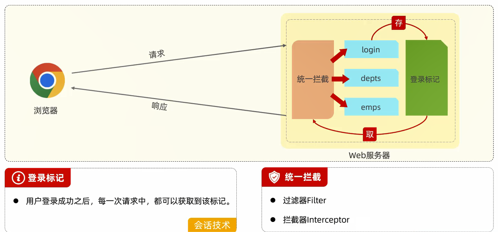

# 基础登录功能

controller类:

```java
@Slf4j
@RestController
@RequestMapping("/login")
public class LoginController {
    @Autowired
    private EmpService empService;

    @PostMapping
    public Result login(@RequestBody Emp emp) {
        // 日志记录
        log.info("员工登录,{}", emp.getName());
        // 员工登录
        Emp e = empService.login(emp);
        return e != null ? Result.success() : Result.error("用户名/密码错误");
    }
}
```

service接口类:

```java
public interface EmpService {
    // 员工登录
    Emp login(Emp emp);
}
```

service实现类:

```java
@Service
public class EmpServiceImpl implements EmpService {
    @Autowired
    private EmpMapper empMapper;
    
    // 员工登录
    @Override
    public Emp login(Emp emp) {
        return empMapper.getByUsernameAndPassword(emp);
    }
}
```

mapper接口类:

```java
@Mapper
public interface EmpMapper {
    // 根据用户名和密码查询员工
    Emp getByUsernameAndPassword(Emp emp);
}
```

xml配置文件:

```xml
<?xml version="1.0" encoding="UTF-8" ?>
<!DOCTYPE mapper
        PUBLIC "-//mybatis.org//DTD Mapper 3.0//EN"
        "http://mybatis.org/dtd/mybatis-3-mapper.dtd">
<mapper namespace="com.jinzhao.mapper.EmpMapper">
    <!--根据用户名和密码查询员工-->
    <select id="getByUsernameAndPassword" resultType="com.jinzhao.pojo.Emp">
        select id,
               username,
               password,
               name,
               gender,
               image,
               job,
               entrydate,
               dept_id,
               create_time,
               update_time
        from emp
        where username = #{username}
          and password = #{password}
    </select>
</mapper>
```

# 登录校验



# 会话技术

会话:用户打开浏览器,访问Web服务器的资源,会话建立,直到有一方断开连接,会话结束,**一次会话中可以包含多次请求和响应**

会话跟踪:一种维护浏览器状态的方法,服务器需要识别多次请求是否来自于同一浏览器,**以便在同一次会话的多次请求间共享数据**


# JWT令牌


# 过滤器Filter


# 拦截器Interceptor

