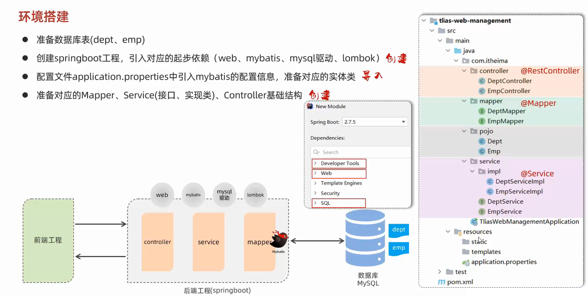

# 准备工作



## 准备数据库表

```sql
-- 创建部门表
create table dept
(
    id          int unsigned primary key auto_increment comment '主键ID',
    name        varchar(10) not null unique comment '部门名称',
    create_time datetime    not null comment '创建时间',
    update_time datetime    not null comment '修改时间'
) comment '部门表';

-- 部门表导入数据
insert into dept (id, name, create_time, update_time)
values (1, '学工部', now(), now()),
       (2, '教研部', now(), now()),
       (3, '咨询部', now(), now()),
       (4, '就业部', now(), now()),
       (5, '人事部', now(), now());

-- 创建员工表
create table emp
(
    id          int unsigned primary key auto_increment comment 'ID',
    username    varchar(20) not null unique comment '用户名',
    password    varchar(32) default '123456' comment '密码',
    name        varchar(10) not null comment '姓名',
    gender      tinyint unsigned not null comment '性别, 说明: 1 男, 2 女',
    image       varchar(300) comment '图像',
    job         tinyint unsigned comment '职位, 说明: 1 班主任,2 讲师, 3 学工主管, 4 教研主管, 5 咨询师',
    entry_date  date comment '入职时间',
    dept_id     int unsigned comment '部门ID',
    create_time datetime    not null comment '创建时间',
    update_time datetime    not null comment '修改时间'
) comment '员工表';

-- 员工表导入数据
INSERT INTO emp
(id, username, password, name, gender, image, job, entry_date, dept_id, create_time, update_time)
VALUES (1, 'jinyong', '123456', '金庸', 1, '1.jpg', 4, '2000-01-01', 2, now(), now()),
       (2, 'zhangwuji', '123456', '张无忌', 1, '2.jpg', 2, '2015-01-01', 2, now(), now()),
       (3, 'yangxiao', '123456', '杨逍', 1, '3.jpg', 2, '2008-05-01', 2, now(), now()),
       (4, 'weiyixiao', '123456', '韦一笑', 1, '4.jpg', 2, '2007-01-01', 2, now(), now()),
       (5, 'changyuchun', '123456', '常遇春', 1, '5.jpg', 2, '2012-12-05', 2, now(), now()),
       (6, 'xiaozhao', '123456', '小昭', 2, '6.jpg', 3, '2013-09-05', 1, now(), now()),
       (7, 'jixiaofu', '123456', '纪晓芙', 2, '7.jpg', 1, '2005-08-01', 1, now(), now()),
       (8, 'zhouzhiruo', '123456', '周芷若', 2, '8.jpg', 1, '2014-11-09', 1, now(), now()),
       (9, 'dingminjun', '123456', '丁敏君', 2, '9.jpg', 1, '2011-03-11', 1, now(), now()),
       (10, 'zhaomin', '123456', '赵敏', 2, '10.jpg', 1, '2013-09-05', 1, now(), now()),
       (11, 'luzhangke', '123456', '鹿杖客', 1, '11.jpg', 5, '2007-02-01', 3, now(), now()),
       (12, 'hebiweng', '123456', '鹤笔翁', 1, '12.jpg', 5, '2008-08-18', 3, now(), now()),
       (13, 'fangdongbai', '123456', '方东白', 1, '13.jpg', 5, '2012-11-01', 3, now(), now()),
       (14, 'zhangsanfeng', '123456', '张三丰', 1, '14.jpg', 2, '2002-08-01', 2, now(), now()),
       (15, 'yulianzhou', '123456', '俞莲舟', 1, '15.jpg', 2, '2011-05-01', 2, now(), now()),
       (16, 'songyuanqiao', '123456', '宋远桥', 1, '16.jpg', 2, '2007-01-01', 2, now(), now()),
       (17, 'chenyouliang', '123456', '陈友谅', 1, '17.jpg', NULL, '2015-03-21', NULL, now(), now());
```

## 准备对应的实体类

部门-Dept类:

```java
package pojo;

import lombok.AllArgsConstructor;
import lombok.Data;
import lombok.NoArgsConstructor;

import java.time.LocalDateTime;

@Data
@NoArgsConstructor
@AllArgsConstructor
public class Dept {
    private Integer id;
    private String name;
    private LocalDateTime createTime;
    private LocalDateTime updateTime;
}
```

员工-Emp类:

```java
package pojo;

import lombok.AllArgsConstructor;
import lombok.Data;
import lombok.NoArgsConstructor;

import java.time.LocalDate;
import java.time.LocalDateTime;

@Data
@NoArgsConstructor
@AllArgsConstructor
public class Emp {
    private Integer id;
    private String username;
    private String password;
    private String name;
    private Short gender;
    private String image;
    private Short job;
    private LocalDate entryDate;
    private Integer deptId;
    private LocalDateTime createTime;
    private LocalDateTime updateTime;
}
```

统一响应结果-Result类:

```java
package pojo;

import lombok.AllArgsConstructor;
import lombok.Data;
import lombok.NoArgsConstructor;

@Data
@NoArgsConstructor
@AllArgsConstructor
public class Result {
    private Integer code;
    private String msg;
    private Object data;

    public static Result success() {
        return new Result(1, "success", null);
    }

    public static Result success(Object data) {
        return new Result(1, "success", data);
    }

    public static Result error(String msg) {
        return new Result(0, msg, null);
    }
}
```

## 引入MyBatis配置信息

```properties
spring.application.name=ClassManagementSystem
spring.datasource.driver-class-name=com.mysql.cj.jdbc.Driver
spring.datasource.url=jdbc:mysql://192.168.1.13:3306/springboot_web
spring.datasource.username=root
spring.datasource.password=123456
mybatis.configuration.map-underscore-to-camel-case=true
mybatis.configuration.log-impl=org.apache.ibatis.logging.stdout.StdOutImpl
```

# 部门管理


## 部门列表查询

Controller类:

```java
@Slf4j
@RestController
public class DeptController {
    @Autowired
    private DeptService deptService;

    @GetMapping("/depts")
    public Result listDept() {
        // 日志记录
        log.info("查询全部部门数据");
        // 部门列表查询
        List<Dept> deptList = deptService.list();
        return Result.success(deptList);
    }
}
```

Service接口类:

```java
public interface DeptService {
    // 部门列表查询
    List<Dept> list();
}
```

Service实现类:

```java
@Service
public class DeptServiceImpl implements DeptService {
    @Autowired
    private DeptMapper deptMapper;

    // 部门列表查询
    @Override
    public List<Dept> list() {
        return deptMapper.list();
    }
}
```

Mapper类:

```java
@Mapper
public interface DeptMapper {
    // 部门列表查询
    List<Dept> list();
}
```

XML配置文件:

```xml
<?xml version="1.0" encoding="UTF-8" ?>
<!DOCTYPE mapper
        PUBLIC "-//mybatis.org//DTD Mapper 3.0//EN"
        "http://mybatis.org/dtd/mybatis-3-mapper.dtd">
<mapper namespace="com.jinzhao.Mapper.DeptMapper">
    <!--部门列表查询-->
    <select id="list" resultType="com.jinzhao.pojo.Dept">
        select id, name, create_time, update_time
        from dept
    </select>
</mapper>
```

## 删除部门

Controller类:

```java
@Slf4j
@RestController
public class DeptController {
    @Autowired
    private DeptService deptService;

    @DeleteMapping("/depts/{id}")
    public Result deleteDept(@PathVariable Integer id) {
        // 日志记录
        log.info("根据Id删除部门,{}", id);
        // 根据Id删除部门
        deptService.delete(id);
        return Result.success();
    }
}
```

Service接口类:

```java
public interface DeptService {
    // 根据Id删除部门
    void delete(Integer id);
}
```

Service实现类:

```java
@Service
public class DeptServiceImpl implements DeptService {
    @Autowired
    private DeptMapper deptMapper;

    // 根据Id删除部门
    @Override
    public void delete(Integer id) {
        deptMapper.deleteById(id);
    }
}
```

Mapper类:

```java
@Mapper
public interface DeptMapper {
    // 根据Id删除部门
    void deleteById(Integer id);
}
```

XML配置文件:

```xml
<?xml version="1.0" encoding="UTF-8" ?>
<!DOCTYPE mapper
        PUBLIC "-//mybatis.org//DTD Mapper 3.0//EN"
        "http://mybatis.org/dtd/mybatis-3-mapper.dtd">
<mapper namespace="com.jinzhao.Mapper.DeptMapper">
    <!--根据Id删除部门-->
    <delete id="deleteById">
        delete
        from dept
        where id = #{id}
    </delete>
</mapper>
```

## 添加部门

Controller类:

```java
@Slf4j
@RestController
public class DeptController {
    @Autowired
    private DeptService deptService;

    @PostMapping("/depts")
    public Result addDept(@RequestBody Dept dept){
        // 日志记录
        log.info("添加部门,{}",dept.getName());
        // 添加部门
        deptService.add(dept);
        return Result.success();
    }
}
```

Service接口类:

```java
public interface DeptService {
    // 添加部门
    void add(Dept dept);
}
```

Service实现类:

```java
@Service
public class DeptServiceImpl implements DeptService {
    @Autowired
    private DeptMapper deptMapper;

    // 添加部门
    @Override
    public void add(Dept dept) {
        // 补全基本属性
        dept.setCreateTime(LocalDateTime.now());
        dept.setUpdateTime(LocalDateTime.now());
        deptMapper.add(dept);
    }
}
```

Mapper类:

```java
@Mapper
public interface DeptMapper {
    // 添加部门
    void add(Dept dept);
}
```

XML配置文件:

```xml
<?xml version="1.0" encoding="UTF-8" ?>
<!DOCTYPE mapper
        PUBLIC "-//mybatis.org//DTD Mapper 3.0//EN"
        "http://mybatis.org/dtd/mybatis-3-mapper.dtd">
<mapper namespace="com.jinzhao.Mapper.DeptMapper">
    <!--添加部门-->
    <insert id="add">
        insert into dept(name, create_time, update_time)
        values (#{name}, #{createTime}, #{updateTime})
    </insert>
</mapper>
```

## 根据Id查询部门

Controller类:

```java
@Slf4j
@RestController
public class DeptController {
    @Autowired
    private DeptService deptService;

    @GetMapping("/depts/{id}")
    public Result getDeptById(@PathVariable Integer id) {
        // 日志记录
        log.info("根据Id查询部门,{}", id);
        // 根据Id查询部门
        Dept dept = deptService.getById(id);
        return Result.success(dept);
    }
}
```

Service接口类:

```java
public interface DeptService {
    // 根据Id查询部门
    Dept getById(Integer id);
}
```

Service实现类:

```java
@Service
public class DeptServiceImpl implements DeptService {
    @Autowired
    private DeptMapper deptMapper;

    // 根据Id查询部门
    @Override
    public Dept getById(Integer id) {
        return deptMapper.getById(id);
    }
}
```

Mapper类:

```java
@Mapper
public interface DeptMapper {
    // 根据Id查询部门
    Dept getById(Integer id);
}
```

XML配置文件:

```xml
<?xml version="1.0" encoding="UTF-8" ?>
<!DOCTYPE mapper
        PUBLIC "-//mybatis.org//DTD Mapper 3.0//EN"
        "http://mybatis.org/dtd/mybatis-3-mapper.dtd">
<mapper namespace="com.jinzhao.Mapper.DeptMapper">
    <!--根据Id查询部门-->
    <select id="getById" resultType="com.jinzhao.pojo.Dept">
        select id, name, create_time, update_time
        from dept
        where id = #{id}
    </select>
</mapper>
```

## 修改部门

Controller类:

```java
@Slf4j
@RestController
public class DeptController {
    @Autowired
    private DeptService deptService;

    @PutMapping("/depts")
    public Result updateDept(@RequestBody Dept dept){
        // 日志记录
        log.info("修改部门名称,{}",dept.getName());
        // 修改部门
        deptService.update(dept);
        return Result.success();
    }
}
```

Service接口类:

```java
public interface DeptService {
    // 修改部门
    void update(Dept dept);
}
```

Service实现类:

```java
@Service
public class DeptServiceImpl implements DeptService {
    @Autowired
    private DeptMapper deptMapper;

    // 修改部门
    @Override
    public void update(Dept dept) {
        // 补全基本属性
        dept.setUpdateTime(LocalDateTime.now());
        deptMapper.update(dept);
    }
}
```

Mapper类:

```java
@Mapper
public interface DeptMapper {
    // 修改部门
    void update(Dept dept);
}
```

XML配置文件:

```xml
<?xml version="1.0" encoding="UTF-8" ?>
<!DOCTYPE mapper
        PUBLIC "-//mybatis.org//DTD Mapper 3.0//EN"
        "http://mybatis.org/dtd/mybatis-3-mapper.dtd">
<mapper namespace="com.jinzhao.Mapper.DeptMapper">
    <!--修改部门-->
    <update id="update">
        update dept
        set name=#{name},
            update_time=#{updateTime}
        where id = #{id}
    </update>
</mapper>
```

## 综合代码

Controller类:

```java
package com.jinzhao.Controller;

import com.jinzhao.Service.DeptService;
import com.jinzhao.pojo.Dept;
import com.jinzhao.pojo.Result;
import lombok.extern.slf4j.Slf4j;
import org.springframework.beans.factory.annotation.Autowired;
import org.springframework.web.bind.annotation.*;

import java.util.List;

@Slf4j
@RestController
// 将方法上共有的请求路径抽取到类上
// 细节:一个完整的请求路径,应该是类上的@RequestMapping的value属性+方法上的@RequestMapping的value属性
@RequestMapping("/depts")
public class DeptController {
    @Autowired
    private DeptService deptService;

    @GetMapping
    public Result listDept() {
        // 日志记录
        log.info("查询全部部门数据");
        // 查询全部部门数据
        List<Dept> deptList = deptService.list();
        return Result.success(deptList);
    }

    @DeleteMapping("/{id}")
    public Result deleteDept(@PathVariable Integer id) {
        // 日志记录
        log.info("根据Id删除部门,{}", id);
        // 根据Id删除部门
        deptService.delete(id);
        return Result.success();
    }

    @PostMapping
    public Result addDept(@RequestBody Dept dept) {
        // 日志记录
        log.info("添加部门,{}", dept.getName());
        // 添加部门
        deptService.add(dept);
        return Result.success();
    }

    @GetMapping("/{id}")
    public Result getDeptById(@PathVariable Integer id) {
        // 日志记录
        log.info("根据Id查询部门,{}", id);
        // 根据Id查询部门
        Dept dept = deptService.getById(id);
        return Result.success(dept);
    }

    @PutMapping
    public Result updateDept(@RequestBody Dept dept){
        // 日志记录
        log.info("修改部门名称,{}",dept.getName());
        // 修改部门
        deptService.update(dept);
        return Result.success();
    }
}
```
Service接口类:

```java
package com.jinzhao.Service;

import com.jinzhao.pojo.Dept;

import java.util.List;

public interface DeptService {
    // 查询全部部门数据
    List<Dept> list();

    // 根据Id删除部门
    void delete(Integer id);

    // 添加部门
    void add(Dept dept);

    // 根据Id查询部门
    Dept getById(Integer id);

    // 修改部门
    void update(Dept dept);
}
```

Service实现类:

```java
package com.jinzhao.Service.impl;

import com.jinzhao.Mapper.DeptMapper;
import com.jinzhao.Service.DeptService;
import com.jinzhao.pojo.Dept;
import org.springframework.beans.factory.annotation.Autowired;
import org.springframework.stereotype.Service;

import java.time.LocalDateTime;
import java.util.List;

@Service
public class DeptServiceImpl implements DeptService {
    @Autowired
    private DeptMapper deptMapper;

    // 查询全部部门数据
    @Override
    public List<Dept> list() {
        return deptMapper.list();
    }

    // 根据Id删除部门
    @Override
    public void delete(Integer id) {
        deptMapper.deleteById(id);
    }

    // 添加部门
    @Override
    public void add(Dept dept) {
        // 补全基本属性
        dept.setCreateTime(LocalDateTime.now());
        dept.setUpdateTime(LocalDateTime.now());
        deptMapper.add(dept);
    }

    // 根据Id查询部门
    @Override
    public Dept getById(Integer id) {
        return deptMapper.getById(id);
    }

    // 修改部门
    @Override
    public void update(Dept dept) {
        // 补全基本属性
        dept.setUpdateTime(LocalDateTime.now());
        deptMapper.update(dept);
    }
}
```

Mapper类:

```java
package com.jinzhao.Mapper;

import com.jinzhao.pojo.Dept;
import org.apache.ibatis.annotations.Mapper;

import java.util.List;

@Mapper
public interface DeptMapper {
    // 查询全部部门数据
    List<Dept> list();

    // 根据Id删除部门
    void deleteById(Integer id);

    // 添加部门
    void add(Dept dept);

    // 根据Id查询部门
    Dept getById(Integer id);

    // 修改部门
    void update(Dept dept);
}
```

XML配置文件:

```xml
<?xml version="1.0" encoding="UTF-8" ?>
<!DOCTYPE mapper
        PUBLIC "-//mybatis.org//DTD Mapper 3.0//EN"
        "http://mybatis.org/dtd/mybatis-3-mapper.dtd">
<mapper namespace="com.jinzhao.Mapper.DeptMapper">
    <!--添加部门-->
    <insert id="add">
        insert into dept(name, create_time, update_time)
        values (#{name}, #{createTime}, #{updateTime})
    </insert>
    <!--修改部门-->
    <update id="update">
        update dept
        set name=#{name},
            update_time=#{updateTime}
        where id = #{id}
    </update>
    <!--根据Id删除部门-->
    <delete id="deleteById">
        delete
        from dept
        where id = #{id}
    </delete>
    <!--查询全部部门数据-->
    <select id="list" resultType="com.jinzhao.pojo.Dept">
        select id, name, create_time, update_time
        from dept
    </select>
    <!--根据Id查询部门-->
    <select id="getById" resultType="com.jinzhao.pojo.Dept">
        select id, name, create_time, update_time
        from dept
        where id = #{id}
    </select>
</mapper>
```

# 员工管理


## 员工列表查询


## 删除员工

## 添加员工

## 根据Id查询员工

## 修改员工

## 文件上传

# 其他接口

## 登录