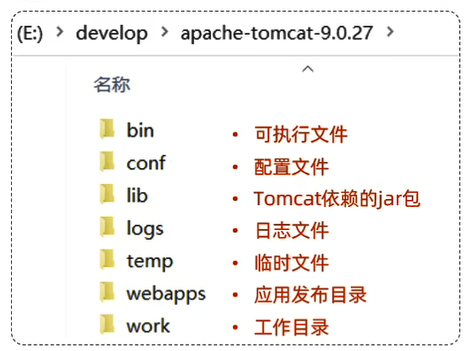

# Web服务器

Web服务器是一个软件程序,对HTTP协议的操作进行封装,使得程序员不必直接对协议进行操作,让Web开发更加便捷                 
主要功能是提供网上信息浏览服务

# Tomcat

概念:Tomcat是Apache软件基金会的一个核心项目,是一个开源免费的轻量级Web服务器,支持Servlet/JSP少量Java EE规范

Java EE:Java Enterprise Edition,Java企业版                  
指Java企业级开发的技术规范总和,包含13项技术规范:JDBC、JNDI、EJB、RMI、JSP、Servlet、XML、JMS、Java IDL、JTS、JTA、JavaMail、JAF

Tomcat也被称为Web容器、Servlet容器(Servlet程序需要依赖于Tomcat才能运行)

[Tomcat官方网站](https://tomcat.apache.org/)

# 基本使用

## 启动Tomcat

双击bin\startup.bat

## 控制台中文乱码 

修改conf/logging.properties中的java.util.logging.ConsoleHandler.encoding = UTF-8为GBK

## 关闭Tomcat

1. 直接关掉运行窗口:强制关闭
2. bin\shutdown.bat:正常关闭
3. Ctrl+C:正常关闭

## 配置Tomcat端口号

修改conf/server.xml中的port="8080"为其他端口号      

## 部署项目

将项目放置到webapps目录下,即部署完成