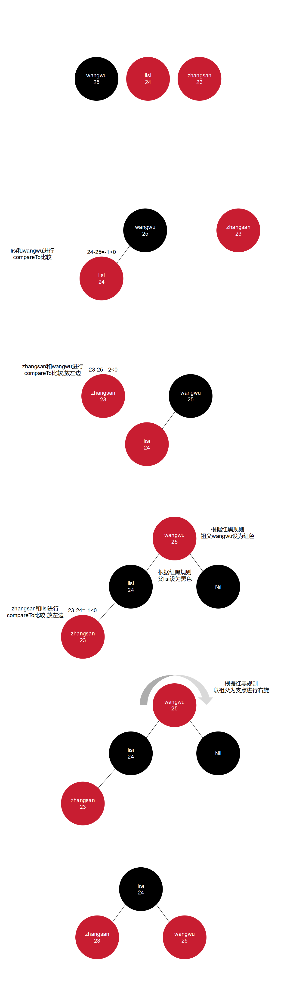

# TreeSet

TreeSet: `Tree` -- 树,`Set` -- 属于`Set`系列的一员

# 特点

1. **可排序**:按照元素的默认规则(从小到大)排序
2. 不重复:可以去除重复
3. 无索引:没有带索引的方法,所以不能使用普通的for循环遍历,也不能通过索引来获取元素

## 底层原理

基于**红黑树**的数据结构实现排序的,增删改查性能都较好

练习: 

存储整数并进行排序

```java
import java.util.TreeSet;

public class test {
    public static void main(String[] args) {
        TreeSet<Integer> set = new TreeSet<>();
        set.add(12);
        set.add(123);
        set.add(21);
        set.add(11);
        for (Integer integer : set) {
            // 打印结果:"11 12 21 123 "
            System.out.print(integer + " ");
        }
    }
}
```

## 排序规则

1. 对于数值类型:Integer、Double默认按照从小到大的顺序进行排序
2. 对于字符、字符串类型:按照字符在ASCII码表中的数字升序进行排序

# 两种比较方式

**使用原则:默认使用第一种,如果第一种不能满足当前需求,就使用第二种**

**如果两种比较方式都存在,系统会优先调用第二种比较方式**

## 默认排序/自然排序

JavaBean类实现Comparable接口指定比较规则

`return this.getAge() - o.getAge();`                 
其中this表示要添加的元素,o表示已经在红黑树中存在的元素

返回值:
1. 负数:认为要添加的元素是小的,存左边
2. 正数:认为要添加的元素是大的,存右边
3. 0:认为要添加的元素已经存在,舍弃

范例:

```java
public class Student implements Comparable<Student> {
    private String name;
    private int age;

    public Student() {
    }

    public Student(String name, int age) {
        this.name = name;
        this.age = age;
    }

    public String getName() {
        return name;
    }

    public void setName(String name) {
        this.name = name;
    }

    public int getAge() {
        return age;
    }

    public void setAge(int age) {
        this.age = age;
    }

    @Override
    public String toString() {
        return "Student{" +
                "name='" + name + '\'' +
                ", age=" + age +
                '}';
    }

    @Override
    public int compareTo(Student o) {
        // 按照年龄的升序进行排序
        return this.getAge() - o.getAge();
    }
}
```

```java
import java.util.TreeSet;

public class StudentTest {
    public static void main(String[] args) {
        Student student1 = new Student("zhangsan", 23);
        Student student2 = new Student("lisi", 24);
        Student student3 = new Student("wangwu", 25);
        TreeSet<Student> ts = new TreeSet<>();
        ts.add(student3);
        ts.add(student2);
        ts.add(student1);
        // 打印结果:"[Student{name='zhangsan', age=23}, Student{name='lisi', age=24}, Student{name='wangwu', age=25}]"
        System.out.println(ts);
    }
}
```



## 比较器排序

创建TreeSet对象的时候,传递比较器Comparetor指定规则

范例:

要求:存入四个字符串,"c","ab","df","qwer",按照长度排序,如果一样长则按照首字母排序

```java
TreeSet<String> set2 = new TreeSet<>(new Comparator<String>() {
            @Override
            public int compare(String o1, String o2) {
                return 0;
            }
        });
```

其中o1表示当前要添加的元素,o2表示已经在红黑树中存在的元素

返回值:
1. 负数:认为要添加的元素是小的,存左边
2. 正数:认为要添加的元素是大的,存右边
3. 0:认为要添加的元素已经存在,舍弃

```java
import java.util.Comparator;
import java.util.TreeSet;

public class test {
    public static void main(String[] args) {
        TreeSet<String> set1 = new TreeSet<>();
        set1.add("c");
        set1.add("ab");
        set1.add("df");
        set1.add("qwer");

        // 打印结果:"[ab, c, df, qwer]"
        System.out.println(set1);

        TreeSet<String> set2 = new TreeSet<>(new Comparator<String>() {
            @Override
            public int compare(String o1, String o2) {
                // 按照长度排序
                int i = o1.length() - o2.length();
                // 如果一样长,则按照首字母排序(即默认规则排序)
                return i == 0 ? o1.compareTo(o2) : i;
            }
        });

//        // 匿名内部类(接口实现类)改成Lambda表达式
//        TreeSet<String> set2 = new TreeSet<>((o1, o2) -> {
//            // 按照长度排序
//            int i = o1.length() - o2.length();
//            // 如果一样长,则按照首字母排序(即默认规则排序)
//            return i == 0 ? o1.compareTo(o2) : i;
//        });

        set2.add("c");
        set2.add("ab");
        set2.add("df");
        set2.add("qwer");

        // 打印结果:"[c, ab, df, qwer]"
        System.out.println(set2);
    }
}
```

练习:

需求:创建6个学生对象

属性:姓名、年龄、语文成绩、数学成绩、英语成绩

要求:
1. 按照总分从高到低输出到控制台
2. 如果总分一样,按照语文成绩排
3. 如果语文一样,按照数学成绩排
4. 如果数学一样,按照英语成绩排
5. 如果英语一样,按照年龄排
6. 如果年龄一样,按照姓名的字母顺序排
7. 如果都一样,认为是同一个学生,不存

实现Comparable接口指定比较规则:

```java
public class Student implements Comparable<Student> {
    private String name;
    private int age;

    private int chineseScore;
    private int mathScore;
    private int englishScore;

    public Student() {
    }

    public Student(String name, int age, int chineseScore, int mathScore, int englishScore) {
        this.name = name;
        this.age = age;
        this.chineseScore = chineseScore;
        this.mathScore = mathScore;
        this.englishScore = englishScore;
    }

    public String getName() {
        return name;
    }

    public void setName(String name) {
        this.name = name;
    }

    public int getAge() {
        return age;
    }

    public void setAge(int age) {
        this.age = age;
    }

    public int getChineseScore() {
        return chineseScore;
    }

    public void setChineseScore(int chineseScore) {
        this.chineseScore = chineseScore;
    }

    public int getMathScore() {
        return mathScore;
    }

    public void setMathScore(int mathScore) {
        this.mathScore = mathScore;
    }

    public int getEnglishScore() {
        return englishScore;
    }

    public void setEnglishScore(int englishScore) {
        this.englishScore = englishScore;
    }

    @Override
    public String toString() {
        return "Student{" +
                "name='" + name + '\'' +
                ", age=" + age +
                ", chineseScore=" + chineseScore +
                ", mathScore=" + mathScore +
                ", englishScore=" + englishScore +
                '}';
    }

    @Override
    public int compareTo(Student o) {
        int thisCount = this.getChineseScore() + this.getMathScore() + this.getEnglishScore();
        int oCount = o.getChineseScore() + o.getMathScore() + o.getEnglishScore();
        // 按照总分从高到低输出到控制台
        int countSort = thisCount - oCount;
        // 如果总分一样,按照语文成绩排
        int chineseSort = countSort == 0 ? this.getChineseScore() - o.getChineseScore() : countSort;
        // 如果语文一样,按照数学成绩排
        int mathSort = chineseSort == 0 ? this.getMathScore() - o.getMathScore() : chineseSort;
        // 如果数学一样,按照英语成绩排
        int englishSort = mathSort == 0 ? this.getEnglishScore() - o.getEnglishScore() : mathSort;
        // 如果英语一样,按照年龄排(可省略)
        int ageSort = englishSort == 0 ? this.getAge() - o.getAge() : englishSort;
        // 如果年龄一样,按照姓名的字母顺序排
        return ageSort == 0 ? this.getName().compareTo(o.getName()) : ageSort;
    }
}
```

```java
import java.util.Comparator;
import java.util.TreeSet;

public class StudentTest {
    public static void main(String[] args) {
        Student s1 = new Student("zhansan1", 23, 88, 90, 100);
        Student s2 = new Student("lisi", 23, 50, 128, 100);
        Student s3 = new Student("wangwu1", 23, 50, 129, 99);
        Student s4 = new Student("wangwu2", 22, 50, 129, 99);
        Student s5 = new Student("xiaowangwu", 22, 50, 129, 99);
        Student s6 = new Student("wangwu2", 22, 50, 129, 99);

        TreeSet<Student> ts = new TreeSet<>();

        ts.add(s1);
        ts.add(s2);
        ts.add(s3);
        ts.add(s4);
        ts.add(s5);
        ts.add(s6);

        // 打印结果:"Student{name='lisi', age=23, chineseScore=50, mathScore=128, englishScore=100}"
        // 打印结果:"Student{name='wangwu2', age=22, chineseScore=50, mathScore=129, englishScore=99}"
        // 打印结果:"Student{name='xiaowangwu', age=22, chineseScore=50, mathScore=129, englishScore=99}"
        // 打印结果:"Student{name='wangwu1', age=23, chineseScore=50, mathScore=129, englishScore=99}"
        // 打印结果:"Student{name='zhansan1', age=23, chineseScore=88, mathScore=90, englishScore=100}"
        for (Student t : ts) {
            System.out.println(t);
        }
    }
}
```

传递比较器Comparetor指定规则:

```java
public class Student {
    private String name;
    private int age;

    private int chineseScore;
    private int mathScore;
    private int englishScore;

    public Student() {
    }

    public Student(String name, int age, int chineseScore, int mathScore, int englishScore) {
        this.name = name;
        this.age = age;
        this.chineseScore = chineseScore;
        this.mathScore = mathScore;
        this.englishScore = englishScore;
    }

    public String getName() {
        return name;
    }

    public void setName(String name) {
        this.name = name;
    }

    public int getAge() {
        return age;
    }

    public void setAge(int age) {
        this.age = age;
    }

    public int getChineseScore() {
        return chineseScore;
    }

    public void setChineseScore(int chineseScore) {
        this.chineseScore = chineseScore;
    }

    public int getMathScore() {
        return mathScore;
    }

    public void setMathScore(int mathScore) {
        this.mathScore = mathScore;
    }

    public int getEnglishScore() {
        return englishScore;
    }

    public void setEnglishScore(int englishScore) {
        this.englishScore = englishScore;
    }

    @Override
    public String toString() {
        return "Student{" +
                "name='" + name + '\'' +
                ", age=" + age +
                ", chineseScore=" + chineseScore +
                ", mathScore=" + mathScore +
                ", englishScore=" + englishScore +
                '}';
    }
}
```

```java
import java.util.Comparator;
import java.util.TreeSet;

public class StudentTest {
    public static void main(String[] args) {
        Student s1 = new Student("zhansan1", 23, 88, 90, 100);
        Student s2 = new Student("lisi", 23, 50, 128, 100);
        Student s3 = new Student("wangwu1", 23, 50, 129, 99);
        Student s4 = new Student("wangwu2", 22, 50, 129, 99);
        Student s5 = new Student("xiaowangwu", 22, 50, 129, 99);
        Student s6 = new Student("wangwu2", 22, 50, 129, 99);

        TreeSet<Student> ts = new TreeSet<>(new Comparator<Student>() {
            @Override
            public int compare(Student o1, Student o2) {
                // 按照总分从高到低输出到控制台
                int countSort = (o1.getChineseScore() + o1.getMathScore() + o1.getEnglishScore()) - (o2.getChineseScore() + o2.getMathScore() + o2.getEnglishScore());
                // 如果总分一样,按照语文成绩排
                int chineseSort = countSort == 0 ? o1.getChineseScore() - o2.getChineseScore() : countSort;
                // 如果语文一样,按照数学成绩排
                int mathSort = chineseSort == 0 ? o1.getMathScore() - o2.getMathScore() : chineseSort;
                // 如果数学一样,按照英语成绩排
                int englishSort = mathSort == 0 ? o1.getEnglishScore() - o2.getEnglishScore() : mathSort;
                // 如果英语一样,按照年龄排(可省略)
                int ageSort = englishSort == 0 ? o1.getAge() - o2.getAge() : englishSort;
                // 如果年龄一样,按照姓名的字母顺序排
                return ageSort == 0 ? o1.getName().compareTo(o2.getName()) : ageSort;
            }
        });

        ts.add(s1);
        ts.add(s2);
        ts.add(s3);
        ts.add(s4);
        ts.add(s5);
        ts.add(s6);

        // 打印结果:"Student{name='lisi', age=23, chineseScore=50, mathScore=128, englishScore=100}"
        // 打印结果:"Student{name='wangwu2', age=22, chineseScore=50, mathScore=129, englishScore=99}"
        // 打印结果:"Student{name='xiaowangwu', age=22, chineseScore=50, mathScore=129, englishScore=99}"
        // 打印结果:"Student{name='wangwu1', age=23, chineseScore=50, mathScore=129, englishScore=99}"
        // 打印结果:"Student{name='zhansan1', age=23, chineseScore=88, mathScore=90, englishScore=100}"
        for (Student t : ts) {
            System.out.println(t);
        }
    }
}
```