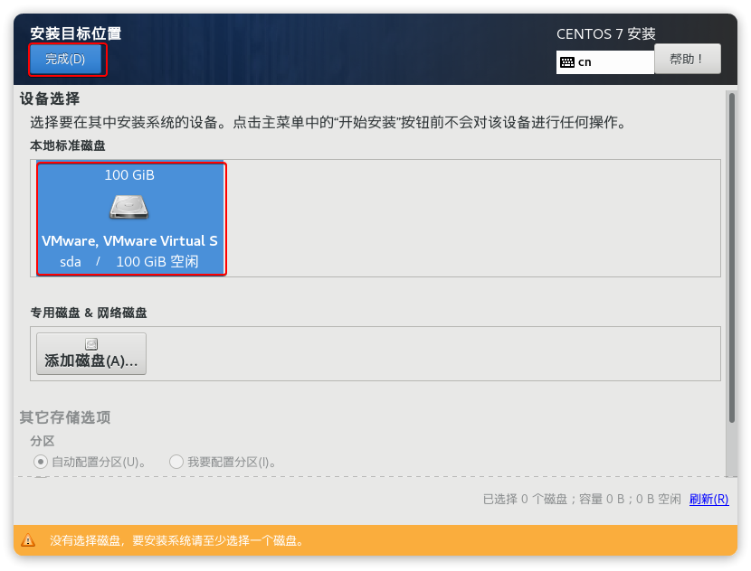
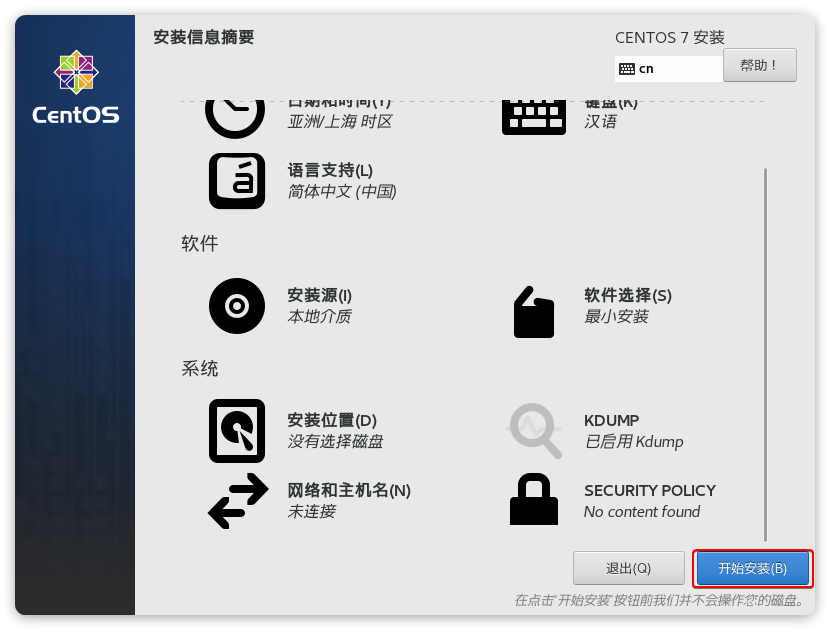
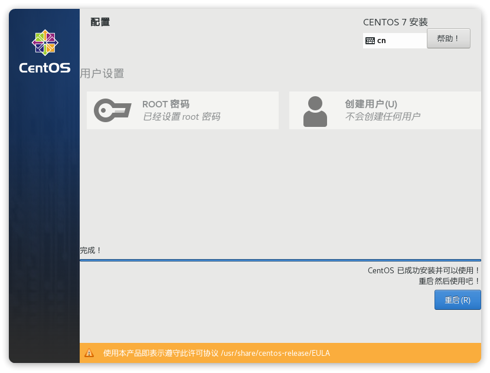

# 创建虚拟机

1. 下载在官网下载CentOS7的iso文件

[CentOS官网](https://www.centos.org/download/)

2. 启动VMWare,点击`创建新的虚拟机`

3. 弹出窗口,点击`下一步`

4. 在页面中选择准备好的iso文件,点击`下一步`

5. 填写`虚拟机名称`以及虚拟机的存储位置,点击`下一步`

6. 填写`虚拟机磁盘大小`,选择`将虚拟磁盘存储为单个文件`,点击`下一步`

7. 选择`自定义硬件`

8. 设置`内存大小`和`处理器数量`,点击`关闭`

9. 返回上一页面,点击`完成`,虚拟机即创建完毕

# 安装CentOS7

1. 点击`开启此虚拟机`

2. 启动后需要选择安装菜单,将鼠标移入黑窗口中后,将无法再使用鼠标,需要按上下键选择菜单,选中`Install Centos 7`后按下`回车`

3. 提示按下`回车`

4. 等待一会儿后,会进入语言选择菜单,这里可以使用鼠标选择,选择`中文-简体中文`,点击`继续`

5. 进入安装配置页面,鼠标向下滚动后,点击`安装位置`

6. 选择`本地标准磁盘`,并点击`完成`

7. 回到配置页面,点击`网络和主机名`

8. 在网络和主机名页面

- 修改主机名为`localhost`
- 点击`应用`
- 打开`网络连接`
- 点击`配置`,配置详细网络信息

**记住本页面的IP地址(192.168.150.103)、子网掩码(255.255.255.0)、默认路由(192.168.150.2)、DNS(192.168.150.2),具体参数以实际页面显示为准**

9. 配置详细网络信息

- 点击`IPv4设置`
- 点击`Add`
- 添加地址:`和上个页面IP地址在同一个局域网内的地址(即192.168.150.XXX)`
- 添加子网掩码:`和上个页面子网掩码相同`
- 添加网关:`和上个页面的默认路由相同`
- 添加DNS服务器:`和上个页面的DNS相同`
- 点击`保存`

10. 点击`完成`

11. 回到配置界面后,点击`开始安装`

12. 点击`ROOT密码`

13. 填写`密码`,点击`完成`,等待安装

14. 安装完成后,点击`重启`

15. 用户输入`root`,密码输入`自己设置的密码`,按下`回车`即可登录CentOS7

