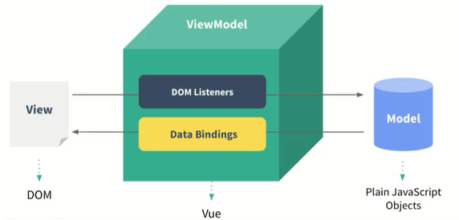
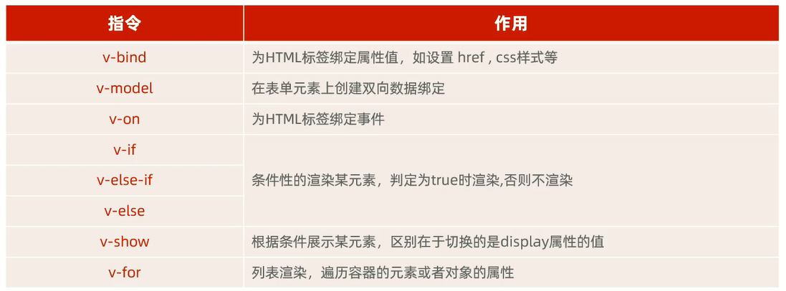
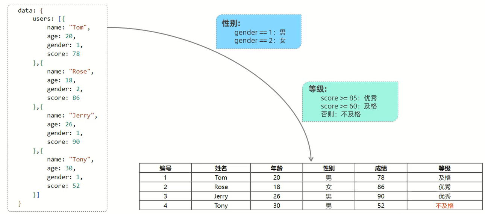
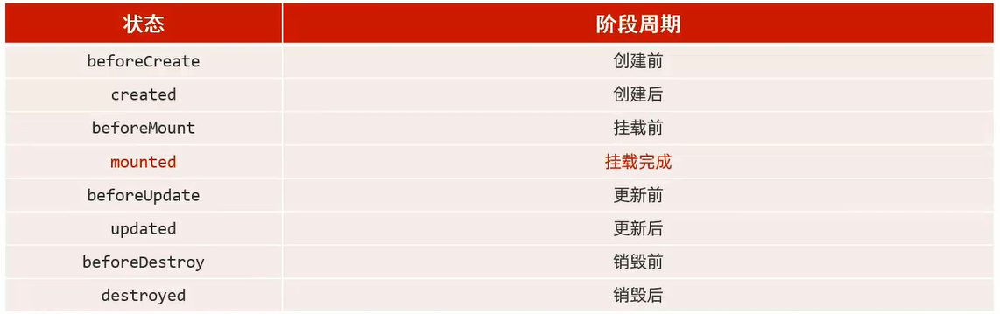
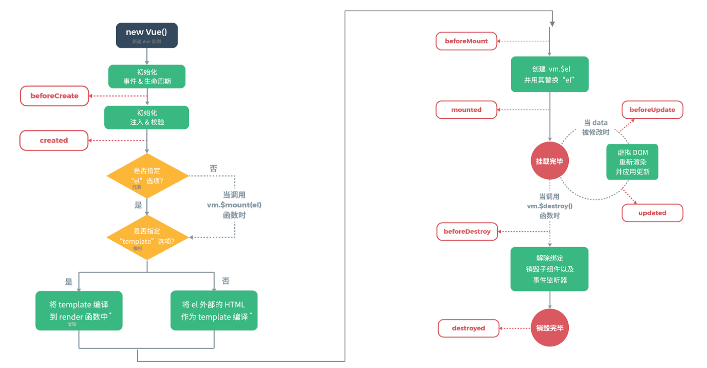

[官方网站](https://cn.vuejs.org/)

# Vue

Vue是一套前端框架,免除原生JavaScript中的DOM操作,简化书写

基于**MVVM(Model-View-ViewModel)**思想,实现数据的**双向绑定**,将编程的关注点放在数据上



## 快速入门

```html
<!DOCTYPE html>
<html lang="en">

<head>
    <meta charset="UTF-8">
    <meta http-equiv="X-UA-Compatible" content="IE=edge">
    <meta name="viewport" content="width=device-width, initial-scale=1.0">
    <title>Vue</title>
    <!--引入Vue.js文件-->
    <script src="js/vue.js"></script>
</head>

<body>
    <!--编写视图-->
    <div id="app">
        <input type="text" v-model="message">
        {{message}}
    </div>
</body>

<script>
    <!--创建Vue核心对象,定义数据模型-->
    new Vue({
        el: "#app",
        data: {
            message: "Hello,Vue"
        }
    })
</script>

</html>
```

## 插值表达式

插值表达式可以将元素在视图中展示出来

格式:`{{表达式}}`

表达式可以是变量、三元运算符、函数调用、算术运算

## 常用指令

指令:HTML标签上带有`v-`前缀的特殊属性,不同指令具有不同含义



### v-bind和v-model

范例:

```html
<!DOCTYPE html>
<html lang="en">

<head>
    <meta charset="UTF-8">
    <meta http-equiv="X-UA-Compatible" content="IE=edge">
    <meta name="viewport" content="width=device-width, initial-scale=1.0">
    <title>Vue</title>
    <script src="js/vue.js"></script>
</head>

<body>
    <div id="app">
        <input type="text" v-model="url">

        <!-- <a v-bind:href="url">官方网站</a> -->
        <a :href="url">跳转到该网站</a>
    </div>
</body>

<script>
    new Vue({
        el: "#app",
        data: {
            url: "https://cn.vuejs.org/"
        }
    })
</script>

</html>
```

细节:**通过v-bind或者v-model绑定的变量,必须在数据模型中声明**

### v-on

范例:

```html
<!DOCTYPE html>
<html lang="en">

<head>
    <meta charset="UTF-8">
    <meta http-equiv="X-UA-Compatible" content="IE=edge">
    <meta name="viewport" content="width=device-width, initial-scale=1.0">
    <title>Vue</title>
    <script src="js/vue.js"></script>
</head>

<body>
    <div id="app">
        <!-- <input type="button" v-on:click="handle()"> -->
        <input type="button" value="跳转" @click="handle()">
    </div>
</body>

<script>
    new Vue({
        el: "#app",
        data: {

        },
        methods: {
            handle: function () {
                alert("跳转成功");
            }
        }
    })
</script>

</html>
```

### v-if、v-else-if、v-else、v-show

范例:

```html
<!DOCTYPE html>
<html lang="en">

<head>
    <meta charset="UTF-8">
    <meta http-equiv="X-UA-Compatible" content="IE=edge">
    <meta name="viewport" content="width=device-width, initial-scale=1.0">
    <title>Vue</title>
    <script src="js/vue.js"></script>
</head>

<body>
    <div id="app">
        请输入年龄&nbsp;<input type="text" v-model="age">&nbsp;经判定,为
        <span v-if="age <= 35">年轻人(35岁及以下)</span>
        <span v-else-if="age >= 36 && age <= 60">中年人(36~60岁)</span>
        <span v-else>老年人(60岁以上)</span>

        <br><br>

        请输入年龄&nbsp;<input type="text" v-model="age">&nbsp;经判定,为
        <span v-show="age <= 35">年轻人(35岁及以下)</span>
        <span v-show="age >= 36 && age <= 60">中年人(36~60岁)</span>
        <span v-show="age > 60">老年人(60岁以上)</span>
    </div>
</body>

<script>
    new Vue({
        el: "#app",
        data: {
            age: 22
        },
        methods: {

        }
    })
</script>

</html>
```

### v-for

范例:

```html
<!DOCTYPE html>
<html lang="en">

<head>
    <meta charset="UTF-8">
    <meta http-equiv="X-UA-Compatible" content="IE=edge">
    <meta name="viewport" content="width=device-width, initial-scale=1.0">
    <title>Vue</title>
    <script src="js/vue.js"></script>
</head>

<body>
    <div id="app">
        <div v-for="item in items">{{item}}</div>
        <br>
        <div v-for="(item, index) in items">{{index+1}} : {{item}}</div>
    </div>
</body>

<script>
    new Vue({
        el: "#app",
        data: {
            items: ["北京", "上海", "南京", "广州", "深圳"]
        },
        methods: {

        }
    })
</script>

</html>
```

### 范例



```html
<!DOCTYPE html>
<html lang="en">

<head>
    <meta charset="UTF-8">
    <meta http-equiv="X-UA-Compatible" content="IE=edge">
    <meta name="viewport" content="width=device-width, initial-scale=1.0">
    <title>Vue</title>
    <script src="js/vue.js"></script>
</head>

<body>
    <div id="app">
        <table border="1" cellspacing="0" width="100%">
            <tr>
                <th>编号</th>
                <th>姓名</th>
                <th>年龄</th>
                <th>性别</th>
                <th>成绩</th>
                <th>等级</th>
            </tr>

            <tr align="center" v-for="(user, index) in users">
                <td>{{index+1}}</td>
                <td>{{user.name}}</td>
                <td>{{user.age}}</td>
                <td>
                    <span v-if="user.gender = 1">男</span>
                    <span v-else>女</span>
                </td>
                <td>{{user.score}}</td>
                <td>
                    <span v-if="user.score >= 85">优秀</span>
                    <span v-else-if="user.score >= 60">及格</span>
                    <span v-else style="color:red">不及格</span>
                </td>
            </tr>
        </table>
    </div>
</body>

<script>
    new Vue({
        el: "#app",
        data: {
            users: [{
                name: "Tom",
                age: 20,
                gender: 1,
                score: 78
            }, {
                name: "Rose",
                age: 18,
                gender: 2,
                score: 86
            }, {
                name: "Jerry",
                age: 26,
                gender: 1,
                score: 90
            }, {
                name: "Tony",
                age: 30,
                gender: 1,
                score: 52
            }]
        },
        methods: {

        }
    })
</script>

</html>
```

## 生命周期

生命周期:指一个对象从创建到销毁的整个过程

生命周期的8个阶段:每触发一个生命周期事件,会自动执行一个生命周期方法(钩子)





`mounted`:挂载完成,Vue初始化成功,HTML页面渲染成功(发送请求到服务端,加载数据)

范例:

```html
<!DOCTYPE html>
<html lang="en">

<head>
    <meta charset="UTF-8">
    <meta http-equiv="X-UA-Compatible" content="IE=edge">
    <meta name="viewport" content="width=device-width, initial-scale=1.0">
    <title>Vue</title>
    <script src="js/vue.js"></script>
</head>

<body>
    <div id="app">

    </div>
</body>

<script>
    new new Vue({
        el: "#app",
        data: {

        },
        methods: {
            
        },
        mounted() {
            alert("Vue挂载完成,发送请求到服务端")
        }
    })
</script>

</html>
```