# 前后端分离开发

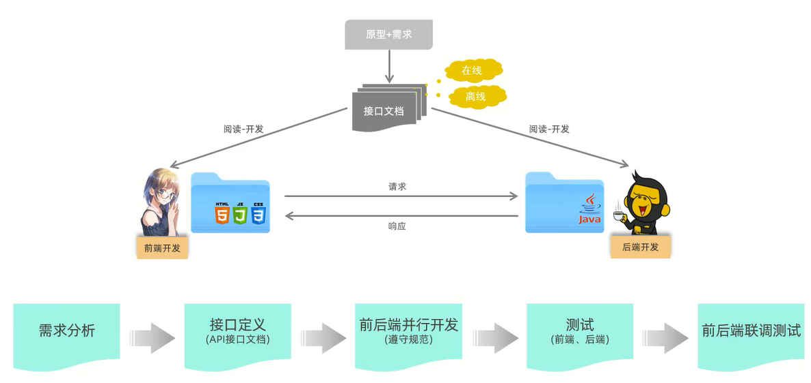

# 前端工程化

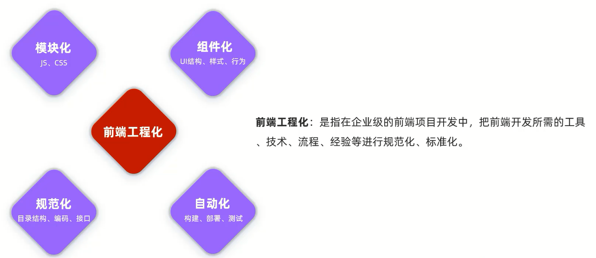

# Vue项目

## 创建项目

到目标文件夹的终端中输入`vue ui`,设置并创建项目

## 目录结构

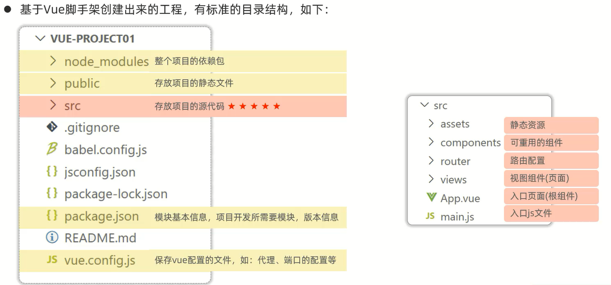

## 启动项目

1. VSCode

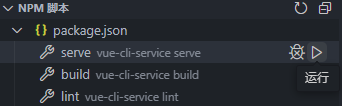

2. 终端输入:`npm run serve`

## 设置端口

在vue.config.js文件中修改设置端口号

```js
const { defineConfig } = require('@vue/cli-service')
module.exports = defineConfig({
  transpileDependencies: true,
  devServer: {
    port: 7000,
  }
})
```

## 开发流程

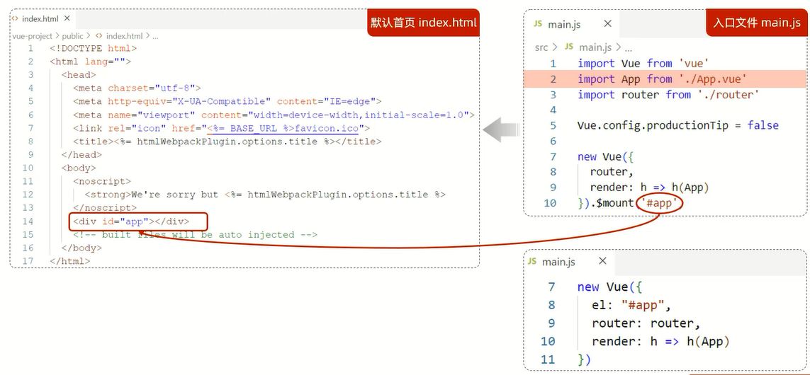

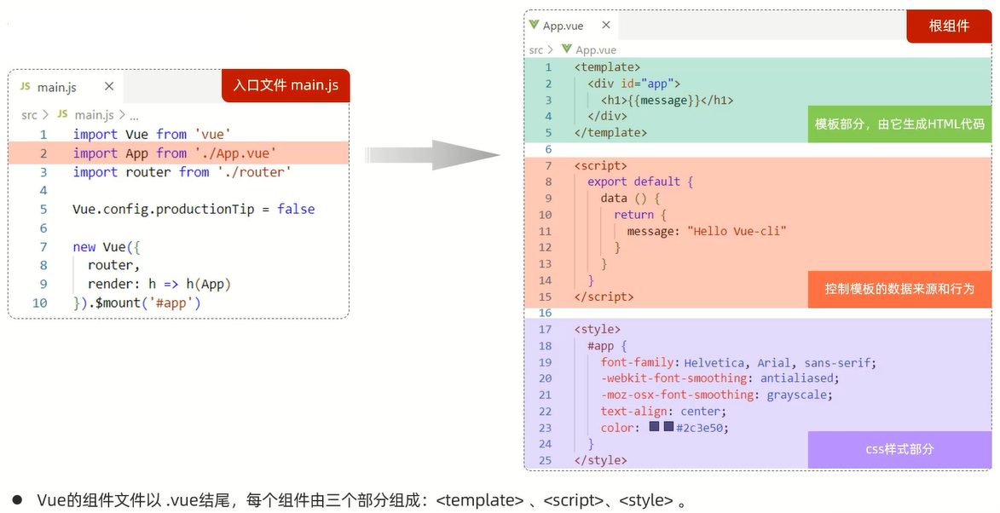

## 组件库

Element:饿了么团队研发的,一套为开发者、设计师和产品经理准备的基于Vue2.0的桌面端**组件库**

组件:组成网页的部件,例如超链接、按钮、图片、表格、表单、分页条等

[Element官方网站](https://element-plus.org/zh-CN/)

### 快速入门

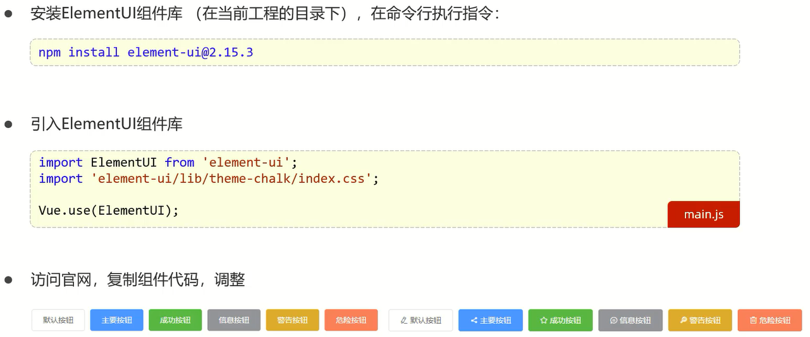

## 打包部署

### 打包

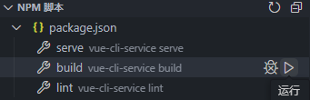

### 部署

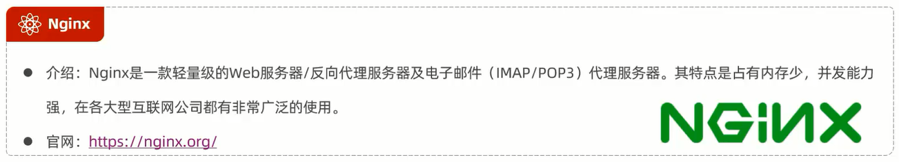

[Nginx官方网站](https://nginx.org/)

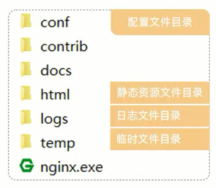

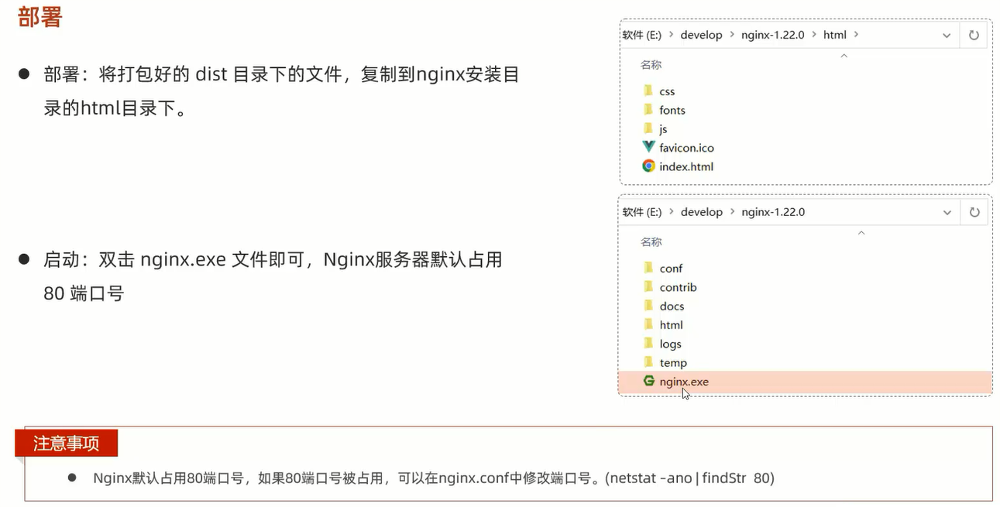