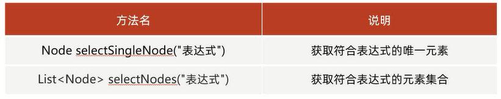

# Xpath

- [Jaxen官方网站](https://central.sonatype.com/artifact/jaxen/jaxen/overview)

Xpath使用**路径表达式**来定位XML文档中的元素结点或属性结点

## 步骤

1. **导入jar包(dom4j.jar和jaxen.jar)**,Xpath技术依赖Dom4j技术,
2. 通过Dom4j的`SAXReader`对象获取Document对象
3. 利用Xpath提供的API,结合XPath的语法选取XML文档元素结点,进行解析操作
4. Document中与Xpath相关的API如下



细节:**selectSingleNode()默认获取第一个**

## 4大检索方案

1. 绝对路径
2. 相对路径
3. 全文检索
4. 属性查找

`/`:单级路径          
`//`:多级路径         
`@`和属性相关             

## 绝对路径

从根结点开始逐层查找结点列表并打印信息

`/根结点/子结点/孙结点`(`/contactList/contact/name`):从根结点开始,一级一级向下查找,**不能跨级**
 
范例:

```xml
<?xml version="1.0" encoding="UTF-8" ?>
<persons>
    <person id="1">
        <name>张三</name>
        <age>23</age>
    </person>
    <person id="2">
        <name>李四</name>
        <age>24</age>
    </person>
    <person id="3">
        <name>王五</name>
        <age>25</age>
    </person>
</persons>
```

```java
import org.dom4j.Document;
import org.dom4j.DocumentException;
import org.dom4j.Node;
import org.dom4j.io.SAXReader;

import java.io.File;
import java.util.List;

public class Test {
    public static void main(String[] args) throws DocumentException {
        SAXReader saxReader = new SAXReader();
        Document document = saxReader.read(new File("D:\\Project\\Test\\src\\com\\jinzhao\\test6\\person.xml"));

        List<Node> names = document.selectNodes("/persons/person/name");
        for (Node name : names) {
            // 打印结果:"张三 李四 王五"
            System.out.print(name.getText() + " ");
        }
        System.out.println();

        Node node = document.selectSingleNode("/persons/person/name");
        // 打印结果:"张三"
        System.out.println(node.getText());
    }
}
```

## 相对路径

先得到根结点,再采用相对路径获取下一级结点的子结点并打印信息

`./子结点/孙结点`(`./contact/name`):从当前结点开始,一级一级向下查找,**不能跨级**

范例:

```xml
<?xml version="1.0" encoding="UTF-8" ?>
<persons>
    <person id="1">
        <name>张三</name>
        <age>23</age>
    </person>
    <person id="2">
        <name>李四</name>
        <age>24</age>
    </person>
    <person id="3">
        <name>王五</name>
        <age>25</age>
    </person>
</persons>
```

```java
import org.dom4j.Document;
import org.dom4j.DocumentException;
import org.dom4j.Element;
import org.dom4j.Node;
import org.dom4j.io.SAXReader;

import java.io.File;
import java.util.List;

public class Test {
    public static void main(String[] args) throws DocumentException {
        SAXReader saxReader = new SAXReader();
        Document document = saxReader.read(new File("D:\\Project\\Test\\src\\com\\jinzhao\\test6\\person.xml"));

        Element rootElement = document.getRootElement();

        List<Node> names = rootElement.selectNodes("./person/name");
        for (Node name : names) {
            // 打印结果:"张三 李四 王五"
            System.out.print(name.getText() + " ");
        }
        System.out.println();

        Node node = rootElement.selectSingleNode("./person/name");
        // 打印结果:"张三"
        System.out.println(node.getText());
    }
}
```

## 全文检索

直接全文搜索所有的某某结点并打印

1. `//contact`:找contact结点,无论结点在哪里                 
2. `//contact/name`:找contact,无论在哪一级,但name一定是contact的子结点                  
3. `//contact//name`:找contact,无论在哪一级,name只要是contact的子孙结点                

范例:

```xml
<?xml version="1.0" encoding="UTF-8" ?>
<persons>
    <person id="1">
        <a>
            <name>张三</name>
            <age>23</age>
        </a>
    </person>
    <person id="2">
        <name>李四</name>
        <age>24</age>
    </person>
    <person id="3">
        <name>王五</name>
        <age>25</age>
    </person>
    <name>赵六</name>
</persons>
```

```java
import org.dom4j.Document;
import org.dom4j.DocumentException;
import org.dom4j.Node;
import org.dom4j.io.SAXReader;

import java.io.File;
import java.util.List;

public class Test {
    public static void main(String[] args) throws DocumentException {
        SAXReader saxReader = new SAXReader();
        Document document = saxReader.read(new File("D:\\Project\\Test\\src\\com\\jinzhao\\test6\\person.xml"));

        List<Node> names1 = document.selectNodes("//name");
        for (Node name : names1) {
            // 打印结果:"张三 李四 王五 赵六"
            System.out.print(name.getText() + " ");
        }
        System.out.println();

        List<Node> names2 = document.selectNodes("//person/name");
        for (Node name : names2) {
            // 打印结果:"李四 王五"
            System.out.print(name.getText() + " ");
        }
        System.out.println();

        List<Node> names3 = document.selectNodes("//person//name");
        for (Node name : names3) {
            // 打印结果:"张三 李四 王五"
            System.out.print(name.getText() + " ");
        }
    }
}
```

## 属性查找

1. `//@属性名`:查找的是属性               
2. `//元素[@属性名]`:查找的是指定属性的标签                
3. `//元素[@属性名=值]`:查找的是指定属性和属性值的标签

范例:

```xml
<?xml version="1.0" encoding="UTF-8" ?>
<persons>
    <person id="1">
        <a>
            <name>张三</name>
            <age>23</age>
        </a>
    </person>
    <person id="2">
        <name>李四</name>
        <age>24</age>
    </person>
    <person id="2">
        <name>王五</name>
        <age>25</age>
    </person>
    <person>
        <name>赵六</name>
        <age>26</age>
    </person>
    <name>田七</name>
</persons>
```

```java
import org.dom4j.Document;
import org.dom4j.DocumentException;
import org.dom4j.Node;
import org.dom4j.io.SAXReader;

import java.io.File;
import java.util.List;

public class Test {
    public static void main(String[] args) throws DocumentException {
        SAXReader saxReader = new SAXReader();
        Document document = saxReader.read(new File("D:\\Project\\Test\\src\\com\\jinzhao\\test6\\person.xml"));

        List<Node> ids = document.selectNodes("//@id");
        for (Node id : ids) {
            // 打印结果:"1 2 2"
            System.out.print(id.getText() + " ");
        }
        System.out.println();

        List<Node> persons1 = document.selectNodes("//person[@id]");
        // 打印结果:"3"
        System.out.println(persons1.size());

        // 细节:双引号的里面用单引号
        List<Node> persons2 = document.selectNodes("//person[@id='2']");
        // 打印结果:"2"
        System.out.println(persons2.size());
    }
}
```