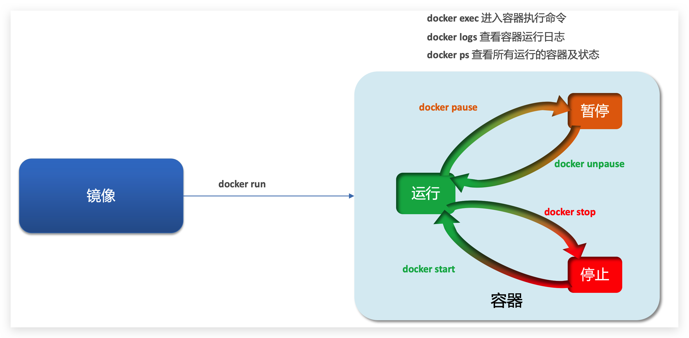

---
title: "docker的使用"
date: 2024-09-15
description: ""
cover: https://github.com/Gjt-9520/MarkDownBlog/blob/main/source/coverImages/Bimage-135/Bimage131.jpg?raw=true
tags: ["Docker"]
category: "实用"
updated: 2024-09-16

top_group_index:
--- 

### 一、什么是docker?

​     Docker 是一个开源的应用容器引擎，能让开发者将应用程序及其依赖打包进轻量级、可移植的容器里，方便部署到任何支持 Docker 的环境中。

### 

### 二、docker中一些必懂得概念

#### 1、镜像

Docker将应用程序及其所需的依赖、函数库、环境、配置等文件打包在一起，称为镜像

#### 2、容器

镜像中的应用程序运行后形成的进程就是**容器**，只是Docker会给容器进程做隔离，对外不可见。

#### 3、数据卷

**数据卷（volume）**是一个虚拟目录，指向宿主机文件系统中的某个目录。一旦完成数据卷挂载，对容器的一切操作都会作用在数据卷对应的宿主机目录了。

#### 4、挂载

**挂载**是指将主机系统中的一个目录或文件挂载到容器中，使得容器可以访问该目录或文件中的内容。通过挂载，可以实现容器与主机系统之间的数据共享和交互

#### 5、DockerHub

**Docker Hub** 是 Docker 官方提供的容器镜像仓库，也是世界上最大的容器镜像库之一。

#### 6、Dockerfile

常见的镜像在DockerHub就能找到，但是我们自己写的项目就必须自己构建镜像了。而我们自己去构建镜像的话，也就是需要编写Dockerfile文本文件来构建我们自己的镜像。

#### 7、Docker Compose

**Docker Compose** 是 Docker 官方的开源项目，主要用于定义和运行多容器 Docker 应用程序。

其实DockerCompose文件可以看做是将多个docker run命令写到一个文件，只是语法稍有差异。


### 三、常用命令

#### 1、镜像相关


```
#查看拉取到的镜像
docker images 

#导出镜像到磁盘 
docker save -o [保存的目标文件名称] [镜像名称] 

#加载镜像
docker load -i  [保存的目标文件名称]

#拉取镜像
docker pull  [镜像名称]
docker pull redis:5.6.3

#删除镜像
docker rmi  [镜像名称]
```

#### 2、容器相关



```
#查看所有运行中的容器
docker ps  
#查看所有容器
docker ps  -a

#运行容器
docker  run  [容器名称]

#停止一个容器
docker stop [容器名称]

#删除一个容器
docker rm [容器名称]

#强制停止并删除容器
docker rm -f [容器名称]

#查看日志
docker logs [容器名称]

#进入容器
docker exec -it [容器名称] bash
```