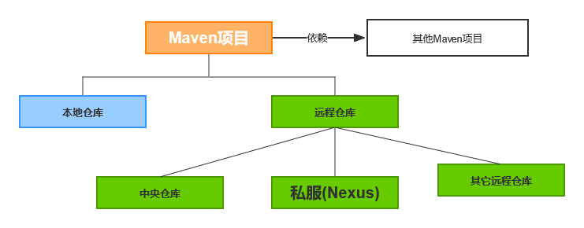
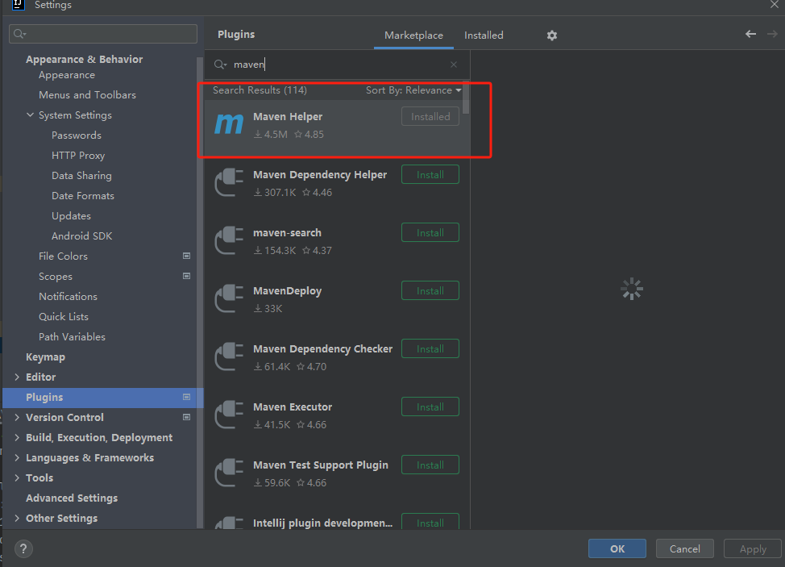
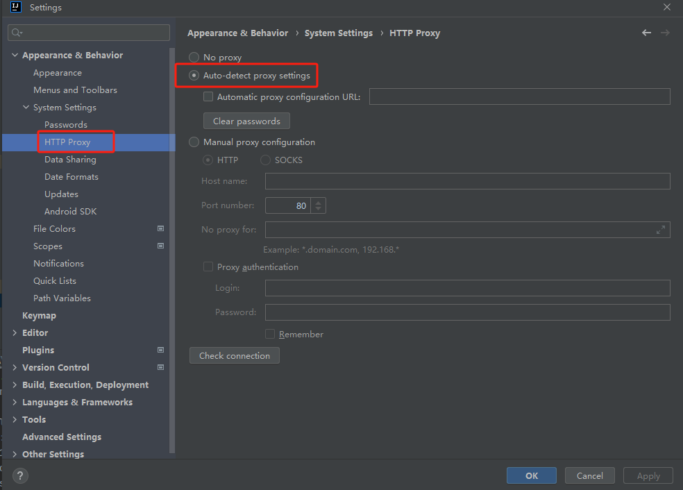

---
title: "maven的基本使用"
date: 2024-09-18
description: ""
cover: https://github.com/Gjt-9520/MarkDownBlog/blob/main/source/coverImages/Bimage-135/Bimage134.jpg?raw=true
tags: ["Maven"]
category: "实用"
updated: 2024-09-19

top_group_index:
--- 

1、什么是maven

Maven的主要作用是简化了Java项目的构建过程。它通过一个名为`pom.xml`的核心配置文件来管理项目的依赖关系、编译设置、打包和部署等操作。使用Maven，开发者不需要手动下载和管理依赖的jar包，只需在`pom.xml`文件中声明所需的依赖项及其版本，Maven会自动从仓库中下载并添加到项目中。

此外，Maven还提供了许多插件，支持项目的开发、测试、打包和部署等一系列活动。这些插件可以扩展Maven的功能，使其能够满足不同项目的需求。

总的来说，Maven是一个强大的自动化构建工具，它通过标准化的项目结构和生命周期管理，提高了开发效率，降低了项目维护的复杂性。



​           中央仓库的地址：https://mvnrepository.com/

2、引入依赖

​     1、maven仓库存在的依赖，直接引入，刷新maven

```
        <dependency>
            <groupId>org.springframework</groupId>
            <artifactId>spring-webmvc</artifactId>
            <version>5.1.6.RELEASE</version>
        </dependency>
```

  2、maven仓库不存在的依赖引入方式

```
       <dependency>
            <groupId>com.alibaba</groupId>
            <artifactId>alicrypto-java-aliyun</artifactId>
            <version>1.0.4</version>
            <scope>system</scope>
            <systemPath>${project.basedir}/lib/alicrypto-java-aliyun-1.0.4.jar</systemPath>
       </dependency>
```

注：project.basedir 就是pom文件所在的目录。

scoop标签的的值有下面几个：

| compile  | 缺省值，适用于所有阶段（测试运行，编译，运行，打包）         |
| -------- | :----------------------------------------------------------- |
| provided | 类似compile，期望JDK、容器或使用者会提供这个依赖。如servlet-api.jar；适用于（测试运行，编译）阶段 |
| runtime  | 只在运行时使用，如 mysql的驱动jar，适用于（运行，测试运行）阶段 |
| test     | 只在测试时使用，适用于（编译，测试运行）阶段，如 junit.jar   |
| system   | Maven不会在仓库中查找对应依赖，在本地磁盘目录中查找；适用于（编译，测试运行，运行）阶段 |

3、依赖冲突

  1）如何查看依赖冲突

   * 命令的形式

     不建议用，依赖多的时候，不好查找

     ```
     mvn -Dverbose dependency:tree
     ```

        *  使用插件 (建议使用该方式)



如果搜索插件的时候，没有任何结果的时候，可进行如下设置后，再进行搜索



​    4）解决依赖冲突

     * 路径最短优先原则

​     主要根据依赖的路径长短来决定引入哪个依赖

   * 最先声明优先原则

     如果两个依赖的路径一样，声明在前的则优先选择。

   * 排除依赖

     使用exclusion标签来排除依赖

   * 封装成rpc服务

     a.1  a.2