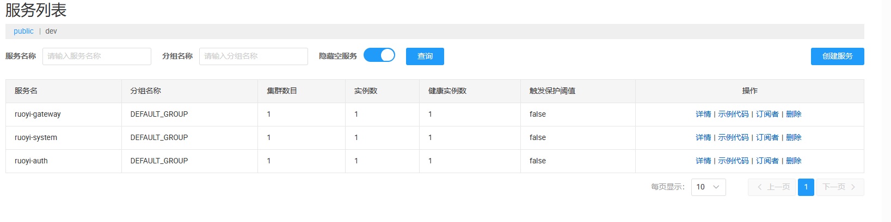
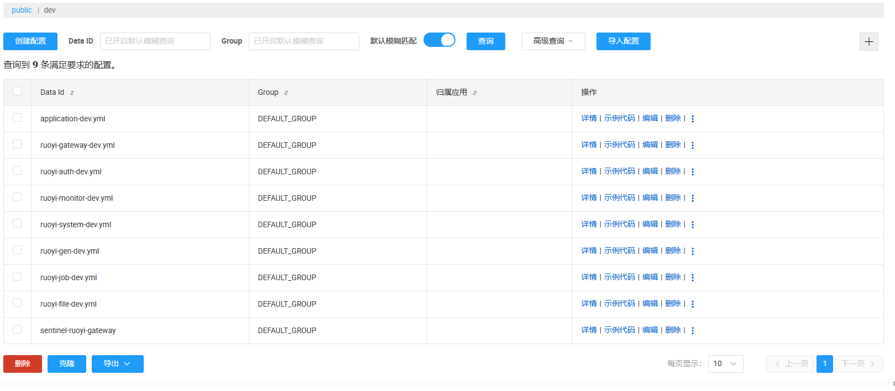

---
title: "nacos的使用"
date: 2024-09-19
description: ""
cover: https://github.com/Gjt-9520/MarkDownBlog/blob/main/source/coverImages/Bimage-135/Bimage135.jpg?raw=true
tags: ["Nacos"]
category: "实用"
updated: 2024-09-20

top_group_index:
---                                                                                               

1、服务注册与发现



2、远程配置



3、nacos的一般配置

```
-Dspring.cloud.nacos.config.server-addr=http://110.40.209.16:8848
-Dspring.cloud.nacos.config.file-extension=yml
#-Dspring.cloud.nacos.config.namespace=f61f6163-9824-4f2b-b27f-9832e53c10f6
-Dspring.cloud.nacos.discovery.group=zhuoye
-Dspring.profiles.active=dev
-Dspring.cloud.nacos.config.group=DEFAULT_GROUP
-Dspring.cloud.nacos.config.username=nacos
-Dspring.cloud.nacos.config.password=nacos
-Dspring.cloud.nacos.discovery.username=nacos
-Dspring.cloud.nacos.discovery.password=nacos
#-Dspring.cloud.nacos.discovery.namespace=f61f6163-9824-4f2b-b27f-9832e53c10f6
```