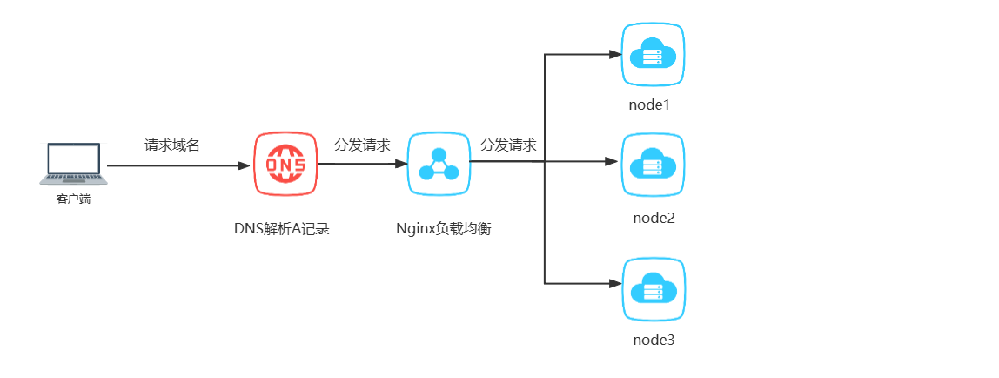

---
title: "nginx的使用"
date: 2024-09-20
description: ""
cover: https://github.com/Gjt-9520/MarkDownBlog/blob/main/source/coverImages/Aimage-135/Aimage1.jpg?raw=true
tags: ["Nginx"]
category: "实用"
updated: 2024-09-21

top_group_index:
---        

#### 一、反向代理

```
提到反向代理就会有正向代理

正和反是站在客户端的角度来看的，也就是代理如果是在客户端做的就是正向代理，代理如果是在目标服务器上做的就是反向代理
正向代理代替客户端去发送请求，反向代理代替服务端接受请求

正向代理主要是用来解决访问限制问题。而反向代理则是提供负载均衡、安全防护等作用。二者均能提高访问速度。
```

如何配置反向代理：

```
user root;
worker_processes auto;
error_log /usr/local/nginx/logs/error.log;  #错误日志路径
pid /usr/local/nginx/logs/nginx.pid;

include /usr/share/nginx/modules/*.conf;


events {
    worker_connections  1024;
}


http {

    log_format  main  '$remote_addr - $remote_user [$time_local] "$request" '
                      '$status $body_bytes_sent "$http_referer" '
                      '"$http_user_agent" "$http_x_forwarded_for"';

   #access_log  /usr/local/nginx/logs/access.log  main;  #访问日志路径，可以关掉

    sendfile            on;
    tcp_nopush          on;
    tcp_nodelay         on;
    keepalive_timeout   65;
    types_hash_max_size 2048;
    client_max_body_size 20M;

		
	server {
	     #如果根据 listen   server_name  没有匹配到的话，默认使用第一个server
	     #可以在listen后面加添加default_server来设置匹配不成功的默认使用的server
		listen       8888;
		server_name  101.31.7.23;  #多个的话可以用空格分隔
		gzip on;  #是否开启gzip模块 on表示开启 off表示关闭
		gzip_buffers 4 16k;  #设置压缩所需要的缓冲区大小
		gzip_comp_level 6;  #压缩级别1-9，数字越大压缩的越好，也越占用CPU时间
		gzip_min_length 100k;  #设置允许压缩的最小字节
		gzip_http_version 1.1;  #设置压缩http协议的版本,默认是1.1
		gzip_types text/plain text/css application/json application/x-javascript text/xml application/xml application/xml+rss text/javascript;  #设置压缩的文件类型
		gzip_vary on;  #加上http头信息Vary: Accept-Encoding给后端代理服务器识别是否启用 gzip 压缩
		location /api {
		    # proxy_pass 端口后面加路径，该路径就会替换location中的路径，有/也会替换
		    #没加路径就只替换访问路径的ip和端口
			proxy_pass http://101.31.7.23:8180/;
		}
		
		http://101.31.7.23:8888/api/user/info/1
		http://101.31.7.23:8180/user/info/1
		http://101.31.7.23:8180/api/user/info/1
	}
		
}

```


#### 二、动静分离

```
通常来说，动态资源其实就是指那些后台资源，而静态资源就是指HTML，JavaScript，CSS，img等文件。可以简单的理解为动态资源就是后端接口，静态资源就是文件。

使用前后端分离部署的项目也是利用了nginx的动静分离的特性

```

配置动静分离：

```
server {
	     #如果根据 listen   server_name  没有匹配到的话，默认使用第一个server
	     #可以在listen后面加添加default_server来设置匹配不成功的默认使用的server
		listen       8888;
		server_name  101.31.7.23;  #多个的话可以用空格分隔
		location /api {
		    # proxy_pass 端口后面加路径，该路径就会替换location中的路径，有/也会替换
		    #没加路径就只替换访问路径的ip和端口
			proxy_pass http://101.31.7.23:8180/;
		}
		
		location / {
			root  /home/zcloud/applications/iomp-web; #前端部署目录
			index  index.html index.htm;
		}

		location /images/ {
			alias /home/zcloud/file/;
			autoindex	off;
		}
	}
	
	
```

alias 和root 的区别

```
alias：将请求的URI替换为alias指定的路径。例如，如果请求为/images/logo.png，则Nginx会查找/home/zcloud/file/logo.png
root 将请求的URI直接附加到root指定的路径后面。例如，如果请求为/images/logo.png，则Nginx会查找/home/zcloud/applications/iomp-web/images/logo.png

需要注意的是：如果使用alias的时候location的路径是以/结尾的话，alias配置的路径也必须以/结尾
```


#### 三、负载均衡

nacos负载均衡和nginx的负载均衡有啥区别？

```
负载均衡，就是说如果一组计算机节点（或者一组进程）提供相同的（同质的）服务，那么对服务的请求就应该均匀的分摊到这些节点上。
```



nginx宕机了怎么办？   nginx也搞个集群     到底要怎么解决？

nginx负载均衡配置

```
http {

    log_format  main  '$remote_addr - $remote_user [$time_local] "$request" '
                      '$status $body_bytes_sent "$http_referer" '
                      '"$http_user_agent" "$http_x_forwarded_for"';

    access_log  /usr/local/nginx/logs/access.log  main;  #访问日志路径，可以关掉
    
    #轮询的方式
    upstream server_group {
         server 101.31.7.24:8080; #node1
         server 101.31.7.25:8081; #node2
         server 101.31.7.26:8082; #node3      
   }
   
    #加权轮询的方式
  #  upstream server_group {
  #       server 101.31.7.24:8080 weight=3; #node1
  #       server 101.31.7.25:8081 weight=5; #node2
  #       server 101.31.7.26:8082 weight=2; #node3      
  # }
  
    
    #ip_hash的方式，基于客户端IP的分配方式  
  #  upstream server_group {
  #       ip_hash;
  #       server 101.31.7.24:8080; #node1
  #       server 101.31.7.25:8081; #node2
  #       server 101.31.7.26:8082; #node3      
  # }
  
   #最少连接的方式，把请求分发给连接请求较少的那台服务器
  #  upstream server_group {
  #       least_conn;
  #       server 101.31.7.24:8080; #node1
  #       server 101.31.7.25:8081; #node1
  #       server 101.31.7.26:8082; #node1      
  # }
		
	server {
	     #如果根据 listen   server_name  没有匹配到的话，默认使用第一个server
	     #可以在listen后面加添加default_server来设置匹配不成功的默认使用的server
		listen       8888;
		server_name  101.31.7.23;  #多个的话可以用空格分隔
		location /api {
		    # proxy_pass 端口后面加路径，该路径就会替换location中的路径，有/也会替换
		    #没加路径就只替换访问路径的ip和端口
			proxy_pass http://server_group/;
		}
	}
		
```


#### 四、常用命令

```
#重新加载配置文件
./nginx -s reload    
#检查配置文件是否正确
./nginx -t  
#启动nginx
./nginx
# 快速停止nginx
./nginx -s stop
# 完整有序的停止nginx，这个命令会等待所有请求结束后再关闭nginx
./nginx -s quit


/usr/local/nginx
find /  -name  nginx.conf
```