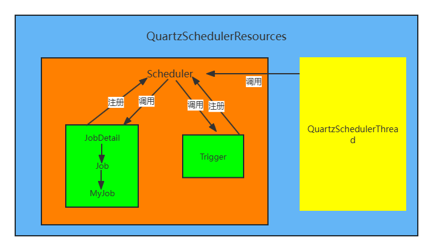

---
title: "quartz框架的使用"
date: 2024-09-21
description: ""
cover: https://github.com/Gjt-9520/MarkDownBlog/blob/main/source/coverImages/Aimage-135/Aimage2.jpg?raw=true
tags: ["Quartz"]
category: "实用"
updated: 2024-09-22

top_group_index:
---        

### 一、架构图



Quartz 的核心类有以下三部分：

- 任务 Job ： 需要实现的任务类，实现execute()`方法，执行后完成任务。
- 触发器 Trigger ： 包括SimpleTrigger和CronTrigger。
- 调度器 Scheduler ：任务调度器，负责基于Trigger触发器，来执行 Job任务。

### 二、引入依赖

```
    <dependency>
      <groupId>org.quartz-scheduler</groupId>
      <artifactId>quartz</artifactId>
      <version>2.3.2</version>
    </dependency>
    <dependency>
      <groupId>org.springframework</groupId>
      <artifactId>spring-context-support</artifactId>
      <version>5.3.27</version>
    </dependency>
```


### 三、使用过程

#### 1、创建调度器

```java
Scheduler sched = new StdSchedulerFactory().getScheduler();  //springboot项目中可以直接注入
```

#### 2、创建任务和触发器

```java
@Component
public class TestJob  implements Job {

    @Override
    public void execute(JobExecutionContext jobExecutionContext) throws JobExecutionException {
                 System.out.println("TestJob 执行了");
    }

}
```

```java
JobDetail job = newJob(TestJob.class)
                .withIdentity("myJob", "group1")
                .build();
        Trigger trigger = newTrigger()
                .withIdentity("myTrigger", "group1")
                .startNow()
                .withSchedule(simpleSchedule()
                        .withIntervalInSeconds(10)
                        .repeatForever())
                .build();
```

#### 3、将任务和触发器注册到调度器中

```java
sched.scheduleJob(job, trigger);
```

#### 4、启动调度器

```java
sched.start();
```