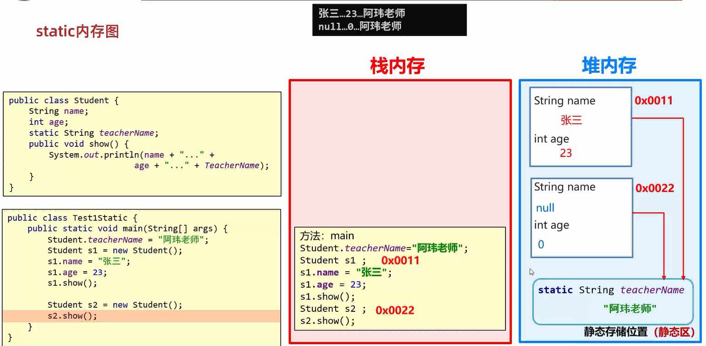
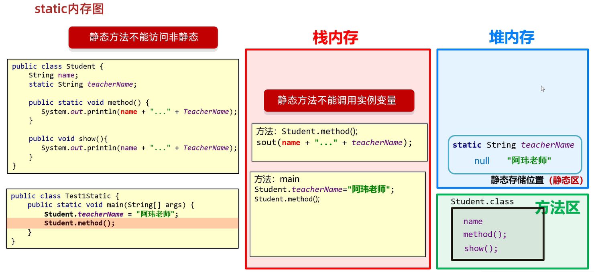
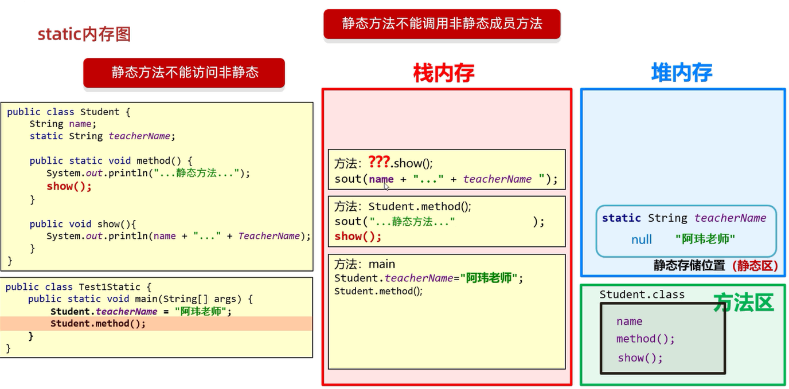
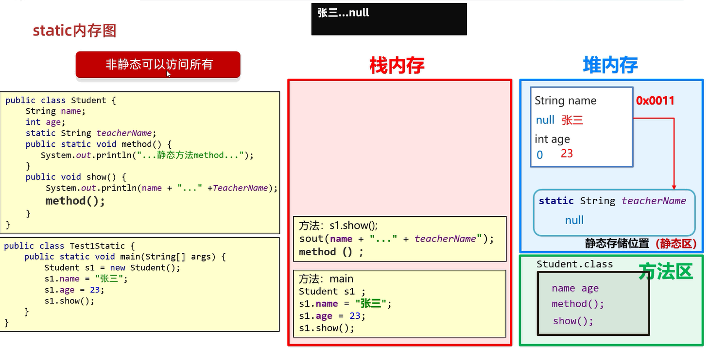
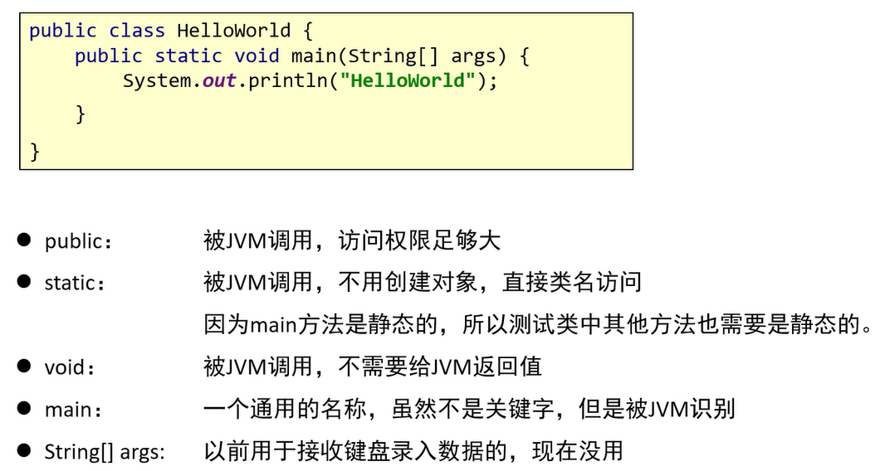

# static

static表示静态,是Java的一个修饰符,可以修饰成员方法、成员变量    
**只要是所有对象都共享的,就需要用static来修饰**    

## 静态变量

被static修饰的成员变量,叫做静态变量

特点:   
1. 被该类所有对象共享   
2. **不属于对象,属于类**   
3. **随着类的加载而加载,优先于对象存在**   
    
调用方式:   
1. 类名调用(推荐)   
2. 对象名调用  

范例: 

```java
public class Student {
    private String name;
    private int age;
    private String gender;

    public static String teacherName1;

    public static String teacherName2;

    public Student() {
    }

    public Student(String name, int age, String gender) {
        this.name = name;
        this.age = age;
        this.gender = gender;
    }

    public String getName() {
        return name;
    }

    public void setName(String name) {
        this.name = name;
    }

    public int getAge() {
        return age;
    }

    public void setAge(int age) {
        this.age = age;
    }

    public String getGender() {
        return gender;
    }

    public void setGender(String gender) {
        this.gender = gender;
    }

    public void learn() {
        System.out.println(name + "正在学习");
    }

    public void show() {
        System.out.println(name + "," + age + "," + gender + "," + teacherName1 + "," + teacherName2);
    }
}
```

```java
public class StudentTest {
    public static void main(String[] args) {
        // 类名调用(推荐)
        Student.teacherName1 = "王老师";
        Student stu1 = new Student("张三", 22, "男");
        Student stu2 = new Student("李四", 23, "女");
        // 对象名调用
        stu1.teacherName2 = "赵老师";
        // 打印结果:"张三,22,男,王老师,赵老师"
        stu1.show();
        // 打印结果:李四正在学习"
        stu2.learn();
    }
}
```

## 内存图



## 静态方法

被static修饰的成员方法,叫做静态方法   

特点:      
1. 多用在测试类和工具类中   
2. JavaBean类中很少会用   

调用方式:   
1. 类名调用(推荐)  
2. 对象名调用   

练习: 

在实际的开发中,经常会遇到一些数组使用的工具类   
请按照如下要求编写一个数组的工具类: ArrayUtil   
 
要求:     
1. 提供一个工具类方法printArr,用于返回整数数组的内容(只考虑整数型数组,且只考虑一维数组),返回的字符串格式如: [10,20,30]    
2. 提供一个工具类方法getAverage,用于返回平均分(只考虑浮点型数组,且只考虑一维数组)  
3. 定义一个测试类TestDemo,调用该工具类的工具方法,并返回结果   

工具类: 

```java
public class ArrayUtil {
    // 私有化构造方法
    private ArrayUtil() {
    }

    // 用于返回整数数组的内容
    public static String printArr(int[] arr) {
        StringBuilder result = new StringBuilder("[");
        for (int i = 0; i < arr.length - 1; i++) {
            result.append(arr[i]).append(",");
        }
        result.append(arr[arr.length - 1]).append("]");
        return result.toString();
    }

    // 用于返回平均分
    public static double getAverage(double[] arr) {
        double sum = arr[0];
        for (int i = 1; i < arr.length; i++) {
            sum += arr[i];
        }
        return sum / arr.length;
    }
}
```

测试类: 

```java
public class TestDemo {
    public static void main(String[] args) {
        int[] intArr = {1, 2, 3, 4, 5};
        double[] doubleArrange = {1.3, 12.3, 14.3, 15.1};
        System.out.println(ArrayUtil.printArr(intArr));
        System.out.println(ArrayUtil.getAverage(doubleArrange));
    }
}
```

练习: 

定义一个集合,用于存储3个学生对象   
学术类的属性为: name、age、gender   
定义一个工具类,用于获取集合中最大学生的年龄   

```java
public class Student {
    private String name;
    private int age;
    private String gender;

    public Student() {
    }

    public Student(String name, int age, String gender) {
        this.name = name;
        this.age = age;
        this.gender = gender;
    }

    public String getName() {
        return name;
    }

    public void setName(String name) {
        this.name = name;
    }

    public int getAge() {
        return age;
    }

    public void setAge(int age) {
        this.age = age;
    }

    public String getGender() {
        return gender;
    }

    public void setGender(String gender) {
        this.gender = gender;
    }
}
```

```java
import java.util.ArrayList;

public class Util {
    private Util() {
    }

    public static int getMaxAge(ArrayList<Student> list) {
        int maxAge = list.get(0).getAge();
        for (Student student :  list) {
            int age = student.getAge();
            if (maxAge < age) {
                maxAge = age;
            }
        }
        return maxAge;
    }
}
```

```java
import java.util.ArrayList;

public class StudentTest {
    public static void main(String[] args) {
        ArrayList<Student> list = new ArrayList<>();
        Student stu1 = new Student("张三", 23, "男");
        Student stu2 = new Student("李四", 28, "男");
        Student stu3 = new Student("王五", 24, "男");
        list.add(stu1);
        list.add(stu2);
        list.add(stu3);
        int maxAge = Util.getMaxAge(list);
        System.out.println("最大学生的年龄为: " + maxAge);
    }
}
```

## 注意事项

1. **静态方法只能访问静态**  
静态方法只能访问静态变量和静态方法   
2. **非静态方法可以访问所有**    
非静态方法既可以访问静态变量和静态方法,也可以访问非静态变量(也叫实例变量)和非静态方法    
3. **静态方法中没有this关键字**    
解释: 非静态方法往往是和对象相关的,所以虚拟机会默认隐藏this关键字   
而静态方法是共享的,和某一个对象无关,所以静态方法中没有this关键字  

## 代码角度理解

```java
public class StudentTest {
    public static void main(String[] args) {
        Student.teacherName = "赵老师";

        Student s1 = new Student();
        System.out.println("s1的地址值: " + s1);
        s1.name = "张三";
        s1.age = 23;
        s1.show1();

        System.out.println("---------------");

        Student s2 = new Student();
        System.out.println("s2的地址值: " + s2);
        s2.name = "李四";
        s2.age = 24;
        s2.show1();

        System.out.println("---------------");

        Student.method1();
    }
}
```

```java
public class Student {
    // 普通成员变量name
    String name;
    // 普通成员变量age
    int age;
    // 静态变量teacherName
    static String teacherName;

    // 非静态的成员方法show1(Student this),其中Student this是隐藏的
    // this表示当前方法调用者的地址值,在这里即Student
    // this是虚拟机赋值的
    public void show1() {
        System.out.println("this所记录的地址值: " + this);

        // 非静态方法可以访问所有
        // 隐藏this.name和this.age
        // 在这里,非静态方法show1()访问非静态变量如name、age和静态变量teacherName
        System.out.println(name + "," + age + "," + teacherName);

        // 隐藏this.show2()
        // 在这里,非静态方法show1()访问非静态方法show2()
        show2();

        // 隐藏this.method()
        // 在这里,非静态方法show1()访问静态方法method1()
        method1();
    }

    // 非静态的成员方法show2()
    public void show2() {
        System.out.println("这是非静态方法");
    }

    // 静态的成员方法method()
    // 静态方法中没有this关键字
    public static void method1() {
        // 静态方法只能访问静态
        // 在这里,静态方法method()只能访问静态变量teacherName
        System.out.println(teacherName);

        // 在这里,静态方法method()只能访问静态方法method2
        method2();
    }

    // 静态的成员方法method2()
    public static void method2() {
        System.out.println("这是静态方法");
    }
}
```

## 内存角度理解

静态: 随着类的加载而加载     
非静态: 和对象有关   

1. 静态方法不能访问非静态    
静态方法不能访问非静态变量(实例变量):    



静态方法不能访问非静态方法: 



2. 非静态方法可以访问所有



# 重新认识main方法

