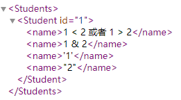

# 配置文件

配置文件用来保存程序在运行时所需要的一些参数

常见的有:

1. `*.txt`             
优点:没有优点                
缺点:不利于阅读          

2. `*.properties`                    
优点:键值对形式利于阅读,解析简单                  
缺点:无法配置一组一组的数据            

3. `*.xml`                 
优点:易于阅读,可以配置成组出现的数据             
缺点:解析比较复杂               

细节:**如果数据量较少,一个键只对应一个值,使用properties;如果数据量较多,使用xml**

# XML

XML的全称(Extensible Markup Language),是一种**可扩展的标记语言**

标记语言:通过标签来描述数据的一门语言(标签有时也称之为元素)              

可扩展:标签的名字是可以自己定义的

作用:
1. 用于进行存储数据和传输数据
2. 作为软件的配置文件

优势:可读性好且可维护性高

# 创建

创建一个XML类型的文件,要求文件的后缀必须使用xml(默认小写)                   
例如`hello_world.xml`

# 语法规则

## 基本组成

1. XML文件的后缀名必须是:**xml**
2. 文档声明必须是**第一行**                
version:XML的默认版本号码          
encoding:XML文件的编码              
standalone:该属性不是必须的,描述XML文件是否依赖其他的XML文件,取值为yes/no

```xml
<?xml version="1.0" encoding="UTF-8" standalone="yes"?>
```

## 标签(元素)规则

1. 标签由一对尖括号和合法标识符组成,**必须存在一个根标签,有且只能有一个**                   
例如`<Students></Students>`

2. 标签**必须成对出现,有开始,有结束**          
例如:`<Student></Student>`             

3. 特殊的标签可以不成对,但是必须有结束标记           
例如:`<br/>`

4. 标签中可以定义属性,属性和标签名空格隔开,属性值必须用引号引起来            
例如:`<Student id="1"></Student>`              

5. 标签**必须正确的嵌套**

范例:

```xml
<?xml version="1.0" encoding="utf-8" ?>
<Students>
    <Student id="1">
        <name>张三</name>
    </Student>
</Students>
```

## 其他组成

1. XML文件中可以定义注释信息:`<!- 注释内容 -->`                      
IDEA注释快捷键:选中内容,`ctrl + /`  

范例:

```xml
<?xml version="1.0" encoding="utf-8" ?>
<Students>
    <!--下面表示一个学生的信息-->
    <Student id="1">
        <name>张三</name>
    </Student>
</Students>
```

2. XML文件中可以存在以下特殊字符


范例:

```xml
<?xml version="1.0" encoding="utf-8" ?>
<Students>
    <Student id="1">
        <name>1 &lt; 2 或者 1 &gt; 2</name>
        <name>1 &amp; 2</name>
        <name>&apos;1&apos;</name>
        <name>&quot;2&quot;</name>
    </Student>
</Students>
```

效果:



XML文件中可以存在CDATA区:`<![CDATA[...内容...]]>`

范例:

```xml
<?xml version="1.0" encoding="utf-8" ?>
<Students>
    <Student id="1">
        <name><![CDATA[1<2 1>2 1&2 '1' "2"]]></name>
    </Student>
</Students>
```

效果:


# 文档约束

文档约束用来限定XML文件中的标签以及属性应该怎么写,以此强制约束程序员必须按照文档约束的规定来编写XML文件

分类:
1. DTD约束
2. schema约束

## DTD约束

利用DTD文档约束,约束一个XML文件的编写

作用:可以约束XML文件的编写                  
问题:**不能约束具体的数据类型**    

### 使用

1. 编写DTD约束文档,后缀必须是`.dtd`                
看xml文件中使用了哪些元素:`<!ELEMENT>`可以定义元素                
判断元素是简单元素还是复杂元素:简单元素(没有子元素);复杂元素(有子元素的元素)       

范例:

```dtd
<!ELEMENT 书架 (书+)>
<!ELEMENT 书 (书名,作者,售价)>
<!ELEMENT 书名 (#PCDATA)>
<!ELEMENT 作者 (#PCDATA)>
<!ELEMENT 售价 (#PCDATA)>
```

2. 在需要编写的XML文件中导入该DTD约束文档

a.引入本地DTD(掌握):                
`<!DOCTYPE 根元素名称 SYSTEM 'DTD文件的路径'>`     

范例:

```xml
<?xml version="1.0" encoding="utf-8" ?>
<!DOCTYPE 书架 SYSTEM 'book.dtd'>
<书架>
    <书>
        <书名>三国演义</书名>
        <作者>罗贯中</作者>
        <售价>23.3</售价>
    </书>
</书架>
```

b.在XML文件内部引入(了解):                
`<!DOCTYPE 根元素名称 [DTD文件内容]>`

范例:

```xml
<?xml version="1.0" encoding="UTF-8" ?>
<!DOCTYPE persons [
        <!ELEMENT persons (person)>
        <!ELEMENT person (name,age)>
        <!ELEMENT name (#PCDATA)>
        <!ELEMENT age (#PCDATA)>
        ]>

<persons>
    <person>
        <name>张三</name>
        <age>23</age>
    </person>
</persons>
```

c.引入网络DTD(了解):            
`<!DOCTYPE 根元素名称 PUBLIC "DTD文件名称" "DTD文件的URL">`     

范例:

```xml
<?xml version="1.0" encoding="UTF-8" ?>
<!DOCTYPE persons PUBLIC "dtd文件的名称" "dtd文档的URL">

<persons>
    <person>
        <name>张三</name>
        <age>23</age>
    </person>
</persons>
```

3. 按照约束的规定编写XML文件的内容

### 语法

1. 定义元素

定义一个元素的格式为:`<!ELEMENT 元素名 元素类型>`               

简单元素:                    
a.`EMPTY`:表示标签体为空            
b.`ANY`:表示标签体可以为空也可以不为空            
c.`PCDATA`:表示该元素的内容部分为字符串

复杂元素:             
直接写子元素名称:多个子元素可以使用`,`或者`|`隔开;       
​`,`表示定义子元素的顺序;`|`:表示子元素只能出现任意一个                         
​`?`表示零次或一次,`+`表示一次或多次,`*`表示零次或多次;如果不写则表示出现一次    

2. 定义属性

定义一个属性的格式为:`<!ATTLIST 元素名称 属性名称 属性的类型 属性的约束>`

属性的类型:CDATA类型、普通的字符串

属性的约束:
a.`#REQUIRED`:必须的             
​b.`#IMPLIED`:属性不是必需的         
​c.`#FIXED value`:属性值是固定的            

范例:

```xml
<!ELEMENT persons (person+)>
<!ELEMENT person (name,age)>
<!ELEMENT name (#PCDATA)>
<!ELEMENT age (#PCDATA)>
<!ATTLIST person id CDATA #REQUIRED>

<?xml version="1.0" encoding="UTF-8" ?>
<!DOCTYPE persons SYSTEM 'persondtd.dtd'>

<persons>
<person id="001">
    <name>张三</name>
    <age>23</age>
</person>

<person id = "002">
    <name>李四</name>
    <age>24</age>
</person>
</persons>
```

## schema约束

schema可以约束具体的数据类型,约束能力更加强大                
schema本身也是一个XML文件,本身也受到其他约束条件的要求,所以编写的更加严谨


### 使用

1. 编写schema约束文档,后缀必须是`.xsd`               
schema文件的根标签为`<schema>`            
其中定义属性:`xmlns=http://www.w3.org/2001/XMLSchema`         
`targetNamespace`:唯一的URL地址,指定当前这个schema文件的名称空间           
`elementFormDefault="qualified"`:表示当前schema文件是一个质量良好的文件     

范例:

```xsd
<?xml version="1.0" encoding="UTF-8" ?>
<xs:schema
        xmlns:xs="http://www.w3.org/2001/XMLSchema"
        targetNamespace="http://www.itheima.cn/javase" 
        elementFormDefault="qualified">
    
    <!--定义persons复杂元素-->
    <xs:element name="persons">
        <xs:complexType>
            <xs:sequence maxOccurs="unbounded">
                <!--定义person复杂元素-->
                <xs:element name="person">
                    <xs:complexType>
                        <xs:sequence>
                            <!--定义name和age简单元素-->
                            <xs:element name="name" type="xs:string"/>
                            <xs:element name="age" type="xs:int"/>
                        </xs:sequence>
                    </xs:complexType>
                </xs:element>
            </xs:sequence>
        </xs:complexType>
    </xs:element>
</xs:schema>
```

2. 在需要编写的XML文件中导入该schema约束文档

a.在根标签上定义属性          
`xmlns=http://www.w3.org/2001/XMLSchema-instance`

b.写第二个xmlns表示被哪个schema文件约束

c.给某一个xmlns属性添加一个标识,用于区分                
格式为`xmlns:标识="名称空间地址"`,标识可以是任意的,一般取值都是`xsi`         

d.通过`xsi:schemaLocation`指定名称空间所对应的约束文件路径        
格式为`xsi:schemaLocation="名称空间url 文件路径"`

范例:

```xml
<?xml version="1.0" encoding="UTF-8" ?>
<persons
    xmlns:xsi="http://www.w3.org/2001/XMLSchema-instance"
    xmlns="http://www.itheima.cn/javase"
    xsi:schemaLocation="http://www.itheima.cn/javase person.xsd">
    
    <person>
        <name>张三</name>
        <age>23</age>
    </person>
</persons>
```

3. 按照约束的规定编写XML文件的内容

### 范例

```xsd
<?xml version="1.0" encoding="UTF-8" ?>
<schema
        xmlns="http://www.w3.org/2001/XMLSchema"
        targetNamespace="http://www.itheima.cn/javase"
        elementFormDefault="qualified">
    
    <!--定义persons复杂元素-->
    <element name="persons">
        <complexType>
            <sequence>
                <!--定义person复杂元素-->
                <element name = "person">
                    <complexType>
                        <sequence>
                            <!--定义name和age简单元素-->
                            <element name="name" type="string"/>
                            <element name="age" type="string"/>
                        </sequence>
                        <!--定义属性,required(必须的)/optional(可选的)-->
                        <attribute name="id" type="string" use="required"/>
                    </complexType>
                </element>
            </sequence>
        </complexType>
    </element>
</schema>
```

```xml
<?xml version="1.0" encoding="utf-8" ?>
<persons xmlns="http://www.itheima.cn/javase">
    <person id="1">
        <name>张三</name>
        <age>23</age>
    </person>
</persons>
```

# 解析技术

XML解析就是使用程序读取XML中的数据

2种解析方式:SAX解析、DOM解析


## DOM解析

## 解析工具


## 解析思想


## Dom4j

- [Dom4j官网](https://dom4j.github.io/)

### 常用方法

`public SAXReader()`:创建Dom4j的解析器对象               
`Document read(String url)`:加载XML文件成为Document对象                
`Element getRootElement()`:获得根标签对象                 
`List<Element> elements()`:得到当前标签下所有子标签                  
`List<Element> elements(String name)`:得到当前标签下指定名字的子标签,返回集合         
`Element element(String name)`:得到当前标签下指定名字的子标签,如果有同名的,返回第一个     
`String getName()`:得到标签名字              
`String attributeValue(String name)`:通过属性名直接得到属性值               
`String elementText(子标签名)`:得到指定名称的子标签的文本            
`String getText()`:得到文本                         

范例:

```xml
<students>
    <!--第一个学生信息-->
    <student id="1">
        <name>张三</name>
        <age>23</age>
    </student>

    <!--第二个学生信息-->
    <student id="2">
        <name>李四</name>
        <age>24</age>
    </student>
</students>
```

```java
public class Student {
    private String id;
    private String name;
    private String age;

    public Student() {
    }

    public Student(String id, String name, String age) {
        this.id = id;
        this.name = name;
        this.age = age;
    }

    public String getId() {
        return id;
    }

    public void setId(String id) {
        this.id = id;
    }

    public String getName() {
        return name;
    }

    public void setName(String name) {
        this.name = name;
    }

    public String getAge() {
        return age;
    }

    public void setAge(String age) {
        this.age = age;
    }

    @Override
    public String toString() {
        return "id=" + id + ", name=" + name + ", age=" + age;
    }
}
```

```java
import org.dom4j.Attribute;
import org.dom4j.Document;
import org.dom4j.DocumentException;
import org.dom4j.Element;
import org.dom4j.io.SAXReader;

import java.io.File;
import java.util.ArrayList;
import java.util.List;

public class Test {
    public static void main(String[] args) throws DocumentException {
        ArrayList<Student> list = new ArrayList<>();

        // 创建解析器对象
        SAXReader saxReader = new SAXReader();

        // 利用解析器去读取xml文件,返回文档对象
        File file = new File("D:\\Project\\Test\\src\\com\\jinzhao\\test4\\person.xml");
        Document document = saxReader.read(file);

        // 获取根标签
        Element rootElement = document.getRootElement();
        // 打印结果:"students"
        System.out.println(rootElement.getName());
        System.out.println();

        // 获取根标签的子标签
        List<Element> elements = rootElement.elements();
        for (Element element : elements) {
            // 获取属性id
            Attribute id = element.attribute("id");

            // 获取标签name
            Element name = element.element("name");

            // 获取标签age
            Element age = element.element("age");

            Student student = new Student(id.getText(), name.getText(), age.getText());
            list.add(student);
        }
        // 打印结果:"id=1, name=张三, age=23"
        // 打印结果:"id=2, name=李四, age=24"
        list.forEach(System.out::println);
    }
}
```

练习:

用户登录

```xml
<users>
    <user id="1">
        <username>张三</username>
        <password>123456</password>
        <personId>123456</personId>
        <phoneId>110</phoneId>
        <admin>true</admin>
    </user>
    <user id="2">
        <username>李四</username>
        <password>123456</password>
        <personId>1234567</personId>
        <phoneId>1100</phoneId>
        <admin>false</admin>
    </user>
</users>
```

```java
public class User {
    private String id;
    private String username;
    private String password;
    private String personId;
    private String phoneId;
    private boolean admin;

    public User() {
    }

    public User(String id, String username, String password, String personId, String phoneId, boolean admin) {
        this.id = id;
        this.username = username;
        this.password = password;
        this.personId = personId;
        this.phoneId = phoneId;
        this.admin = admin;
    }

    public String getId() {
        return id;
    }

    public void setId(String id) {
        this.id = id;
    }

    public String getUsername() {
        return username;
    }

    public void setUsername(String username) {
        this.username = username;
    }

    public String getPassword() {
        return password;
    }

    public void setPassword(String password) {
        this.password = password;
    }

    public String getPersonId() {
        return personId;
    }

    public void setPersonId(String personId) {
        this.personId = personId;
    }

    public String getPhoneId() {
        return phoneId;
    }

    public void setPhoneId(String phoneId) {
        this.phoneId = phoneId;
    }

    public boolean isAdmin() {
        return admin;
    }

    public void setAdmin(boolean admin) {
        this.admin = admin;
    }

    @Override
    public String toString() {
        return "User{" +
                "id='" + id + '\'' +
                ", username='" + username + '\'' +
                ", password='" + password + '\'' +
                ", personId='" + personId + '\'' +
                ", phoneId='" + phoneId + '\'' +
                ", admin=" + admin +
                '}';
    }
}
```

```java
import org.dom4j.Document;
import org.dom4j.DocumentException;
import org.dom4j.Element;
import org.dom4j.io.SAXReader;

import java.io.File;
import java.util.ArrayList;
import java.util.List;
import java.util.Scanner;

public class Test {
    static Scanner scanner = new Scanner(System.in);

    public static void main(String[] args) throws DocumentException {
        ArrayList<User> list = new ArrayList<>();
        File file = new File("D:\\Project\\Test\\src\\com\\jinzhao\\test5\\user.xml");
        SAXReader saxReader = new SAXReader();
        Document document = saxReader.read(file);
        Element rootElement = document.getRootElement();
        List<Element> elements = rootElement.elements("user");
        for (Element element : elements) {
            String id = element.attribute("id").getText();
            String username = element.element("username").getText();
            String password = element.element("password").getText();
            String personId = element.element("personId").getText();
            String phoneId = element.element("phoneId").getText();
            String admin = element.element("admin").getText();
            User user = new User(id, username, password, personId, phoneId, Boolean.parseBoolean(admin));
            list.add(user);
        }
        while (true) {
            login(list);
        }
    }

    // 验证密码是否正确,正确则登录成功,错误则提示密码有误
    public static boolean login(ArrayList<User> list) {
        int index = isUserNameRight(list);
        // 用户名不存在,提示先注册
        if (index == -1) {
            System.out.println("用户名不存在,请先注册!");
            return false;
        } else {
            // 用户名存在,验证密码
            System.out.print("请输入密码:");
            String password = scanner.nextLine();
            for (User user : list) {
                if (user.getPassword().equals(password)) {
                    User nowUser = list.get(index);
                    if (nowUser.isAdmin()) {
                        System.out.println("登录成功!欢迎" + nowUser.getUsername() + "管理员!");
                    } else {
                        System.out.println("登录成功!欢迎" + nowUser.getUsername() + "用户!");
                    }
                    return true;
                }
            }
        }
        System.out.println("密码输入有误,请重新登录!");
        return false;
    }

    // 验证用户名是否存在,存在则返回其索引,不存在返回-1
    public static int isUserNameRight(ArrayList<User> list) {
        System.out.println("======登录界面======");
        System.out.print("请输入用户名:");
        String username = scanner.nextLine();
        for (int i = 0; i < list.size(); i++) {
            User user = list.get(i);
            if (user.getUsername().equals(username)) {
                return i;
            }
        }
        return -1;
    }
}
```

# 检索技术

dom4j需要进行文件的全部解析,然后再寻找数据                   
Xpath更加适合做信息检索

## Xpath

- [Jaxen官网](https://central.sonatype.com/artifact/jaxen/jaxen/overview)

Xpath使用**路径表达式**来定位XML文档中的元素结点或属性结点

### 步骤

1. **导入jar包(dom4j.jar和jaxen.jar)**,Xpath技术依赖Dom4j技术,
2. 通过Dom4j的`SAXReader`对象获取Document对象
3. 利用Xpath提供的API,结合XPath的语法选取XML文档元素结点,进行解析操作
4. Document中与Xpath相关的API如下


细节:**selectSingleNode()默认获取第一个**

### 4大检索方案

1. 绝对路径
2. 相对路径
3. 全文检索
4. 属性查找

`/`:单级路径          
`//`:多级路径         
`@`和属性相关             

#### 绝对路径

从根结点开始逐层查找结点列表并打印信息

`/根结点/子结点/孙结点`(`/contactList/contact/name`):从根结点开始,一级一级向下查找,**不能跨级**
 
范例:

```xml
<?xml version="1.0" encoding="UTF-8" ?>
<persons>
    <person id="1">
        <name>张三</name>
        <age>23</age>
    </person>
    <person id="2">
        <name>李四</name>
        <age>24</age>
    </person>
    <person id="3">
        <name>王五</name>
        <age>25</age>
    </person>
</persons>
```

```java
import org.dom4j.Document;
import org.dom4j.DocumentException;
import org.dom4j.Node;
import org.dom4j.io.SAXReader;

import java.io.File;
import java.util.List;

public class Test {
    public static void main(String[] args) throws DocumentException {
        SAXReader saxReader = new SAXReader();
        Document document = saxReader.read(new File("D:\\Project\\Test\\src\\com\\jinzhao\\test6\\person.xml"));

        List<Node> names = document.selectNodes("/persons/person/name");
        for (Node name : names) {
            // 打印结果:"张三 李四 王五"
            System.out.print(name.getText() + " ");
        }
        System.out.println();

        Node node = document.selectSingleNode("/persons/person/name");
        // 打印结果:"张三"
        System.out.println(node.getText());
    }
}
```

#### 相对路径

先得到根结点,再采用相对路径获取下一级结点的子结点并打印信息

`./子结点/孙结点`(`./contact/name`):从当前结点开始,一级一级向下查找,**不能跨级**

范例:

```xml
<?xml version="1.0" encoding="UTF-8" ?>
<persons>
    <person id="1">
        <name>张三</name>
        <age>23</age>
    </person>
    <person id="2">
        <name>李四</name>
        <age>24</age>
    </person>
    <person id="3">
        <name>王五</name>
        <age>25</age>
    </person>
</persons>
```

```java
import org.dom4j.Document;
import org.dom4j.DocumentException;
import org.dom4j.Element;
import org.dom4j.Node;
import org.dom4j.io.SAXReader;

import java.io.File;
import java.util.List;

public class Test {
    public static void main(String[] args) throws DocumentException {
        SAXReader saxReader = new SAXReader();
        Document document = saxReader.read(new File("D:\\Project\\Test\\src\\com\\jinzhao\\test6\\person.xml"));

        Element rootElement = document.getRootElement();

        List<Node> names = rootElement.selectNodes("./person/name");
        for (Node name : names) {
            // 打印结果:"张三 李四 王五"
            System.out.print(name.getText() + " ");
        }
        System.out.println();

        Node node = rootElement.selectSingleNode("./person/name");
        // 打印结果:"张三"
        System.out.println(node.getText());
    }
}
```

#### 全文检索

直接全文搜索所有的某某结点并打印

1. `//contact`:找contact结点,无论结点在哪里                 
2. `//contact/name`:找contact,无论在哪一级,但name一定是contact的子结点                  
3. `//contact//name`:找contact,无论在哪一级,name只要是contact的子孙结点                

范例:

```xml
<?xml version="1.0" encoding="UTF-8" ?>
<persons>
    <person id="1">
        <a>
            <name>张三</name>
            <age>23</age>
        </a>
    </person>
    <person id="2">
        <name>李四</name>
        <age>24</age>
    </person>
    <person id="3">
        <name>王五</name>
        <age>25</age>
    </person>
    <name>赵六</name>
</persons>
```

```java
import org.dom4j.Document;
import org.dom4j.DocumentException;
import org.dom4j.Node;
import org.dom4j.io.SAXReader;

import java.io.File;
import java.util.List;

public class Test {
    public static void main(String[] args) throws DocumentException {
        SAXReader saxReader = new SAXReader();
        Document document = saxReader.read(new File("D:\\Project\\Test\\src\\com\\jinzhao\\test6\\person.xml"));

        List<Node> names1 = document.selectNodes("//name");
        for (Node name : names1) {
            // 打印结果:"张三 李四 王五 赵六"
            System.out.print(name.getText() + " ");
        }
        System.out.println();

        List<Node> names2 = document.selectNodes("//person/name");
        for (Node name : names2) {
            // 打印结果:"李四 王五"
            System.out.print(name.getText() + " ");
        }
        System.out.println();

        List<Node> names3 = document.selectNodes("//person//name");
        for (Node name : names3) {
            // 打印结果:"张三 李四 王五"
            System.out.print(name.getText() + " ");
        }
    }
}
```

#### 属性查找

1. `//@属性名`:查找的是属性               
2. `//元素[@属性名]`:查找的是指定属性的标签                
3. `//元素[@属性名=值]`:查找的是指定属性和属性值的标签

范例:

```xml
<?xml version="1.0" encoding="UTF-8" ?>
<persons>
    <person id="1">
        <a>
            <name>张三</name>
            <age>23</age>
        </a>
    </person>
    <person id="2">
        <name>李四</name>
        <age>24</age>
    </person>
    <person id="2">
        <name>王五</name>
        <age>25</age>
    </person>
    <person>
        <name>赵六</name>
        <age>26</age>
    </person>
    <name>田七</name>
</persons>
```

```java
import org.dom4j.Document;
import org.dom4j.DocumentException;
import org.dom4j.Node;
import org.dom4j.io.SAXReader;

import java.io.File;
import java.util.List;

public class Test {
    public static void main(String[] args) throws DocumentException {
        SAXReader saxReader = new SAXReader();
        Document document = saxReader.read(new File("D:\\Project\\Test\\src\\com\\jinzhao\\test6\\person.xml"));

        List<Node> ids = document.selectNodes("//@id");
        for (Node id : ids) {
            // 打印结果:"1 2 2"
            System.out.print(id.getText() + " ");
        }
        System.out.println();

        List<Node> persons1 = document.selectNodes("//person[@id]");
        // 打印结果:"3"
        System.out.println(persons1.size());

        List<Node> persons2 = document.selectNodes("//person[@id=2]");
        // 打印结果:"2"
        System.out.println(persons2.size());
    }
}
```