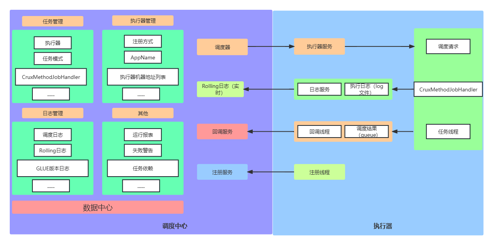

### 一、架构图



核心以下两步分：

- 执行器： 负责接收调度请求，执行调度任务的业务逻辑。执行器启动后需要注册到调度中心。接收调度中心的发出的执行请求，终止请求，日志请求等等。说白了就是我们自己的应用。
- 调度中心 ： 负责**管理调度信息**，按照调度配置发出调度请求，自身不承担业务代码。支持可视化界面，可以在调度中心对任务进行新增，更新，删除，会实时生效。支持监控调度结果，查看执行日志，查看调度任务统计报表，任务失败告警等等。说白了就是xxl-job管理端应用。

### 二、引入依赖

```
   <dependency>
            <groupId>com.xuxueli</groupId>
            <artifactId>xxl-job-core</artifactId>
            <version>2.2.0</version>
   </dependency>
```

### 三、使用过程

#### 1、配置执行器信息

```java
xxl:
  job:
    admin:
      #调度中心部署跟地址：如调度中心集群部署存在多个地址则用逗号分隔。
      #执行器将会使用该地址进行"执行器心跳注册"和"任务结果回调"。
      addresses: http://127.0.0.1:8190/xxl-job-admin
    accessToken: ""
    #分别配置执行器的名称、ip地址、端口号
    #注意：如果配置多个执行器时，防止端口冲突
    executor:
      #执行器AppName [选填]：执行器心跳注册分组依据；为空则关闭自动注册
      appname: app1
      # 执行器注册 [选填]：优先使用该配置作为注册地址，为空时使用内嵌服务 ”IP:PORT“ 作为注册地址。
      #从而更灵活的支持容器类型执行器动态IP和动态映射端口问题。
      address: ""
     # 执行器IP [选填]：默认为空表示自动获取IP，多网卡时可手动设置指定IP，该IP不会绑定Host仅作为通讯实用；
      ip: 127.0.0.1
      # 执行器端口号 [选填]：小于等于0则自动获取；默认端口为9999，单机部署多个执行器时，注意要配置不同执行器端口；
      port: 9911
      #执行器运行日志文件存储的磁盘位置，需要对该路径拥有读写权限
      logpath: D:\files\log
      #执行器Log文件定期清理功能，指定日志保存天数，日志文件过期自动删除。限制至少保持3天，否则功能不生效；
      #-1表示永不删除
      logretentiondays: 10
```

#### 2、创建配置类XxlJobConfig

```java
@Configuration
public class XxlJobConfig {

    @Value("${xxl.job.admin.addresses}")
    private String adminAddresses;

    @Value("${xxl.job.accessToken}")
    private String accessToken;

    @Value("${xxl.job.executor.appname}")
    private String appname;

    @Value("${xxl.job.executor.address}")
    private String address;

    // Test + Pre
    @Value("${xxl.job.executor.ip}")
    private String ip;

    @Value("${xxl.job.executor.port}")
    private int port;

    @Value("${xxl.job.executor.logpath}")
    private String logPath;

    @Value("${xxl.job.executor.logretentiondays}")
    private int logRetentionDays;


    @Bean
    public XxlJobSpringExecutor xxlJobExecutor() {
        XxlJobSpringExecutor xxlJobSpringExecutor = new XxlJobSpringExecutor();
        xxlJobSpringExecutor.setAdminAddresses(adminAddresses);
        xxlJobSpringExecutor.setAppname(appname);
        xxlJobSpringExecutor.setAddress(address);
        xxlJobSpringExecutor.setIp(ip);
        xxlJobSpringExecutor.setPort(port);
        xxlJobSpringExecutor.setAccessToken(accessToken);
        xxlJobSpringExecutor.setLogPath(logPath);
        xxlJobSpringExecutor.setLogRetentionDays(logRetentionDays);

        return xxlJobSpringExecutor;
    }
}

```

#### 3、创建任务类

```java
@Component
public class TestJob {


    @XxlJob("helloWorld")
    public ReturnT<String> helloWorld(String param) {
        XxlJobLogger.log("XXL-JOB, updateSilentExecStatus beginning");
        System.out.println("XXL-JOB===============================Hello World-1");
        return ReturnT.SUCCESS;
    }
}
```