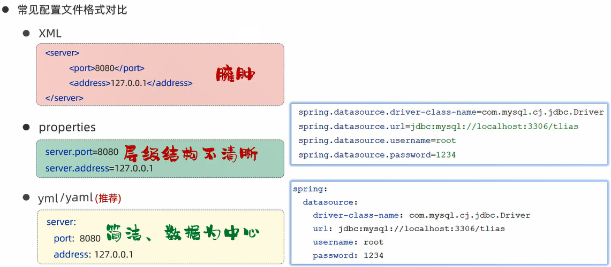
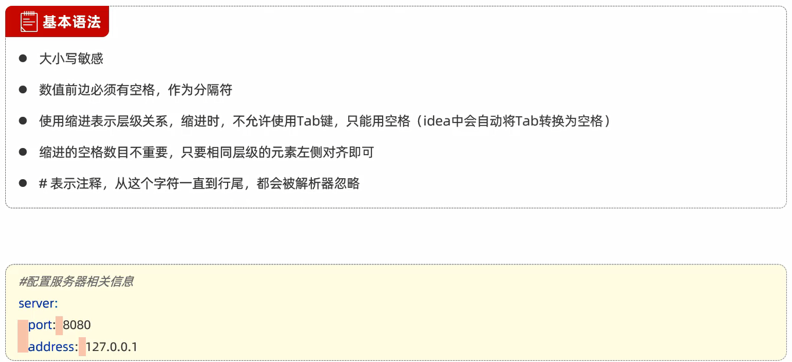

# 配置文件



**SpringBoot支持`properties`和`yml`,通常推荐使用`yml`**

yml基本语法:



# 数据格式

## 对象/Map集合

范例:

```yml
user:
  name: zhangsan
  age: 18
  address: beijing
```

## 数组/List/Set集合

范例:

```yml
hobby:
  - java
  - c
  - game
```

# 范例

```properties
spring.application.name=ClassManagementSystem
# 服务器
server.port=8080
server.address=localhost

# 数据库
spring.datasource.driver-class-name=com.mysql.cj.jdbc.Driver
spring.datasource.url=jdbc:mysql://192.168.1.13:3306/springboot_web
spring.datasource.username=root
spring.datasource.password=123456

# 驼峰命名
mybatis.configuration.map-underscore-to-camel-case=true

# 日志记录
mybatis.configuration.log-impl=org.apache.ibatis.logging.stdout.StdOutImpl

# 文件上传
spring.servlet.multipart.max-file-size=10MB
spring.servlet.multipart.max-request-size=100MB

# 阿里云OSS
aliyun.oss.endpoint=
aliyun.oss.accessKeyId=
aliyun.oss.accessKeySecret=
aliyun.oss.bucketName=
```

将以上properties配置文件转为yml配置文件:

```yml
# 服务器
server:
  port: 8080
  address: localhost

spring:
  # 数据库
  datasource:
    driver-class-name: com.mysql.cj.jdbc.Driver
    url: jdbc:mysql://192.168.1.13:3306/springboot_web
    username: root
    password: 123456
  # 文件上传
  servlet:
    multipart:
      max-file-size: 10MB
      max-request-size: 100MB

mybatis:
  configuration:
    # 驼峰命名
    map-underscore-to-camel-case: true
    # 日志记录
    log-impl: org.apache.ibatis.logging.stdout.StdOutImpl

# 阿里云OSS
aliyun:
  oss:
    endpoint: 
    accessKeyId: 
    accessKeySecret: 
    bucketName: 
```

# @Value注解

作用:外部配置的属性注入

使用:`@Value("${配置文件中的key}")`

## 范例

配置文件中:

```properties
# 自定义阿里云OSS配置信息
aliyun.oss.endpoint=
aliyun.oss.accessKeyId=
aliyun.oss.accessKeySecret=
aliyun.oss.bucketName=
```

参数调用时:

```java
package com.jinzhao.utils;

import com.aliyun.oss.OSS;
import com.aliyun.oss.OSSClientBuilder;
import org.springframework.beans.factory.annotation.Value;
import org.springframework.stereotype.Component;
import org.springframework.web.multipart.MultipartFile;

import java.io.*;
import java.util.UUID;

// 阿里云OSS 工具类
@Component
public class AliOSSUtils {
    @Value("${aliyun.oss.endpoint}")
    private String endpoint;
    @Value("${aliyun.oss.accessKeyId}")
    private String accessKeyId;
    @Value("${aliyun.oss.accessKeySecret}")
    private String accessKeySecret;
    @Value("${aliyun.oss.bucketName}")
    private String bucketName;

    // 实现上传图片到OSS
    public String upload(MultipartFile file) throws IOException {
        // 获取上传的文件的输入流
        InputStream inputStream = file.getInputStream();

        // 避免文件覆盖
        String originalFilename = file.getOriginalFilename();
        String fileName = UUID.randomUUID() + originalFilename.substring(originalFilename.lastIndexOf("."));

        // 上传文件到 OSS
        OSS ossClient = new OSSClientBuilder().build(endpoint, accessKeyId, accessKeySecret);
        ossClient.putObject(bucketName, fileName, inputStream);

        // 文件访问路径
        String url = endpoint.split("//")[0] + "//" + bucketName + "." + endpoint.split("//")[1] + "/" + fileName;
        // 关闭OSSClient
        ossClient.shutdown();
        // 把上传到OSS的路径返回
        return url;
    }
}
```

# @ConfigurationProperties注解

作用:外部配置的属性注入

使用:`@ConfigurationProperties(prefix = "配置属性的前缀")`


## 范例

添加Maven依赖:自动识别被`@ConfigurationProperties`注解标识的类对象

```xml
<dependency>
    <groupId>org.springframework.boot</groupId>
    <artifactId>spring-boot-configuration-processor</artifactId>
</dependency>
```

AliOSSProperties类:                            
1. 封装阿里云OSS的配置属性,生成getter/setter方法
2. 将配置文件中的阿里云OSS属性值映射到对象AliOSSProperties的属性上
3. 将该AliOSSProperties对象交给IOC容器管理

```java
package com.jinzhao.pojo;

import lombok.Data;
import org.springframework.boot.context.properties.ConfigurationProperties;
import org.springframework.stereotype.Component;

// 阿里云OSS中的配置属性
@Data
@Component
@ConfigurationProperties(prefix = "aliyun.oss")
public class AliOSSProperties {
    private String endpoint;
    private String accessKeyId;
    private String accessKeySecret;
    private String bucketName;
}
```

AliOSSUtils工具类:

```java
package com.jinzhao.utils;

import com.aliyun.oss.OSS;
import com.aliyun.oss.OSSClientBuilder;
import com.jinzhao.pojo.AliOSSProperties;
import org.springframework.beans.factory.annotation.Autowired;
import org.springframework.stereotype.Component;
import org.springframework.web.multipart.MultipartFile;

import java.io.IOException;
import java.io.InputStream;
import java.util.UUID;

// 阿里云OSS 工具类
@Component
public class AliOSSUtils {

    @Autowired
    private AliOSSProperties aliOSSProperties;

    // 实现上传图片到OSS
    public String upload(MultipartFile file) throws IOException {
        // 获取阿里云OSS参数
        String endpoint = aliOSSProperties.getEndpoint();
        String accessKeyId = aliOSSProperties.getAccessKeyId();
        String accessKeySecret = aliOSSProperties.getAccessKeySecret();
        String bucketName = aliOSSProperties.getBucketName();

        // 获取上传的文件的输入流
        InputStream inputStream = file.getInputStream();

        // 避免文件覆盖
        String originalFilename = file.getOriginalFilename();
        assert originalFilename != null;
        String fileName = UUID.randomUUID() + originalFilename.substring(originalFilename.lastIndexOf("."));

        // 上传文件到 OSS
        OSS ossClient = new OSSClientBuilder().build(endpoint, accessKeyId, accessKeySecret);
        ossClient.putObject(bucketName, fileName, inputStream);

        // 文件访问路径
        String url = endpoint.split("//")[0] + "//" + bucketName + "." + endpoint.split("//")[1] + "/" + fileName;
        // 关闭OSSClient
        ossClient.shutdown();
        // 把上传到OSS的路径返回
        return url;
    }
}
```

# 两种注解的比较

